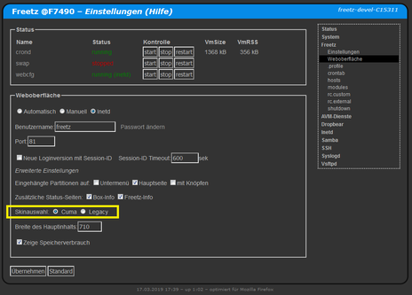

# Skins

Momentan stehen 4 Skins zu Auswahl. Im Menuconfig unter "Web Interface"
können die zu installierenden Skins ausgewählt werden. Falls mehrere 
installiert wurden, kann im Webinterface unter "Freetz > Aussehen"
zwischen den Skins umgeschaltet werden. 

Zur Auswahl stehen:

 * **cuma (dark)** 
     

 * **Legacy (blue)** 
     

 * **Phoenix (red)** 
     

 * **Newfreetz (green)** 
     
   
