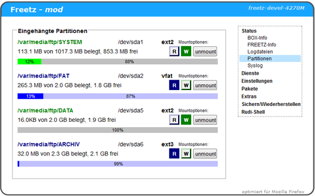

# Style (mounted.cgi)

Das Aussehen von mounted.cgi (Balken für die Größe der internen und
eingebundenen Medien) kann in menuconfig festgelegt werden. Folgende
Darstellungsarten sind möglich:

 * **Green (retro)** 
   Retrystil für 70er Jahre Fanboys. Überwiegend grüne Balken, die nach
   dem Mountzustand ihre Farbe in dunkelblau verändern können. Andere
   Informationen sind durch unterschiedliche Farben gekennzeichnet.  
     

 * **Grey (dark)** 
   In diesem Design wurde versucht durch die Grauskala die Vielfalt der
   bunten Farben möglichst farbtreu nachzubilden. Ob es letztendlich
   überall gelungen ist, darüber lässt sich bekanntlich streiten.
   Augenfreundlich, falls die Augen noch nicht vom Alter getrübt sind.  
     

