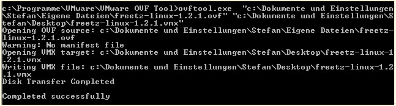
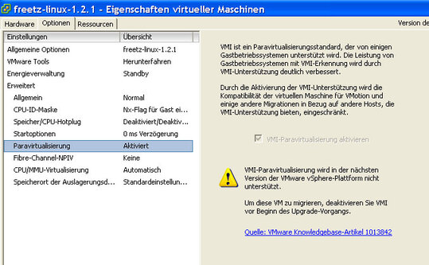
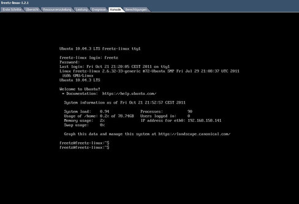
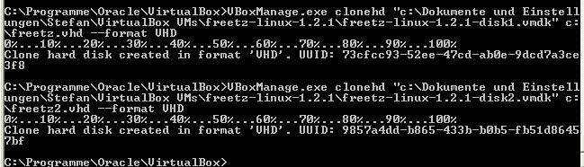
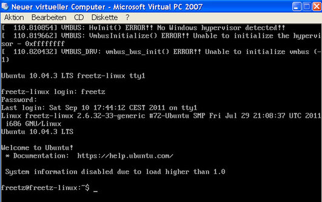

# Freetz Linux

### Freetz Linux unter VirtualBox

1. VirtualBox starten, Datei → Appliance importieren auswählen und dem
Dialog folgen. Als Image die gerade runtergeladene freetz-linux Datei
angeben.
2. Der Import dauert einen Augenblick. Danach noch mit **Ändern** die
Einstellungen kontrollieren.

### Freetz Linux unter VMWare

Je nach dem, in welchem VMware Produkt Freetz Linux nachher laufen soll,
habe ich zwei Wege ausprobiert. Folgende Tools sind dabei hilfreich
(aber nicht alle für beide Wege notwendig):

-   [Freetz-Linux](http://www.ip-phone-forum.de/showpost.php?p=1400234&postcount=1)
    selbst
-   [Virtualbox](https://www.virtualbox.org/wiki/Downloads)
-   [VMWare OVF
    Tool](http://www.vmware.com/support/developer/ovf/)
-   [Notepad++](http://notepad-plus-plus.org/) als
    guter Editor
-   [VMware vCenter Converter
    standalone](http://downloads.vmware.com/de/d/info/infrastructure_operations_management/vmware_vcenter_converter_standalone/5_0)

### Freetz Linux unter VMware ESXi V4.1 Hypervisor (funktioniert auch mit vSphere Hypervisor 5.5)

1. VirtualBox starten, Datei → Appliance importieren auswählen und dem Dialog folgen ...
2. Der Import dauert einen Augenblick. Danach Datei → Appliance
   exportieren auswählen und dem Dialog folgen\
   → Speicherort und Dateinamen wählen. Dabei die Dateiendung von *.ova in
   *.ovf abändern.
Die OVF Version sollte auf 1.0 eingestellt werden.
3. Die unter anderem enstandene *.ovf Datei in einen Texteditor laden
4. <vssd:VirtualSystemType>virtualbox-2.2</vssd:VirtualSystemType>
abändern in <vssd:VirtualSystemType>vmx-07</vssd:VirtualSystemType>
und die *.ovf Datei speichern\
→ vmx-07 tituliert VM Version 7 (z.B. für ESXi V4.1), ältere VM
Versionen sollten mit vmx-04 zurecht kommen
5. vSphere Client starten, zum ESXi Hypervisor verbinden.
6. Datei → OVF-Vorlage bereitstellen. Dem Dialog folgen und gewünschte
Einstellungen machen. Importvorgang abwarten.
7a. Virtuelle Maschine starten.
7b. Wer beim Systemstart einen Segmentation Fault Fehler bekommt:\
→ VM ausschalten, in den Optionen der VM-Einstellungen
Paravirtualisierung aktivieren und die VM erneut starten.

### Freetz Linux unter VMware Player V2.5

1. VirtualBox starten, Datei → Appliance importieren auswählen und dem
Dialog folgen ...
2. Der Import dauert einen Augenblick. Danach Datei → Appliance
exportieren auswählen und dem Dialog folgen\
→ Speicherort und Dateinamen wählen. Dabei die Dateiendung von *.ova in
*.ovf abändern.
3. Die unter anderem enstandene *.ovf Datei in einen Texteditor laden
4. <vssd:VirtualSystemType>virtualbox-2.2</vssd:VirtualSystemType>
abändern in <vssd:VirtualSystemType>vmx-07</vssd:VirtualSystemType>
und die *.ovf Datei speichern\
→ vmx-07 tituliert VM Version 7 (z.B. für ESXi V4.1), ältere VM
Versionen sollten mit vmx-04 zurecht kommen
5. Kommandozeile öffnen (Windows: Start → Ausführen → cmd [ENTER])
6. In das OVFTool Verzeichnis wechseln und die VM wie folgt
konvertieren\
→ ovftool [*.ovf Datei] [*.vmx Datei]
7. VMware Player starten und die VM laden.

Die in Szenario 2 erzeugte *.vmx Datei kann ebenfalls genutzt werden
auf dem ESXi Hypervisor und manuell über den Datenspeicherbrowser in die
Bestandsliste aufgenommen werden. Dabei bitte den oben erwähnten Hinweis
zum Segmentation Fault berücksichtigen.
Evtl. ist die Erzeugung der *.vmx und *.vmdk Dateien sowieso sinnvoll,
um sich das konvertierte Freetz-Linux so wegspeichern zu können.

Zur Information:\
Den oben aufgeführten VMware vCenter Converter standalone habe ich nur
einmal bei einem ESXi Hypervisor benutzen müssen, da keiner der beiden
beschriebenen Wege funktioniert hat.

Und noch ein paar Screenshots passend zu den Hinweisen oben:

### Freetz Linux unter Virtual PC

Getestet habe ich unter Windows XP x86 mit Virtual PC 2007 sowie Windows
7 x86_64 Windows Virtual PC.
Folgende Tools sind dabei hilfreich:

-   [Freetz-Linux](http://www.ip-phone-forum.de/showpost.php?p=1400234&postcount=1) selbst
-   [Virtualbox](https://www.virtualbox.org/wiki/Downloads)
-   [Virtual PC 2007](http://www.microsoft.com/downloads/de-de/details.aspx?FamilyID=04d26402-3199-48a3-afa2-2dc0b40a73b6) (für Windows XP)
-   [Windows Virtual C](http://www.microsoft.com/windows/virtual-pc/) (für Windows 7 ... XP-Mode nicht erforderlich)

1a. VirtualBox starten, Datei → Appliance importieren auswählen und dem
Dialog folgen ... Der Import dauert einen Augenblick.
1b. VirtualBox beenden\
2. Folgende Kommandos absetzen, um die zwei Festplatten zu
kovertieren:\
→ VBoxManage.exe clonehd freetz-linux-1.2.1-disk1.vmdk freetz.vhd
---format VHD\
→ VBoxManage.exe clonehd freetz-linux-1.2.1-disk2.vmdk freetz2.vhd
---format VHD\
3a. Virtual PC starten und einen neuen virtuellen Computer anlegen
(Details siehe Screenshot).
3b. Den neuen virtuellen PC starten.
4. Höchstwahrscheinlich wird die Grafikauflösung etc. nicht ordentlich
erkannt (siehe Screenshot). Wenn dem so ist, weiter bei 5.
5. Virtuelle Maschine neu starten (Tastenkombination [Alt
GR]+[ENTF])\
6. Während der Bootmanager Grub aktiv ist, [ESC] drücken, um ins Menu
zu gelangen.
7a. Taste [e] drücken beim ersten Menueintrag. Nochmal Taste [e]
drücken bei den Kernel Bootparametern.
→ Folgende Bootoptionen hinzufügen: vga=791 noreplace-paravirt\
7b. [RETURN] drücken\
7c. [b] drücken, um Ubuntu zu starten\
8. Daraufhin sollte der gewohnte Ubuntu Bildschirm erscheinen und
Freetz-Linux bis zum Konsolenlogin starten\
9. Die manuellen Eingaben nun festigen in der Grub Konfiguration.
Folgendes Kommando absetzen:\
→ sudo nano /boot/grub/menu.lst\
→ Recht weit unten in der Datei die Optionen ergänzen, die beim ersten
Booten benutzt wurden\
→ Mit [STRG]+[O] speichern und [STRG]+[X] beenden\
10. Virtuelle Maschine neu starten, um zu sehen, ob die Werte fest
übernommen wurden.

Und noch ein paar Screenshots passend zu den Hinweisen oben:

