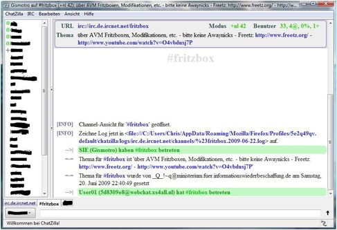

# IRC

Wer den direkten Kontakt zur Zweirad und Fritz-Community sucht, kann
das über IRC tun. Dazu benötigt man lediglich einen
[Web-Browser](http://webchat.freenode.net/) oder IRC-Client.
Der IRC-Kanal ("Chatraum") nennt sich **##fritzbox** und befindet
sich im Freenode (IRC-Server).
Auf ##fritzbox werden verschiedenste Themen diskutiert.
Auch wenn das Topic vermuten lässt dass es sich um einen
englischsprachigen Kanal handelt, wird sich fast nur auf
deutsch unterhalten. Das hängt davon ab wie schnell es
dem neu eingetretenen auffällt.
Die Regeln des Admins sind unbedingt zu befolgen da sonst
ein mute droht.

**Zugangsdaten:**

```
	Server="chat.freenode.net"
	Port="6667"
	Channel="##fritzbox"
```

 * Grundsätzlich: Bitte einfach Eure Fragen stellen, Antworten können manchmal dauern (siehe "IRC Netiquette").

### IRC Netiquette

Auch im IRC gibt es "Benimmregeln" und die Einhaltung sollten helfen
dieses Kommunikationsmedium (effektiv) zu nutzen. Schliesslich hat man
Fragen, die man gerne beantwortet haben möchte. Die
[Benimmregeln](http://channel.debian.de/netiquette/ch-rules.html)
aus dem "Netiquette & HOWTO für #debian.de" sind nicht verpflichtend,
geben aber einige Hinweise, wie man "Fettnäpfchen" vermeiden kann.

### Troubleshooting IRC

 - Unauthorized connection
> Falls es Probleme beim Verbinden gibt (z.B. Fehlermeldung:
> "Unauthorized connection"), so kann man versuchen einen alternativen
> IRC-Server zu verwenden.
> Tipp: Einen IRC-Server aus dem eigenen Land verwenden! Eine Übersicht
> aller Server im Freenode gibt es
> [hier](http://freenode.net/irc_servers.shtml).

### Konfiguration Chatzilla-Plugin in Firefox

[](../../screenshots/25.jpg)


Ebenfalls kann das Chatzilla-Plugin für den Firefox genutzt werden
([Download](https://addons.mozilla.org/de/firefox/addon/16)).

Einstellen des Chatzilla-Plugins:

1. Chatzilla installieren
2. Unter **Chatzilla** ⇒ **Einstellungen** ⇒ **Globale Einstellungen**
   ⇒ **Allgemein** einen **Benutzernamen** und einen **Nick** vergeben.
3. Chatzilla wieder beenden
4. Nun diesen Link anklicken:
   [irc://chat.freenode.net/##fritzbox](irc://chat.freenode.net/##fritzbox)
5. Chatzilla sollte sich nun im Fritzbox-Chat mit Eurem neu vergebenen
   Nick einloggen (siehe Bild oben)
6. Dann unter **IRC** den Haken bei **Chanel beim starten** aktivieren

Ab sofort verbindet man sich automatisch mit jedem Start von Chatzilla
zu ##fritzbox.


