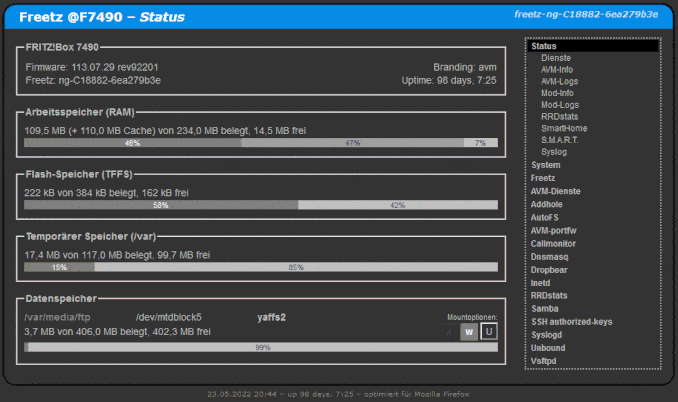

# Welcome to Freetz-NG
 
 
Watch important changes and [NEWS](NEWS.md) about Freetz-NG. 
Talk about everything around Freetz-NG at [DISCUSSIONS](https://github.com/Freetz-NG/freetz-ng/discussions). 
Check list of supported devices and [FIRMWARES](FIRMWARES.md). 
Read [CHANGELOG](CHANGELOG.md) for all improvements and additions. 
For download and quickstart instructions go to [README](https://github.com/Freetz-NG/freetz-ng/blob/master/README.md#readme). 
These [PREREQUISITES](PREREQUISITES.md) are mandatory to build an image. 
Things you could do to [SUPPORT](SUPPORT.md) Freetz-NG. 
Why the [ADDONS](ADDONS.md) of the "Digitale Elite" are not supported here.

### Listings
[Packages](make/README.md) 
[Libraries](libs/README.md) 
[Patches](patches/README.md) 
[Themes](themes/README.md) 

### Timeline
[GitHub](https://github.com/Freetz-NG/freetz-ng/commits/master) 
[GitLab](https://gitlab.com/Freetz-NG/freetz-ng/commits/master) (Mirror) 
[Bitbucket](https://bitbucket.org/Freetz-NG/freetz-ng/commits/branch/master) (Mirror) 

### [Wiki](wiki/README.md) (abandon)

[//]: # ( WikiDYN )

[FAQ](wiki/00_FAQ/README.md) 
[Beginner](wiki/10_Beginner/README.md) 
[Advanced](wiki/20_Advanced/README.md) 
[Expert](wiki/30_Expert/README.md) 
[Troubleshooting](wiki/40_Troubleshooting/README.md) 
[Security](wiki/50_Security/README.md) 
[Development](wiki/60_Development/README.md) 
[Various](wiki/70_Various/README.md) 

[//]: # ( WikiEND )

