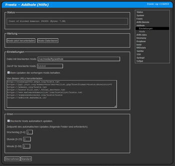

# Addhole (for dnsmasq)
 - Package: [master/make/pkgs/addhole/](https://github.com/Freetz-NG/freetz-ng/tree/master/make/pkgs/addhole/)

Addhole ist eine Erweiterung für Dnsmasq. 
 

 

 - Mit Addhole können Listen mit Hostnamen in Dnsmasq eingebunden werdend die blockiert werden. Es gibt Listen mit Hosts die Werbung, Malware, Viren etc verbreiten.
   Das Package ist vergleichbar mit Pi-Hole, nur ohne Webinterface mit den Zugriffsstatistiken und ohne ein zusätzliches Gerät.

 - In der Standardkonfiguration von Addhole benötig Dnsmasq etwa 10MB Ram, werden alle vordefinierten Listen aktiviert 25MB Ram.
   Hinweis: Dies macht keinen Sinn auf einer Fritzbox mit 32 MB Ram!
   Die Listen können automatisch mit Cron aktualisert werden. Es könne zusätzlich eigene Hosts angegeben werden

 - Vorsicht: Die Namensauflösung wird auf dem Server (Dnsmasq), dem Client (Linux, Windows, Android, ...) und im Anwendungsprogramm (zb Webbrowser) gecacht!
   Falls sich nicht sofort eine Änderung zeigt, alle Caches löschen - oder einfach alles rebooten...

