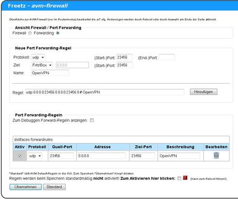
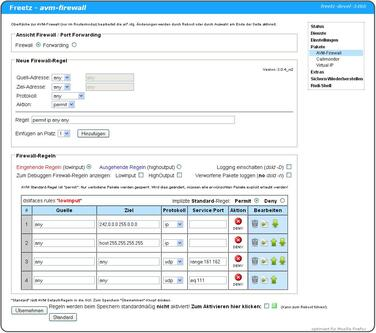
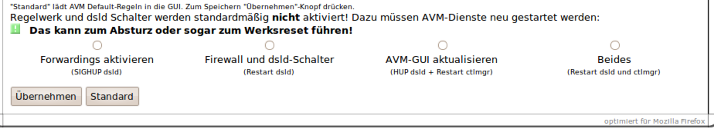

# AVM-firewall
 - Package: [master/make/pkgs/avm-firewall/](https://github.com/Freetz-NG/freetz-ng/tree/master/make/pkgs/avm-firewall/)

Das **AVM-firewall-CGI** stellt eine Web-Oberfläche dar, mit der man die
von AVM dem User vorenthaltene integrierte Firewall administrieren kann.
Die Firewall ist ein Bestandteil des "dsld" von AVM, deshalb kann man
diese Firewall nicht wirklich starten oder stoppen, sie läuft eigentlich
immer (solange dsld auf der Box ist).

Ein paar Worte zu den "Grundlagen" und der Philosophie, die AVM damit
umsetzt:

-   Die Firewall von AVM ist wohl konzipiert als eine "Zusatzfirewall"
-   Die "Firewall" ist jeweils vorgeschaltet und wirkt auf Pakete, die
    *vom* WAN-Interface kommen oder *zum* WAN gehen. Box-intern wirkt
    sie nicht.
-   Die Box hat für das WAN-Interface eine zweite (die "eigentliche")
    Sicherung: Alle eingehenden Pakete, für die es keinen Eintrag in der
    NAT-Tabelle gibt, werden verworfen.

Diese NAT-Einträge geschehen entweder dynamisch (wenn aus dem LAN ins
Internet zugegriffen wird), oder statisch, wenn Einträge im
"Portforwarding" existieren. Dieses Verfahren gilt immer, auch die
Box-Prozesse selbst akzeptieren keine Pakete, ohne eine solche NAT,
daher gibt es dafür die Portweiterleitungen "auf die Box selbst".

Die Firewall filtert also nur zusätzlich Pakete heraus, die eigentliche
"Sicherheit" wird über den "NAT-Mechanismus" realisiert. Deshalb ist
die "Default-Einstellung" der Firewall auch für alle nicht verbotenen
Pakete: Permit.

Wirklich wirksam wird diese Firewall deshalb zum einen, um ausgehend
bestimmte Verbindungen zu blocken, oder aber, wenn man sich "viel
Arbeit macht" und alle benötigten Verbindungen erlaubt und dann die
Default-Regel auf "Deny" stellt.

Ich persönlich (ich hoffe, auch als "Autor" darf ich das sagen) würde
für tiefergehende Eingriffe eher auf [iptables](iptables.md)
zurückgreifen...

### Feature-Übersicht

Mit AVM-FIREWALL-CGI kann man direkt über eine Weboberfläche Folgendes
tun:

-   Die von AVM vordefinierten Firewallregeln ändern/löschen
-   Eigene Regeln hinzufügen (sehr praktisch um lästiges "nach Hause
    telefonieren" von mancher Software im Router zu unterbinden)
-   Portforwardings erstellen, die auch auf die Fritz selber (0.0.0.0)
    zeigen können.(z.B. für FTP oder webserver Freigaben ins I-Net)

Die Syntax sollte nicht weiter schwer sein, dafür gibt es ja die
Dropdown-Felder.

### Anwendung der geänderten Regeln

Die Tatsache, dass AVM entweder keine Änderungen am Regelwerk vorsieht
(bei der Firewall) oder selbst die Änderungen verwaltet (Forwarding),
erfordert besondere Maßhnahmen, um die in der GUI vorgenommenen
Änderungen auch anzuwenden. Hierfür werden AVM-Dienste neu gestartet,
was zum Crash der Box und sogar zum Reset auf Werkseinstellungen führen
kann, deshalb am Ende der Seite die animierte Grafik zur Warung.

Um allen Problemen aus dem Weg zu gehen sollte der "Übernehmen" Haken
**nicht** gesetzt werden, sondern die Regeln "nur" abgespeichert und
die Box dann neu gestartet.

**Ergänzung zur Trunk-Version, Stand 22.02.2010** In dieser Version sind
jetzt vier Auswahlpunkte zur Übernahme der Regelwerke vorgesehen, um die
beschriebenen Crash-Probleme besser eingrenzen zu können (sihe Bild
unten). Hier eine Kurze Erläuterung dazu:
Die GUI tangiert zwei AVM Daemons (ctlmgr und dsld) und zwar deshalb,
weil im *dsld* die Regeln tatsächlich wirken, im *ctlmgr*, weil der die
eigene Regelverwaltung macht.

-   In der Freetz-GUI vorgenommenen Änderungen sind der
    AVM-"Regelverwaltung" unbekannt. Deshalb muss der *ctlmgr* neu
    gestartet werden, um diese Änderunegen dort auch zu verankern. Wird
    der ctlmgr nicht neu gestartet, können Änderungen in der AVM-GUI
    alle Änderungen in dieser GUI (sowohl in der Firewall als auch im
    Forwarding) rückgängig machen.
-   Um **Firewall-Änderungen** zu aktivieren, muss der dsld gestoppt und
    neu gestartet werden
-   Um Änderungen an den **Optionen des dsld** zu aktivieren, ist
    ebenfalls ein Neustart des dsld erforderlich
-   Um **Portforwarding-Änderungen** zu übernehmen, muss der dsld nicht
    komplett neu gestartet werden, es reicht, ihn über ein Signal (HUP)
    "anzuweisen", die Regeln neu zu laden und anzuwenden.

### Die Gefahr von Reboot-Schleifen und wie man da wieder herauskommt

Bei zahlreichen Versuchen mit der Einrichtung von Firewallregeln mit
Hilfe dieses CGI-Paketes hat sich gezeigt, daß man die Box bei
umfangreichen Änderungen dazu bringen kann, immer wieder neu zu starten.
Das geschieht auch bei völlig legitimen Regeln und scheint mit dem
Umfang des Regelsatzes zusammenzuhängen. Subjektiv erscheinen mir
Portsperren unkritischer als IP-Bereichssperren über Subnetzadressen und
-Masken. Aufgetreten ist das bei mir auf einer 7270v3 mit 74.04.88 und
Freetz 1.2 Revision 7500; ein anderer Nutzer berichtete gleiches von
einer 7390.

Die Ursache des Problems liegt irgendwo im „dsld" von AVM begraben, der
auch die Firewall-Funktion bereitstellt und ist inziwschen insbesondere
dank
[„MaxMuster"](http://www.ip-phone-forum.de/member.php?u=62478)
ergründet (siehe dazu die „Literaturhinweise" aus dem IP-Phone-Forum am
Ende dieser Seite).

### Abhilfe

AVM hat nach dem Hinweis auf die hier beschriebenen Sachverhalte den
Fehler gefunden und will ihn in der nächsten Laborversion der Firmware
beheben. Die X.05.05-Versionen sind auf jeden Fall noch betroffen. Bis
dahin kann es helfen, wenn man beim Erstellen von Firewall-Regeln die
folgenden Hinweise beachtet.

Es dürfen nicht mehr als jeweils drei „gleichartige" Regeln für das
Protokoll „IP" unmittelbar hintereinander stehen. Die folgenden Typen
sind betroffen:

-   „ip reject [...]"
-   „ip deny [...]"
-   „ip permit [...]"

Man muß also nach spätestens drei Zeilen, die mit „ip reject" beginnen,
mindestens eine andere Zeile einfügen, so daß nie mehr als drei Zeilen
gleichen „Typs" aufeinanderfolgen. Port-Forward-Regeln und Port-Sperren
scheinen nicht betroffen zu sein, letztere können aber mit den anderen
Zeilen gemischt werden, um den Fehler zu verhindern. Wenn man nicht
genügend „andersartige" Regeln hat, kann man bereits bestehende
wiederholen oder andere wirkungslose Regeln einfügen.

Bei zwei 7270 hat diese Vorgehensweise reproduzierbar funktioniert. In
einem Fall, bei der schon erwähnten 7390, scheint das nicht ausreichend
gewesen zu sein.

### Anleitung, um eine versehentlich ausgelöste Reboot-Schleife zu beenden

Die folgende Lösung funktioniert nur, wenn tatsächlich eine
Firewall-Änderung die Neustarts verursacht und ist kein Allheilmittel
für Neustart-Schleifen. Sie funktioniert auch nicht, wenn der Router im
Ethernet-Modus läuft, also die ADSL-Verbindung nicht selber aufbaut.
Getestet ist sie nur im gewöhnlichen ADSL-Router-Modus, also ohne
externes Modem. Den Flash-Speicher mit einer Sicherheitskopie zu
überschreiben ist in diesem speziallen Fall unnötig, gleichwohl sollte
man unbedingt eine funktionierende Komplettsicherung und alles nötige
für eine Wiederherstellung bereitliegen haben, wenn man an der
AVM-Firewall Änderungen vornimmt.

Glücklicherweise erfolgt in dem Fall kein Neustart, wenn man den
ADSL-Verbindungsaufbau unterbindet, das heißt, das ADSL-Kabel vom
Splitter abzieht. Das analoge oder ISDN-Telefonkabel kann
steckenbleiben, man hat also während der Reparaturzeit kein Internet,
wohl aber Telefon zur Verfügung, das Risiko von Experimenten mit der
Firewall ist also kleiner, als man auf den ersten Blick denkt, wenn man
was von „Reboot-Schleifen" liest.

#### Wie also erkenne ich, daß so eine „Reboot-Schleife" stattfindet?

Der Router zeigt dabei die typischen „Start-Blink-Sequenzen" der
Leuchtdioden. Wenn man es immer wieder probiert, kommt man zwar kurz ins
Webinterface hinein, aber ein paar Sekunden später „hängt" es schon
wieder, die Zeit reicht nicht, um die letzten Änderungen rückgängig zu
machen. Das liegt daran, daß alles normal läuft, bis die
Internet-Verbindung aufgebaut wird, dabei stürzt der Kernel dann ab.

#### Wie behebe ich das Problem ohne FTP-Flash?

1.  Das ADSL-Kabel vom Splitter ziehen.
2.  Warten, bis der Router ordentlich gestartet hat und das Freetz-CGI
    wieder läuft. (Das kann etwas dauern, je nachdem welcher Paketumfang
    in Freetz installiert ist, kommen nicht alle Programme fast
    gleichzeitig hoch.)
3.  Die Firewalländerungen zurücknehmen, die den Fehler verursacht
    haben.
4.  Neustart über das Freetz-Webinterface anstoßen.
5.  Das ADSL-Kabel wieder einstecken.

[Christoph
Franzen](http://www.ip-phone-forum.de/member.php?u=121255)

### Verweise

Im [IP-Phone-Forum](http://www.ip-phone-forum.de)
gibt es zur AVM Firewall einige Threads, z.B.:

-   [instabile AVM-Firewall auf
    7270](http://www.ip-phone-forum.de/showthread.php?t=238901)
    (aktueller Diskussions-Thread)
-   [Aufruf zur Dokumentation der internen
    Firewall](http://www.ip-phone-forum.de/showthread.php?t=156778)
-   [(NEU) AVM-Firewall package für
    Freetz](http://www.ip-phone-forum.de/showthread.php?t=159802)
-   [Blog von
    real-riot](http://www.realriot.de/2007/05/die-interne-fritzbox-stateful-firewall_30.html)

