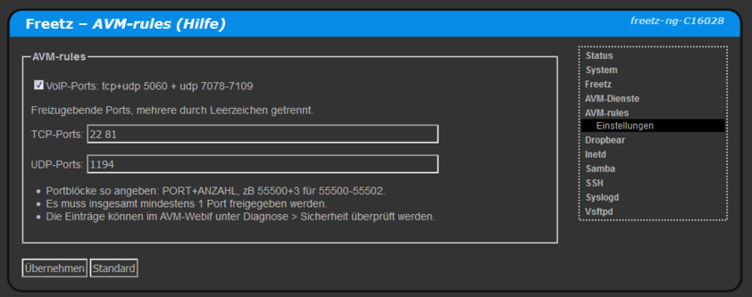

# AVM-rules (deprecated)
 - Package: [master/make/pkgs/avm-rules/](https://github.com/Freetz-NG/freetz-ng/tree/master/make/pkgs/avm-rules/)

Mit AVM-rules können (ausschliesslich) Ports der Fritz!Box selbst für Zugriff aus dem Internet freigegeben werden.<br>
<br>
<a href='../screenshots/000-PKG_avm-rules.png'></a>
<br>

Dazu wird ```voip_forwardrules``` verwendet, nur für IPv4-Freigaben. Zu finden im menuconfig unter ```packages > webif```.
Da die ```ar7.cfg``` bearbeitet wird, sollte man vorher ein komplettes Backup anlegen - EXPERIMENTAL!
Die VoIP Ports sollte man nicht deaktivieren, ausser man weiss was man macht.

 * Portblöcke so angeben: PORT+ANZAHL, zB 55500+3 für 55500-55502.
 * Umleitungen so angeben: EXTERN(+ANZAHL):INTERN, zB 443:8443 oder 80+2:8008.
 * Es muss insgesamt mindestens 1 Port freigegeben werden.
 * Mindestens eine VoIP-Rufnummer muss konfiguriert sein.
 * Die Einträge können im AVM-Webif unter Diagnose > Sicherheit überprüft werden.
 * Bei Syntaxfehlern wird die komplette ar7.cfg von AVM zurückgesetzt.

### Deprecated?

Dieses Package sollte nicht mehr verwendet werden. Hiermit freigegeben Ports hängen von VoIP ab und
werden auch als solche markiert, was je nach Internetzugang Nachteile mit sich bringen kann.<br>
Diese Nachteile hat das Package [AVM-portfw](avm-portfw.md) nicht.<br>
Da ein Port nur einmal (entweder in AVM-rules oder AVM-portfw) freigegeben werden kann,
vor Deinstallation von AVM-rules dessen Konfiguration auf Standard zurücksetzen!

