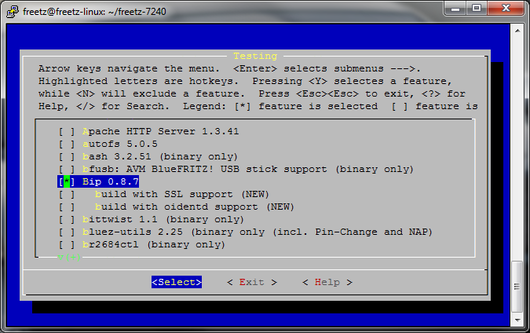
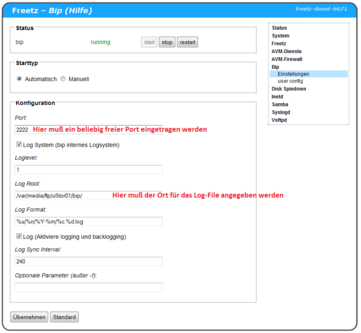

# Bip 0.9.2
 - Homepage: [https://projects.duckcorp.org/projects/bip](https://projects.duckcorp.org/projects/bip)
 - Manpage: [https://bip.milkypond.org/projects/bip/wiki](https://bip.milkypond.org/projects/bip/wiki)
 - Changelog: [https://projects.duckcorp.org/projects/bip/news](https://projects.duckcorp.org/projects/bip/news)
 - Repository: [https://projects.duckcorp.org/projects/bip/repository](https://projects.duckcorp.org/projects/bip/repository)
 - Package: [master/make/pkgs/bip/](https://github.com/Freetz-NG/freetz-ng/tree/master/make/pkgs/bip/)

Der Bip
[IRC](http://de.wikipedia.org/wiki/Internet_Relay_Chat)
Proxy ist eine Anwendung, die, wie das Wort
*[Proxy](http://de.wikipedia.org/wiki/Proxy_(Rechnernetz))*
es bereits andeutet, zwischen IRC Server und IRC Client sitzt. Er hält
quasi die permanente Verbindung zu dem/den IRC Server(n), kann die Logs
zwischenspeichern, und selbige sogar an einen sich (wieder-)
verbindenden Client weiterleiten - was es z.B. erlaubt, selbige zwischen
mehreren Rechnern auszutauschen (sofern man selbst mehrere Rechner zum
Chatten benutzt).

Mehr Informationen gibt es auf der [BIP
Homepage](http://bip.milkypond.org/).

### Auswahl

[](../screenshots/212.png)

Wenn man einen Bip-Proxy auf seiner Fritzbox betreiben möchte muss
dieser beim Bau eines Freetz-Image im Menuconfig ausgewählt werden:

Zu finden ist dieser im **menuconfig** unter : **Package selection** =⇒
**Testing** =⇒ Bip 0.8.x


### Konfiguration

[](../screenshots/213.png)

Im Main-Menu des Bip-Proxy müssen dann noch ein beliebiger Port (im
Beispiel haben wir die 2222 gewählt) und der Speicherort des Log-Files
angegeben werden. Des weiteren müsst ihr noch die **user.config** von
hier :

```
###client_side_ssl = false;
### Networks
network {
    name = "freetz";
    server { host = "random.ircd.de"; port = 6667; };
};
### Users
user {
    name = "Mustermann";
    password = "xxxxxxxxxxxxxxxxxxxxxxxx";
    default_nick = "";
    default_user = "Mustermann";
    default_realname = "Mustermann";
    connection {
        name = "freetz";
        network = "freetz";
#       away_nick = "Mustermann-away";
        follow_nick = false;
        ignore_first_nick = false;
        channel {
        name = "#fritzbox";
        };

    };

};
```

kopieren und nach Euren Wünschen anpassen. Geändert werden muss
eigentlich nur der **Mustermann** gegen Euren **Usernamen**. Unter
**Networks** kann auch folgender Eintrag genutzt werden:

```
network {
    name = "freetz";
    server { host = "irc.fu-berlin.de"; port = 6667; };
};
```

**Hinweis:** Nach **jeder** Änderungen an der **user.config** und
drücken des Button **Übernehmen** muss man ca. 5 Minuten warten bis sich
der User wieder am IRC-Chanel anmelden kann.

### Weiterführende Links

Hier findet man noch weitere Erläuterungen zu BIP und welche
Einstellungen man beim IRC-Client vornehmen muss:
[http://nerderati.com/2010/11/perpetual-irc-the-proxy-edition/](http://nerderati.com/2010/11/perpetual-irc-the-proxy-edition/)

