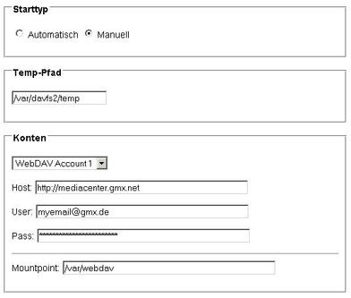

# davfs 1.5.2/1.6.1
 - Package: [master/make/pkgs/davfs2/](https://github.com/Freetz-NG/freetz-ng/tree/master/make/pkgs/davfs2/)

[](../screenshots/62.jpg)

Paket aus dem Thread: [WebDAV-zu-Mountpoint für die
Fritz!Box](http://www.ip-phone-forum.de/showthread.php?t=115302)

### Einführung

### Was ist WebDAV?

WebDAV ist ein offener Standard, der auf dem
[HTTP](http://de.wikipedia.org/wiki/Hypertext_Transfer_Protocol)/1.1
Protokoll aufsetzt und dieses so erweitert, dass Dateien nicht nur
abgerufen sondern auch erstellt und ersetzt werden können. Dabei können
Benutzer auf ihre Daten wie auf eine Online-Festplatte zugreifen.
Bekannte Beispiele sind Apples iDisk und die MediaCenter von GMX
(1GB-Speicher gibt's gratis bei Anmeldung zum FreeMail-Dienst) und 1&1.
Das WebDAV Paket bietet eine grafische Oberfläche, worüber die
Einstellungen vorgenommen werden können.

### Was ist davfs2?

Das WebDAV-Paket in Freetz verwendet davfs2, ein
Linux-Dateisystem-Treiber, der es erlaubt, einen WebDAV-Share als
lokalen Datenträger zu mounten.
(Quelle und weitere Infos:
[http://dav.sourceforge.net/](http://dav.sourceforge.net/)).

### Anwendungen

-   Direktes Starten von Software vom WebDAV-Server aus ohne aufwendiges
    Nachladen per wget
-   Bereitstellung des WebDAV-Speicherplatzes im LAN mit Hilfe von
    [Samba](samba.md)

### Paket in die Firmware einbauen

Das davfs2 Paket unter *menuconfig* auswählen:

```
make menuconfig
Package selection -> Testing -> davfs auswählen
make
```

### Verschlüsselung mit Zertifikaten

Etliche WebDAV-Seiten (z.B. 1&1, Alice, GMX) arbeiten mit
Verschlüsselung (https) mit Zertifikaten.
Um diese Zertifikate im WebDAV Freetz-GUI einzutragen, geht man so vor
(Bsp. GMX Mediacenter mit dem Firefox 3.x):

-   Aufrufen von
    [https://webdav.mc.gmx.net](https://webdav.mc.gmx.net)
-   Es kommt ggf. eine Fehlermeldung ("Not found"), die man aber
    ignoriert
-   Im Firefox ruft man unter Extras die Seiteninformation auf.
-   Im neuen Fenster der Seiteninformation klickt man unter
    "Sicherheit" auf "Zertifikat anzeigen", dann auf "Details".
-   Unter Zertifikatshierarchie stehen 2 Einträge:
    -   Thawte Premium Server CA
    -   mediacenter.gmx.net
-   Es wird nur das CA Zertifikat (d.h. Thawte Premium Server CA)
    gebraucht. Man exportiert dieses und fügt es (copy & paste, Achtung
    bei Zeilenumbrüchen) im WebDAV Freetz-GUI ein. Auch für 1&1 sowie
    für Alice ist nur das Thawte CA notwendig.

Alternativ kann man es auch bei Thawte
[herunterladen](https://www.thawte.com/roots/thawte_Premium_Server_CA.pem).

Seit dem 28.05.2012 gibt es Fehlermeldungen beim Zugriff auf GMX.
Aktualisieren des Zertifikates schafft Abhilft.

Man kann auch die Datei mit dem Zertifikat
`/tmp/flash/davfs2/servercrtX.pem` auf
`/etc/default.Fritz_Box_7390/avm/root_ca.pem` linken, dort hält AVM
einige Zertifikate vor.

Man kann das Zertifikat auch über folgenden Aufruf auf dem PC ausgeben
lassen (Die Adresse in der ersten Zeile ist anzupassen):

```
TARGET=www.box.net:https
openssl s_client -showcerts -connect $TARGET < /dev/null 2> /dev/null | sed -n '/^-----BEGIN CERTIFICATE-----$/,/^-----END CERTIFICATE-----$/{/BEGIN /h;/BEGIN /!H};${g;p}'
```

### Einstellungen/ Optionen

Hier kann man noch Optionen (de)aktivieren:

-   Deaktiviere use-locks
    Wenn die Option use-locks aktiviert ist, werden Dateien auf dem
    Server gesperrt, wenn sie zum Schreiben geöffnet werden (Standard).
    Man kann dieses Verhalten auch deaktivieren, d.h. dazu ist im
    Freetz-GUI vor "Deaktiviere use-locks" ein Häkchen zu setzen.
-   Aktiviere if_match_bug-Option
    Die Option "if_match_bug" muss z.B. für GMX und 1und1 aktiviert
    sein, sonst kann man keine Dateien hochladen. Manche Server
    verarbeiten If-Match- und If-None-Match-Header nicht richtig. Die
    aktivierte Option veranlasst mount.davfs, stattdessen HEAD zu
    benutzen.

### Weiterführende Threads im IPPF

[Zweiten OnlineSpeicher einbinden Webdav davfs2.conf,
davfs2.secrets und
mtab](http://www.ip-phone-forum.de/showthread.php?t=225316)[WebDav
und
SSL](http://www.ip-phone-forum.de/showthread.php?t=179968)
[WebDAV und
http://mediacenter.gmx.net](http://www.ip-phone-forum.de/showthread.php?t=217572)
[[erledigt] freetz-dev-3306: davfs2_1.conf statt
davfs2.conf + ...secrets
failed](http://www.ip-phone-forum.de/showthread.php?t=191646)
[[gelöst] WebDAV: davfs2_1.conf <>
davfs2.conf](http://www.ip-phone-forum.de/showthread.php?t=186260)
[[gelöst] WebDAV-zu-Mountpoint für die
Fritz!Box](http://www.ip-phone-forum.de/showthread.php?t=115302)
[[gelöst] WebDAV-zu-Netzwerklaufwerk-Umsetzung auf der
Fritzbox](http://www.ip-phone-forum.de/showthread.php?t=114558)

