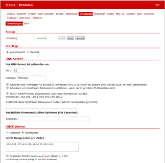

# Dnsmasq 2.80/2.87
 - Homepage: [https://thekelleys.org.uk/dnsmasq/doc.html](https://thekelleys.org.uk/dnsmasq/doc.html)
 - Manpage: [https://thekelleys.org.uk/dnsmasq/docs/dnsmasq-man.html](https://thekelleys.org.uk/dnsmasq/docs/dnsmasq-man.html)
 - Changelog: [https://thekelleys.org.uk/dnsmasq/CHANGELOG](https://thekelleys.org.uk/dnsmasq/CHANGELOG)
 - Repository: [https://thekelleys.org.uk/gitweb/?p=dnsmasq.git;a=summary](https://thekelleys.org.uk/gitweb/?p=dnsmasq.git;a=summary)
 - Package: [master/make/pkgs/dnsmasq/](https://github.com/Freetz-NG/freetz-ng/tree/master/make/pkgs/dnsmasq/)

[](../screenshots/200.png)

Dnsmasq ermöglicht es, auf der FRITZBox

-   einen **DNS-Server**, der die IP- und Namensauflösung zentral
    vornimmt,
-   einen **DHCP-Server**, der Clienten eine IP-Adresse und einen
    Hostnamen übermittelt, und
-   einen **TFTP-Server**, der z. B. das Booten via
    [PXE](http://de.wikipedia.org/wiki/Preboot_Execution_Environment)
    ermöglicht,

zu betreiben.

Dnsmasq läuft komplett auf der FRITZBox, man braucht also keine
gesonderten Rechner als DHCP-Server und als DNS-Server.

Das Besondere ist, dass dnsmasq statische DHCP-Leases beherrscht, was
die FRITZBox ohne Freetz nur eingeschränkt kann. So ist es jetzt möglich
einem Client eine selbst definierte feste IP zu geben und nicht nur eine
bereits durch den DHCP vergebene IP fest mit dem Client zu verbinden.

### Installation

Dnsmasq ist als Paket im Rahmen von Freetz realisiert und kann bei
dessen Erzeugung einfach ausgewählt werden.

### Konfiguration

Zur Konfiguration gibt es im Web-Interface von Freetz die Seiten:

-   *Pakete / Dnsmasq*: Optionen zum Startverhalten, DNS-Server und
    DHCP-Server (DHCP-Ranges)
-   *Einstellungen / Hosts*: Liste fest vorgegebener Hostnamen
-   *Einstellungen / Dnsmasq: extra*: Textfeld zur Eingabe zusätzlicher
    Optionen (dnsmasq long options ohne führende `--`)

 * Wenn der
DHCP-Server von dnsmasq genutzt werden soll, dann ist der
FRITZBox-interne DHCP-Server aus der Original-Firmware unter *System* →
*Netzwerkeinstellungen* → *IP-Adressen* zu [deaktivieren]

### DNS Server

Im Abschnitt *Der DNS Server ist gebunden an: Port:* trägt man den Port
ein, an den der DNS-Server gebunden ist. Der Default-Wert ist hier Port
53.

Im Feld *Domain* kann die Domain (Domain-Teil des Hostnamens) für den
DHCP-Server angegeben werden.

Das hat zwei Effekte. Erstens veranlasst es den DHCP-Server, diese
Domain an Hosts zurückzugeben, die sie anfordern. Zweitens bestimmt es
die Domain, die legitimiert ist, von DHCP-konfigurierten Hosts
angefordert zu werden.

Dahinter steckt die Absicht, einen Hostnamen zu erzwingen, so kann ein
nicht vertrauenswürdiger Host im LAN seinen Namen über DHCP z. B nicht
als "ip-phone-forum.de" angeben.

Wenn unter *Domain* nichts angegeben wurde, wird jeder DHCP-Hostname,
der einen Domain-Teil enthält, zurückgewiesen. Wenn jedoch im Feld
*Domain* ein Name angegeben wurde, dann sind Hostnamen, die einen
Domain-Teil enthalten, erlaubt, vorausgesetzt, dieser Domain-Teil und
der Name im Feld *Domain* stimmen überein.

Wenn ein Name unter *Domain* angegeben wurde und somit Hostnamen ohne
Domain-Teil erlaubt sind, kann außerdem der Name im *Domain*-Feld als
optionaler Domain-Teil hinzugefügt werden.

Wenn man z. B. im Feld *Domain* "fritz.box" einträgt und außerdem ein
Rechner mit dem DHCP-Hostnamen "Laptop" vorhanden ist, dann ist mit
dnsmasq die IP-Adresse dieses Rechners sowohl als "Laptop" als auch
als "laptop.fritz.box" verfügbar.

Gibt man die Domain als "**#**" an, dann wird die Domain von der
ersten "search"-Direktive in `/etc/resolv.conf` gelesen.

*Anmerkung 1:* Diese Funktion entspricht den dnsmasq-Parametern
`-E -s <domainname>`

*Anmerkung 2:* Achtung, die bereits in
[resolv.conf](http://www.freebsd.org/doc/de/books/handbook/configtuning-configfiles.html)
bestehenden Einträge
`nameserver 192.168.x.x` oder auch `nameserver 127.0.0.1`
kommen von AVM und dürfen nicht gelöscht werden, sonst funktioniert die
Namensauflösung von AVM (z.B. Internettelefonie) nicht mehr (egal, ob
die Box per DSL oder hinter einem Kabelmodem am Internet hängt).
Gegebenfalls sind aber die Adressen (z.B. per Telnet) auf den oder die
jetztigen DNS Server zu setzen.

### mit iptables den DNS-Port umleiten

Dazu den Port von dnsmasq auf 50053 ändern und die Optionen 'vor multid
starten' und 'multid restarten' deaktivieren.
Im menuconfig müssen diese Optionen von iptables ausgewählt sein
( * je nach
Kernelversion variieren die Namen etwas):

bei Kernel 2.6.28 (zb Fritzbox 7320):

```
nf_conntrack nf_conntrack_ipv4 nf_defrag_ipv4 iptable_filter iptable_nat ip_tables ipt_REDIRECT
x_tables xt_tcpudp
libipt_REDIRECT
libxt_standard libxt_tcp libxt_udp
```

Die Module durch eintragen in 'modules' beim Start von Freetz laden.

Diese iptables Regeln mittels rc.custom ausführen:

```
rport=50053

iptables -t nat -F dns 2>/dev/null
iptables -t nat -N dns

iptables -t nat -D PREROUTING -p tcp --dport 53 -j dns 2>/dev/null
iptables -t nat -I PREROUTING -p tcp --dport 53 -j dns
iptables -t nat -D PREROUTING -p udp --dport 53 -j dns 2>/dev/null
iptables -t nat -I PREROUTING -p udp --dport 53 -j dns

iptables -t nat -D OUTPUT -o lo -p tcp --dport 53 -j REDIRECT --to-port $rport 2>/dev/null
iptables -t nat -I OUTPUT -o lo -p tcp --dport 53 -j REDIRECT --to-port $rport
iptables -t nat -D OUTPUT -o lo -p udp --dport 53 -j REDIRECT --to-port $rport 2>/dev/null
iptables -t nat -I OUTPUT -o lo -p udp --dport 53 -j REDIRECT --to-port $rport

for _if in $(ifconfig | sed -nr 's/^([^ ]*) .*/1/p' | grep -vE "lo|dsl|:|eth"); do
_ip="$(ifconfig $_if 2>/dev/null | sed -n 's/.*inet addr:([0-9.]*).*/1/p')"
[ -z "$_ip" ] && continue
iptables -t nat -I dns -i $_if -p tcp -d $_ip -j REDIRECT --to-port $rport
iptables -t nat -I dns -i $_if -p udp -d $_ip -j REDIRECT --to-port $rport
done
```

So kann der multid Port 53 belegen, aber es wird trotzdem dnsmasq zur
Namensauflösung genutzt. Außerdem sind so Restarts von multid nicht mehr
nötig.

### Kommandozeilen-Optionen

Unter *Zusätzliche Kommandozeilen-Optionen (für Experten)* lassen sich
weitere dnsmasq-Optionen eintragen. Einige dieser Optionen sind in den
folgenden Beispielen erläutert. Alle Parameter finden sich auf der
[originalen Man-Page von
dnsmasq](http://www.thekelleys.org.uk/dnsmasq/docs/dnsmasq-man.html).
Alle Optionen können anstelle der Kommandozeilen-Option auch unter
*Einstellungen* → *Dnsmasq-extra* als Liste eingetragen werden (dann das
führende Zeichen `-` weglassen). Das ist wesentlich bequemer und man
kann auch mit # Kommentare zufügen. Eine Beispiel-Konfiguration findet
man
hier:[dnsmasq.conf.example](http://www.thekelleys.org.uk/dnsmasq/docs/dnsmasq.conf.example).
Nach Speichern der Änderungen wird dnsmasq automatisch neu gestartet,
damit die Änderungen wirksam werden. (Ansonsten manuell über *Dienste* →
*dnsmasq restart*)

### Beispiel 1

Durch (Kommandozeilen-Optionen)

```
-O 44,192.168.178.1 -O 45,192.168.178.1 -O 46,8
```

oder alternativ (als Liste)

```
#options to DHCP clients
dhcp-option=44,192.168.178.1
dhcp-option=45,192.168.178.1
dhcp-option=46,8
```

wird unter der Adresse 192.168.178.1 ein WINS- und ein NBDD-Server mit
dem NetBIOS-Knotentyp "h-Knoten" beim Client eingetragen.
*-O* bezeichnet spezielle Optionen für DHCP-Clients, hier für NetBIOS
über TCP/IP; dem Code *44* folgt die IP-Adresse für WINS-Server, *45*
die für NBDD-Server, und *46* der Knotentyp.

Die meisten DHCP-Optionen sind in der
[RFC2132](http://www.faqs.org/rfcs/rfc2132.html)
festgelegt. Allgemeine Informationen zu DHCP in deutscher Sprache findet
man bei [Microsoft
DHCP](http://technet.microsoft.com/de-de/library/cc778368%28WS.10%29.aspx).

### Beispiel 2

Durch (Kommandozeilen-Optionen)

```
-R -S 208.67.222.222 -S 208.67.220.220
```

oder alternativ (als Liste)

```
#don't read resolv file
no-resolv
#dns server
server=208.67.222.222
server=208.67.222.220
```

werden eigene DNS-Einträge genutzt, im Beispiel diejenigen von
[www.OpenDNS.com](http://www.opendns.com/). *-S*
nutzt den DNS mit der angegebenen IP-Adresse. Dieser Schalter
unterdrückt nicht das Lesen der Datei `resolv.conf`, das muss zusätzlich
mit *-R* erledigt werden.

### DHCP Server

Im Bereich *DHCP Range (eine pro Zeile)* werden die Bereiche in
folgender Form eingetragen:

```
[[net:]network-id,]<start-addr>,<end-addr>[[,<netmask>],<broadcast>][,<default lease time>]
```

(Die [dnsmask
Direktive](http://www.thekelleys.org.uk/dnsmasq/docs/dnsmasq-man.html)
dazu lautet: `dhcp-range`. Man findet findet übrigens fast alle
gespeicherten Einstellungen im File: `/mod/etc/dnsmasq.conf`)

Dabei werden Adressen aus dem Bereich von `start-addr` bis
`end-addr` zuzüglich der statisch definierten Adressen aus den
**Einträgen in der Hosts-Liste** vergeben.

Wenn eine Lease-Time ("Leihzeit") angegeben wird, dann werden Leases
für diese Zeitspanne vergeben. Die Lease-Time kann in Sekunden (z. B.
**30**) oder Minuten (z. B. **45m**) oder Stunden (z. B. **1h**) oder
durch das Wort **infinite** (unendlich) angegeben werden. Diese Option
kann mit unterschiedlichen Adressen wiederholt werden, um den
DHCP-Service zu mehr als einem Netz zu ermöglichen.

Eine Liste der vergebenen Leases findet man in den Files
`/var/tmp/dnsmasq.leases` und `/var/tmp/multid.leases`. Sollte man mal
'komische' Zuordnungen von Leases oder IP-Adressen in Netz
feststellen, lohnt sich ein Blick auf diese Files allemal. Mit Telnet
kann man diese notfalls auch komplett löschen. Mit einen Neustart von
dnsmasq werden die Files automatisch neu erstellt.

Für direkt verbundene Netze (d. h. Netze, zu denen die FRITZBox mit
laufendem dnsmasq eine Schnittstelle hat) ist netmask optional. Es wird
jedoch für Netze verlangt, die den DHCP-Service über einen Relay-Agenten
empfangen.

Die Broadcast-Adresse ist immer optional. Die optional freigestellte
Network-ID ist ein alphanumerisches Label, das dieses Netz kennzeichnet,
damit DHCP-Optionen auf einer Per-Netzwerk-Basis spezifiziert werden
können. Wenn *net:* davor gesetzt wird, ändert sie ihre Bedeutung von
Setzen eines Tag zu Matching. Nur ein Tag kann gesetzt werden, mehr als
ein Tag können jedoch gematchet werden. Die Endadresse kann durch das
Schlüsselwort *static* ersetzt werden, das weist dnsmasq an, DHCP für
das spezifizierte Netz zu ermöglichen, aber IP-Adressen nicht dynamisch
zuzuteilen. Nur Hosts, die statisch vergebene Adressen entsprechend der
*Einträge in der Hosts-Liste* haben, werden bedient.

### Beispiel

Mit dem Eintrag

```
192.168.178.20,192.168.178.200,12h
```

werden Adressen von IP 192.168.178.20 bis IP 192.168.178.200 mit einer
Lease-Time von 12 Stunden vergeben.

### Einträge in der Hosts-Liste

```
<ipaddr>|* <hwaddr>|[id:]<client_id>|* [net:]<netid>|* <hostname>|* [ignore]
```

Die Einträge in der Liste fest vorgegebener Hostnamen erlauben, dass
einem Rechner mit einer bestimmten Hardwareadresse immer die gleichen
Hostname, IP-Adresse, Lease-Time zugeteilt werden können. Ein hier
spezifizierter Hostname wird über den DHCP-Client auf den Rechner
geliefert. Hier statisch vergebene IP-Adressen werden logischerweise bei
der dynamischen IP-Vergabe ausgespart.

Hostnamen [mit Punkten im Namen] sind ab Release 1.6
(dnsnasq 2.40) [nicht mehr zulässig]! Dies quittiert dnsmasq
mit der Fehlermeldung

```
fritz daemon.err dnsmasq[ ]: bad name at /etc/ethers line ...
```

Eine Zuordnung aus der Hosts-Liste ist dann nicht mehr möglich, und es
werden einfach andere Adressen zugeordnet.

Es ist auch zulässig, die Hardwareadresse auszulassen und dafür den
Hostnamen mit anzugeben, in diesem Fall treffen IP-Adresse und
Lease-Time auf jeden möglichen Rechner zu, der diesen Hostnamen liefert.
Z. B. weist `00:20:e0:3b:13:af wap infinite` dnsmasq an, dem Rechner mit
der Hardwareadresse `00:20:e0:3b:13:af` den Namen wap und eine
unendliche DHCP-Lease-Time zuzuteilen.

`lap 192.168.0.199` weist dnsmasq an, dem Rechner lap immer die
IP-Adresse 192.168.0.199 zuzuteilen. Die Adressen, die so zugeteilt
werden, werden nicht auf den durch die dhcp-range-Option angegebenen
Bereich begrenzt, aber sie müssen im Netz, das durch den DHCP-Server
bedient wird, vorhanden sein.

Um Hosts zu kennzeichnen, kann man statt der Hardwareadresse auch die
Client-ID verwenden, indem man `id:` vorsetzt. So bezieht sich
`id:01:02:03:04 .....` auf den Host mit Client-ID !01:02:03:04. Man kann
auch die Client-ID als Text spezifizieren: `id:clientidastext .....` Die
spezielle Option `id:*` bedeutet alle möglichen Client-IDs ignorieren
und ausschließliche Nutzung der Hardwareadressen. Dies ist nützlich,
wenn ein Client meistens eine feste Client-ID hat, manchmal aber eine
andere.

Nur wenn ein Eintrag in der Hosts-Liste mit dem entsprechenden Namen
vorhanden ist, kann die zugehörige IP-Adresse über einen DHCP-Lease
zugeteilt werden.

Das spezielle Schlüsselwort `ignore` weist dnsmasq an, einem Rechner nie
einen DHCP-Lease anzubieten. Dieser Rechner kann durch seine
Hardwareadresse, Client-ID oder Hostnamen, zum Beispiel
`00:20:e0:3b:13:af ignore` spezifiziert werden. Dies ist nützlich, wenn
es einen anderen DHCP-Server im Netz gibt, der von einigen Rechnern
benutzt werden soll.

Die Option `net:<network-id>` setzt das Netzwerk-ID-Tag, wenn diese
DHCP-Host-Richtlinie genutzt wird. Das kann verwendet werden, um
DHCP-Optionen für diesen Host selektiv zu senden. Ethernet-Adressen
(aber nicht Client-IDs) können Wildcard-Bytes wie etwa
`00:20:e0:3b:13:* ignore` enthalten. Das veranlasst dnsmasq, eine Range
der Hardwareadressen zu ignorieren.

Hardwareadressen können normalerweise irgendeinen Netz(ARP)-Typ
aufweisen, aber es ist auch möglich, sie auf einzelne ARP-Typen
einzuschränken, indem man ihnen den ARP-Typ (in HEX) und - voranstellt.
So bezeichnet `06-00:20:e0:3b:13:af 1.2.3.4` nur eine
Token-Ring-Hardware-Adresse, da die ARP-Adresse für Token Ring 6 ist.

*Anmerkung:* Die `/etc/hosts` ist ein Symlink auf `/var/tmp/hosts`.
Diese wiederum wird aus `hosts` mit den MAC-Adressen etc. beim Start von
dnsmasq generiert.

### DHCP-Hosts Einträge --dhcp-host

Wenn die Option "Lese DHCP host Informationen aus einer Datei."
aktiviert ist, kann man zusätzlich dhcp-hosts über den dnsmasq parameter
--dhcp-host anlegen. (Dnsmasq -> DHCP-hosts). Es handelt sich um eine 
Liste von hosts:

```
[<hwaddr>][,id:<client_id>|*][,set:<tag>][tag:<tag>][,<ipaddr>][,<hostname>][,<lease_time>][,ignore]
```

Gegenüber der normalen Freetz hosts Liste, biete das den Vorteil, dass
man auch IPv6 Adressen bzw. Suffix definieren kann. (Achtung Privacy)

```
11:22:33:AA:BB:CC,192.168.1.100,[::bad:a55:100] ## pc-01
```

Desweiteren kann man auch hosts durch deren HW Adresse oder Client ID
nur einen Hostname zuweisen, die IP Adresse wiederum bleibt dynamisch 
und wird durch dnsmasq aus dem pool vergeben. Der hostname wird dann 
durch dnsmasq DNS Server aufgelöst.

```
11:22:33:AA:BB:CC,tv-wohnzimmer
```

Durch die Benutzung von Tags können DHCP optionen jedem Host seperat 
zuweisen werden. In folgendem Beispiel wird zusätzlich zu dem /24 
Pool ein kleinerer Pool definiert, ein anderer DNS Server und ein
anderes default GW angelegt. Die DHCP Optionen sind durch die 
IANA festgelegt: [DHCP Options](https://www.iana.org/assignments/bootp-dhcp-parameters/bootp-dhcp-parameters.txt)

Zuerst muss man einen weiteren Pool hinzufügen und einem tag 
zuweisen. Hinzufügen bei "DHCP Range (eine pro Zeile)"

```
tag:clients, 192.168.100.30, 192.168.100.40,24h
```

Zusätzliche DHCP Optionen kann man in der "extra" datei wie folgt 
anlegen:

```
dhcp-option=tag:no_adaway,6,8.8.8.8,8.8.4.4   # 6 - DNS Server
dhcp-option=tag:no_adaway,15,local            # 15 - domain name
dhcp-option=tag:no_internet,3,192.168.100.253 # 3 - default GW
```

Wenn man jetzt 2 clients hat, der eine soll ohne ad-blocker direct
den google DNS benutzen, der andere client wiederum soll nicht die 
Fritzbox als Router sondern ein anderes GW benutzen:

```
11:22:33:AA:BB:CC,set:clients,set:no_internet,tv-wohnzimmer
33:22:11:CC:BB:AA,set:clients,set:no_adaway,smartphone-01
```

Beide clients bekommen eine Adresse aus dem Pool "clients"
(.30 - .40), aber entsprechend andere DHCP optionen.

### DHCP Boot

Der DHCP-Boot-Eintrag wird für Optionen des
[BOOTP](http://de.wikipedia.org/wiki/Bootstrap_Protocol)-Protokolls
gebraucht. Zusammen mit dem TFTP-Server können damit datenträgerlose
Arbeitsstationen konfiguriert werden.

(Die [dnsmask
Direktive](http://www.thekelleys.org.uk/dnsmasq/docs/dnsmasq-man.html)
dazu lautet: `dhcp-boot`. )

### TFTP Server

Für einen TFTP-Server lauten die [dnsmask
Direktiven](http://www.thekelleys.org.uk/dnsmasq/docs/dnsmasq-man.html):
`enable-tftp` und `tftp-root`.

### Beispiel

Der integrierte TFTP-Server für einen Zugriff auf die Daten unter
`/var/ftpd` wird wie folgt aktiviert:

```
--enable-tftp --tftp-root=/var/ftpd
```

Man sollte also zusätzlich zum Parameter `--enable-tftp` (der den
integrierten TFTP-Server aktiviert) mittels
`--tftp-root=/irgendein_pfad_auf_der_box` angeben, wo die Dateien
liegen, auf die per TFTP zugegriffen werden darf. Soll ein
Client-Rechner via BOOTP (Bootstrap Protocol --- die erweiterte
automatische Methode per PXE [Preboot Execution Environment] ist hier
nicht möglich) und TFTP gebootet werden, muss noch das entsprechende
Bootimage definiert werden. Das geschieht mit folgendem Parameter:

```
-M [net:<network-id>,]<filename>,[<servername>[,<serveraddress>]]
```

Dieser setzt die durch den DHCP-Server zurückgegebenen BOOTP-Optionen.
Dabei sind *Servername* und *Serveraddress* optional, ist hier nichts
angegeben, wird der Name leer gelassen und die Adresse auf die Adresse
der FRITZBox, auf der dnsmasq läuft, gesetzt. Für den von dnsmasq mit
`--enable-tftp` zur Verfügung gestellten TFTP-Dienst ist hier nur der
Dateiname erforderlich der das Booten ermöglicht. Sollten optionale
Netzwerk-IDs angegeben werden, müssen diese mit der zu sendenden
Konfiguration zusammenpassen und außerdem den Vorsatz *net:* aufweisen.

Nutzen kann man das Ganze zum Beispiel, um den Debian-Etch-Installer via
Netzwerk zu booten. Dazu ist auf einem USB-Datenträger das Verzeichnis
`tftp` zu erstellen und von einem Debian-Mirror die Datei
`netboot.tar.gz` herunterzuladen (z. B. vom [Debian-Mirror der
TU
Chemnitz](http://ftp.tu-chemnitz.de/pub/linux/debian/debian/dists/etch/main/installer-i386/current/images/netboot/netboot.tar.gz))
und in das soeben erstellte Verzeichnis zu entpacken. Ist der
Datenträger mit NTFS oder FAT32 formatiert, muss der komplette Ordner
`debian-installer/i386/pxelinux.cfg` und die Datei
`debian-installer/i386/pxelinux.0` auf die gleiche Ebene wie
`debian-installer` verschoben werden. Anschließend konfiguriert man
dnsmasq wie folgt (Pfad eventuell noch anpassen, je nach Konfiguration
beim Bauen von Freetz):

```
--enable-tftp --tftp-root=/var/media/ftp/uStor01/tftp -M pxelinux.0
```

Wenn der TFTP-Server auf einem anderen Rechner läuft, z. B. hier auf
192.168.178.10 mit dem Bootfile `pxelinux.0`, dann ist dieser anzugeben:

```
-M pxelinux.0,192.168.178.10,192.168.178.10
```

### Komplett eigene Konfiguration

Es lassen sich auch komplett eigene Konfigurationen nutzen. Dazu
erstellt man eine leere, ausführbare Datei mit dem Namen
*/tmp/flash/dnsmasq_conf* und trägt dann im Freetz-Web-Interface unter
*Einstellungen* → *Dnsmasq: extra* die gewünschte Konfiguration ein.
Informationen zur Syntax finden sich unter
[Beispiel-Konfiguration](http://www.thekelleys.org.uk/dnsmasq/docs/dnsmasq.conf.example).

### Weiterführende Links

-   [Website von
    dnsmasq](http://www.thekelleys.org.uk/dnsmasq/doc.html)
-   [Deutsche
    Beschreibung](http://www.martin-bock.de/pc/pc-0604.html)
-   [Man-Page](http://www.thekelleys.org.uk/dnsmasq/docs/dnsmasq-man.html)
-   [Beispiel-Konfiguration](http://www.thekelleys.org.uk/dnsmasq/docs/dnsmasq.conf.example)

