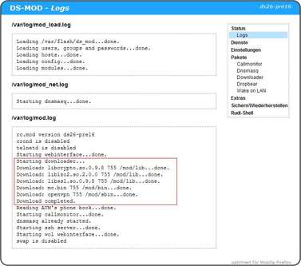

# Downloader CGI
 - Package: [master/make/pkgs/downloader/](https://github.com/Freetz-NG/freetz-ng/tree/master/make/pkgs/downloader/)

Das **Downloader-CGI** ist ausführlich in [diesem
Forumsthread](http://www.ip-phone-forum.de/showthread.php?t=134934)
beschrieben. Es hilft beim [Platz sparen im Dateisystem der
Fritz!Box](http://wiki.ip-phone-forum.de/software:ds-mod:development:platz_sparen),
indem es benötigte Pakete zur Laufzeit aus dem Netz lädt - sodass man
diese nicht fest auf der Box installieren muss. Interessant ist
Downloader in erster Linie für die Boxen ohne USB-Host und wird letzte
Zeit immer seltener gebraucht.
Das Vorbereitungsskript für External wurde um eine automatische
Vorbereitungsroutine für den Downloader erweitert. Somit werden sowohl
die eigentlichen Dateien für die Auslagerung als separate gz-Archive
vorbereitet als auch eine Datei mit der Konfiguration für Downloader-CGI
während der make-Prozedur angelegt. Die Sektion befindet sich in
menuconfig unter den External-Optionen.
Das Verhalten von External und Downloader unterscheidet sich um
Einiges:

1.  Downloader benutzt ausgelagerte Binaries als separate gz-Archive.
    External packt dagegen alle Dateien zu einem gemeinsamen
    tar.bz2-Archiv.
2.  Downloader braucht eine Downloader-CGI, mit einem Dienst, der beim
    Starten der Box die benötigten Dateien von einem externen HTTP- oder
    FTP-Server ins RAM der Box holt. Beim External gibt es diesen
    Schritt nicht. Die Dateien sind im Falle von External sofort nach
    dem mounten vom USB-Medium verfügbar.
3.  Beim Downloader werden Symlinks beim Bauen der Firmware vom Flash
    nach RAM hingelegt. Beim External zeigen diese Symlinks auf eine
    zuvor vereinbarte Stelle auf dem USB-Medium.

Die Screenshots stammen zwar noch aus den Zeiten von ds-mod. Bis auf die
Namensänderung in Freetz und einige kosmetische Änderungen hat sich
allerdings seit dieser Zeit nicht viel geändert.

**Hauptseite:**

**Downloader-Logs beim Hochfahren der Box:**

