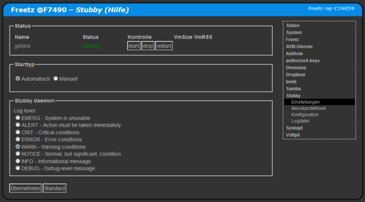

# getdns 1.5.2
 - Package: [master/make/pkgs/getdns/](https://github.com/Freetz-NG/freetz-ng/tree/master/make/pkgs/getdns/)

Mit Getdns  kann die Namensauflösung via DNS-over-TLS erfolgen.<br>
<br>
<a href='../screenshots/000-PKG_getdns.png'></a>
<br>

 * In Dnsmasq muss Getdns als "Upstream Nameserver" eingetragen werden, z.B. ```127.0.0.1#11153```

