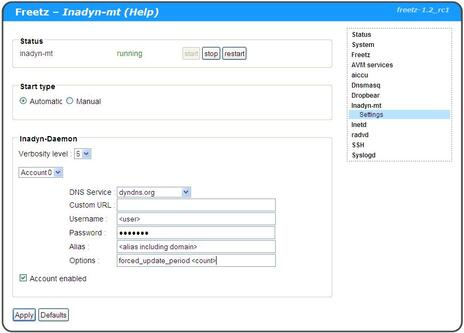

# Inadyn-mt 02.28.10
 - Package: [master/make/pkgs/inadyn-mt/](https://github.com/Freetz-NG/freetz-ng/tree/master/make/pkgs/inadyn-mt/)

Inadyn is an update client that keeps your IP address up to date at your
DNS name provider.
But also if you have a free Host Service from dyn.com you can use the
update client to update your account within every 30 days to prevent it
from being deleted.
Just using the service is not sufficient to prevent your account from
getting expired.
An update client prevents your account from becoming expired, and also
makes sure a IP address change is updated for your host service.
More info about Inadyn can be found via:
[http://dyn.com/support/clients/linux/](http://dyn.com/support/clients/linux/)
For general update client information you can look here:
[http://dyn.com/support/clients/](http://dyn.com/support/clients/)

It appears from the forum that it is not possible anymore to apply for a
new free account. But on page
[http://dyn.com/legal/account-ownership-and-recovery-policy/](http://dyn.com/legal/account-ownership-and-recovery-policy/)
there is a reference that a new account can be created via
[https://account.dyn.com/entrance/](https://account.dyn.com/entrance/)
Just give it a try.

 * From
7-May-2014

> From 7-May the free Dyn account will stop. See [Dyn
> blog](http://dyn.com/blog/why-we-decided-to-stop-offering-free-accounts/).


 * Since
14-May-2013

> Starting now, if you would like to maintain your free Dyn account, you
> must log into your account once a month. Failure to do so will result
> in expiration and loss of your hostname. This activity helps us
> eliminate hostnames that are no longer needed and/or dormant. Note
> that using an update client will no longer suffice for this monthly
> login.

Dyn users should have a look at the following (german):
[http://www.ip-phone-forum.de/showthread.php?t=260356](http://www.ip-phone-forum.de/showthread.php?t=260356)
and [OpenDD](opendd.md)

### Creating a Feetz Image with Inadyn

Follow the directions from the [/wiki/WikiStart.en#
Wiki](../index.en.html#%20Wiki)
After the following step you can configure the packages you want to have
included in your image.

```
make menuconfig
```

Make sure the following is selected:

```
[*] Show advanced options
```

```
Package selection  --->  Testing  --->    [*] Inadyn-mt 02.24.36
```

### Setup in Freetz web-interface

To update your account within the default 30 days you can use the
parameter forced_update_period followed by the update period in
seconds.
E.g. for one day you can use 86400 or for 10 days 864000.

[](../screenshots/238.jpg)

If you have enabled the syslog you can verify the syslog messages. E.g.
via a telnet or ssh connection you can using the following command:

```
logread
```

Or via the Freetz web interface: Status > Syslog You can filter on
INADYN to show only Inadyn related messages. You will see that the every
10 minutes by default the IP address is verified for changes. Only if
the IP address changed, your account at your DNS provider is updates
with this new IP address.
