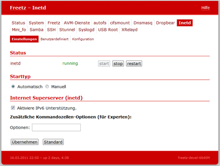

# Inetd 0.2
 - Package: [master/make/pkgs/inetd/](https://github.com/Freetz-NG/freetz-ng/tree/master/make/pkgs/inetd/)

[](../screenshots/206.png)

Hier handelt es sich nur um ein [virtuelles] **inetd**
Paket, welches das benötigte Konfigurations-Framework bereitstellt. Ein
kompatibles `inetd` Binary wird zusätzlich benötigt - wobei derzeit nur
der Busybox-*inetd* unterstützt wird (der aktuelle Stand kann in der
Hilfe zu diesem Paket in
[menuconfig](../help/howtos/common/install/menuconfig.html)
eingesehen werden).

Aus dem Hilfetext des Paketes (siehe "make menuconfig"):

> *This feature is required by the Inetd Freetz package, otherwise you
> may deactivate it. ATTENTION, this feature is NOT deactivated
> automatically if the Inetd Freetz package is unselected.*

Es ist zu beachten, dass BusyBox-*inetd* eine bestimmte Box als
Standardbox mit *inetd* im Image hat (z.B. 7270). Wenn man die
voreingestellte Box auf eine andere umändert, bei welcher kein inetd
verwendet wird/verwendet werden kann (z.B. 3170), dann bleibt *inetd*
trotzdem ausgewählt. Man kann es manuell abwählen (Advanced options ⇒
BusyBox options ⇒ inetd) oder nach dem Beenden von "make menuconfig"
und Speichern der Einstellungen mittels "make config-clean-deps"
(Details [hier](../help/fritz_faq.html)) abwählen. Dabei werden
aber alle Sachen deaktiviert, zu denen es keine abhängigen, angewählten
Patches, Pakete etc. gibt. Danach müsste man ggf. also noch einmal
"make menuconfig" aufrufen, und das noch einmal überprüfen.


### Benutzerdefiniert

Es können eigene Daemons eingetragen werden die inetd anbieten soll.
Auch können auch in inetd integrierte Services angegeben werden.
Beispiele:

```
31337          stream  tcp     nowait  root    /var/media/ftp/uStor01/binary    binary -i

echo           stream  tcp     nowait  root    internal
echo           dgram   udp     wait    root    internal

discard        stream  tcp     nowait  root    internal
discard        dgram   udp     wait    root    internal

daytime        stream  tcp     nowait  root    internal
daytime        dgram   udp     wait    root    internal

chargen        stream  tcp     nowait  root    internal
chargen        dgram   udp     wait    root    internal

time           stream  tcp     nowait  root    internal
time           dgram   udp     wait    root    internal
```

Hinweis: Es können nur Servicenamen benutzt werden die in /etc/services
hinterlegt sind


### Konfiguration

Hier wird der Inhalt der /etc/inetd.conf angezeigt wie sie von Freetz
generiert wurde. Sie kann hier nicht geändert werden.


### Weiterführende Links

-   [Wikipedia Artikel zu
    ''inetd''](http://de.wikipedia.org/wiki/Inetd)
-   [Linuxfibel: ''inetd''
    Grundlagen](http://de.linwiki.org/index.php/Linuxfibel_-_Netzwerk_Grundlagen_-_Internet_Service_D%C3%A4mon)

### Für Entwickler

-   Ein einfaches Webinterface mit inetd-Unterstützung
    [oidentd](/browser/trunk/make/oidentd/files){.source}
-   Erweiterung eines Paketes mit 2 Diensten, wobei der Webserver
    inetd-fähig wird (vnstat-cgi):
    Changeset r4926

