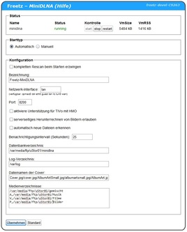

# minidlna 1.3.2
 - Homepage: [https://sourceforge.net/projects/minidlna/](https://sourceforge.net/projects/minidlna/)
 - Manpage: [https://manpages.debian.org/testing/minidlna/minidlnad.1.en.html](https://manpages.debian.org/testing/minidlna/minidlnad.1.en.html)
 - Changelog: [https://sourceforge.net/p/minidlna/git/ci/master/tree/NEWS](https://sourceforge.net/p/minidlna/git/ci/master/tree/NEWS)
 - Repository: [https://sourceforge.net/p/minidlna/git/ci/master/tree/](https://sourceforge.net/p/minidlna/git/ci/master/tree/)
 - Package: [master/make/pkgs/minidlna/](https://github.com/Freetz-NG/freetz-ng/tree/master/make/pkgs/minidlna/)

MiniDLNA ist ein DLNA Server der darauf abzielt vollständig kompatibel
mit DLNA/UPnp-AV Clients zu sein.

### Konfiguartion

Das `Datenbankverzeichnis` sollte auf einen USB-Stick gelegt werden,
damit die Datenbank nicht bei jedem Reboot neu aufgebaut werden muss.

### Weiterführende Links

Projektseite:
[http://sourceforge.net/projects/minidlna/](http://sourceforge.net/projects/minidlna/)
