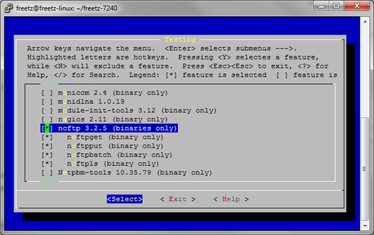

# ncftp 3.2.6 (binaries only)
 - Homepage: [https://www.ncftp.com/ncftp/](https://www.ncftp.com/ncftp/)
 - Manpage: [https://www.ncftp.com/ncftp/doc/faq.html](https://www.ncftp.com/ncftp/doc/faq.html)
 - Changelog: [https://www.ncftp.com/ncftp/doc/changelog.html](https://www.ncftp.com/ncftp/doc/changelog.html)
 - Package: [master/make/pkgs/ncftp/](https://github.com/Freetz-NG/freetz-ng/tree/master/make/pkgs/ncftp/)

*"NcFTP Client (also known as just NcFTP) is a set of FREE application
programs implementing the File Transfer Protocol (FTP)."*

### Was ist NcFTP?

NcFTP Client ist ein FTP Client für die Kommandozeile. Er besitzt
fortgeschrittene Funktionen wie z.B. automatisches Vervollständigen von
Dateinamen, Hintergrundverarbeitung, Bookmarks, Herunterladen ganzer
Verzeichnissbäume oder Verzeichniscaching.

NcFTP bringt die Befehle ncftpget, ncftpput, ncftpls mit. Mit diesen
können Dateien direkt via Kommandozeilenbefehl herunter- oder
heraufgeladen bzw. Verzeichnisse angezeigt werden. Dies ist besonders
für Shell-Scripte äußerst hilfreich.

Quelle:
[apfelwiki](http://www.apfelwiki.de/Main/NcFTPClient)

### Wozu kann NcFTP benutzt werden?

1.) Upload von Dateien ohne, dass der PC gestartet sein muß.
2.) [Download](../Download.html) von Datein ohne, dass der PC
gestartet sein muß.

### Wie installiere ich NcFTP?

Das NcFTP-Package ist beim Bauen eines neuen Freetz-Images auszuwählen.
Im Trunk ist NcFTP unter Packages→Testing zu finden.

[](../screenshots/214.png)

### Wie starte ich NcFTP?

Als erstes schreibt man ein Skript z.B. **upload.sh** mit folgendem
Inhalt:

```
nohup ncftpput -u XXX -p XXX remote-host /remote/path/ /local/path/*
```

Anschließend startet man es per Telnet/SSH mit dem Befehl **sh
upload.sh**.

### Wie ist der Befehl im upload.sh-Skript aufgebaut?

```
nohup ncftpput -u (Username) -p (Password) -m (Adresse des FTP-Servers) /(Zielordner auf dem FTP)/ /(Pfad zum lokalen/eigenen Ordner)/*
```

Beispiel:

```
nohup ncftpput -u freetz -p mypass -m mustermann.no-ip.org /Uploads/ /var/media/ftp/uStor01/User/Mustermann/Downloads/*
```

**Zur Info:** Das **nohup** sorgt dafür das das Skript weiter läuft
obwohl Putty beendet wird.

### Wie sieht der Befehl für ein download.sh Skript aus?

```
nohup ncftpget -u (Username) -p (Password) (Ziel-FTP) (local-Verzeichnis) /(remote-Verzeichnis)/*
```

Beispiel:

```
nohup ncftpget -u freetz -p mypass mustermann.no-ip.org /var/media/ftp/uStor01/Downloads /Downloads/*
```

### Wie kann ich einen abweichenden Port nutzen?

Falls nicht der Standard-Port (21) genutzt werden soll kann man den
gewünschten Port über den Parameter **-P xx** angeben. Der angegebene
Port sollte natürlich zu dem Port passen auf dem der Server hört.

```
nohup ncftpput -u (Username) -p (Password) -P (Ziel-Port) -m (Adresse des FTP-Servers) /(Zielordner auf dem FTP)/ /(Pfad zum lokalen/eigenen Ordner)/*
```

Beispiel:

```
nohup ncftpput -u freetz -p mypass -P 1234 -m mustermann.no-ip.org /Uploads/ /var/media/ftp/uStor01/User/Mustermann/Downloads/*
```

