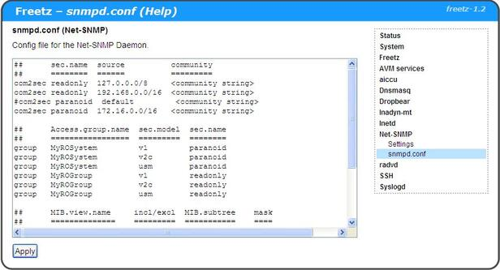
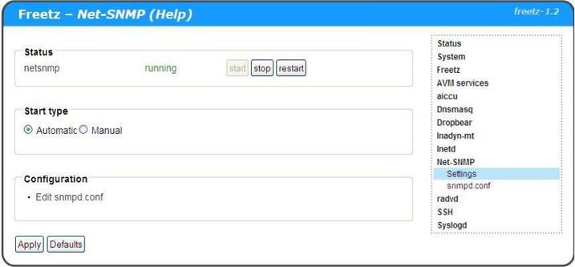
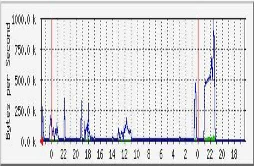
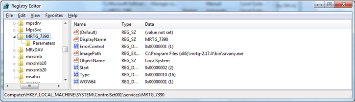

# Net-SNMP 5.9.3
 - Homepage: [http://www.net-snmp.org/](http://www.net-snmp.org/)
 - Manpage: [http://www.net-snmp.org/docs/man/](http://www.net-snmp.org/docs/man/)
 - Changelog: [http://www.net-snmp.org/download.html](http://www.net-snmp.org/download.html)
 - Repository: [https://github.com/net-snmp/net-snmp](https://github.com/net-snmp/net-snmp)
 - Package: [master/make/netsnmp/](https://github.com/Freetz-NG/freetz-ng/tree/master/make/netsnmp/)

Net-SNMP (**S**imple **N**etwork **M**anagement **P**rotocol) includes
an open source SNMPd agent to monitor and administer SNMP capable
network devices like routers and switches.
You can poll the snmpd agent on the router to obtain e.g. interface or
CPU statistics information and display this in a nice graph with the
help of a program like
[MRTG](http://oss.oetiker.ch/mrtg/)
More info about Net-SNMP can be found via:
[http://www.net-snmp.org/](http://www.net-snmp.org/)

### Creating a Feetz Image with Net-SNMP

Follow the directions from the [Wiki](../index.en.html#)
After the following step you can configure the packages you want to have
included in your image.

```
	make menuconfig
```

Make sure the following is selected (so I have 1 out of 3 selected):

```
	Package selection  ---> Standard packages  ---> [*] Net-SNMP 5.4.2.1 snmpd
	Package selection  ---> Standard packages  ---> [ ]   With openssl encryption (NEW)
	Package selection  ---> Standard packages  ---> [ ]   With zlib compression (NEW)
```

### Setup in Freetz web-interface

#### conf

First you should create a snmpd.conf file. This file contains all
configuration options for Net-SNMP, including a community string, which
you can regard as a password for access control.
A full
description of all possible parameters can be found in the online manual
page:
[http://www.net-snmp.org/docs/man/snmpd.conf.html](http://www.net-snmp.org/docs/man/snmpd.conf.html)
You can edit the snmpd.conf file via the Freetz web-interface via
Net-SNMP > snmpd.conf

If you would like to have a minimal config you can use the following:

```
	rocommunity public
	rwcommunity private
```

This way access contol is only based on the communiy string.

I found an example config with more accss contol options in one of the
attachments in this thread:
[http://www.ip-phone-forum.de/showthread.php?t=122073](http://www.ip-phone-forum.de/showthread.php?t=122073)
This shows how to control access based on source IP address range with
additional options to restrict access.

```
	##      sec.name  source          community
	##      ========  ======          =========
	com2sec readonly  127.0.0.0/8     <community string>
	com2sec readonly  192.168.0.0/16  <community string>
	#com2sec paranoid  default         <community string>
	com2sec paranoid  172.16.0.0/16   <community string>

	##      Access.group.name  sec.model  sec.name
	##      =================  =========  ========
	group   MyROSystem         v1         paranoid
	group   MyROSystem         v2c        paranoid
	group   MyROSystem         usm        paranoid
	group   MyROGroup          v1         readonly
	group   MyROGroup          v2c        readonly
	group   MyROGroup          usm        readonly

	##      MIB.view.name     incl/excl  MIB.subtree    mask
	##      ==============    =========  ===========    ====
	view    all               included   .1             80
	view    system            included   .1.3.6.1.2.1.1

	##      MIB
	##      group.name   context sec.model sec.level prefix read     write  notif
	##      ==========   ======= ========= ========= ====== ====     =====  =====
	access  MyROSystem   ""      any       noauth    exact  system   none   none
	access  MyROGroup    ""      any       noauth    exact  all      none   none
```

If you only allow access from inside your trusted network you can use
the default community string, which is for readonly **public** and for
readwrite **private**.
More information on the View-Based Access Control Model (VACM) can be
found on the [Net-SNMP
Wiki](http://www.net-snmp.org/wiki/index.php/Vacm)

[](../screenshots/247.jpg)

#### setup

After saving a snmpd.conf file using the Net-SNMP > snmpd.conf setup
page you can enable Net-SNMP to start automatically at bootup.

[](../screenshots/246.jpg)

#### verify

With many Linux distributions you als have snmp tools included like
snmpget, snmpset, snmpwalk, ...
A quick guide how to use these tools can be found [on the
net-snmp.org
site](http://www.net-snmp.org/wiki/index.php/Tutorials).

Some commands: To get a list of interface descriptions (ifDesc):

> snmpwalk -v 2c -c <community string> 192.168.178.1
> .1.3.6.1.2.1.2.2.1.2

> snmpwalk -v 2c -c <community string> -O a 192.168.178.1
> .1.3.6.1.2.1.2.2.1.2

To get a list of all available objects:

> snmpwalk -v 2c -c <community string> 192.168.178.1 .1

### MRTG

The Multi Router Traffic Grapher will allow you to generate nice graphs
of the data available via SNMP.
This can be system information like uptime, interface information and
statistics, and more.
The graphs can help a lot with trouble clearing issues, both with the
FritsBox (e.g. CPU memory), and in the network.
For more info see the [MRTG
site](http://oss.oetiker.ch/mrtg/).


Here an example on the graph you can generate:

[](../screenshots/248.jpg)

# Installing MRTG

I installed MRTG on a Win7 pc. For this I followed the
[Windows Installation
Guide](http://oss.oetiker.ch/mrtg/doc/mrtg-nt-guide.en.html).

I also installed MGTG as a service.


### MRTG Config file

You can generate a initial config file with the cfgmaker tool.
This will query the snmp agent, and from the obtained info a config file
is created:

> perl cfgmaker public@192.168.178.1 ---global "WorkDir:
> c:\www\mrtg" ---output mrtg.cfg

But be aware that I have noticed that interface index numbering changes
often at reboot, or when router parameters are changed.
For the wifi interfaces 'wifi0' and 'ath0' of the 7270v3 I have even
seen multiple interface indexes were created where only the last created
with actual counters. A restart of the snmpd will correct this.

In the generated config file most, if not all, are commented out due to
e.g. if there is no speed information found. Start with remove the
comments character for one interface, and get this to work.
After you have cleared all possible config errors (e.g. watch leading
spaces which seems not accepted at some locations), you can add more
interfaces.
You can also change the ADSL related interfaces to have two speeds
(asymmetric) so the percentage of used link speed for up and down is
more realistic.

Here my current config for the 7270v3: I added config for monitoring CPU
load (1, 5, and 15 minutes average), CPU Usage, and Memory usages. This
to help with trouble shooting performance issues.
A good explanation of how to interpret the CPU load values can be found
[here](http://blog.scoutapp.com/articles/2009/07/31/understanding-load-averages).

```
	# Created by
	# cfgmaker public@192.168.178.1 --global "WorkDir: c:\www\mrtg" --output mrtg.cfg

	### Global Config Options

	#  for UNIX
	# WorkDir: /home/http/mrtg

	#  or for NT
	# WorkDir: c:\mrtgdata
	WorkDir: c:\Users\<user>\www\mrtg
	RunAsDaemon: yes

	### Global Defaults

	#  to get bits instead of bytes and graphs growing to the right
	# Options[_]: growright, bits

	EnableIPv6: no

	######################################################################
	# System: fritz.fonwlan.box
	# Description: Linux fritz.fonwlan.box 2.6.19.2 #1 Fri Apr 8 14:13:30 CEST 2011 mips
	# Contact: root@localhost
	# Location: Unknown
	######################################################################

	## Interface 1 >> Descr: 'cpmac0' | Name: 'No Name' | Ip: 'No Ip' | Eth: 'No Ethernet Id' ###
	## The following interface is commented out because:
	## * has no ifSpeed property

	Target[192.168.178.1_cpmac0]: \cpmac0:public@192.168.178.1:
	SetEnv[192.168.178.1_cpmac0]: MRTG_INT_IP="No Ip" MRTG_INT_DESCR="cpmac0"
	MaxBytes[192.168.178.1_cpmac0]: 12500000
	Title[192.168.178.1_cpmac0]: Traffic Analysis for 1 -- cpmac0 100Mbit/s Ethernet switch
	PageTop[192.168.178.1_cpmac0]: <h1>Traffic Analysis for 1 -- cpmac0 100Mbit/s Ethernet switch</h1>
		<div id="sysdetails">
		    <table>
		        <tr>
		            <td>System:</td>
		            <td>fritz.fonwlan.box in Unknown</td>
		        </tr>
		        <tr>
		            <td>Maintainer:</td>
		            <td>root@localhost</td>
		        </tr>
		        <tr>
		            <td>Description:</td>
		            <td>cpmac0  </td>
		        </tr>
		        <tr>
		            <td>ifType:</td>
		            <td>ethernetCsmacd (6)</td>
		        </tr>
		        <tr>
		            <td>ifName:</td>
		            <td>No Name</td>
		        </tr>
		        <tr>
		            <td>Max Speed:</td>
		            <td>12.5 MBytes/s</td>
		        </tr>
		        <tr>
		            <td>Ip:</td>
		            <td>No Ip (No DNS name)</td>
		        </tr>
		    </table>
		</div>

	## Interface 2 >> Descr: 'lo' | Name: 'No Name' | Ip: '127.0.0.1' | Eth: 'No Ethernet Id' ###
	## The following interface is commented out because:
	## * it is a Software Loopback interface

	Target[192.168.178.1_lo]: \lo:public@192.168.178.1:
	SetEnv[192.168.178.1_lo]: MRTG_INT_IP="127.0.0.1" MRTG_INT_DESCR="lo"
	MaxBytes[192.168.178.1_lo]: 1250000
	Title[192.168.178.1_lo]: Traffic Analysis for 2 -- lo Local Loopback Interface
	PageTop[192.168.178.1_lo]: <h1>Traffic Analysis for 2 -- lo Local Loopback Interface</h1>
		<div id="sysdetails">
		    <table>
		        <tr>
		            <td>System:</td>
		            <td>fritz.fonwlan.box in Unknown</td>
		        </tr>
		        <tr>
		            <td>Maintainer:</td>
		            <td>root@localhost</td>
		        </tr>
		        <tr>
		            <td>Description:</td>
		            <td>lo  </td>
		        </tr>
		        <tr>
		            <td>ifType:</td>
		            <td>softwareLoopback (24)</td>
		        </tr>
		        <tr>
		            <td>ifName:</td>
		            <td>No Name</td>
		        </tr>
		        <tr>
		            <td>Max Speed:</td>
		            <td>1250.0 kBytes/s</td>
		        </tr>
		        <tr>
		            <td>Ip:</td>
		            <td>127.0.0.1 (localhost)</td>
		        </tr>
		    </table>
		</div>

	### Interface 3 >> Descr: 'sit0' | Name: 'No Name' | Ip: 'No Ip' | Eth: 'No Ethernet Id' ###
	### The following interface is commented out because:
	### * it is administratively DOWN
	### * it is operationally DOWN
	### * has no ifSpeed property
	#
	# Target[192.168.178.1_sit0]: \sit0:public@192.168.178.1:
	# SetEnv[192.168.178.1_sit0]: MRTG_INT_IP="No Ip" MRTG_INT_DESCR="sit0"
	# MaxBytes[192.168.178.1_sit0]: 0
	# Title[192.168.178.1_sit0]: Traffic Analysis for 3 -- sit0
	# PageTop[192.168.178.1_sit0]: <h1>Traffic Analysis for 3 -- sit0</h1>
	#       <div id="sysdetails">
	#           <table>
	#               <tr>
	#                   <td>System:</td>
	#                   <td>fritz.fonwlan.box in Unknown</td>
	#               </tr>
	#               <tr>
	#                   <td>Maintainer:</td>
	#                   <td>root@localhost</td>
	#               </tr>
	#               <tr>
	#                   <td>Description:</td>
	#                   <td>sit0  </td>
	#               </tr>
	#               <tr>
	#                   <td>ifType:</td>
	#                   <td>Encapsulation Interface (131)</td>
	#               </tr>
	#               <tr>
	#                   <td>ifName:</td>
	#                   <td>No Name</td>
	#               </tr>
	#               <tr>
	#                   <td>Max Speed:</td>
	#                   <td>0.0 Bytes/s</td>
	#               </tr>
	#               <tr>
	#                   <td>Ip:</td>
	#                   <td>No Ip (No DNS name)</td>
	#               </tr>
	#           </table>
	#       </div>

	## Interface 4 >> Descr: 'eth0' | Name: 'No Name' | Ip: 'No Ip' | Eth: 'No Ethernet Id' ###
	## The following interface is commented out because:
	## * has no ifSpeed property

	Target[192.168.178.1_eth0]: \eth0:public@192.168.178.1:
	SetEnv[192.168.178.1_eth0]: MRTG_INT_IP="No Ip" MRTG_INT_DESCR="eth0"
	MaxBytes[192.168.178.1_eth0]: 12500000
	Title[192.168.178.1_eth0]: Traffic Analysis for 4 -- eth0
	PageTop[192.168.178.1_eth0]: <h1>Traffic Analysis for 4 -- eth0</h1>
		<div id="sysdetails">
		    <table>
		        <tr>
		            <td>System:</td>
		            <td>fritz.fonwlan.box in Unknown</td>
		        </tr>
		        <tr>
		            <td>Maintainer:</td>
		            <td>root@localhost</td>
		        </tr>
		        <tr>
		            <td>Description:</td>
		            <td>eth0  </td>
		        </tr>
		        <tr>
		            <td>ifType:</td>
		            <td>ethernetCsmacd (6)</td>
		        </tr>
		        <tr>
		            <td>ifName:</td>
		            <td>No Name</td>
		        </tr>
		        <tr>
		            <td>Max Speed:</td>
		            <td>12.5 MBytes/s</td>
		        </tr>
		        <tr>
		            <td>Ip:</td>
		            <td>No Ip (No DNS name)</td>
		        </tr>
		    </table>
		</div>

	## Interface 6 >> Descr: 'lan' | Name: 'No Name' | Ip: '169.254.1.1' | Eth: 'No Ethernet Id' ###
	## The following interface is commented out because:
	## * has no ifSpeed property

	Target[192.168.178.1_lan]: \lan:public@192.168.178.1:
	SetEnv[192.168.178.1_lan]: MRTG_INT_IP="169.254.1.1" MRTG_INT_DESCR="lan"
	MaxBytes[192.168.178.1_lan]: 12500000
	Title[192.168.178.1_lan]: Traffic Analysis for 6 -- lan (eth + wifi)
	PageTop[192.168.178.1_lan]: <h1>Traffic Analysis for 6 -- lan (eth + wifi)</h1>
		<div id="sysdetails">
		    <table>
		        <tr>
		            <td>System:</td>
		            <td>fritz.fonwlan.box in Unknown</td>
		        </tr>
		        <tr>
		            <td>Maintainer:</td>
		            <td>root@localhost</td>
		        </tr>
		        <tr>
		            <td>Description:</td>
		            <td>lan  </td>
		        </tr>
		        <tr>
		            <td>ifType:</td>
		            <td>ethernetCsmacd (6)</td>
		        </tr>
		        <tr>
		            <td>ifName:</td>
		            <td>No Name</td>
		        </tr>
		        <tr>
		            <td>Max Speed:</td>
		            <td>12.5 MBytes/s</td>
		        </tr>
		        <tr>
		            <td>Ip:</td>
		            <td>169.254.1.1 (No DNS name)</td>
		        </tr>
		    </table>
		</div>

	## Interface 7 >> Descr: 'guest' | Name: 'No Name' | Ip: '192.168.179.1' | Eth: 'No Ethernet Id' ###
	## The following interface is commented out because:
	## * has no ifSpeed property

	Target[192.168.178.1_guest]: \guest:public@192.168.178.1:
	SetEnv[192.168.178.1_guest]: MRTG_INT_IP="192.168.179.1" MRTG_INT_DESCR="guest"
	MaxBytes[192.168.178.1_guest]: 6750000
	Title[192.168.178.1_guest]: Traffic Analysis for 7 -- guest (Guest WiFi)
	PageTop[192.168.178.1_guest]: <h1>Traffic Analysis for 7 -- guest (Guest WiFi)</h1>
		<div id="sysdetails">
		    <table>
		        <tr>
		            <td>System:</td>
		            <td>fritz.fonwlan.box in Unknown</td>
		        </tr>
		        <tr>
		            <td>Maintainer:</td>
		            <td>root@localhost</td>
		        </tr>
		        <tr>
		            <td>Description:</td>
		            <td>guest  </td>
		        </tr>
		        <tr>
		            <td>ifType:</td>
		            <td>ethernetCsmacd (6)</td>
		        </tr>
		        <tr>
		            <td>ifName:</td>
		            <td>No Name</td>
		        </tr>
		        <tr>
		            <td>Max Speed:</td>
		            <td>6.75 MBytes/s</td>
		        </tr>
		        <tr>
		            <td>Ip:</td>
		            <td>192.168.179.1 (No DNS name)</td>
		        </tr>
		    </table>
		</div>

	## Interface 22 >> Descr: 'wifi0' | Name: 'No Name' | Ip: 'No Ip' | Eth: 'No Ethernet Id' ###
	## The following interface is commented out because:
	## * has no ifSpeed property

	Target[192.168.178.1_wifi0]: \wifi0:public@192.168.178.1:
	SetEnv[192.168.178.1_wifi0]: MRTG_INT_IP="No Ip" MRTG_INT_DESCR="wifi0"
	MaxBytes[192.168.178.1_wifi0]: 6750000
	Title[192.168.178.1_wifi0]: Traffic Analysis for 22 -- wifi0
	PageTop[192.168.178.1_wifi0]: <h1>Traffic Analysis for 22 -- wifi0</h1>
		<div id="sysdetails">
		    <table>
		        <tr>
		            <td>System:</td>
		            <td>fritz.fonwlan.box in Unknown</td>
		        </tr>
		        <tr>
		            <td>Maintainer:</td>
		            <td>root@localhost</td>
		        </tr>
		        <tr>
		            <td>Description:</td>
		            <td>wifi0  </td>
		        </tr>
		        <tr>
		            <td>ifType:</td>
		            <td>ethernetCsmacd (6)</td>
		        </tr>
		        <tr>
		            <td>ifName:</td>
		            <td>No Name</td>
		        </tr>
		        <tr>
		            <td>Max Speed:</td>
		            <td>6.75 MBytes/s</td>
		        </tr>
		        <tr>
		            <td>Ip:</td>
		            <td>No Ip (No DNS name)</td>
		        </tr>
		    </table>
		</div>

	## Interface 25 >> Descr: 'ath0' | Name: 'No Name' | Ip: 'No Ip' | Eth: 'No Ethernet Id' ###
	## The following interface is commented out because:
	## * has no ifSpeed property

	Target[192.168.178.1_ath0]: \ath0:public@192.168.178.1:
	SetEnv[192.168.178.1_ath0]: MRTG_INT_IP="No Ip" MRTG_INT_DESCR="ath0"
	MaxBytes[192.168.178.1_ath0]: 6750000
	Title[192.168.178.1_ath0]: Traffic Analysis for 25 -- ath0
	PageTop[192.168.178.1_ath0]: <h1>Traffic Analysis for 25 -- ath0</h1>
		<div id="sysdetails">
		    <table>
		        <tr>
		            <td>System:</td>
		            <td>fritz.fonwlan.box in Unknown</td>
		        </tr>
		        <tr>
		            <td>Maintainer:</td>
		            <td>root@localhost</td>
		        </tr>
		        <tr>
		            <td>Description:</td>
		            <td>ath0  </td>
		        </tr>
		        <tr>
		            <td>ifType:</td>
		            <td>ethernetCsmacd (6)</td>
		        </tr>
		        <tr>
		            <td>ifName:</td>
		            <td>No Name</td>
		        </tr>
		        <tr>
		            <td>Max Speed:</td>
		            <td>6.75 MBytes/s</td>
		        </tr>
		        <tr>
		            <td>Ip:</td>
		            <td>No Ip (No DNS name)</td>
		        </tr>
		    </table>
		</div>

	## Interface 30 >> Descr: 'guest1' | Name: 'No Name' | Ip: 'No Ip' | Eth: 'No Ethernet Id' ###
	## The following interface is commented out because:
	## * has no ifSpeed property

	Target[192.168.178.1_guest1]: \guest1:public@192.168.178.1:
	SetEnv[192.168.178.1_guest1]: MRTG_INT_IP="No Ip" MRTG_INT_DESCR="guest1"
	MaxBytes[192.168.178.1_guest1]: 6750000
	Title[192.168.178.1_guest1]: Traffic Analysis for 30 -- guest1 (Guest WiFi)
	PageTop[192.168.178.1_guest1]: <h1>Traffic Analysis for 30 -- guest1 (Guest WiFi)</h1>
		<div id="sysdetails">
		    <table>
		        <tr>
		            <td>System:</td>
		            <td>fritz.fonwlan.box in Unknown</td>
		        </tr>
		        <tr>
		            <td>Maintainer:</td>
		            <td>root@localhost</td>
		        </tr>
		        <tr>
		            <td>Description:</td>
		            <td>guest1  </td>
		        </tr>
		        <tr>
		            <td>ifType:</td>
		            <td>ethernetCsmacd (6)</td>
		        </tr>
		        <tr>
		            <td>ifName:</td>
		            <td>No Name</td>
		        </tr>
		        <tr>
		            <td>Max Speed:</td>
		            <td>6.75 MBytes/s</td>
		        </tr>
		        <tr>
		            <td>Ip:</td>
		            <td>No Ip (No DNS name)</td>
		        </tr>
		    </table>
		</div>

	## Interface 37 >> Descr: 'dsl' | Name: 'No Name' | Ip: 'No Ip' | Eth: 'No Ethernet Id' ###
	## The following interface is commented out because:
	### * has no ifSpeed property

	Target[192.168.178.1_dsl]: \dsl:public@192.168.178.1:
	SetEnv[192.168.178.1_dsl]: MRTG_INT_IP="No Ip" MRTG_INT_DESCR="dsl"
	MaxBytes1[192.168.178.1_dsl]: 1500000
	MaxBytes2[192.168.178.1_dsl]: 128000
	Title[192.168.178.1_dsl]: Traffic Analysis for 37 -- dsl
	PageTop[192.168.178.1_dsl]: <h1>Traffic Analysis for 37 -- dsl</h1>
		<div id="sysdetails">
		    <table>
		        <tr>
		            <td>System:</td>
		            <td>fritz.fonwlan.box in Unknown</td>
		        </tr>
		        <tr>
		            <td>Maintainer:</td>
		            <td>root@localhost</td>
		        </tr>
		        <tr>
		            <td>Description:</td>
		            <td>dsl  </td>
		        </tr>
		        <tr>
		            <td>ifType:</td>
		            <td>ppp (23)</td>
		        </tr>
		        <tr>
		            <td>ifName:</td>
		            <td>No Name</td>
		        </tr>
		        <tr>
		            <td>Max Speed:</td>
		            <td>1.50 MBytes/s Downstream, 128 kBytes/s Upstream</td>
		        </tr>
		        <tr>
		            <td>Ip:</td>
		            <td>No Ip (No DNS name)</td>
		        </tr>
		    </table>
		</div>

	## Interface 38 >> Descr: 'adsl' | Name: 'No Name' | Ip: 'No Ip' | Eth: 'No Ethernet Id' ###
	## The following interface is commented out because:
	## * has no ifSpeed property

	Target[192.168.178.1_adsl]: \adsl:public@192.168.178.1:
	SetEnv[192.168.178.1_adsl]: MRTG_INT_IP="No Ip" MRTG_INT_DESCR="adsl"
	MaxBytes1[192.168.178.1_adsl]: 1500000
	MaxBytes2[192.168.178.1_adsl]: 128000
	Title[192.168.178.1_adsl]: Traffic Analysis for 38 -- atm
	PageTop[192.168.178.1_adsl]: <h1>Traffic Analysis for 38 -- atm</h1>
		<div id="sysdetails">
		    <table>
		        <tr>
		            <td>System:</td>
		            <td>fritz.fonwlan.box in Unknown</td>
		        </tr>
		        <tr>
		            <td>Maintainer:</td>
		            <td>root@localhost</td>
		        </tr>
		        <tr>
		            <td>Description:</td>
		            <td>adsl  </td>
		        </tr>
		        <tr>
		            <td>ifType:</td>
		            <td>atm (37)</td>
		        </tr>
		        <tr>
		            <td>ifName:</td>
		            <td>No Name</td>
		        </tr>
		        <tr>
		            <td>Max Speed:</td>
		            <td>1.50 MBytes/s Downstream, 128 kBytes/s Upstream</td>
		        </tr>
		        <tr>
		            <td>Ip:</td>
		            <td>No Ip (No DNS name)</td>
		        </tr>
		    </table>
		</div>

	## Interface 43 >> Descr: 'sixxs' | Name: 'No Name' | Ip: 'No Ip' | Eth: 'No Ethernet Id' ###
	## The following interface is commented out because:
	## * has no ifSpeed property

	Target[192.168.178.1_sixxs]: \sixxs:public@192.168.178.1:
	SetEnv[192.168.178.1_sixxs]: MRTG_INT_IP="No Ip" MRTG_INT_DESCR="sixxs"
	MaxBytes1[192.168.178.1_sixxs]: 1500000
	MaxBytes2[192.168.178.1_sixxs]: 128000
	Title[192.168.178.1_sixxs]: Traffic Analysis for 43 -- sixxs
	PageTop[192.168.178.1_sixxs]: <h1>Traffic Analysis for 43 -- sixxs</h1>
		<div id="sysdetails">
		    <table>
		        <tr>
		            <td>System:</td>
		            <td>fritz.fonwlan.box in Unknown</td>
		        </tr>
		        <tr>
		            <td>Maintainer:</td>
		            <td>root@localhost</td>
		        </tr>
		        <tr>
		            <td>Description:</td>
		            <td>sixxs  </td>
		        </tr>
		        <tr>
		            <td>ifType:</td>
		            <td>Other (1)</td>
		        </tr>
		        <tr>
		            <td>ifName:</td>
		            <td>No Name</td>
		        </tr>
		        <tr>
		            <td>Max Speed:</td>
		            <td>1.50 MBytes/s Downstream, 128 kBytes/s Upstream</td>
		        </tr>
		        <tr>
		            <td>Ip:</td>
		            <td>No Ip (No DNS name)</td>
		        </tr>
		    </table>
		</div>

	# Router CPU one minute load averages
	Target[cpu.1]:.1.3.6.1.4.1.2021.10.1.5.1&.1.3.6.1.4.1.2021.10.1.5.1:public@192.168.178.1:
	RouterUptime[cpu.1]: sysUpTime.0:public@192.168.178.1:
	MaxBytes[cpu.1]: 1000
	Title[cpu.1]: CPU LOAD
	PageTop[cpu.1]: <H1>CPU one minute load averages</H1>
		<div id="sysdetails">
		    <table>
		        <tr>
		            <td>System:</td>
		            <td>fritz.fonwlan.box 7270</td>
		        </tr>
		        <tr>
		            <td>Maintainer:</td>
		            <td>root@localhost</td>
		        </tr>
		        <tr>
		            <td>Description:</td>
		            <td>One minute load averages</td>
		        </tr>
		    </table>
		</div>
	ShortLegend[cpu.1]: avg cpu/min
	Factor[cpu.1]: 0.01
	YLegend[cpu.1]: CPU Utilization
	Legend1[cpu.1]: CPU Utilization (Load)
	Legend2[cpu.1]: CPU Utilization (Load)
	Legend3[cpu.1]:
	Legend4[cpu.1]:
	LegendI[cpu.1]:
	LegendO[cpu.1]: &nbsp;Usage
	Options[cpu.1]: gauge, unknaszero

	# Router CPU five minute load averages
	Target[cpu.2]:.1.3.6.1.4.1.2021.10.1.5.2&.1.3.6.1.4.1.2021.10.1.5.2:public@192.168.178.1:
	RouterUptime[cpu.2]: .1.3.6.1.2.1.1.3.0:public@192.168.178.1:
	MaxBytes[cpu.2]: 1000
	Title[cpu.2]: CPU LOAD
	PageTop[cpu.2]: <H1>CPU five minute load averages</H1>
		<div id="sysdetails">
		    <table>
		        <tr>
		            <td>System:</td>
		            <td>fritz.fonwlan.box 7270</td>
		        </tr>
		        <tr>
		            <td>Maintainer:</td>
		            <td>root@localhost</td>
		        </tr>
		        <tr>
		            <td>Description:</td>
		            <td>Five minute load averages</td>
		        </tr>
		    </table>
		</div>
	ShortLegend[cpu.2]: avg cpu/5 min
	Factor[cpu.2]: 0.01
	YLegend[cpu.2]: CPU Utilization
	Legend1[cpu.2]: CPU Utilization (Load)
	Legend2[cpu.2]: CPU Utilization (Load)
	Legend3[cpu.2]:
	Legend4[cpu.2]:
	LegendI[cpu.2]:
	LegendO[cpu.2]: &nbsp;Usage
	Options[cpu.2]: gauge, unknaszero

	# Router CPU fifteen minute load averages
	Target[cpu.3]:.1.3.6.1.4.1.2021.10.1.5.3&.1.3.6.1.4.1.2021.10.1.5.3:public@192.168.178.1:
	RouterUptime[cpu.3]: sysUpTime.0:public@192.168.178.1:
	MaxBytes[cpu.3]: 1000
	Title[cpu.3]: CPU LOAD
	PageTop[cpu.3]: <H1>CPU fifteen minute load averages</H1>
		<div id="sysdetails">
		    <table>
		        <tr>
		            <td>System:</td>
		            <td>fritz.fonwlan.box 7270</td>
		        </tr>
		        <tr>
		            <td>Maintainer:</td>
		            <td>root@localhost</td>
		        </tr>
		        <tr>
		            <td>Description:</td>
		            <td>Fifteen minute load averages</td>
		        </tr>
		    </table>
		</div>
	ShortLegend[cpu.3]: avg cpu/15 min
	Factor[cpu.3]: 0.01
	YLegend[cpu.3]: CPU Utilization
	Legend1[cpu.3]: CPU Utilization (Load)
	Legend2[cpu.3]: CPU Utilization (Load)
	Legend3[cpu.3]:
	Legend4[cpu.3]:
	LegendI[cpu.3]:
	LegendO[cpu.3]: &nbsp;Usage
	Options[cpu.3]: gauge, unknaszero

	# Router CPU Utilization ssCpuIdle.0
	Target[cpu.idle]: 100 - .1.3.6.1.4.1.2021.11.11.0&.1.3.6.1.4.1.2021.11.11.0:public@192.168.178.1:
	RouterUptime[cpu.idle]: sysUpTime.0:public@192.168.178.1:
	MaxBytes[cpu.idle]: 1000
	Title[cpu.idle]: CPU Utilization
	PageTop[cpu.idle]: <H1>CPU Utilization</H1>
		<div id="sysdetails">
		    <table>
		        <tr>
		            <td>System:</td>
		            <td>fritz.fonwlan.box 7270</td>
		        </tr>
		        <tr>
		            <td>Maintainer:</td>
		            <td>root@localhost</td>
		        </tr>
		        <tr>
		            <td>Description:</td>
		            <td>CPU Utilization</td>
		        </tr>
		    </table>
		</div>
	ShortLegend[cpu.idle]: %
	YLegend[cpu.idle]: CPU Utilization
	Legend1[cpu.idle]: CPU Utilization %(Load)
	Legend2[cpu.idle]: CPU Utilization %(Load)
	Legend3[cpu.idle]:
	Legend4[cpu.idle]:
	LegendI[cpu.idle]:
	LegendO[cpu.idle]: &nbsp;Usage
	Options[cpu.idle]: gauge, unknaszero

	# Router Used Memory = Memory - Free Memory
	# The total memory can be obtained from /proc/meminfo
	# For the 7390 the MemTotal = 109168 kB
	# For the 7270v3 the MemTotal = 59716 kB
	Target[mem.used]: 59716 - .1.3.6.1.4.1.2021.4.11.0&.1.3.6.1.4.1.2021.4.11.0:public@192.168.178.1:
	RouterUptime[mem.used]: sysUpTime.0:public@192.168.178.1:
	MaxBytes[mem.used]: 59716
	Title[mem.used]: Used Memory
	PageTop[mem.used]: <H1>Used Memory</H1>
		<div id="sysdetails">
		    <table>
		        <tr>
		            <td>System:</td>
		            <td>fritz.fonwlan.box 7270</td>
		        </tr>
		        <tr>
		            <td>Maintainer:</td>
		            <td>root@localhost</td>
		        </tr>
		        <tr>
		            <td>Description:</td>
		            <td>Used Memory</td>
		        </tr>
		    </table>
		</div>
	ShortLegend[mem.used]: kBytes
	YLegend[mem.used]: Used Memory
	Legend1[mem.used]: Used Memory (Total is 59716)
	Legend2[mem.used]: Used Memory (Total is 59716)
	Legend3[mem.used]:
	Legend4[mem.used]:
	LegendI[mem.used]:
	LegendO[mem.used]: &nbsp;Usage
	Options[mem.used]: gauge, unknaszero

	WorkDir: c:\Users\<user>\www\mrtg
```

For the 7390 I have the following config (not so much different).

```
	# Created by
	# cfgmaker public@192.168.178.1 --global "WorkDir: c:\www\mrtg" --output mrtg_7390.cfg

	### Global Config Options

	#  for UNIX
	# WorkDir: /home/http/mrtg

	#  or for NT
	# WorkDir: c:\mrtgdata
	WorkDir: c:\Users\<user>\www\mrtg
	RunAsDaemon: yes

	### Global Defaults

	#  to get bits instead of bytes and graphs growing to the right
	# Options[_]: growright, bits

	EnableIPv6: no

	######################################################################
	# System: fritz.fonwlan.box
	# Description: Linux fritz.fonwlan.box 2.6.28.10 #1 Thu Mar 21 15:33:40 CET 2013 mips
	# Contact: root@localhost
	# Location: Unknown
	######################################################################

	## Changes to use RRDTool as explained in: http://oss.oetiker.ch/mrtg/doc/mrtg-rrd.en.html
	# LogFormat: rrdtool
	# PathAdd: c:\rrdtool\rrdtool-1.4.7\win32\Debug
	# LibAdd: c:\rrdtool\rrdtool-1.4.7\bindings\perl-shared
	## Interface 1 >> Descr: 'lo' | Name: 'No Name' | Ip: '127.0.0.1' | Eth: 'No Ethernet Id' ###
	## The following interface is commented out because:
	## * it is a Software Loopback interface

	Target[192.168.178.1_lo]: \lo:public@192.168.178.1:
	SetEnv[192.168.178.1_lo]: MRTG_INT_IP="127.0.0.1" MRTG_INT_DESCR="lo"
	MaxBytes[192.168.178.1_lo]: 1250000
	Title[192.168.178.1_lo]: Traffic Analysis for 1 -- lo Local Loopback Interface
	PageTop[192.168.178.1_lo]: <h1>Traffic Analysis for 1 -- lo Local Loopback Interface</h1>
		<div id="sysdetails">
		    <table>
		        <tr>
		            <td>System:</td>
		            <td>fritz.fonwlan.box in Unknown</td>
		        </tr>
		        <tr>
		            <td>Maintainer:</td>
		            <td>root@localhost</td>
		        </tr>
		        <tr>
		            <td>Description:</td>
		            <td>lo  </td>
		        </tr>
		        <tr>
		            <td>ifType:</td>
		            <td>softwareLoopback (24)</td>
		        </tr>
		        <tr>
		            <td>ifName:</td>
		            <td>No Name</td>
		        </tr>
		        <tr>
		            <td>Max Speed:</td>
		            <td>1250.0 kBytes/s</td>
		        </tr>
		        <tr>
		            <td>Ip:</td>
		            <td>127.0.0.1 (localhost)</td>
		        </tr>
		    </table>
		</div>

	### Interface 2 >> Descr: 'sit0' | Name: 'No Name' | Ip: 'No Ip' | Eth: 'No Ethernet Id' ###
	### The following interface is commented out because:
	### * it is administratively DOWN
	### * it is operationally DOWN
	### * has no ifSpeed property
	#
	# Target[192.168.178.1_sit0]: \sit0:public@192.168.178.1:
	# SetEnv[192.168.178.1_sit0]: MRTG_INT_IP="No Ip" MRTG_INT_DESCR="sit0"
	# MaxBytes[192.168.178.1_sit0]: 0
	# Title[192.168.178.1_sit0]: Traffic Analysis for 2 -- sit0
	# PageTop[192.168.178.1_sit0]: <h1>Traffic Analysis for 2 -- sit0</h1>
	#       <div id="sysdetails">
	#           <table>
	#               <tr>
	#                   <td>System:</td>
	#                   <td>fritz.fonwlan.box in Unknown</td>
	#               </tr>
	#               <tr>
	#                   <td>Maintainer:</td>
	#                   <td>root@localhost</td>
	#               </tr>
	#               <tr>
	#                   <td>Description:</td>
	#                   <td>sit0  </td>
	#               </tr>
	#               <tr>
	#                   <td>ifType:</td>
	#                   <td>Encapsulation Interface (131)</td>
	#               </tr>
	#               <tr>
	#                   <td>ifName:</td>
	#                   <td>No Name</td>
	#               </tr>
	#               <tr>
	#                   <td>Max Speed:</td>
	#                   <td>0.0 Bytes/s</td>
	#               </tr>
	#               <tr>
	#                   <td>Ip:</td>
	#                   <td>No Ip (No DNS name)</td>
	#               </tr>
	#           </table>
	#       </div>

	## Interface 3 >> Descr: 'cpmac0' | Name: 'No Name' | Ip: 'No Ip' | Eth: 'No Ethernet Id' ###
	## The following interface is commented out because:
	## * has no ifSpeed property

	Target[192.168.178.1_cpmac0]: \cpmac0:public@192.168.178.1:
	SetEnv[192.168.178.1_cpmac0]: MRTG_INT_IP="No Ip" MRTG_INT_DESCR="cpmac0"
	MaxBytes[192.168.178.1_cpmac0]: 128000000
	Title[192.168.178.1_cpmac0]: Traffic Analysis for 3 -- cpmac0 1Gbit/s Ethernet switch
	PageTop[192.168.178.1_cpmac0]: <h1>Traffic Analysis for 3 -- cpmac0 1Gbit/s Ethernet switch</h1>
		<div id="sysdetails">
		    <table>
		        <tr>
		            <td>System:</td>
		            <td>fritz.fonwlan.box in Unknown</td>
		        </tr>
		        <tr>
		            <td>Maintainer:</td>
		            <td>root@localhost</td>
		        </tr>
		        <tr>
		            <td>Description:</td>
		            <td>cpmac0  </td>
		        </tr>
		        <tr>
		            <td>ifType:</td>
		            <td>ethernetCsmacd (6)</td>
		        </tr>
		        <tr>
		            <td>ifName:</td>
		            <td>No Name</td>
		        </tr>
		        <tr>
		            <td>Max Speed:</td>
		            <td>128 MBytes/s</td>
		        </tr>
		        <tr>
		            <td>Ip:</td>
		            <td>No Ip (No DNS name)</td>
		        </tr>
		    </table>
		</div>

	## Interface 4 >> Descr: 'eth0' | Name: 'No Name' | Ip: 'No Ip' | Eth: 'No Ethernet Id' ###
	## The following interface is commented out because:
	## * has no ifSpeed property

	Target[192.168.178.1_eth0]: \eth0:public@192.168.178.1:
	SetEnv[192.168.178.1_eth0]: MRTG_INT_IP="No Ip" MRTG_INT_DESCR="eth0"
	MaxBytes[192.168.178.1_eth0]: 12500000
	Title[192.168.178.1_eth0]: Traffic Analysis for 4 -- eth0
	PageTop[192.168.178.1_eth0]: <h1>Traffic Analysis for 4 -- eth0</h1>
		<div id="sysdetails">
		    <table>
		        <tr>
		            <td>System:</td>
		            <td>fritz.fonwlan.box in Unknown</td>
		        </tr>
		        <tr>
		            <td>Maintainer:</td>
		            <td>root@localhost</td>
		        </tr>
		        <tr>
		            <td>Description:</td>
		            <td>eth0  </td>
		        </tr>
		        <tr>
		            <td>ifType:</td>
		            <td>ethernetCsmacd (6)</td>
		        </tr>
		        <tr>
		            <td>ifName:</td>
		            <td>No Name</td>
		        </tr>
		        <tr>
		            <td>Max Speed:</td>
		            <td>12.5 MBytes/s</td>
		        </tr>
		        <tr>
		            <td>Ip:</td>
		            <td>No Ip (No DNS name)</td>
		        </tr>
		    </table>
		</div>

	## Interface 5 >> Descr: 'lan' | Name: 'No Name' | Ip: '169.254.1.1' | Eth: 'No Ethernet Id' ###
	## The following interface is commented out because:
	## * has no ifSpeed property
	Target[192.168.178.1_lan]: \lan:public@192.168.178.1:
	SetEnv[192.168.178.1_lan]: MRTG_INT_IP="169.254.1.1" MRTG_INT_DESCR="lan"
	MaxBytes[192.168.178.1_lan]: 12500000
	Title[192.168.178.1_lan]: Traffic Analysis for 5 -- lan (eth + wifi)
	PageTop[192.168.178.1_lan]: <h1>Traffic Analysis for 5 -- lan (eth + wifi)</h1>
		<div id="sysdetails">
		    <table>
		        <tr>
		            <td>System:</td>
		            <td>fritz.fonwlan.box in Unknown</td>
		        </tr>
		        <tr>
		            <td>Maintainer:</td>
		            <td>root@localhost</td>
		        </tr>
		        <tr>
		            <td>Description:</td>
		            <td>lan  </td>
		        </tr>
		        <tr>
		            <td>ifType:</td>
		            <td>ethernetCsmacd (6)</td>
		        </tr>
		        <tr>
		            <td>ifName:</td>
		            <td>No Name</td>
		        </tr>
		        <tr>
		            <td>Max Speed:</td>
		            <td>12.5 MBytes/s</td>
		        </tr>
		        <tr>
		            <td>Ip:</td>
		            <td>169.254.1.1 (No DNS name)</td>
		        </tr>
		    </table>
		</div>

	## Interface 6 >> Descr: 'guest' | Name: 'No Name' | Ip: '192.168.179.1' | Eth: 'No Ethernet Id' ###
	## The following interface is commented out because:
	## * has no ifSpeed property

	Target[192.168.178.1_guest]: \guest:public@192.168.178.1:
	SetEnv[192.168.178.1_guest]: MRTG_INT_IP="192.168.179.1" MRTG_INT_DESCR="guest"
	MaxBytes[192.168.178.1_guest]: 37500000
	Title[192.168.178.1_guest]: Traffic Analysis for 6 -- guest (Guest WiFi)
	PageTop[192.168.178.1_guest]: <h1>Traffic Analysis for 6 -- guest (Guest WiFi)</h1>
		<div id="sysdetails">
		    <table>
		        <tr>
		            <td>System:</td>
		            <td>fritz.fonwlan.box in Unknown</td>
		        </tr>
		        <tr>
		            <td>Maintainer:</td>
		            <td>root@localhost</td>
		        </tr>
		        <tr>
		            <td>Description:</td>
		            <td>guest  </td>
		        </tr>
		        <tr>
		            <td>ifType:</td>
		            <td>ethernetCsmacd (6)</td>
		        </tr>
		        <tr>
		            <td>ifName:</td>
		            <td>No Name</td>
		        </tr>
		        <tr>
		            <td>Max Speed:</td>
		            <td>37.5 MBytes/s</td>
		        </tr>
		        <tr>
		            <td>Ip:</td>
		            <td>192.168.179.1 (No DNS name)</td>
		        </tr>
		    </table>
		</div>

	## Interface 19 >> Descr: 'wifi0' | Name: 'No Name' | Ip: 'No Ip' | Eth: 'No Ethernet Id' ###
	## The following interface is commented out because:
	## * has no ifSpeed property

	Target[192.168.178.1_wifi0]: \wifi0:public@192.168.178.1:
	SetEnv[192.168.178.1_wifi0]: MRTG_INT_IP="No Ip" MRTG_INT_DESCR="wifi0"
	MaxBytes[192.168.178.1_wifi0]: 37500000
	Title[192.168.178.1_wifi0]: Traffic Analysis for 19 -- wifi0
	PageTop[192.168.178.1_wifi0]: <h1>Traffic Analysis for 19 -- wifi0</h1>
		<div id="sysdetails">
		    <table>
		        <tr>
		            <td>System:</td>
		            <td>fritz.fonwlan.box in Unknown</td>
		        </tr>
		        <tr>
		            <td>Maintainer:</td>
		            <td>root@localhost</td>
		        </tr>
		        <tr>
		            <td>Description:</td>
		            <td>wifi0  </td>
		        </tr>
		        <tr>
		            <td>ifType:</td>
		            <td>Other (1)</td>
		        </tr>
		        <tr>
		            <td>ifName:</td>
		            <td>No Name</td>
		        </tr>
		        <tr>
		            <td>Max Speed:</td>
		            <td>37.5 MBytes/s</td>
		        </tr>
		        <tr>
		            <td>Ip:</td>
		            <td>No Ip (No DNS name)</td>
		        </tr>
		    </table>
		</div>

	## Interface 20 >> Descr: 'wifi1' | Name: 'No Name' | Ip: 'No Ip' | Eth: 'No Ethernet Id' ###
	## The following interface is commented out because:
	## * has no ifSpeed property

	Target[192.168.178.1_wifi1]: \wifi1:public@192.168.178.1:
	SetEnv[192.168.178.1_wifi1]: MRTG_INT_IP="No Ip" MRTG_INT_DESCR="wifi1"
	MaxBytes[192.168.178.1_wifi1]: 37500000
	Title[192.168.178.1_wifi1]: Traffic Analysis for 20 -- wifi1
	PageTop[192.168.178.1_wifi1]: <h1>Traffic Analysis for 20 -- wifi1</h1>
		<div id="sysdetails">
		    <table>
		        <tr>
		            <td>System:</td>
		            <td>fritz.fonwlan.box in Unknown</td>
		        </tr>
		        <tr>
		            <td>Maintainer:</td>
		            <td>root@localhost</td>
		        </tr>
		        <tr>
		            <td>Description:</td>
		            <td>wifi1  </td>
		        </tr>
		        <tr>
		            <td>ifType:</td>
		            <td>Other (1)</td>
		        </tr>
		        <tr>
		            <td>ifName:</td>
		            <td>No Name</td>
		        </tr>
		        <tr>
		            <td>Max Speed:</td>
		            <td>37.5 MBytes/s</td>
		        </tr>
		        <tr>
		            <td>Ip:</td>
		            <td>No Ip (No DNS name)</td>
		        </tr>
		    </table>
		</div>

	## Interface 25 >> Descr: 'ath0' | Name: 'No Name' | Ip: 'No Ip' | Eth: 'No Ethernet Id' ###
	## The following interface is commented out because:
	## * has no ifSpeed property

	Target[192.168.178.1_ath0]: \ath0:public@192.168.178.1:
	SetEnv[192.168.178.1_ath0]: MRTG_INT_IP="No Ip" MRTG_INT_DESCR="ath0"
	MaxBytes[192.168.178.1_ath0]: 37500000
	Title[192.168.178.1_ath0]: Traffic Analysis for 25 -- ath0
	PageTop[192.168.178.1_ath0]: <h1>Traffic Analysis for 25 -- ath0</h1>
		<div id="sysdetails">
		    <table>
		        <tr>
		            <td>System:</td>
		            <td>fritz.fonwlan.box in Unknown</td>
		        </tr>
		        <tr>
		            <td>Maintainer:</td>
		            <td>root@localhost</td>
		        </tr>
		        <tr>
		            <td>Description:</td>
		            <td>ath0  </td>
		        </tr>
		        <tr>
		            <td>ifType:</td>
		            <td>ethernetCsmacd (6)</td>
		        </tr>
		        <tr>
		            <td>ifName:</td>
		            <td>No Name</td>
		        </tr>
		        <tr>
		            <td>Max Speed:</td>
		            <td>37.5 MBytes/s</td>
		        </tr>
		        <tr>
		            <td>Ip:</td>
		            <td>No Ip (No DNS name)</td>
		        </tr>
		    </table>
		</div>

	## Interface 26 >> Descr: 'ath1' | Name: 'No Name' | Ip: 'No Ip' | Eth: 'No Ethernet Id' ###
	## The following interface is commented out because:
	## * has no ifSpeed property

	Target[192.168.178.1_ath1]: \ath1:public@192.168.178.1:
	SetEnv[192.168.178.1_ath1]: MRTG_INT_IP="No Ip" MRTG_INT_DESCR="ath1"
	MaxBytes[192.168.178.1_ath1]: 37500000
	Title[192.168.178.1_ath1]: Traffic Analysis for 26 -- ath1
	PageTop[192.168.178.1_ath1]: <h1>Traffic Analysis for 26 -- ath1</h1>
		<div id="sysdetails">
		    <table>
		        <tr>
		            <td>System:</td>
		            <td>fritz.fonwlan.box in Unknown</td>
		        </tr>
		        <tr>
		            <td>Maintainer:</td>
		            <td>root@localhost</td>
		        </tr>
		        <tr>
		            <td>Description:</td>
		            <td>ath1  </td>
		        </tr>
		        <tr>
		            <td>ifType:</td>
		            <td>ethernetCsmacd (6)</td>
		        </tr>
		        <tr>
		            <td>ifName:</td>
		            <td>No Name</td>
		        </tr>
		        <tr>
		            <td>Max Speed:</td>
		            <td>37.5 MBytes/s</td>
		        </tr>
		        <tr>
		            <td>Ip:</td>
		            <td>No Ip (No DNS name)</td>
		        </tr>
		    </table>
		</div>

	## Interface 37 >> Descr: 'dsl' | Name: 'No Name' | Ip: 'No Ip' | Eth: 'No Ethernet Id' ###
	## The following interface is commented out because:
	## * has no ifSpeed property

	Target[192.168.178.1_dsl]: \dsl:public@192.168.178.1:
	SetEnv[192.168.178.1_dsl]: MRTG_INT_IP="No Ip" MRTG_INT_DESCR="dsl"
	MaxBytes1[192.168.178.1_dsl]: 1500000
	MaxBytes2[192.168.178.1_dsl]: 128000
	Title[192.168.178.1_dsl]: Traffic Analysis for 37 -- dsl
	PageTop[192.168.178.1_dsl]: <h1>Traffic Analysis for 37 -- dsl</h1>
		<div id="sysdetails">
		    <table>
		        <tr>
		            <td>System:</td>
		            <td>fritz.fonwlan.box in Unknown</td>
		        </tr>
		        <tr>
		            <td>Maintainer:</td>
		            <td>root@localhost</td>
		        </tr>
		        <tr>
		            <td>Description:</td>
		            <td>dsl  </td>
		        </tr>
		        <tr>
		            <td>ifType:</td>
		            <td>ppp (23)</td>
		        </tr>
		        <tr>
		            <td>ifName:</td>
		            <td>No Name</td>
		        </tr>
		        <tr>
		            <td>Max Speed:</td>
		            <td>1.50 MBytes/s Downstream, 128 kBytes/s Upstream</td>
		        </tr>
		        <tr>
		            <td>Ip:</td>
		            <td>No Ip (No DNS name)</td>
		        </tr>
		    </table>
		</div>

	## Interface 38 >> Descr: 'adsl' | Name: 'No Name' | Ip: 'No Ip' | Eth: 'No Ethernet Id' ###
	## The following interface is commented out because:
	## * has no ifSpeed property

	Target[192.168.178.1_adsl]: \adsl:public@192.168.178.1:
	SetEnv[192.168.178.1_adsl]: MRTG_INT_IP="No Ip" MRTG_INT_DESCR="adsl"
	MaxBytes1[192.168.178.1_adsl]: 1500000
	MaxBytes2[192.168.178.1_adsl]: 128000
	Title[192.168.178.1_adsl]: Traffic Analysis for 38 -- atm
	PageTop[192.168.178.1_adsl]: <h1>Traffic Analysis for 38 -- atm</h1>
		<div id="sysdetails">
		    <table>
		        <tr>
		            <td>System:</td>
		            <td>fritz.fonwlan.box in Unknown</td>
		        </tr>
		        <tr>
		            <td>Maintainer:</td>
		            <td>root@localhost</td>
		        </tr>
		        <tr>
		            <td>Description:</td>
		            <td>adsl  </td>
		        </tr>
		        <tr>
		            <td>ifType:</td>
		            <td>atm (37)</td>
		        </tr>
		        <tr>
		            <td>ifName:</td>
		            <td>No Name</td>
		        </tr>
		        <tr>
		            <td>Max Speed:</td>
		            <td>1.50 MBytes/s Downstream, 128 kBytes/s Upstream</td>
		        </tr>
		        <tr>
		            <td>Ip:</td>
		            <td>No Ip (No DNS name)</td>
		        </tr>
		    </table>
		</div>

	## Interface 43 >> Descr: 'sixxs' | Name: 'No Name' | Ip: 'No Ip' | Eth: 'No Ethernet Id' ###
	## The following interface is commented out because:
	## * has no ifSpeed property

	Target[192.168.178.1_sixxs]: \sixxs:public@192.168.178.1:
	SetEnv[192.168.178.1_sixxs]: MRTG_INT_IP="No Ip" MRTG_INT_DESCR="sixxs"
	MaxBytes1[192.168.178.1_sixxs]: 1500000
	MaxBytes2[192.168.178.1_sixxs]: 128000
	Title[192.168.178.1_sixxs]: Traffic Analysis for 43 -- sixxs
	PageTop[192.168.178.1_sixxs]: <h1>Traffic Analysis for 43 -- sixxs</h1>
		<div id="sysdetails">
		    <table>
		        <tr>
		            <td>System:</td>
		            <td>fritz.fonwlan.box in Unknown</td>
		        </tr>
		        <tr>
		            <td>Maintainer:</td>
		            <td>root@localhost</td>
		        </tr>
		        <tr>
		            <td>Description:</td>
		            <td>sixxs  </td>
		        </tr>
		        <tr>
		            <td>ifType:</td>
		            <td>Other (1)</td>
		        </tr>
		        <tr>
		            <td>ifName:</td>
		            <td>No Name</td>
		        </tr>
		        <tr>
		            <td>Max Speed:</td>
		            <td>1.50 MBytes/s Downstream, 128 kBytes/s Upstream</td>
		        </tr>
		        <tr>
		            <td>Ip:</td>
		            <td>No Ip (No DNS name)</td>
		        </tr>
		    </table>
		</div>

	# Router CPU one minute load averages
	Target[cpu.1]:.1.3.6.1.4.1.2021.10.1.5.1&.1.3.6.1.4.1.2021.10.1.5.1:public@192.168.178.1:
	RouterUptime[cpu.1]: sysUpTime.0:public@192.168.178.1:
	MaxBytes[cpu.1]: 1000
	Title[cpu.1]: CPU LOAD
	PageTop[cpu.1]: <H1>CPU one minute load averages</H1>
		<div id="sysdetails">
		    <table>
		        <tr>
		            <td>System:</td>
		            <td>fritz.fonwlan.box 7390</td>
		        </tr>
		        <tr>
		            <td>Maintainer:</td>
		            <td>root@localhost</td>
		        </tr>
		        <tr>
		            <td>Description:</td>
		            <td>One minute load averages</td>
		        </tr>
		    </table>
		</div>
	ShortLegend[cpu.1]: avg cpu/min
	Factor[cpu.1]: 0.01
	YLegend[cpu.1]: CPU Utilization
	Legend1[cpu.1]: CPU Utilization (Load)
	Legend2[cpu.1]: CPU Utilization (Load)
	Legend3[cpu.1]:
	Legend4[cpu.1]:
	LegendI[cpu.1]:
	LegendO[cpu.1]: &nbsp;Usage
	Options[cpu.1]: gauge, unknaszero

	# Router CPU five minute load averages
	Target[cpu.2]:.1.3.6.1.4.1.2021.10.1.5.2&.1.3.6.1.4.1.2021.10.1.5.2:public@192.168.178.1:
	RouterUptime[cpu.2]: .1.3.6.1.2.1.1.3.0:public@192.168.178.1:
	MaxBytes[cpu.2]: 1000
	Title[cpu.2]: CPU LOAD
	PageTop[cpu.2]: <H1>CPU five minute load averages</H1>
		<div id="sysdetails">
		    <table>
		        <tr>
		            <td>System:</td>
		            <td>fritz.fonwlan.box 7390</td>
		        </tr>
		        <tr>
		            <td>Maintainer:</td>
		            <td>root@localhost</td>
		        </tr>
		        <tr>
		            <td>Description:</td>
		            <td>Five minute load averages</td>
		        </tr>
		    </table>
		</div>
	ShortLegend[cpu.2]: avg cpu/5 min
	Factor[cpu.2]: 0.01
	YLegend[cpu.2]: CPU Utilization
	Legend1[cpu.2]: CPU Utilization (Load)
	Legend2[cpu.2]: CPU Utilization (Load)
	Legend3[cpu.2]:
	Legend4[cpu.2]:
	LegendI[cpu.2]:
	LegendO[cpu.2]: &nbsp;Usage
	Options[cpu.2]: gauge, unknaszero

	# Router CPU fifteen minute load averages
	Target[cpu.3]:.1.3.6.1.4.1.2021.10.1.5.3&.1.3.6.1.4.1.2021.10.1.5.3:public@192.168.178.1:
	RouterUptime[cpu.3]: sysUpTime.0:public@192.168.178.1:
	MaxBytes[cpu.3]: 1000
	Title[cpu.3]: CPU LOAD
	PageTop[cpu.3]: <H1>CPU fifteen minute load averages</H1>
		<div id="sysdetails">
		    <table>
		        <tr>
		            <td>System:</td>
		            <td>fritz.fonwlan.box 7390</td>
		        </tr>
		        <tr>
		            <td>Maintainer:</td>
		            <td>root@localhost</td>
		        </tr>
		        <tr>
		            <td>Description:</td>
		            <td>Fifteen minute load averages</td>
		        </tr>
		    </table>
		</div>
	ShortLegend[cpu.3]: avg cpu/15 min
	Factor[cpu.3]: 0.01
	YLegend[cpu.3]: CPU Utilization
	Legend1[cpu.3]: CPU Utilization (Load)
	Legend2[cpu.3]: CPU Utilization (Load)
	Legend3[cpu.3]:
	Legend4[cpu.3]:
	LegendI[cpu.3]:
	LegendO[cpu.3]: &nbsp;Usage
	Options[cpu.3]: gauge, unknaszero

	# Router CPU Utilization ssCpuIdle.0
	Target[cpu.idle]: 100 - .1.3.6.1.4.1.2021.11.11.0&.1.3.6.1.4.1.2021.11.11.0:public@192.168.178.1:
	RouterUptime[cpu.idle]: sysUpTime.0:public@192.168.178.1:
	MaxBytes[cpu.idle]: 1000
	Title[cpu.idle]: CPU Utilization
	PageTop[cpu.idle]: <H1>CPU Utilization</H1>
		<div id="sysdetails">
		    <table>
		        <tr>
		            <td>System:</td>
		            <td>fritz.fonwlan.box 7390</td>
		        </tr>
		        <tr>
		            <td>Maintainer:</td>
		            <td>root@localhost</td>
		        </tr>
		        <tr>
		            <td>Description:</td>
		            <td>CPU Utilization</td>
		        </tr>
		    </table>
		</div>
	ShortLegend[cpu.idle]: %
	YLegend[cpu.idle]: CPU Utilization
	Legend1[cpu.idle]: CPU Utilization %(Load)
	Legend2[cpu.idle]: CPU Utilization %(Load)
	Legend3[cpu.idle]:
	Legend4[cpu.idle]:
	LegendI[cpu.idle]:
	LegendO[cpu.idle]: &nbsp;Usage
	Options[cpu.idle]: gauge, unknaszero

	# Router Used Memory = Memory - Free Memory
	# The total memory can be obtained from /proc/meminfo
	# For the 7390 the MemTotal = 109168 kB
	# Without Swap:
	# Target[mem.used]: 109168 - .1.3.6.1.4.1.2021.4.11.0&.1.3.6.1.4.1.2021.4.11.0:public@192.168.178.1:
	# With Swap enabled:
	Target[mem.used]: .1.3.6.1.4.1.2021.4.5.0&.1.3.6.1.4.1.2021.4.5.0:public@192.168.178.1 - .1.3.6.1.4.1.2021.4.6.0&.1.3.6.1.4.1.2021.4.6.0:public@192.168.178.1
	RouterUptime[mem.used]: sysUpTime.0:public@192.168.178.1:
	MaxBytes[mem.used]: 109168
	Title[mem.used]: Used Memory
	PageTop[mem.used]: <H1>Used Memory</H1>
		<div id="sysdetails">
		    <table>
		        <tr>
		            <td>System:</td>
		            <td>fritz.fonwlan.box 7390</td>
		        </tr>
		        <tr>
		            <td>Maintainer:</td>
		            <td>root@localhost</td>
		        </tr>
		        <tr>
		            <td>Description:</td>
		            <td>Used Memory</td>
		        </tr>
		    </table>
		</div>
	ShortLegend[mem.used]: kBytes
	YLegend[mem.used]: Used Memory
	Legend1[mem.used]: Used Memory (Total is 109168)
	Legend2[mem.used]: Used Memory (Total is 109168)
	Legend3[mem.used]:
	Legend4[mem.used]:
	LegendI[mem.used]:
	LegendO[mem.used]: &nbsp;Usage
	Options[mem.used]: gauge, unknaszero

	WorkDir: c:\Users\<user>\www\mrtg
```

### One page overview

MRTG offers a tool to generate a web-page with for a specific period,
e.g. all one-day graphs of all configured targets on one page.
In a dos-box in the mrtg\bin directory execute the following (replace
<name> with your prefered name for the page). For a page with one-day
graphs:

> perl indexmaker ---output <name>.htm mrtg.cfg

For a page with graphs of a week, month or year:

> perl indexmaker ---show=week ---output <name>.htm mrtg.cfg perl
> indexmaker ---show=month ---output <name>.htm mrtg.cfg perl
> indexmaker ---show=year ---output <name>.htm mrtg.cfg

Then move the created .htm file to the directory with all the generated
MRTG pages.

### MGTG as a service

With a new installation on Win7 I installed I decided to install on the
following locations i.s.o. the root of the c: directory:

Web-pages:

> C:\Users\<user>\www\mrtg\

MRTG:

> C:\Program Files (x86)\mrtg-2.17.4\

Net-SNMP:

> C:\Program Files (x86)\Net-SNMP\

You need to obtain the following two programs to create the service:

> instsrv.exe srvany.exe

Copy them to C:\Program Files (x86)\mrtg-2.17.4\bin\ directory.

I generated a service named mrtg_7390.

```
	cd C:\Program Files (x86)\mrtg-2.17.4\bin\
	instsrv "MRTG_7390" "C:\Program Files (x86)\mrtg-2.17.4\bin\srvany.exe"
```

Create a registry file at the following location:

C:\Program Files (x86)\mrtg-2.17.4\bin\mrtg_7390.reg
```
	[HKEY_LOCAL_MACHINE\SYSTEM\CurrentControlSet\Services\MRTG_7390\Parameters]
	"Application"="c:\Program Files\perl64\bin\wperl.exe"
	"AppParameters"="\"c:\Program Files (x86)\mrtg-2.17.4\bin\mrtg\" \"c:\Program Files (x86)\mrtg-2.17.4\bin\mrtg_7390.cfg\""
	"AppDirectory"="c:\Program Files (x86)\mrtg-2.17.4\bin\"
```

Add the entries in the in the registry using the following command:

> regedit /s mrtg_7390.reg

[](../screenshots/279.png)

[](../screenshots/280.png)

