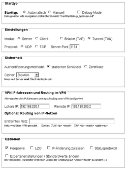
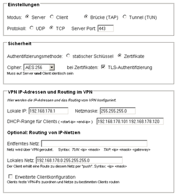

# OpenVPN 2.4.12/2.5.8
 - Homepage: [https://openvpn.net/community-downloads/](https://openvpn.net/community-downloads/)
 - Changelog: [https://community.openvpn.net/openvpn/wiki/ChangesInOpenvpn25](https://community.openvpn.net/openvpn/wiki/ChangesInOpenvpn25)
 - Repository: [https://github.com/OpenVPN/openvpn](https://github.com/OpenVPN/openvpn)
 - Package: [master/make/pkgs/openvpn/](https://github.com/Freetz-NG/freetz-ng/tree/master/make/pkgs/openvpn/)

OpenVPN ist ein Programm zur Herstellung eines Virtuellen Privaten
Netzwerkes (VPN) über eine verschlüsselte TLS-Verbindung.

### Häufige Fragen / Howto

Die Dokumentation auf der OpenVPN Webseite ist sehr gut und ausführlich.
Dort findet man wohl auf die meisten Fragen die passende Antwort.

[http://openvpn.net/faq.html](http://openvpn.net/faq.html)
oder
[http://openvpn.net/howto.html](http://openvpn.net/howto.html)

Viele hilfreiche Informationen zu OpenVPN findet man auch
[hier im
ippf-Wiki](http://wiki.ip-phone-forum.de/gateways:avm:howtos:mods:openvpn).

### Konfigurationsanleitung

Dies ist eine (sicher nicht ganz vollständige) Anleitung zur
Konfiguration des OpenVPN Pakets. Sie soll aufzeigen, wie man eine
OpenVPN Konfiguration mit der zugehörigen GUI erstellt. *Was* ein VPN
ist und welche Parameter man grundsätzlich braucht, kann hier *nicht*
gefunden werden.

### Portweiterleitung

Soll (was wohl meistens der Fall ist), die Verbindung auf die Box über
das Internet aufgebaut werden, so muss dafür eine "Portweiterleitung"
eingerichet werden, damit die Box die VPN-Pakete annimmt. Standardmäßig
nutzt OpenVPN den IP-Port 1194 mit UDP oder TCP, und die Pakete dafür
müssen von der Box angenommen werden. Die naheliegende Idee, dieses in
der Fritzbox GUI einzurichten wird von AVM unterbunden, indem keine
Weiterleitungen "auf die Box selbst" erlaubt werden. Prinzipiell gibt
es drei Möglichkeiten, das zu "umgehen":

1.  Indem die Box eine zusätzliche IP-Adresse bekommt, von der die GUI
    "nichts weiss" und damit die Einrichtung über die GUI vornehmen.
    Dafür kann das Paket [Virtual IP](virtualip.md) genutzt
    werden und dann in der GUI eine Weiterleitung auf diese IP
    eingerichtet werden. Mittlerweile gibt es einige User, die damit
    Probleme gemeldet haben (vermutlich wegen der "Startreihenfolge"
    der Pakete). Als Alternative dazu bietet es sich an, in der
    [debug.cfg](http://wiki.ip-phone-forum.de/gateways:avm:howtos:mods:shell_scripte#erzeugen_der_dateien_aus_der_debug.cfg)
    eine weitere IP anzulegen (zum Beispiel mittels des Eintrags
    "ifconfig lan:1 192.168.178.253" in dieser Datei).
2.  Man verwendet das Freetz-Paket
    [avm-firewall](avm-firewall.md). Hierdurch kann man einfach
    im Freetz-GUI eine Portweiterleitung auf die IP-Adresse 0.0.0.0
    eintragen. Anschließend ist der Port vom Internet aus offen
    (Achtung: UDP als Protokoll auswählen!).
3.  Oder man editiert die Datei "/var/flash/ar7.cfg", wozu der Zugriff
    auf die Box mit Telnet/SSH nötig ist, was jedoch mit freetz kein
    Problem darstellt. Obwohl diese Methode etwas "risikoreicher" ist
    ( weil eine "falsch editierte Datei" den Start der Box verhindern
    kann) würde ich sie empfehlen.

Ich würde vorschlagen, die Datei im RAM zu editieren und dann, wenn
alles "zufriedenstellend" erfolgt ist, die Datei zurück zu kopieren.
Zum "Kopieren" nutzt man hier das "Auslesen und Umleiten", da diese
Datei keine normale Datei ist. Die Stelle, an der man ändern muß, findet
man am einfachsten, indem man zuvor in der AVM-GUI unter Einstellungen →
Erweitertet Einstellungen → Internet → Portfreigabe → Neue Portfreigabe
eine aussagekräftige Portfreigabe erstellt, z.B. "MeineFreigabe".
Diese kann in der im vi geöffneten /var/tmp/ar7.cfg gesucht werden mit
/MeineFreigabe.

```
  cat /var/flash/ar7.cfg > /var/tmp/ar7.cfg
  vi /var/tmp/ar7.cfg

  # Mini-Anleitung zu vi:
  # i  Insert  - an dieser Stelle etwas eingeben
  # a  append  - nach dieser Stelle etwas eingeben
  # o          - Zeile nach der aktuellen Zeile einfügen
  # O          - Zeile vor der aktuellen Zeile einfügen
  # /<Ausdruck>- Suche vorwärts nach Ausdruck
  # A  Append  - am Ende der Zeile etwas eingeben
  # r  replace - den Buchstaben unter dem Cursor ersetzen
  # x  delete  - den Buchstaben unter dem Cursor löschen
  # <Zahl>     - den nächsten Befehl so oft ausführen (z.B. 10x -> 10 Zeichen löschen)
  # dd         - Zeile Löschen
  # D          - Rest der Zeile ab aktuellem Zeichen löschen
  # <ESC>      - Editier- / Eingabe-Modus verlassen
  # :w  write  - Änderungen Speichern
  # :q  quit   - vi verlassen
  # :q!        - vi verlassen, auch wenn ungesicherte Änderungen waren
  #
  #
  # Hier nun im vi die Freigabe eintragen und die Datei mit ":wq" abgespeichert

  # Wenn alles richtig war, kann diese neue Datei zurückgeschrieben werden:
  cat /var/tmp/ar7.cfg > /var/flash/ar7.cfg
```

> Im Ergebnis muss zu den "forwardrules" eine der folgenden Art
> hinzugefügt werden, natürlich mit dem richtigen Protokoll (TCP/UDP)
> und der richtigen Port-Nummer. Zu beachten ist, dass die Zeilen mit
> "," abzuschließen sind, die letzte Zeile mit ";":

```
  ## falls es **nicht** die letzte Zeile ist so,
  ## wenn es **die letzte** ist, bitte ein ";" statt des ","
  "udp 0.0.0.0:1194 0.0.0.0:1194" ,
```

Das Format dafür ist: <Protokoll> <In IP>:<In IP-Port> <Out IP
>:<Out IP-Port> Hier ist das erste "0.0.0.0" jeweils alles
eingehende das zweite "0.0.0.0" steht für "die Box selbst". Der
"ausgehende" Port ist hier wie der eingehende der Standardport von
OpenVPN: 1194.

Nach dem Editieren der ar7.cfg muss die Änderung übernommen werden, z.B.
mittels *ar7cfgchanged* oder einem Reboot.

**Relativ neu:** Mittels [dieses
Patches](http://www.ip-phone-forum.de/showthread.php?t=159266)
ist auch eine Freigabe über die "normale" Portfreigabe in der AVM-GUI
auf die Box selbst mit 0.0.0.0 möglich.

### Static Key

Die einfachste Variante ist der Betrieb mit statischem Schlüssel:

-   es kann sich immer ein Client gleichzeitig mit dem Server verbinden
-   beide Seiten verwenden den selben statischen Schlüssel zur
    Authentifizierung
-   beim ersten Start des Dienstes wird ein Schlüssel automatisch
    erzeugt
-   Der Schlüssel kann unter "Einstellungen → Static Key" ausgelesen
    und eingestellt werden
    (eventuell vorher die [Sicherheitsstufe
    einstellen](http://wiki.ip-phone-forum.de/software:ds-mod:faq#konfiguration_in_der_aktuellen_sicherheitsstufe_nicht_verfuegbar))
-   die IP-Zuweisung erfolgt manuell auf Client und Server

Hier mal ein Beispiel mit folgenden Daten:

```
  Server-IP 192.168.200.1
  Client-IP 192.168.200.2
  Netzwerk hinter Fritzbox 192.168.178.0/255.255.255.0
```

In der GUI wäre der Server dann so zu konfigurieren:

[](../screenshots/27.png)

Eine passende Windows-Client-Konfiguration dazu, die sich auf die Box
verbinden kann:

```
  remote meinserver.dyndns.org
  proto udp
  dev tun
  ifconfig 192.168.200.2 192.168.200.1
  route 192.168.178.0 255.255.255.0
  secret "D:Eigene DateienOpenVPNfritzbox.key"
  tun-mtu 1500
  float
  mssfix
  nobind
  verb 3
  keepalive 10 120
```

### Zertifikate

Wenn man mehrere gleichzeitige Verbindungen ermöglichen will, muss man
mit Zertifikaten arbeiten.

-   es können sich mehrere Clients gleichzeitig mit dem Server verbinden
-   Zertifikate müssen erstellt und auf Server und Client hinterlegt
    werden
-   Die Zertifikate werden über "Einstellungen" eingetragen (Zuordnung
    siehe weiter unten)
-   die IP-Zuweisung erfolgt dynamisch durch den Server
-   einfache Konfiguration der Clients durch Push/Pull

Wie man ganz einfach Zertifikate erstellen und auf die Box laden kann,
erklären u.a. dieser
[Wiki-Eintrag](http://wiki.ip-phone-forum.de/gateways:avm:howtos:mods:openvpn#2._zertifikate_erstellen)
sowie die offizielle OpenVPN Hilfe zum Thema [Public Key
Infrastructure](http://openvpn.net/howto.html#pki). Die
Zertifikate werden auch mit Hilfe der GUI auf die Box geladen werden.
Dafür öffnet man im Freetz das Menu Einstellungen und wählt den
entsprechenden Eintrag aus (z.B. OpenVPN: Box Cert). Mit einem Editor
öffnet man nun die entsprechende Datei (z.B. Server.crt) und kopiert den
Inhalt in das Freetz Fenster. Mit Übernehmen überträgt nun die GUI das
Zertifikat auf die Box.
***Hinweis:*** Bevor man unter "Einstellungen" Dinge eintragen kann,
muss man ggf vorher die Sicherheitsstufe entsprechend ändern, das geht
z.B. mit

> *echo 0 > /var/tmp/flash/security && modsave*

Zuordnung der Schlüssel und Zertifikate auf der Box:

```
  ------------- ----------------- ----------------------------------------
  GUI-Name      Datei-Name        Beispiel / Bemerkung
  Box Cert      <Name>.crt        server.crt od. client01.crt
  Private Key   <Name>.key        server.key oder client01.key
  CA Cert       ca.crt            Zertifikat der CA
  DH Param      dh<Länge>.pem     dh1024.pem od. dh2048.pem
  Static Key    wird generiert    muss auf Server und Client gleich sein
  CRL           leer lassen       Liste zurückgezogener Zertifikate
  ------------- ----------------- ----------------------------------------
```

In der folgenden Beispiel-Konfiguration soll der Server auf der Box mit
mehreren Clients genutzt werden können und im TAP-Modus laufen. Die
meiste Konfiguration der Clients (IP- und Netzwerkeinstellungen,
Routing, usw.) erfolgt ebenfalls durch den Server.
Der Server vergibt an die Clients IP-Adressen ab der 192.168.200.100 bis
192.168.200.150. Er übergibt dem Client auch eine Route zu seinem LAN,
dem Netz 192.168.178.0. Für das "Abholen" dieser Parameter sorgt das
***pull*** in der Client-Konfiguration.

[](../screenshots/28.png)

Ebenfalls wieder eine Client-Konfiguration dazu, die sich mit diesem
Server verbinden könnte:

```
  remote meinserver.dyndns.org
  proto udp
  dev tap
  tls-client
  ns-cert-type server
  ca "D:Eigene DateienOpenVPNca.crt"
  cert "D:Eigene DateienOpenVPNclient.crt"
  key "D:Eigene DateienOpenVPNclient.key"
  tls-auth "D:Eigene DateienOpenVPNstatic.key" 1
  tun-mtu 1500
  mssfix
  nobind
  pull
  cipher AES-128-CBC
  verb 3
```

Dass der Name des Servers (hinter **"remote"**) und die Pfade zu den
Zertifikaten ggf. anzupassen sind, versteht sich hoffentlich von selbst
;-). Man sieht,
dass der Client keine eigene IP Konfiguration oder Routing Einträge hat,
diese Parameter bekommt er mit dem *pull* vom Server. Wichtig ist
hierbei auch die **"Schlüsselrichtung"** bei der
TLS-Authentifizierung. Da freetz hierfür augenscheinlich den Wert "0"
nutzt, muss im Client entsprechend der Wert "1" gesetzt werden.

### Routing vs. Bridging

Für die meisten Anwendungsfälle ist Routing (TUN) die beste Wahl, doch
in einigen Fällen kann es auch sinnvoll sein, das VPN Netzwerk mit einer
Brücke (TAP) zu realisieren. Eine ausführliche Beschreibung der
Unterschiede findet man auf der [OpenVPN
Webseite](http://openvpn.net/faq.html#bridge2)

Hier ein paar Vorteile von Bridging:

-   Der Client befindet sich nach Aufbau der Verbindung im gleichen Netz
    wie der Server
-   Broadcasts werden durch den VPN-Tunnel geleitet, das hat den
    Vorteil, dass z.B. NetBIOS Namen aufgelöst werden können (sinnvoll
    für PING, Netzwerkfreigaben etc)
-   Bridging leitet alle Ethernet-Protokolle über den Tunnel (IPv4,
    IPv6, IPX, AppleTalk etc.)

Hier ein paar Nachteile von Bridging:

-   weniger effizient als Routing (langsamer)
-   alle Broadcasts gehen durch das Netz

Um mit der Fritz Box ein echtes Bridging zu realisieren, ist es
notwendig, den tap0-Adapter in die Liste der gebrückten Adapter der
Fritz Box einzutragen. Dies geschieht wiederum in der ar7.cfg, die im
oben beschriebenen Verfahren geändert werden muß. Unter dem Punkt
"brinterfaces" → interfaces muß der tap0-Adapter ergänzt werden:

Also wieder:

```
  cat /var/flash/ar7.cfg > /var/tmp/ar7.cfg
  vi /var/tmp/ar7.cfg
```

Dann suchen nach /brinterfaces und den Eintrag "tap0" vor dem
Semikolon einfügen.

```
  brinterfaces {
                name = "lan";
                dhcp = no;
                ipaddr = 192.168.178.1;
                netmask = 255.255.255.0;
                dstipaddr = 0.0.0.0;
                interfaces = "eth0", "usbrndis", "tiwlan0", "wdsup0",
                             "wdsdw0", "wdsdw1", "wdsdw2", "wdsdw3", "tap0";
                dhcpenabled = yes;
                dhcpstart = 192.168.178.20;
                dhcpend = 192.168.178.100;
```

Zum Abschluß noch mal

```
  cat /var/tmp/ar7.cfg > /var/flash/ar7.cfg
  reboot
```

Die Konfiguration in der OpenVPN-Gui könnte für den FritzBox Standard
dann folgendermaßen aussehen:

[](../screenshots/29.png)

Die Windows-Client-Konfiguration dazu sieht so aus:

```
  client
  dev tap
  #udp/tcp je nachdem, was ausgewählt wurde
  proto tcp
  #Port entsprechend der Konfiguration
  remote meinserver.dyndns.org 443
  nobind
  persist-key
  persist-tun
  #hier die Zertifikate/Schlüssel, wie beim Erstellen benannt
  ca ca.crt
  cert client01.crt
  key client01.key
  # für TLS-Remote "ServerBox1" wie beim Erstellen benannt
  tls-remote ServerBox1
  tls-auth static.key 1
  auth SHA1
  cipher AES-256-CBC
  comp-lzo
  verb 3
```

CRL
---

CRL steht für "certificate revocation list" und bietet eine
Möglichkeit, ausgestellte Zertifikate zurückzuziehen und damit ungültig
zu machen. Aktuell gibt es einen BUG in Freetz
(Ticket #1578) so dass eine CRL nur mit etwas Handarbeit
über die Telnet Konsole bzw. Rudishell zum Laufen gebracht werden kann.
Wer sich das manuelle Erstellen einer CRL nicht zutraut findet mit
Kleopatra (Windows /
[http://www.gpg4win.de/](http://www.gpg4win.de/))
oder TinyCA (Linux /
[http://tinyca.sm-zone.net/](http://tinyca.sm-zone.net/))
GUI-basierte Zertifikatmanager, die das Erstellen einer CRL
unterstützen.

### Fehlersuche: Ein paar Tips wenn es nicht gleich so klappt

Meist versucht man gleich den schwierigsten Fall, über das Internet mit
Zertifikaten und TLS-Authentifizierung zwei Netze zu verbinden und
testet, indem man versucht eine Freigabe auf dem Fileserver im anderen
Netz anzubinden
;-).

Schön, wenn es sofort klappt, dafür gibt es "unendlich" viele
Fehlermöglichkeiten falls nicht...

Daher der Apell, tastet euch langsam an das ganze heran!

-   Erster "Fehlerkandidat" ist der Zugang über das Internet, der über
    eine "virtuelle IP" oder in der Datei "/var/flash/ar7.cfg"
    freigeschaltet werden muss (siehe oben, ich bevorzuge persönlich die
    zweite Methode). Diesen Faktor kann man prüfen, indem man die
    Verbindung zunächst mal "intern" testet, also über die
    LAN-Schnittstelle. Klappt es so, aber nicht über das Internet, habt
    ihr den Fehler eingegrenzt.
-   Wenn es was anderes ist, hilt nur noch der Vergleich der
    Konfigurationen Punkt für Punkt. Eigentlich gibt es nur zwei Arten
    von Parametern:
    Solche, die identisch sein müssen und solche, die
    "spiegelverkehrt" auftreten müssen.
    -   Die "identischen" sind z.B. Cipher, "comp-lzo", tls-auth,
        das benutzte Protokoll (UDP/TCP) und der Port,
    -   "Spiegelbildlich" sind die IPs beim TUN, die Routing-Einträge,
        die Server- / Client-Parameter wie "tls-server/tls-client",
        push und pull.
-   Die Config auf der Box kann man am einfachsten in der
    [Rudi-Shell](rudi-shell.md) ausgeben lasssen, indem man
    dort
    *cat /mod/etc/openvpn*.conf*
    ausführt. Diese Config kann man dann gut mit der Config der
    "Gegenseite" vergleichen.
-   Erste Hilfe für mehr Infos, z.B. wenn die Ausgabe nur lautet
    *Starting OpenVPN ...failed.*
    In der [Rudi-Shell](rudi-shell.md) (wenn openvpn nicht mehr
    läuft) sollten so (spätestens nach zehn Sekunden) die Startmeldungen
    Hinweise auf den Fehler bringen.:

    ``` 
      # die .../openvpn*.conf wird erst beim Starten des Dienstes erstellt und beim Stoppen gelöscht!
    ```

    ``` 
      cat /mod/etc/openvpn*.conf | grep -v daemon > /var/tmp/ovpn.conf
      openvpn /var/tmp/ovpn.conf &
      sleep 10
      killall openvpn
    ```

-   Ein typisches Fehlerbild (ich tippe mal auf mindestens 20% aller
    Probleme ;-)):
    Die Verbindung wird aufgebaut, aber der Client und Server können
    sich nicht per Ping erreichen, es "geht nichts durch das VPN".
    Häufigste Ursache ist ein nur auf einer Seite aktiviertes
    "comp-lzo"

<!-- -->

-   Und noch ein Hinweis für die "Windows-Nutzer": Wenn der Rechner,
    der eine Freigabe hat, nicht im gleichen Netz ist (also zum Beispiel
    über VPN verbunden ist), muss zum einen die Firewall Zugriffe aus
    einem anderen Netz zulassen zum anderen funktioniert die Windows
    Namensauflösung nicht. Kann man im LAN die Freigabe in der Art *
    Der_PC_mit-Freigabemeine_Daten*
    nutzen, so ist das über das VPN nicht möglich. Es gibt dann zwei
    Möglichkeiten:
    1.  Nutzung der IP-Adresse, also *
        192.168.178.12meine_Daten*
    2.  Nutzung der Datei
        *<Windowsverzeichnis>system32driversetclmhosts*, in
        die man Rechnername und IP einträgt. Dann kann die Freigabe
        weiterhin über den Namen genutzt werden

### Verschlüsselung: Welcher "Cipher" ?

Der Verkehr zwischen Client und Server wird normalerweise verschlüsselt
übertragen, um die Inhalte vor dem Ausspähen zu schützen. Die Wahl des
Verschlüsselungsalgorithmus erfolg über die "Cipher" Auswahlbox.
Momentan sind dort diese Cipher wählbar, in Klammern jeweils die OpenVPN
Bezeichnung, wie sie aus dem OpenSSL übernommen wurde:

```
Blowfish (BF-CBC)
AES 128 (AES-128-CBC)
AES 256 (AES-256-CBC)
Triple-DES (DES-EDE3-CBC)
```

Um die Frage der durch die Verschüsselung erzeugte Last auf der Box
nachzugehen, habe ich mal mit `openssl speed des aes blowfish` einen
"Leistungsvergleich" der Verfahren auf einem Speedport 701 gemacht
(nur für die wählbaren Optionen):

```
The 'numbers' are in 1000s of bytes per second processed.
type              16 bytes     64 bytes    256 bytes   1024 bytes   8192 bytes
des cbc           1827.26k     1909.78k     1931.44k     1935.13k     1888.51k
blowfish cbc      2940.90k     3187.67k     3257.75k     3245.84k     3108.06k
aes-128 cbc       1936.58k     1984.45k     2019.82k     2004.45k     1940.50k
aes-256 cbc       1500.48k     1532.26k     1541.70k     1510.14k     1494.16k
```

Man sieht, dass von den verfügbaren Algorithmen "Blowfish" den größten
Durchsatz hat. Bei intensiver Nutzung könnte das von Interesse sein. Für
tiefergehende Vergleiche der Algorithmen sei z.B. auf
[Wikipedia](http://en.wikipedia.org/wiki/Block_cipher)
verwiesen.

Zum Vergleich die Zahlen von einer 7320:

```
The 'numbers' are in 1000s of bytes per second processed.
type             16 bytes     64 bytes    256 bytes   1024 bytes   8192 bytes
des cbc           2256.44k     2403.96k     2394.38k     2398.15k     2416.23k
des ede3           838.01k      863.05k      852.47k      864.63k      860.43k
blowfish cbc      5949.83k     6772.94k     6777.60k     6852.09k     6858.03k
aes-128 cbc       4218.86k     4641.06k     4719.34k     4722.43k     4723.41k
aes-192 cbc       3731.79k     4053.84k     4106.21k     4079.90k     4176.53k
aes-256 cbc       3312.71k     3596.58k     3627.24k     3628.52k     3678.10k
```

... und von einer 7390:

```
The 'numbers' are in 1000s of bytes per second processed.
type             16 bytes     64 bytes    256 bytes   1024 bytes   8192 bytes
des cbc           3020.13k     3136.60k     3153.10k     3178.21k     3166.10k
des ede3          1104.84k     1119.55k     1127.09k     1129.19k     1126.40k
blowfish cbc      8043.34k     8744.39k     8965.62k     8973.62k     8947.55k
aes-128 cbc       5597.86k     6122.27k     6304.22k     6262.31k     6254.70k
aes-192 cbc       4932.01k     5308.92k     5450.89k     5446.16k     5429.97k
aes-256 cbc       4388.37k     4711.52k     4812.80k     4817.99k     4798.96k
```

### DNS & Redirect all clients' traffic

I wanted to monitor all traffic coming from my Android device, so I
route all my traffic through openVPN and am using tcpdump to see the
traffic. I discovered that DNS going to my mobile provider is blocked
via by my DSL provider (of course). To circumvent that problem I tried
to specific a DNS server using openVPN, but that didn' work. Eventually
I fixed this problem by using iptables to re-route DNS to the local DNS
server (dnsmasq) like this:

```
iptables -A PREROUTING -i tun0 -p tcp -m tcp --dport 53 -j DNAT --to-destination 192.168.178.1
iptables -A PREROUTING -i tun0 -p udp -m udp --dport 53 -j DNAT --to-destination 192.168.178.1
```

It is interesting to see what Android is doing ...

### Diskussion

Fragen und Anmerkungen zu diesem Paket werden in [diesem
Thread](http://www.ip-phone-forum.de/showthread.php?t=101980)
diskutiert.

### Neue, simple GUI (GUI2)

[](../screenshots/273.png)

Aktuell ist im "trunk" (der Freetz Entwicklerversion) eine weitere GUI
zum Paket hinzugekommen, die deutlich "schlanker" ist als die
bisherige. Sie ist als "simple GUI" für Experten gedacht, die direkt
eine Konfigurationsdatei eingeben können.

Wichtig:

-   Um diese GUI wählen zu können, muss der "Level of user competence"
    mindestens "Advanced" sein.

Als Option sind zusätzlich Skript-Dateien hinzugekommen, die z.B. als
"up"- oder "client-connect"-Skript genutzt werden können.

Ein Beispiel sei hier genannt für einen Server mit Zertifikaten, zu dem
sich Clients verbinden, zu denen Netze geroutet werden sollen. Damit das
funktioniert muss neben dem "normalen" Routing auch das interne
Routing des Servers konfiguriert werden, der dazu "iroute" Einträge
benötigt.

```
mode server
tls-server
port 1194
proto udp
ca /tmp/flash/openvpn/ca.crt
cert /tmp/flash/openvpn/box.crt
key /tmp/flash/openvpn/box.key
dh /tmp/flash/openvpn/dh.pem
dev tun
topology subnet
push "topology subnet"
ifconfig 10.10.10.1 255.255.255.0
cipher AES-128-CBC
verb 3

script-security 2
client-connect "/bin/sh /tmp/flash/openvpn/script1"

daemon
```

Um für die Clients IPs zu vergeben wird hier "script1" als
client-connect Skript genutzt (ähnlich wie die "erweiterte
Clientconfig" der "alten GUI"). Die Idee/Anwendung sollte
selbsterklärend sein (hoffe ich):

```
#!/bin/sh
CLIENTS='name:ip maske:netz1 maske1; netz2 maske2
Client1:10.10.10.1 255.255.255.0:192.168.100.0 255.255.255.0
Client2:10.10.10.2 255.255.255.0:192.168.200.0 255.255.255.0
Client3:10.10.10.3 255.255.255.0:
Client4:10.10.10.4 255.255.255.0:192.168.104.0 255.255.255.0;192.168.105.0 255.255.255.0
client3:10.10.10.12 255.255.255.0:192.168.104.0 255.255.255.0;192.168.105.0 255.255.255.0
Client5:10.10.10.5 255.255.255.0'

# env will give name of connected client in variable "common_name"
X=$(echo "$CLIENTS" | sed -n "/^${common_name}:/ s/^${common_name}:// p")
CLIENTCONFIG=$1

# if found info on common name, generate client-config
if [ -n "$X" -a -n "$CLIENTCONFIG" ]; then
IP=${X%%:*}
NETS=${X##*:}
[ -n "$IP" ] && echo "ifconfig-push $IP" > $CLIENTCONFIG
[ -n "$NETS" -a "$NETS" != "$IP" ] &&  echo -e "iroute $NETS" | 
    sed "s/[[:space:]]*;[[:space:]]*/niroute /g" >> $CLIENTCONFIG
fi
```

### Weitere Konfigs anlegen

Um weitere Konfigs anzulegen, muss man momentan noch von Hand einmal
einen Aufruf machen. Um Beispielsweise eine Config Namens `OpenVPN_TCP`
anzulegen:

`http://fritz.box:81/cgi-bin/conf/openvpn?genconfigname=OpenVPN_TCP`

ACHTUNG: Nicht den Config-Namen "OpenVPN" oder "openvpn" verwenden!

