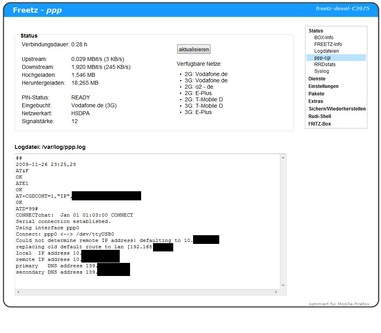

# Point-to-Point
 - Package: [master/make/ppp/](https://github.com/Freetz-NG/freetz-ng/tree/master/make/ppp/)

[](../screenshots/121.jpg)

Entstanden aus diesem Thread im IPPF:
[http://www.ip-phone-forum.de/showthread.php?t=201519](http://www.ip-phone-forum.de/showthread.php?t=201519)
Mit dem "ppp-cgi" kann man eine dialup-network Verbindung über eine
serielle Schnittstelle aufbauen. USB-Modems für UMTS stellen eine solche
zur Verfügung.


### Allgemeine Konfiguration

zu finden im Webinterface unter "Pakete" > "PPP"

### Starttyp

Wenn man "automatisch" wählt wird die Verbindung gleich beim starten
der Box aufgebaut, bzw bei Fallback nach Ausfall der
DSL/ATA-Internetverbindung.

### Logdatei

Hier kann der Pfad zu Logdatei angegeben werden. Sie kann im
Freetz-Webinterface unter "Status" eingesehen werden. Es ist zu
empfehlen den Pfad auf einen persistenten Ort zu ändern damit die Datei
durch einen Reboot der Fritzbox nicht verloren geht!


### Konfiguration für UMTS

### PEERS: chat

Hier muss der benötigte Access-Pount-Name (APN) anstelle des
"your.personal.apn" eingetragen werden.

### PEERS: options

Hier kann der Port (Vorgabe: /dev/ttyUSB0) geändert und falls benötigt
der Benutzername und das Passwort angegeben werden.

### Befehls-TTY

Optional kann hier der 2. Port des Modem eingetragen werden (meist
/dev/ttyUSB1). Über diesen werden Statusinformationen wie verfügbare
Netze abgerufen und auf der Statusseite angezeigt. Wenn das Feld leer
bleibt wird wie komplette Statusbox nicht angezeigt.

### Modus

Optional kann hier der gewünschte Verbindungsmodus ausgewählt werden.


### Namensauflösung

Für eine dynamisch wechselnde Namensauflösung zwischen Mobilfunk und
herkömmlicher Verbindung empfiehlt sich folgendes:

-   Bei dnsmasq im Feld "Zusätzliche Kommandozeilen-Optionen (für
    Experten)" dies eintragen:

    ``` 
    -r /var/tmp/avm-resolv.conf -r /etc/ppp/resolv.conf
    ```

-   alternativ falls OpenDNS bevorzugt wird

    ``` 
    -r /etc/ppp/resolv.conf -S 208.67.220.220 -S 208.67.222.222
    ```


### Firewall, Routing & NAT

Um Masquerading zu aktivieren sind folgende Befehle nötig:

```
modprobe ipt_state
modprobe ipt_MASQUERADE
iptables -A INPUT -m state --state ESTABLISHED,RELATED   -i ppp0 -j ACCEPT
iptables -A INPUT                                        -i ppp0 -j DROP
iptables -A FORWARD -m state --state ESTABLISHED,RELATED -i ppp0 -j ACCEPT
iptables -A FORWARD                                      -i ppp0 -j DROP
iptables -t nat -A POSTROUTING                           -o ppp0 -j MASQUERADE
```

Hierzu werden die iptables-Module *state* und *MASQUERADE* benötigt.

 * Diese lassen
(ließen?) Boxen mit altem Kernel 2.6.13.1 wie zB die 7170 nach einer
gewissen Zeit rebooten, siehe Ticket
Ticket #260

Die Befehle können in der debug.cfg oder rc.custum eingetragen werden.
Von Vorteil ist es aber sie von den Skripten des ppp-cgi ausfgühren zu
lassen und nach Verbindungsabbau wieder aufzuheben und vor allem die
Module wieder zu entladen.


### Fallback

 * Dieses Feature
ist noch exprimentell. Fehlfunktionen und hohe Kosten können nicht
ausgeschlossen werden!

Bei Aktivierung von Fallback wird die DSL/ATA-Internetverbindung alle X
Sekunden mit den durch Leerzeichen angegebenen Hosts geprüft und nach Y
Sekunden ohne Antwort die ppp-Verbindung aufgebaut. Zu dem Host "prüfen
auf Wiederherstellung" wird eine Route eingerichtet um zu erkennen wann
die DSL/ATA-Internetverbindung wieder besteht. Durch anlegen dieser
Route kann die entsprechende IP nicht per ppp-Verbindung erreicht
werden!


### Treiberprobleme

Das Treibermodul *option* wird beim Start automatisch geladen. Es kann
aber nötig sein es mit eigenen Parameter zu laden, zB durch
`usbserial vendor=0xYYYY product=0xZZZZ` in der *Freetz: modules*.


### Was ist noch zu beachten? (2do-Liste)

 * Es können
momentan nur SIMs mit deaktivierter PIN-Abfrage genutzt werden. (dies
ist allerdings mit dem Package *gcom* möglich)


### Weiteres

Deaktivierung des integrierten CD-Roms bei Huawei-Sticks mittels
einmaligem `at^u2diag=0` an das 2. virtuelle, serielle Interface (meist
/dev/ttyUSB1 unter Linux) des Sticks, bzw `at^u2diag=1` um es wieder
einzuschalten.


