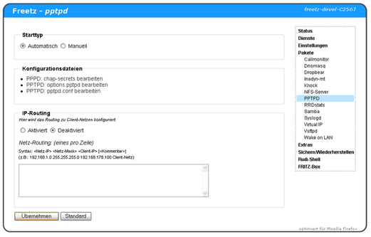

# pptpd 1.4.0
 - Package: [master/make/pkgs/pptpd/](https://github.com/Freetz-NG/freetz-ng/tree/master/make/pkgs/pptpd/)

Das Interface an sich ist leicht überschaubar ;-).

Unter **Einstellungen** sind die Links zu den einzelnen
Konfigurationsdateien zu finden.

Ein Übersicht über die Einstellmöglichkeiten gibt die Dokumantation von
Poptop auf deren
[Homepage](http://poptop.sourceforge.net/dox/).

-   **"pptpd Einstellungen bearbeiten"** editiert die Datei
    [pptpd.conf](http://poptop.sourceforge.net/dox/pptpd.conf.txt)
    -   Pfadangaben zum Binary sowie zur Konfigurations-Datei
    -   mögliche Debug-Infos einschalten
    -   Server-IP festlegen (Standard: localip 192.168.178.1)
    -   IP-Bereich angemeldeter Rechner festlegen (Standard: remoteip
        192.168.178.210-229 )
    -   Sonstiges
-   **"PPPD Einstellungen bearbeiten"** editiert die Datei
    [options.pptpd](http://poptop.sourceforge.net/dox/options.pptpd.txt)
    -   Name des PPTP-Server (Standard: fritzbox)
    -   Angabe, welche Protokolle zugelassen sind
    -   DNS-Server für Clients festlegen (Standard: ms-dns
        192.168.178.1)
    -   Sonstiges
-   **"Password bearbeiten"** editiert die Datei
    [chap-secrets](http://poptop.sourceforge.net/dox/chap-secrets.txt)
    -   verwaltet berechtigte Benutzer sowie deren Passwörter

[](../screenshots/38.png)

### Portweiterleitung

Um sich schließlich von außen auf den PPTP-Server verbinden zu können,
muss natürlich eine Portweiterleitung auf die IP der FRITZBox
eingerichtet werden.

```
	Protokoll: TCP  Port: 1723
	Protokoll: GRE  (keine Portangabe nötig)
```

Siehe dazu auch folgende Paketen:

-   [Virtual IP](virtualip-cgi.md)
-   [AVM Firewall CGI](avm-firewall.md)

### Konfiguration

Die drei für Poptop relevanten Dateien können entweder über das
Webinterface oder auf der Shell per vi editiert
werden. Sie liegen im Verzeichnis `/tmp/flash/ppp`.

### pptpd.conf

In der mitgelieferten Konfiguration ist logwtmp standardmäßig aktiviert
(bezieht sich auf Version 1.1.2-stable. Ist im 'trunk' schon
gefixed.). Dies sollte deaktiviert werden, da wtmp auf der fritzbox
nicht läuft und somit eine vpn-Verbindung nicht zustande kommt.

```
	# TAG: logwtmp
	#       Use wtmp(5) to record client connections and disconnections.
	#
	#logwtmp
```

Falls die Datenrate vom Wlan ins Internet mit pptpd sehr langsam ist,
sollte die Zeile `bcrelay` auskommentiert werden (siehe
[IPPF](http://www.ip-phone-forum.de/showthread.php?t=201539))

### options.pptpd

In der Datei options.pptpd ist gegebenenfalls `require-mppe-128`
eingetragen (bezieht sich auf Version 1.1.2-stable. Ist im 'trunk'
schon gefixed.). Der pppd kennt diese Option aber nicht. Beim Aushandeln
der Verschlüsselung per 'Auto' Einstellung im Client kann es unter
Umständen zu Verbindungsproblemen kommen, wenn der Client erstmal
verhandeln will (negotiation), der pppd aber direkt verschlüsselt
sprechen will. Man kann die Verschlüsselung direkt auf 128 Bit fest
einstellen. Mit dieser Einstellung hat eine PPTP Verbindung mit dem
iPhone VPN-Client geklappt:

```
	# Require the peer to authenticate itself using MS-CHAPv2 [Microsoft
	# Challenge Handshake Authentication Protocol, Version 2] authentication.
	require-mschap-v2
	# Require MPPE 128-bit encryption
	# (note that MPPE requires the use of MSCHAP-V2 during authentication)
	#require-mppe-128

	mppe required,no40,no56,stateless
```

### chap-secrets

In der `options.pptpd` ist der Name auf `fritzbox` eingestellt. Dies
sollte sich dann in einem Benutzereintrag in der `chap-secrets`
widerspiegeln:

```
	# client        server  secret                  IP addresses
	username fritzbox password 192.168.x.y
	EOF
```

In vielen Beispielen im Netz steht in der zweiten Spalte `pptpd`. Möchte
man das so haben, dann sollte man einfach den `name` Eintrag in
`options.pptpd` entsprechend anpassen.

### Troubleshooting

Um die pptpd Meldungen zu sehen, muss man zunächst einen syslogd
starten:

```
	/var/tmp/flash/ppp # syslogd -L -C256 -l 7
```

Und kann sich danach die Meldungen des daemons im syslog per `logread`
anschauen:

```
	/var/tmp/flash/ppp # logread
```

Um mehr Meldungen zu bekommen, kann man in `options.pptpd` und/oder
`pptpd.conf` den Debug-Modus aktivieren:

options.pptpd:

```
	# Enable connection debugging facilities.
	# (see your syslog configuration for where pppd sends to)
	debug
```

pptpd.conf:

```
	# TAG: debug
	#       Turns on (more) debugging to syslog
	#
	debug
```

### Troubleshooting keine Fehlermeldung

Bei mir tauchte im log keine Fehlermeldung auf. Da hilft debuggen auf
der Box mit:

```
	./strace pptpd -d -f -c /etc/ppp/pptpd.conf
```

Dabei kam heraus, dass es folgende Fehlermeldung gibt:

```
	can't resolve symbol 'bzero'
```

Dazu gibt es einen Thread im Forum, der letzte Post erklärt wie man die
Toolchain zum fixen neu bauen muss:
[http://www.ip-phone-forum.de/showpost.php?p=1407147&postcount=25](http://www.ip-phone-forum.de/showpost.php?p=1407147&postcount=25)

Update[18.07.11]: Das Problem sollte mit Freetz-1.2 bzw. einem
aktuellen Trunk nicht mehr auftreten.

