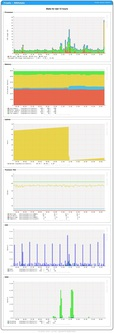
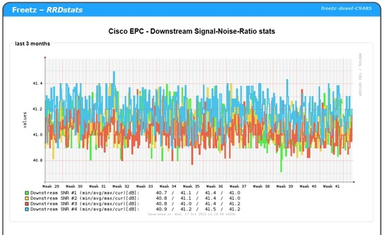
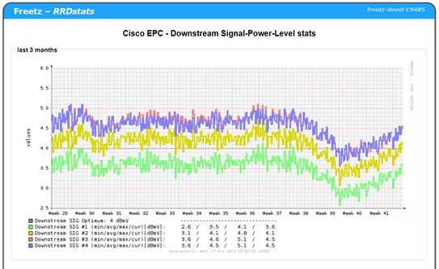
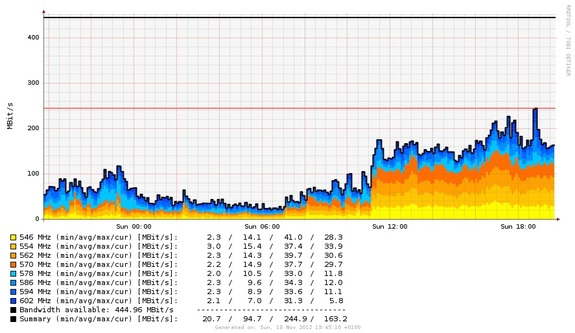
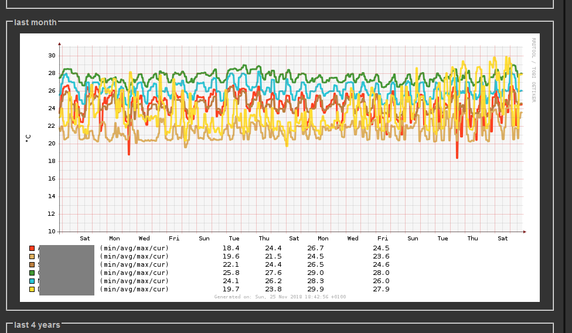
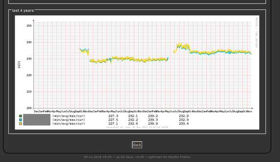

# RRDstats for RRDtool
 - Package: [master/make/rrdstats/](https://github.com/Freetz-NG/freetz-ng/tree/master/make/rrdstats/)

[](../screenshots/229.jpg)

### Einleitung

RRD steht für Round Robin Database und wurde für Linux und Windows unter
der GNU-Lizenz von Tobias Oetiker entwickelt. Es ist ein sehr
leistungsfähiges Werkzeug, um zeitbezogene Messdaten wie Temperatur,
Festplattenauslastung, Netzwerkverkehr auf kompakte Art und Weise in
einer Datenbank zu speichern und ansprechend zu visualisieren. Weitere
Details sind hier im Wiki beim Paket [RRDtool](rrdtool.md)
nachzulesen. Um die Daten nachher graphisch darzustellen, wird rrdstats
verwendet, worum es hier im Detail geht. Das Package
[DigiTemp](digitemp.md) wird zum Aufzeichen von
Temperaturwerten benötigt.

### Voraussetzungen und Einbau von RRDstats beim Firmware-Bau

Im `menuconfig`:

-   Package selection / Web interface / RRDstats for RRDtool
    [selektiert automatisch auch RRDtool 1.2.30 unter "Package
    selection / Testing"]
-   *nur für DigiTemp:* Package selection / Testing / digitemp 3.0.6 /
    digitemp for ds9097 [mit den beiden anderen Optionen ging es (bei
    ao) nicht] Ich (cuma) nutze "ds2490" mit dem "DS9490R". Hierbei
    sind keine zusätzlichen Module nötig.
-   *nur für DigiTemp:* Advanced options / Kernel modules / drivers /
    pl2303.ko [habe für einen anderen Adapter zusätzlich auch noch
    ftdi_sio.ko ausgewählt]
-   *nur für Kabelmodem:* Optional das Package "wget" installieren.
    Dadurch werden Ausfälle bei Nichterreichbarkeit des Kabelmodem
    vermieden, es ist aber ca 350 kB gross.

Auf der Box:

-   *nur für DigiTemp:* im Freetz-WebGUI unter "Einstellungen /
    Freetz:modules das bzw. die Kernel-Modul(e) untereinander eintragen
    (aber ohne "modprobe" o.ä.!)

```
	pl2303
	ftdi_sio
```

-   im Freetz-Webif unter "RRDstats" weitere Einstellungen vornehmen

### Backup

Sinnvoll ist die Anpassung der Pfade, falls man regelmäßige Backups der
Messdaten machen möchte, z.B.:

```
	Backup Verzeichnis: /var/media/ftp/uStor01/rrdstats/backup
```

... und im Freetz-WebGUI bei den RRDstats-Einstellungen das automatisch
Wiederherstellen von Backups beim Starten aktivieren

Wenn man die Backups nun regelmäßig mittels eines cronjobs durchführt,
z.B. alle 20-30 Minuten, sind die Lücken in den Graphen bei entsprechend
kurzen Box-Ausfallzeiten auch nicht zu groß. Im Freetz-WebGUI gibt man
dazu unter "Einstellungen / Freetz: crontab" z.B. folgendes ein:

```
	00 * * * * /etc/init.d/rc.rrdstats backup
	20 * * * * /etc/init.d/rc.rrdstats backup
	40 * * * * /etc/init.d/rc.rrdstats backup
```

Näheres zu crontab bitte im Internet nachlesen.

### Einstellungen WebGUI

"Not lazy" bedeutet, dass die Graphen immer neu generiert werden,
hingegen bedeutet "lazy", dass sie nur neu generiert werden, wenn sie
veraltet sind. Die Einstellung "lazy" (bzw. das Abschalten von "not
lazy") verringert die CPU-Last.

Vefügbare Netzwerkintrafaces auf der Box kann man so ermitteln:
`ifconfig |grep -v "^ "`

 * Das
Unterdrücken der 85°C Fehlerwerte wirkt sich nur auf die .rrd Dateien
aus, nicht auf die .cvs.

*Die anderen Einstellungen dürften selbsterklärend sein. Falls nicht,
bitte im Forum nachfragen und bei neuen Erkenntnissen hier ergänzen.*

### DigiTemp

Die Initialisierung ist nur 1x pro Messfühler nötig.
Danach muss der Dienst "RRDstats" manuell wieder im Freetz-Webif unter
"Dienste" gestartet werden


### Kabelmodem

[](../screenshots/253.jpg)

[](../screenshots/252.jpg)

Es werden die Kabelmodems Thomson THG 520 und 540, Cisco EPC 3212 und
Arris Touchstone TM sowie baugleiche unterstützt.

### Loggen der Kanäle

Sollen mehr Kanäle geloggt werden als beim Erstellen der Datenbank
eingestellt waren, ist es an einfachsten die epc_*.rrd zu löschen.
Bereits aufgezeichneten Daten weiterzuverwenden ist aufwändiger, da
rrdtool keine Möglichkeit bietet nachträglich einen DS hinzuzufügen.
Dazu:

-   Datensicherung!
-   Die Daten exportieren: `rrdtool dump epc_60.rrd dump.xml`
-   DS Spalten hinzufügen. Hier am Beispiel 1 Upstreamkanal auf 2
    erweitern:
    1) Am Anfang der dump.xml vor den Zeilen

``` 
    <ds>
    <name> up </name>
```

    dies hinzufügen

``` 
    <name> txfq2 </name>
    <type> GAUGE </type>
    <minimal_heartbeat> 600 </minimal_heartbeat>
    <min> 9.0000000000e+00 </min>
    <max> 9.9000000000e+01 </max>

    <!-- PDP Status -->
    <last_ds> UNKN </last_ds>
    <value> NaN </value>
    <unknown_sec> 25 </unknown_sec>
    </ds>

    <ds>
    <name> txdb2 </name>
    <type> GAUGE </type>
    <minimal_heartbeat> 600 </minimal_heartbeat>
    <min> 0.0000000000e+00 </min>
    <max> 9.9000000000e+01 </max>

    <!-- PDP Status -->
    <last_ds> UNKN </last_ds>
    <value> NaN </value>
    <unknown_sec> 25 </unknown_sec>
    </ds>
```

    2) 12 Zeilen vor allen `</cdp_prep>` Zeilen dies hinzufügen

``` 
    <ds>
    <primary_value> 0.0000000000e+00 </primary_value>
    <secondary_value> 0.0000000000e+00 </secondary_value>
    <value> NaN </value>
    <unknown_datapoints> 0 </unknown_datapoints>
    </ds>
    <ds>
    <primary_value> 0.0000000000e+00 </primary_value>
    <secondary_value> 0.0000000000e+00 </secondary_value>
    <value> NaN </value>
    <unknown_datapoints> 0 </unknown_datapoints>
    </ds>
```

    3) Nun noch alle Zeilen die mit `</row>` enden zwischen das drittletzte
    und vorletzte `<v> ... </v>` dies einfügen: `<v> NaN </v> <v> NaN </v>`.

<!-- -->

-   Geänderte Datenbank erstellen:
    `rrdtool restore dump.xml epc_60.rrd -f`

Viel Spass und Erfolg beim nachmachen
:)


### Kabelsegment

[](../screenshots/257.jpg)

Hiermit kann die Auslastung des Segmentes von Kabelinternet aufzeichnet
werden. Es wird zusätzlich noch ein Treiber benötigt. Momentan gibt es
nur ein Package für DVB-Sticks von [Sundtek](sundtek.md).
Vorteil dieser ist, dass man kein v4l im Kernel benötigt.

### SmartHome

Hiermit können viele Daten von AVM SmartHome Geräten aufgezeichnet werden.
Welche Daten genau hängt vom Gerät ab, zB ein Heizkostenregler hat keine Spannung.\
Es wird ein Passwort für die AVM-Weboberfläche (API) benötigt, dies kann auch ein zusätzlicher Benutzer sein.

 * Temperatur [Grad Celsius]<br>
   [](../screenshots/000-PKG_rrdstats-Temperatur.png)
 * Spannung [Volt]<br>
   [](../screenshots/000-PKG_rrdstats-Spannung.png)
 * Leistung [Wirkleistung, Blindleistung, Scheinleistung]<br>
   [](../screenshots/000-PKG_rrdstats-Leistung.png)
 * Stromstärke [Ampere]<br>
   [](../screenshots/000-PKG_rrdstats-Stromstaerke.png)
 * Wirk-/Leistungsfaktor [Prozent/100]<br>
   [](../screenshots/000-PKG_rrdstats-Leistungsfaktor.png)


### Script aha.sh

Die Steuerung der SmartHome-Geräte geschieht mit aha.sh. Man kann z. B. per cron mit aha.sh entsprechende Schaltzeitpunkte einstellen.
Derzeit unterstützt aha.sh nur Heizkörperregler wie Comet DECT, FRITZ!DECT 300+301+302 und ein/aus-Aktoren wie die Steckdosen FRITZ!DECT 200, FRITZ!DECT 210 oder FRITZ!Powerline 546E.

Parameter für den Aufruf von `aha.sh`

**a** oder **alias**
sha-alias (Liste aller Smarthome-Geräte) aktualisieren (dasselbe wie „Smarthome aktualisieren“ im Webinterface)

**f** oder **fancy**
Ausgabe der grundlegenden Informationen aller SmartHome-Geräte
 ```
            manufacturer = AVM
             productname = Comet DECT
               fwversion = 03.68
         functionbitmask = 320
                           --- ---- ---1 -1-- ----
                           SRQ PONM LKJI HGFE DCBA
              identifier = 11111 0112314
                      id = 20
                    name = Heizung A
                 present = 1
                    lock = 0
              devicelock = 0
                 celsius = 270
                  offset = 0
                    tist = 54
                   tsoll = 253
                  absenk = 32
                 komfort = 44
         windowopenactiv = 0
                 battery = 80
              batterylow = 0

...

                           SRQ PONM LKJI HGFE DCBA
                           ||| |||| |||| |||| ||||
                           ||| |||| |||| |||| |||+- Bit  0/A: HANFUN Gerät
                           ||| |||| |||| |||| ||+-- Bit  1/B: ?Unused
                           ||| |||| |||| |||| |+--- Bit  2/C: Lampe
                           ||| |||| |||| |||| +---- Bit  3/D: ?Action
                           ||| |||| |||| ||||
                           ||| |||| |||| |||+------ Bit  4/E: Alarmsensor
                           ||| |||| |||| ||+------- Bit  5/F: Taster
                           ||| |||| |||| |+-------- Bit  6/G: Heizkörperregler
                           ||| |||| |||| +--------- Bit  7/H: Energiemessgerät
                           ||| |||| ||||
                           ||| |||| |||+----------- Bit  8/I: Temperatursensor
                           ||| |||| ||+------------ Bit  9/J: Schaltsteckdose
                           ||| |||| |+------------- Bit 10/K: DECT-Repeater
                           ||| |||| +-------------- Bit 11/L: Mikrofon
                           ||| ||||
                           ||| |||+---------------- Bit 12/M: ?Bundle
                           ||| ||+----------------- Bit 13/N: HANFUN Unit
                           ||| |+------------------ Bit 14/O: ?Template
                           ||| +------------------- Bit 15/P: Schaltbar
                           |||
                           ||+--------------------- Bit 16/Q: Potentiometer
                           |+---------------------- Bit 17/R: Farbtemperatur
                           +----------------------- Bit 18/S: Rollladensteuerung
```
**s** oder **small**
Ausgabe von ain, Name, aktuelle Leistung, aktuelle Spannung, absoluter Verbrauch seit Zurücksetzen der Energiestatistik, Temperatur, Temperaturabweichung (Offset), Current, Factor
```
111110112314|Heizung A||||270|0||
111110222314|Heizung B||||275|0||
111300022222|Steckdose|45910|230676|31986|280|0|2820|706
```

**b** oder **battery**
Ausgabe von ain, Name, Batterieladezustand in Prozent, Batterieladezustand niedrig (=1), voll = 100
```
111110112314|Heizung A|80|0
111110222314|Heizung B|80|0
```

**m** oder **modus**
Ausgabe von ain, Name, Schaltzustand, Lock
```
111110112314|Heizung A||0
111110222314|Heizung B||0
111300022222|Steckdose|1|0
grp7D7D7D-1C991C990|Heizungen||0
```

**g** oder **gradc**
Ausgabe von ain, Name, Schaltzustand, Lock, Isttemperatur in 1/10 °C, Solltemperatur in internen Temperatureinheiten (8°C=16, 28°C=56, aus=253, ein=254)
```
111110112314|Heizung A||0|270|32
111110222314|Heizung B||0|270|32
111300022222|Steckdose|1|0|275|
grp7D7D7D-1C991C990|Heizungen||0||253
```

**t** oder **translate**
ain <-> Name zuordnen oder umgekehrt
```
aha.sh t 111300022222
Steckdose
```

```
aha.sh t Steckdose
111300022222
```

**d** oder **docmd**
SmartHome-Geräte schalten

Zusätzlich erforderliche Parameter: Device Command oder Wert
Device kann als Name oder ain angegeben werden.

Command kann für ein/aus-Aktoren wie folgt lauten:
- off (aus)
- on (ein)
- toggle (umschalten)

Bereich für Wert bei ein/aus-Aktoren:
- 0 (aus)
- 1 (ein)
- -1 (umschalten)

Bereich für Wert bei Heizkörperreglern:
- 16…56 (interne Temperatureinheiten)
- 8.0…28.0 (°C)
- 8,0…28,0 (°C)
- 253 (aus)
- 254 (ein)

`aha.sh d Steckdose off`
Steckdose aus

`aha.sh d Steckdose 1`
Steckdose ein

`aha.sh d Steckdose toggle`
Umschalten der Steckdose ein/aus

`aha.sh d "Heizung A" 17`
Heizung A auf 17 internen Einheiten schalten (8,5°C)

`aha.sh d 111110112314 8,5`
Heizung mit ain 111110112314 auf 8,5°C schalten

`aha.sh d Heizungen 253`
Gruppe Heizungen ausschalten


### Datenbanken

Bis zu Changeset r11010
konnte mit einem Intervall von 60 Sekunden 146 Tage aufgezeichnet
werden, mit 150 Sekunden 1 Jahr. Ab dieser Revision werden die
Datenbanken von DigiTemp und RRDstats-Kabelsegment mit 2 Jahren bei 60
Sekunden *erstellt*. Damit wachsen die einzelnen Dateien von ~85kB
auf ~150kB. Existierende rrd-Datenbanken kann man so neue RRAs
hinzufügen: [DigiTemp#Datenbank](digitemp.html#Datenbank)

### Dateiübersicht (unvollständig)

Folgende Dateien/Pfade sind an der Erstellung der Graphischen Auswertung
beteiligt:

-   `/usr/lib/cgi-bin/rrdstats/stats.cgi`: Diverses Feintuning kann man
    in der Datei vornehmen. Erstellt die png Graphen, aus den rrd
    Dateien. Es lassen sich z.B. slopes u.ä. hinzufügen. Ein paar
    Hinweise dazu gibt es in [diesem
    IPPF-Thread](http://www.ip-phone-forum.de/showpost.php?p=1250750&postcount=44).
    Zum manuellen generieren der Graphen (z.B. durch cron) kann der neue
    Parameter "graph" von rc.rrdstats genutzt werden

<!-- -->

-   `/usr/bin/rrdstats`: Dieses Shellskript dient dem einsammeln der
    anzuzeigenden Werte, erstellt csv Dateien und pflegt die neuen Werte
    in die Round Robin Database über [RRDtool](rrdtool.md) ein.

### BUGS

Manchmal kann es vorkommen, dass die Zähler / Graphiken für CPU, Memory
etc. nicht mehr verfügbar sind. Im Persistenten Verzeichnis (Dienste -
RRDStats) sind dann leere Dateien für den jeweiligen counter zu finden.
Abhilfe schafft ein stoppen des Dienstes, löschen der leeren Dateien und
erneutes starten des Dienstes. Dabei werden die fehlenden Dateien erneut
korrekt angelegt und der Fehler ist weg. Verursacht wahrscheinlich durch
eine fehlerhaftes Datum auf der Fritzbox (Jahr 2017-Problem).

Die Dateien können auf ihre Konsistenz mit `rrdtool dump dateiname.rrd`
überprüft werden.

### Weiterführende Links

Entstanden aus diesem Thread im IPPF:
[http://www.ip-phone-forum.de/showthread.php?t=183491](http://www.ip-phone-forum.de/showthread.php?t=183491)

