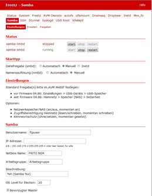

# Samba 3.0.37/3.6.25
 - Package: [master/make/pkgs/samba/](https://github.com/Freetz-NG/freetz-ng/tree/master/make/pkgs/samba/)

[](../screenshots/204.png)

Dieses Paket macht angeschlossen USB-Speicher oder das Dateisystem der
FritzBox für Windows als Dateifreigabe verfügbar (die Beschreibung
basiert auf freetz-1.2 mit Samba 3.0.37). Unter Linux kann dieser
Speicher mittels *smbmount*, *cifsmount*, etc. verfügbar gemacht werden.
Natürlich ergibt ein Samba-Server auf der FritzBox nur dann Sinn, wenn
man einen USB-Datenträger angeschlossen hat oder wenn man einen
[WebDav](davfs2.html) im LAN bereitstellen möchte - ein
Samba-Client kann jedoch durchaus auch genutzt werden, um der FritzBox
externen Speicher zur Verfügung zu stellen - etwa von einem
[NAS](http://de.wikipedia.org/wiki/Network_Attached_Storage)
Device.

Die Dateifreigabe ist zwar auch Bestandteil neuerer AVM Firmware, aber
das Freetz-Paket erweitert die Möglichkeiten:

```
  --------------------------------------------- ------- ---------- --------
                                                AVM^1   freetz^2   Samba^3
  Automatische Freigabe von USB-Speicher        +       +       +
  * mit / ohne Passwort                        +       +       +
  * nur lesen / lesen und schreiben            +       +       +
  * für FAT, FAT32                             +       +       +
  * für EXT2, EXT3, NTFS                       -^4     +       +
  Arbeitsgruppe und Servername konfigurierbar   -       -       +
  Dateigröße über 2GB                           -       -       +
  In der Netzwerkumgebung sichtbar              -       -       +
  Manuell konfigurierte Freigaben               -       -       +
  Master Browser                                -       -       +
  Detailierte Konfiguration des Servers         -       -       +
  --------------------------------------------- ------- ---------- --------
```

^1 wenn Dateifreigabe für das Modell vorgesehen ist
^2 Freetz mit AVM-Samba
^3 Freetz mit "eigenem" Samba
^4 NTFS/EXT2 bei Modellen ab Generation x2xx (EXT2 nicht bei 7270v1), EXT3/4 bei Modellen ab Firmware 5.x

### Package ins Image einbinden

Im menuconfig unter `Package selection -> Standard packages` befindet
sich

  - *Samba 3.0.37 smbd (Filesharing)*
    Damit wird Dateifreigabe möglich.
  - *Samba 3.0.37 nmbd (Nameservices)*
    Dies macht die FritzBox in der Netzwerkumgebung sichtbar. `nmbd`
    kann nur gewählt werden, wenn `smbd` ausgewählt ist.

### Verwandte Themen

Unter `Patches` befindet sich

  - *Patch USB storage names* ... mit zusätzlichen Unterpunkten.
    Diese beeinflussen ebenfalls Details der Dateifreigabe.
  - *Remove smbd*
     * Diese
    Option sollte deselektiert sein und wird bei der Auswahl des
    Samba-Packages aus menuconfig entfernt.

### Konfigurieren des Pakets

### AVM Konfiguration

Die Optionen der original AVM Firmware sind unverändert verfügbar (unter
*Erweiterte Einstellungen → USB-Geräte → USB-Speicher*) . Dies sind:

  - aktivieren / deaktivieren des Dateiservers (Samba)
  - Zugriffsberechtigung für die automatischen Freigaben: nur lesen /
    lesen und schreiben
  - Kennwort

### Freetz Konfiguration

Im Freetz Webinterface werden die zusätzlichen Möglichkeiten des Pakets
konfiguriert.

#### Pakete → Samba

  - **Arbeitsgruppe**
    unter dieser Arbeitsgruppe wird der Server in der Netzwerkumgebung
    von Windows sichtbar
  - **Name des Servers**
    der Name des Server in seiner Arbeitsgruppe
  - **Beschreibung des Servers**
    und seine zusätzliche Beschreibung
  - Optionen für den **Master Browser**
    Wenn mehrere Windows Systeme im gleichen Netzwerksegment vorhanden
    sind, übernimmt eines die Aufgabe, eine Liste mit verfügbaren
    Systemen zu verwalten. Die folgenden Parameter bestimmen, ob die
    FritzBox diese Aufgabe übernimmt und *Master Browser* wird. Details
    unter
    [http://us3.samba.org/samba/docs/using_samba/ch07.html#samba2-CHP-7-TABLE-2](http://us3.samba.org/samba/docs/using_samba/ch07.html#samba2-CHP-7-TABLE-2)
      - OS Level für Election
        Mit dem Standardwert von 20 wird die FritzBox fast immer *Master
        Browser*.
      - Bevorzugter Master
        Wenn dies gewählt ist, versucht die FritzBox nach dem Booten
        einen eventuell schon vorhanden Master Browser abzulösen.
  - Auswahl der **Netzwerkschnittstelle**
    Hier wird das Netzwerksegment angegeben, für das die Box die
    Dateifreigabe bereit stellt. Es kann leer gelassen werden. Dann gilt
    die Dateifreigabe für alle Netzwerksegment, in der sich die Box
    befindet.
    /!
    **Achtung:** Wenn die Box direkt mit dem Internet verbunden ist,
    sollte man sicher sein der der interne Firewall in Ordnung ist.
    Sonst könnte das eine Angriffsmöglichkeit aus dem gesamten Internet
    eröffnen.
  - Startmodus
    Hier kann entweder **automatisch** oder **manuell** ausgewählt
    werden. (*TODO: Wird smbd auch von den Hotplug-Skripten gestartet*?)


#### Einstellungen → Samba Freigaben

Zusätzlich zum USB-Speicher, der beim Anschließen automatisch eine
Freigabe erzeugt, können hier statische Freigaben definiert werden. Z.
B. das Dateisystem der FritzBox oder ausgewählte Verzeichnisse des
USB-Speichers als selbständige Freigabe.
Konfiguriert werden kann:

  - **Path**: Der FritzBox-interne Pfad des Verzeichnisses, das
    freigegeben wird.
  - **Name**: Unter diesem Namen ist die Freigabe für Windows sichtbar
  - **guest ok**: *1*: Legt fest, dass auf diese Freigabe auch ohne
    Kennwort zugegriffen werden kann. Das Kennwort wird in der
    Konfiguration der FritzBox festgelegt.
  - **read only**: *1*: Auf diese Freigabe kann nur lesend zugegriffen
    werden. *0*: Lese- und Schreibzugriff
  - **comment 1**: *-*: Beschreibung folgt
  - **comment 2**: Beschreibung / Kommentar, den Windows mit dieser
    Freigabe anzeigt.

**Beispiel:**

```
/var/media/ftp/uStor01/Videos hdd1 1 0 - Videos
/var/media/ftp/uStor01/Bilder hdd1 1 0 - Bilder
/var/media/ftp/uStor01/Musik hdd1 1 0 - Musik
```

Bei Nutzung eines USB-Speichers ist zu beachten, dass die Zugriffsrechte
entsprechend gesetzt sein müssen. Wurde der Speicher an einem
Fremdrechner z. B. mit ext2 oder ext3 formatiert, sind oft keine
Schreibrechte und auch nicht `ftpuser` als Eigentümer gesetzt. In der
FRITZBox kann das mit folgenden Kommandos korrigiert werden:

```
chmod -R 777 uStor01
```

```
chown ftpuser -R uStor01
```


#### Einstellungen → Samba Erweitert

Hier können sich die Experten austoben und beliebige globale Optionen
für Samba definieren: Der eingegebene Text wird verbatim ans Ende der
`[global]` - Sektion in der Samba-Konfiguration eingefügt.
Details unter
[http://samba.org/samba/docs/using_samba/ch06.html](http://samba.org/samba/docs/using_samba/ch06.html)

Weitere Tuningmöglichkeiten gibt es hier:
[http://lug.krems.cc/docu/samba/appb_02.html](http://lug.krems.cc/docu/samba/appb_02.html)

Für Performanceverbesserungen kann folgendes unter 'Erweitert'
eingetragen werden:

```
socket options = TCP_NODELAY IPTOS_LOWDELAY
read raw = yes
write raw = yes
oplocks = yes
max xmit = 65535
dead time = 15
getwd cache = yes
```

Nichtexperten können diese Einstellung einfach leer lassen.
Falls bei Windows 7 64-bit ein BSOD auftritt "oplocks = no" setzen,
siehe
[IPPF](http://www.ip-phone-forum.de/showpost.php?p=1538911&postcount=1).

