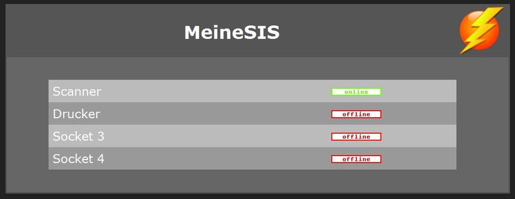
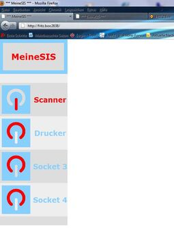

# sispmctl 3.1
 - Package: [master/make/sispmctl/](https://github.com/Freetz-NG/freetz-ng/tree/master/make/sispmctl/)

**[sispmctl](http://sispmctl.sourceforge.net/)**
ermöglicht das Schalten von 230V-Steckdosen über den USB-Anschluss der
Fritzbox (nur für Fritzboxen mit USB-Host-Anschluss). Es unterstützt die
USB-Steckdosen GEMBIRD Silvershield SIS-PM, SIS-PMS und mSIS-PM. Diese
USB-Steckdosen sind deutlich günstiger zu bekommen als Steckdosen, die
übers Netzwerk geschaltet werden. Dank der Fähigkeiten von Freetz können
diese Steckdosen auch per Internet und per Telefon geschaltet werden.

### Einschränkung

sispmctl läuft leider nicht auf Boxen, die den USB-Low-Speed-Modus nicht
unterstützen. Zu diesen Boxen gehört z.B. die alt bekannte 7170. Der
Grund dafür liegt darin, dass der USB-Controller solcher Boxen in einem
FPGA realisiert ist und von AVM nur sehr spärlich programmiert wurde. Da
dieser Teil der Firmware zum Closed-Source-Bereich gehört, sehen wir
leider keine große Chancen, dass sich die Situation in der nächsten Zeit
verbessern wird. Wenn sich jemand damit auskennt, ist er dennoch
herzlich eingeladen den USB-Controller einer 7170 dazu zu ertüchtigen,
mit den Steckdosenleisten von GEMBIRD zu reden.

Liste der Boxen, mit denen sispmctl [**nicht**]
funktioniert: alle x1xx Modelle z.B. **3131**, **7141**, **7170**
Liste der Boxen, mit denen sispmctl funktioniert: **3370**, **7270**,
**W920V**
([Speedport2Fritz](http://www.ip-phone-forum.de/showthread.php?t=172137))

### Benutzung

**sispmctl** kann einerseits per Kommandozeile benutzt werden
(telnet/ssh), andererseits enthält es einen kleinen Webserver, der das
Schalten der Steckdosen ermöglicht. Der eingebaute Webserver enthält
leider keine Möglichkeit zur Authentifizierung, so dass auch bei
Benutzung von https (xrelayd, matrixtunnel) von der Verwendung übers
Internet abzuraten ist. Es ist leider ohne Weiteres nicht möglich den
integrierten Webserver über inetd laufen zu lassen, da sispmctl nur
rudimentär Listener-Mode unterstützt. Selbst im Listener-Mode
unterstützt sispmctl-Binary nicht die echte Daemon-Funktionalität. Aus
diesem Grund muss der integrierte Webserver mit einem & am Ende in den
Hintergrund geschickt werden, um eine Daemon-ähnliche Funktionsweise
abzubilden.

Die Steckdosenleiste kann, wenn sie direkt an einem Windows-Rechner
angeschlossen ist, über die mitgelieferte Software auch so eingestellt
werden, dass sie unabhängig vom Rechner zu bestimmten Zeitpunkten
Schaltvorgänge ausführt. Diese Fähigkeit unterstützt **sispmctl** seit
Version 3.0 (30.03.2011). Da diese Funktionalität noch ziemlich neu ist,
wird sie oft auch durch andere Pakete in Freetz realisiert:

-   **cron**: zeitgesteuertes Schalten
-   **callmonitor**: Schalten per Telefon (ohne Annahme des Gesprächs).
-   **dtmfbox**: Schalten per Telefon (mit Annahme des Gesprächs; per
    DTMF).
-   **dropbear (ssh)**: Schalten übers Internet.
-   **apache/lighthttpd/busybox-httpd, haserl/php und
    xrelayd/matrixtunnel**: Schalten per Web-Interface.

### Freetz Webinterface

[](../screenshots/207.jpg)

Seit Mitte März 2011 wurden die ersten Versuche unternommen, eine
Konfigurationsseite für FREETZ und einen rc-Startskript zu entwickeln.
Näheres s. unter weiterführenden Links.

Die Version 1.0 von sispmctl-cgi erlaubt das Wählen zwei zusätzlicher
Skins über menuconfig. Insbesonders "smartphone"-Skin ist
minimalistisch gestaltet und bestens für Kleingeräte zugeschnitten. Auf
der Einstellungsseite kann man "on-the-box" zwischen den Skins
umschalten.

Seit Version 1.1 von sispmctl-cgi besteht die Möglichkeit mehrere
Steckdosenleisten (bis 9) zu konfigurieren und einzelnen Steckdosen
Namen zu vergeben. Diese benutzerdefinierten Bezeichnungen werden in
FREETZ-Einstellungen abgespeichert und vom integrierten Webserver dank
einer Parser-Funktion im rc-Skript dargestellt. Um mehrere
Steckdosenleisten per integriertes Webinterface bedienen zu können,
werden mehrere Instanzen von sispmctl als Listener auf unterschiedlichen
Ports gestartet. Diese Ports können über die Einstellungsseite separat
für jede Steckdosenleiste konfiguriert werden.

Seit Trunkversion [r6789](https://trac.boxmatrix.info/freetz-ng/changeset/6789) ist sispmctl 3.0 samt cgi-Version 1.1 ein
Bestandteil von FREETZ und kann über menuconfig unter "Testing"
ausgewählt werden. CGI-Version und rc-Skript kann in menuconfig separat
abgewählt oder ins Image "mitgenommen" werden. Werden cgi- und
rc-Skript abgewählt, so steht dem Benutzer die alt bekannte
binary-Version zur Verfügung, die er allerdings selbst händisch starten
und verwalten muss. Für das in sispmctl integrierte Webinterface stehen
jetzt zusätzliche Skins zur Verfügung, die ebenfalls über menuconfig
ausgewählt werden können.

[](../screenshots/210.jpg)

### Platzbedarf

Cgi und rc-Skript beanspruchen im Flash circa 4kB. Der Unterschied im
Binary mit und ohne Webserver ist 6kB. Die Skins beinhalten jeweils ein
Bildchen und einige html-Dateien, was pro Skin etwa 10...16kB an
Zusatzplatz kostet.

### manpage

Auf der Kommandozeile gibt `sispmctl -h` eine kurze Übersicht über die
Optionen. Die
[man-page](http://sispmctl.sourceforge.net/#mozTocId756141)
findet sich aber auch auf der Homepage des Projekts.

```
root@fritz:/var/mod/root# sispmctl -h

SiS PM Control for Linux 3.0

(C) 2004-2011 by Mondrian Nuessle, (C) 2005, 2006 by Andreas Neuper.
(C) 2010 by Olivier Matheret for the plannification part
This program is free software.
sispmctl comes with ABSOLUTELY NO WARRANTY; for details
see the file INSTALL. This is free software, and you are welcome
to redistribute it under certain conditions; see the file INSTALL
for details.

sispmctl -s
sispmctl [-q] [-n] [-d 0...] [-D ...] -b <on|off>
sispmctl [-q] [-n] [-d 0...] [-D ...] -[o|f|t|g|m] 1..4|all
sispmctl [-q] [-n] [-d 0...] [-D ...] -[a|A] 1..4|all [--Aat '...'] [--Aafter ...] [--Ado <on|off>] ... [--Aloop ...]
   'v'   - print version & copyright
   'h'   - print this usage information
   's'   - scan for supported GEMBIRD devices
   'b'   - switch buzzer on or off
   'o'   - switch outlet(s) on
   'f'   - switch outlet(s) off
   't'   - toggle outlet(s) on/off
   'g'   - get status of outlet(s)
   'm'   - get power supply status outlet(s) on/off
   'd'   - apply to device 'n'
   'D'   - apply to device with given serial number
   'n'   - show result numerically
   'q'   - quiet mode, no explanations - but errors
   'a'   - get plannification for outlet
   'A'   - set plannification for outlet
           '-A<num>'        - select outlet
           '--Aat "date"'   - sets an event time as a date '%Y-%m-%d %H:%M'
           '--Aafter N'     - sets an event time as N minutes after the previous one
           '--Ado <on|off>' - sets the current event's action
           '--Aloop N'      - loops to 1st event's action after N minutes

Webinterface features:
sispmctl [-q] [-i <ip>] [-p <#port>] [-u <path>] -l
   'l'   - start port listener
   'i'   - bind socket on interface with given IP (dotted decimal, i.e. 192.168.1.1)
   'p'   - port number for listener (2638)
   'u'   - repository for web pages (default=/usr/share/sispmctl)
```

### Bekannte Bugs

Das integrierte Web-Interface ist sehr empfindlich gegenüber Störungen
auf dem USB-Bus bzw. gegenüber falscher Byte-Sequenzen auf dem
lauschenden Port. Beides führt zu einem sicheren Absturz vom Webserver.
Zu erkennen sind solche Abstürze dadurch, dass der Web-Browser auf dem
besagten Port eine Zeitüberschreitung meldet bzw. sispmctl-Dienst in
FREETZ als "stopped" vermeldet wird. Ein manueller Wiederstart des
intgrierten Web-Interfaces ist nach einem solchen Absturz möglich.

### Weiterführende Links

-   [Homepage von
    sispmctl](http://sispmctl.sourceforge.net/) (Englisch)
-   [Version 1.0 von sispmctl-cgi auf
    IPPF](http://www.ip-phone-forum.de/showthread.php?t=232493&p=1690967&viewfull=1#post1690967)
-   [Version 1.1 von sispmctl-cgi auf
    IPPF](http://www.ip-phone-forum.de/showthread.php?t=232493&p=1695596&viewfull=1#post1695596)
-   Ticket #1264
-   Ticket #1677

### Weitere Screenshots

[](../screenshots/208.jpg)

[](../screenshots/211.jpg)


