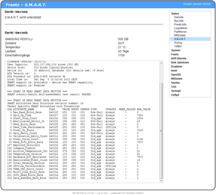

# Smartmontools 7.3
 - Homepage: [https://www.smartmontools.org/](https://www.smartmontools.org/)
 - Manpage: [https://www.smartmontools.org/wiki/TocDoc](https://www.smartmontools.org/wiki/TocDoc)
 - Changelog: [https://www.smartmontools.org/browser/trunk/smartmontools/NEWS](https://www.smartmontools.org/browser/trunk/smartmontools/NEWS)
 - Repository: [https://www.smartmontools.org/timeline](https://www.smartmontools.org/timeline)
 - Package: [master/make/smartmontools/](https://github.com/Freetz-NG/freetz-ng/tree/master/make/smartmontools/)

Mit den Smartmontools (bzw. mit smartctl) können die
"Gesundheitswerte" von Festplatten (auch
[SMART](http://smartmontools.sourceforge.net/man/smartctl.8.html)
genannt) ausgelesen, und im Freetz-Webinterface unter Status angezeigt
werden. Dies funktioniert allerdings nur dann, wenn die Festplatte und
dessen USB-Festplattengehäuse das Auslesen dieser Werte auch zuläßt.

**Folgende Werte werden im Webinterface angezeigt:**

-   Modellbezeichnung der Festplatte und dessen Speicherkapazität.
-   Der allgemeine, von SMART bewertete Zustand (Health) der
    Festplatte.
-   Aktuelle Temperatur der Festplatte in °C.
-   Bisherige Laufzeit der Festplatte.
-   Anzahl der Einschaltvorgänge.
-   Und anschließend alle verfügbaren Werte, wie man sie auch auf der
    Konsole sehen würde.

**Hinweis:**
Durch das Öffnen der Statusseite im Webinterface wird eine eventuell
geparkte Festplatte hochgefahren! Daher kann es auch ein wenig dauern,
bis die Statusseite komplett angezeigt wird.

