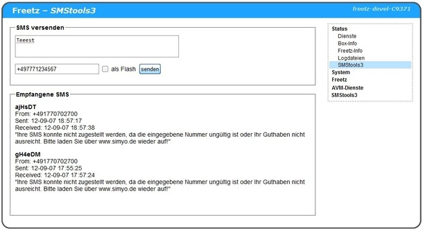

# smstools3 3.1.21
 - Homepage: [http://smstools3.kekekasvi.com/](http://smstools3.kekekasvi.com/)
 - Changelog: [http://smstools3.kekekasvi.com/index.php?p=history3](http://smstools3.kekekasvi.com/index.php?p=history3)
 - Package: [master/make/pkgs/smstools3/](https://github.com/Freetz-NG/freetz-ng/tree/master/make/pkgs/smstools3/)

[](../screenshots/251.jpg)

Package um SMS mit einem UMTS-Stick zu versenden und zu empfangen.

 * Falls die
FritzBox UMTS-Unterstützung hat, am besten den umtsd herauspatchen.

SMStools3 kann komplett per Webif bedient werden oder alternativ per
Terminal.

### Datenverzeichnis

Das "Datenverzeichnis" legt man am besten auf einen USB-Stick, damit
keine SMS verloren gehen. Dennoch wird ein `modsave` beim Beenden des
Packages ausgeführt, falls der Pfad mit `/tmp/flash` beginnt.

### Senden und Empfangen mit dem Terminal

Eine SMS kann man diesem Befehl versendet werden, der Parameter `flash`
ist optional:

```
rc.smstools3 sendsms flash +497771234567 Text der Nachricht
```

Empfangene SMS können so aufgelistet angezeigt:

```
rc.smstools3 listsms
```

### Event-Handler

On every event (SENT; RECEIVED; FAILED; REPORT; CALL;) this script is called.

The following is an simple example script that forwards all normal SMS to a pre-programmed number,
and all SMS with a "Forward: \<phone\> " prefix, to mentioned \<phone\> but cleansed from the prefix.

This way you can receive, and remotely respond to, SMS from your service provider.

Caution: as is the script is an security risk (anyone can instruct it to forward an SMS)
Also it only handles SMS in ISO text encoding, I believe non-ISO characters are simply dropped by smstools3,
but embedded quotes will surely mess up the processing.

```
#!/bin/sh
# Make executable or smstools3 will crash: chmod a+x
# Debug by viewing /var/log/smsd

NUMBER=316xxxxxxxx   # My Phone, international format without +
#NUMBER2=316xxxxxxxx  # My alternate Phone

SOURCE=`cat $2|grep ^From:|cut -d " " -f2`
FORWARD=`cat $2|grep ^Forward:|cut -d " " -f2`

SENDSMS="/etc/init.d/rc.smstools3 sendsms"

if [ "$1" = "RECEIVED" ]; then

    # line number of the actual message (last line)
    line="$(awk '/^\s*$/{print NR}' $2|head -n 1)"
    [ -z "$line" ] && exit 0

    # extract message
    MESSAGE="`sed "1,${line}da" < $2`"

    # If forward command, then forward message
    if [ -n "$FORWARD" ];then
      #remove forward header
      MESSAGE2=${MESSAGE#Forward: [0-9]* }
      $SENDSMS "$FORWARD" "${MESSAGE2}"
      sleep 1 # force sepate timestamp in temp file
    fi

    # If no forward command, then forward to preprogrammed number
    # Even if a forward command, still forward to listed numbers, to show processing was OK
    if [ -n "$NUMBER" ];then
      $SENDSMS "$NUMBER" "Forward: ${SOURCE} ${MESSAGE}"
    fi
    if [ -n "$NUMBER2" ];then
      sleep 1 # force sepate timestamp in temp file
      $SENDSMS "$NUMBER2" "Forward: ${SOURCE} ${MESSAGE}"
    fi

fi
```

### Weiteres

-   Komplette Dokumentation:
    [http://smstools3.kekekasvi.com/](http://smstools3.kekekasvi.com/)
-   Falls der Stick nicht richtig erkannt wird, sondern nur als
    Datenträger:
    [wiki:/packages/ppp#Weiteres](ppp.html#weiteres)
