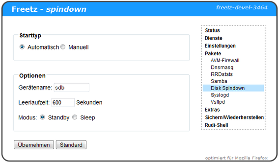

# spindown-cgi 0.2
 - Package: [master/make/pkgs/spindown-cgi/](https://github.com/Freetz-NG/freetz-ng/tree/master/make/pkgs/spindown-cgi/)

Mit **Spindown** können kompatible *"mechanische"* Festplatten in den
Schlafmodus versetzt werden.

**Starttyp**: Automatisch (mit dem Starten der Box), oder Manuell
(starten des Dienstes von Hand)
**Gerätenamen**: Hier wird der Gerätenamen der Festplatte angegeben,
welche schlafen gelegt werden soll (sda, sdb, sdc, usw.)
**Leerlaufzeit**: Nach der hier eingestellten Zeit des Nichtstuns wird
die Festplatte schlafen gelegt.
**Modus**: Standby oder Sleep: Einfach probieren, mit welchem Modus die
Festplatte sich in den Ruhezustand versetzen lässt, und auch wieder
geweckt werden kann.

