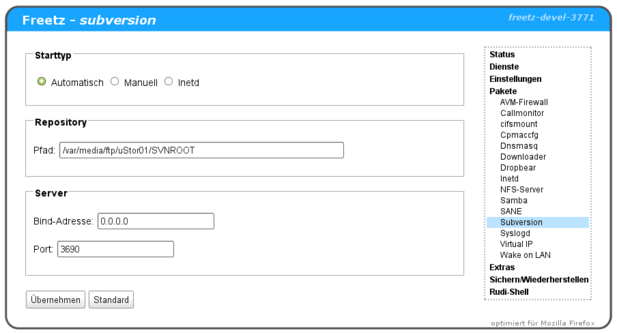

# Subversion 1.9.12/1.14.2
 - Homepage: [https://subversion.apache.org/](https://subversion.apache.org/)
 - Manpage: [https://subversion.apache.org/quick-start](https://subversion.apache.org/quick-start)
 - Changelog: [https://subversion.apache.org/docs/release-notes/release-history.html](https://subversion.apache.org/docs/release-notes/release-history.html)
 - Repository: [https://svn.apache.org/viewvc/subversion/](https://svn.apache.org/viewvc/subversion/)
 - Package: [master/make/pkgs/subversion/](https://github.com/Freetz-NG/freetz-ng/tree/master/make/pkgs/subversion/)

[Subversion](http://subversion.tigris.org/) (SVN)
ist eine Freie Software zur Versionsverwaltung von Dateien und
Verzeichnissen.

Die Versionierung erfolgt in einem zentralen Projektarchiv (engl.
repository) in Form einer einfachen Revisionszählung. Wenn Änderungen an
Inhalten verteilt auf den Computern der Bearbeiter ausgeführt werden,
werden zwischen dem Projektarchiv und einem Arbeitsplatz jeweils nur die
Unterschiede zu bereits vorhandenen Ständen übertragen.

### Enthaltene Programmteile

```
  --------------- --------------------------------------------------------------------------------------------------------
  svn             Das Kommandozeilenprogramm
  svnadmin        Ein Werkzeug zum Erstellen, Verändern oder Reparieren eines Repositorys
  svndumpfilter   Ein Programm zum Filtern von Subversion-Repository-Dump-Streams
  svnlook         Ein Werkzeug zur direkten Untersuchung eines Subversion-Repositorys
  svnserve        Ein spezielles Server-Programm, dass als Hintergrundprozess laufen oder von SSH aufgerufen
                  werden kann; eine weitere Möglichkeit, das Repository über ein Netzwerk verfügbar zu machen
  svnsync         Ein Programm zum inkrementellen Spiegeln eines Repositorys über ein Netzwerk
  svnversion      Ein Programm, das den Zustand einer Arbeitskopie (durch Revisionen der vorliegenden Objekte) berichtet
  --------------- --------------------------------------------------------------------------------------------------------
```

### WebIF

[](../screenshots/117.png)


### Konfiguration

Ein Repository wird mit folgendem Befehl angelegt

```
svnadmin create --fs-type fsfs /PFAD_ZU_DEM_EXT2_TRAEGER/REPOSITORY_NAME
```

REPOSITORY_NAME ist ein Platzhalter und darf beliebig gewählt werden.
Der Datenträger muss mit ext2 bzw. ext3 formatiert werden, Repositories
auf FAT- bzw. NTFS-Trägern werden von Freetz (derzeit noch) nicht
unterstützt.

Nachdem das Repository angelegt ist, sind in dem Verzeichnis
REPOSITORY_NAME/**conf** folgende Dateien zu finden bzw. neu anzulegen.
Welche Einträge in diesen gemacht werden können und was sie bedeuten,
kann
[hier](http://svnbook.red-bean.com/nightly/en/svn.serverconfig.svnserve.html)
nachgelesen werden. Die allereinfachte Konfiguration könnte z.B. so
aussehen:

**authz** einfach leer

**passwd**

```
[users]
DeinName = DeinPasswort
```

**svnserve.conf**

```
[general]
anon-access = none
auth-access = write
password-db = passwd
```

