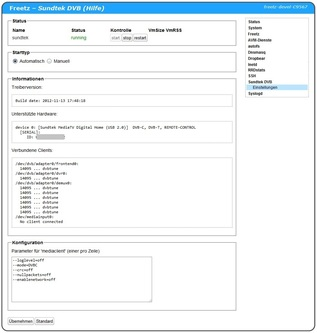

# Sundtek DVB driver 130210.134617/170310.204343/210803.071224
 - Package: [master/make/pkgs/sundtek/](https://github.com/Freetz-NG/freetz-ng/tree/master/make/pkgs/sundtek/)

[](../screenshots/256.jpg)

Dieses Package stellt den Treiber für USB-Sticks von Sundtek bereit, mit
denen DVB (c/s/t) empfangen werden kann.

 * Die Fritzbox
sollte mindestens USB 2.0 haben, 11 MBit/s reichen nicht aus.
 * Mit Kernel
2.6.19.2 (Fritzbox 7270v1 und 7570) gibt es momentan ein Memoryleak,
siehe
Ticket #472

### Parameter für 'mediaclient'

In dieses Textfeld können Parameter zum initialisieren für den
`mediaclient` eingetragen werden. Wenn dies genutzt wird, wird die
Hardwareerkennung vom `mediasrv` abgewartet was etwa 10 Sekunden
benötigt

### Treiber verwenden

Um den Treiber benutzen zu können muss vorher dieser Befehl ausgeführt
werden:

```
export LD_PRELOAD=/usr/lib/libmediaclient.so
```

### USB-Stick initialisieren

Der USB-Stick muss für die Fritzbox in den Übertrangungsmodus "bulk"
versetzt werden:

```
mediaclient --dtvtransfermode=bulk
```

Dies ist nur einmalig nötig und der Stick muss danach neu angesteckt
werden.

### Weiteres

Nutzbar z.B. zur Aufzeichnung der Auslastung des Segmentes von
Kabelinternet mit [RRDstats](rrdstats.html#segment). Es soll
damit auch Streaming zu einem Windows PC mit einer aktuellen Betaversion
des DVB-Viewer via SAT>IP möglich sein.
