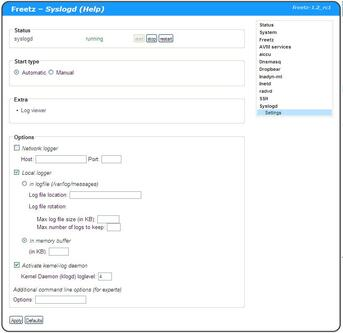

# Syslogd CGI 0.2.3
 - Package: [master/make/pkgs/syslogd-cgi/](https://github.com/Freetz-NG/freetz-ng/tree/master/make/pkgs/syslogd-cgi/)

The syslog package enables to log messages local to memory, to a local
disk (e.g. USB), or remote to another server.
For the local memory a FIFO buffer is used, with a default size of
200KB.

### Setup in Freetz web-interface

[](../screenshots/239.jpg)

### Usage of syslog

The syslog messages can be displayed via the web-interface via:

```
Status > Syslog
```

You can filter on some items depending on your configuration and used
packages (e.g. hostapd, login, INADYN).

Another option is to view the messages via a telnet or ssh connection
using the following commands:

```
logread
```

You can monitor the syslog messages where all new messages are displayed
using the command:

```
logread -f
```

(With CTRL-C you can stop the monitoring.)
