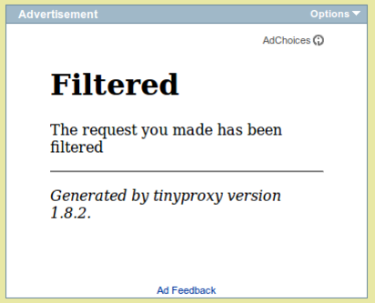

# Tinyproxy 1.11.1
 - Homepage: [https://tinyproxy.github.io/](https://tinyproxy.github.io/)
 - Manpage: [https://tinyproxy.github.io/#documentation](https://tinyproxy.github.io/#documentation)
 - Changelog: [https://github.com/tinyproxy/tinyproxy/releases](https://github.com/tinyproxy/tinyproxy/releases)
 - Repository: [https://github.com/tinyproxy/tinyproxy](https://github.com/tinyproxy/tinyproxy)
 - Package: [master/make/pkgs/tinyproxy/](https://github.com/Freetz-NG/freetz-ng/tree/master/make/pkgs/tinyproxy/)

Das [tinyproxy](http://tinyproxy.sourceforge.net/)
Paket stellt einen kleinen HTTP Proxy mit Filterfunktionen bereit.

### Proxy auto-config (pac)

The complete URL for the default settings is:
[http://fritz.box:88/cgi-bin/proxy.cgi](http://fritz.box:88/cgi-bin/proxy.cgi)

See also
[wikipedia](http://en.wikipedia.org/wiki/Proxy_auto-config).

### URL blocking

[](../screenshots/217.png)

-   Clear option *ConnectPort*
-   Check option *FilterURLs*
-   Add URL's to text box *content of filter file*

```
doubleclick.net
googleadservices.com
google-analytics.com
googlesyndication.com
facebook.com/plugins
```

Setup Firefox:

-   *Edit > Preferences > Advanced > Settings*
-   Check *Manual proxy configuration*
-   *HTTP Proxy:* fritz.box
-   *Port:* 3128 (assuming tinyproxy default)
-   Check *Use this proxy for all protocols*
-   *No proxy for:* localhost, 127.0.0.1, fritz.box, 192.168.178.0/24

### Memory usage

After some use:

-   VmSize: 1068 kB
-   VmRSS: 508 kB

Privoxy will use twice as much.

