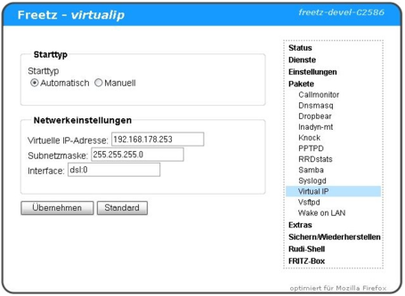

# Virtual IP CGI 0.4.2 (deprecated)
 - Package: [master/make/pkgs/virtualip-cgi/](https://github.com/Freetz-NG/freetz-ng/tree/master/make/pkgs/virtualip-cgi/)

[](../screenshots/61.png)

**Virtual IP** ist eine Erweiterung für Freetz, die es ermöglicht, eine
virtuelle IP auf der Box anzulegen. Das Paket ist über das Freetz
Webinterface konfigurierbar. Anfangs wurde diese virtuelle IP genutzt um
Portfreigaben auf die Box im AVM Webinterface anlegen zu können.

 * **VORSICHT**

Dieses Package wird nicht mehr supported und es sollte stattdessen
"[AVM-Firewall](avm-firewall.md)" verwendet werden.

Portfreigaben auf virtuelle IPs mit Firmwares (> 04.57) funktinieren
nicht mehr zuverlässig. Bei manchen Firmwares (> 04.80) ist die Box
teilweise nicht mehr per Netzwerk erreichbar sobald eine virtuelle IP
eingerichtet wurde. Der ATA-Modus macht weniger Probleme wie der
DSL-Modus.

Weitereführende Links dazu:

-   [IPPF: Bei welchen Boxen funktioniert Virtual IP (nicht
    mehr)?](http://www.ip-phone-forum.de/showthread.php?t=174245)
-   [IPPF: Port-Freigabe auf die Box ist so möglich!
    Virtual-IP
    überflüssig?!?](http://www.ip-phone-forum.de/showthread.php?t=159266)

### Einrichtung

-   **Starttyp**: "Automatisch", wenn *VirtualIP* nach einem Reboot
    auch automatisch aktiv werden soll.
-   **Virtuelle IP-Adresse**: Die zusätzliche IP, unter der die Box
    erreichbar sein soll.
-   **Subnetzmaske**: Die dazu passende
    [Subnetz](http://de.wikipedia.org/wiki/Subnetz)-Maske
    (ggf. auch den
    [englischen](http://en.wikipedia.org/wiki/Subnet_mask)
    bzw.
    [deutschen](http://de.wikipedia.org/wiki/Subnetz)
    Wikipedia-Artikel konsultieren)
-   **Interface**: Normalerweise "eth0:1" wenn die Box auch die
    DSL-Einwahl vornimmt, bzw. "dsl:0" im ATA-Modus. Im Zweifelsfall
    ein wenig probieren.

Fragen und Diskussionen zu diesem Package kann man auch
[hier](http://www.ip-phone-forum.de/showthread.php?t=111623)
stellen/führen.

### Bekannte Probleme und Bugs

### dsld-Syslogmeldung

Fehlermeldung im Syslog:

```
user.err dsld[1243]: internet: 192.168.178.253 not an intern host, forwardrule "tcp 0.0.0.0:85 192.168.178.253:85 0 # Test" ignored
```

AVM hat im **dsld**, der sich um DSL und die Portweiterleitungen
kümmert, einen Schutz eingebaut, der eine Weiterleitung auf die FritzBox
eigenen IPs verhindert.

### Probleme mit OpenVPN / UDP

Eine Weiterleitung für OpenVPN bzw. für einen UDP-Port scheint Probleme
zu machen. Bei einigen funktioniert es jedenfalls nicht.

### Probleme mit IPTV

Bei aktiver Virtual IP wird das TV Signal nicht mehr an den
Mediareceiver weitergeleitet.

### Probleme mit dem SIP-Registrar Modus

Nutzt man eine Fritzbox auf der virtual-ip läuft als Registrar scheitern
VoIP Telefonate am SIP Client. Ausgehende Pakete werden korrekt an den
Registrar übertragen, jedoch wartet der Client auf Pakete von der
virtuellen IP - vergebens. Deaktiviert man virtual-ip und ruft
'voipcfgchanged' auf funktioniert alles korrekt. Getestet mit Firmware
4.80 und Freetz 1.1.3.


