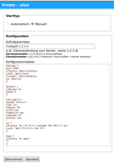

# VTun 3.0.4
 - Package: [master/make/pkgs/vtun/](https://github.com/Freetz-NG/freetz-ng/tree/master/make/pkgs/vtun/)

[VTUN](http://vtun.sourceforge.net/) ist eine
einfache Möglichkeit, einen Tunnel von der oder auf die Fritzbox
aufzubauen. Mit maximal 75k ist es zudem auch nicht allzu groß.

### Version

Momentan ist die Version 3.0.2 enthalten. Es kann im menuconfig
(momentan im Bereich "Testing") mit folgenden Optionen gebaut werden:

-   Komprimierung per LZO2 oder Deflate (zlib)
-   Verschlüsselung per SSL (Achtung, [Hinweise zur SSL Bibliothek
    beachten](../FAQ.html#NachdemFlashenistdieBoxnichtmehrerreichbarundoderrebootetständig))
    ^Es besteht die Möglichkeit, VTUN statisch zu bauen, um mögliche Probleme damit zu vermeiden^
-   Flusssteuerung ("Traffic-Shaping")

### Konfigurationsanleitung

Die GUI für das Programm ist momentan sehr einfach aufgebaut:

-   In einer Zeile wird der Aufrufstring für das Programm festgelegt
-   In der Feld darunter wird die Konfigurationsdatei eingegeben werden

Auf der Seite von VTUN findet man auch ein paar
[Konfigurationsbeispiele](http://vtun.sourceforge.net/setup.html)

### Portweiterleitung

Soll die Box als Server dienen und die Verbindung auf die Box über das
Internet aufgebaut werden, so muss dafür eine "Portweiterleitung"
eingerichet werden. Ausführlich wird das Thema z.B. beim Paket
[OpenVPN](openvpn.html#Portweiterleitung) behandelt, als Freetz
Nutzer bietet sich dafür das Paket [AVM
Firewall](avm-firewall.md) an

