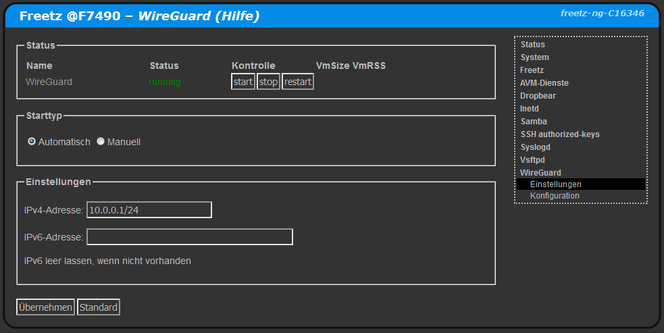

# wireguard-tools 1.0.20200827

Mit Wireguard kann ein VPN aufgebaut werden. Es ist schneller als [OpenVPN](openvpn.md) und einfach zu konfugurieren als IPsec.<br>
<br>
<a href='../screenshots/000-PKG_wireguard.png'></a>
<br>


### Hinweise

 - Ein Wireguard-Client auf der Fritzbox kann nicht als Default-Gateway verwendet werden, siehe [ip-phone-forum.de/threads/304914/](https://www.ip-phone-forum.de/threads/304914/).
 - Falls der Wireguard-Server nicht der Router ist muss auf dem Router eine Route zum IP-Bereich von Wireguard eingerichtet werden.


### Datendurchsatz
Erfahrungswerte mit verschiedener Hardware.
|  Client  |     Server     |    Download    |     Upload    |                                          Quelle                                     |
|:--------:|:--------------:|:--------------:|:-------------:|:-----------------------------------------------------------------------------------:|
| Computer | Raspberry PI 4 | min 100 MBit/s | min 45 MBit/s | [cuma](https://github.com/Freetz-NG/freetz-ng/pull/101#issuecomment-716029888)      |
| Computer | Fritz!Box 7590 | min  85 MBit/s | min 40 MBit/s | cuma                                                                                |
| Computer | Fritz!Box 7490 | max  35 MBit/s | min 45 MBit/s | cuma                                                                                |
| Computer | Fritz!Box 7520 | ca   35 MBit/s | ca  35 MBit/s | [wall007](https://github.com/Freetz-NG/freetz-ng/issues/118#issuecomment-731734627) |

### Konfiguration für einen Wireguard-Server auf der Fritzbox mit einem PC erstellen

Die `PresharedKey`-Zeilen bzw `psk`-Dateien sind optional und können entfernt werden.
Der Port muss gegebenenfalls in der Firewall freigegben werden, zum Beispiel mit [AVM-portfw](avm-portfw.md).

##### Erforderliche Programme installieren
Bei Ubuntu heisst der Paketmanager `apt-get`.
```
sudo dnf install wireguard-tools qrencode
```

##### Variablendefinition
Diese Variabelen werden weiter unten genutzt und sollten angepasst werden.
```
NUMCLIENTS="9"
HOSTNAME="mein.dyndns.host"
UDPPORT="51820"
IPBEREICH="10.0.0.1/24"
DNSSERVER="192.168.178.1"

```

##### Schlüssel-Dateien erstellen
Es werden die Schlüsseldateien `*.prv`, `*.psk` und `*.pub` generiert. Mit diesen werden die Konfigurationsdateien erstellt.
```
for x in SRV $(seq -f "CL%g" $NUMCLIENTS); do
touch           $x.prv   $x.psk     $x.pub
chmod 640       $x.prv   $x.psk     $x.pub
wg genkey | tee $x.prv | wg pubkey >$x.pub
wg genpsk >              $x.psk
[ "$x" == "SRV" ] && rm  $x.psk
done

```


##### Serverkonfiguration erstellen
Es wird die Serverkonfiguration in `SRV.cfg` erstellt die auf der Fritzbox eingefügt werden kann.
```
touch      SRV.cfg
chmod 640  SRV.cfg
cat >  SRV.cfg << EOX
[Interface]
ListenPort   = $UDPPORT
PrivateKey   = $(cat SRV.prv)

EOX
for x in $(seq -f "CL%g" $NUMCLIENTS); do
cat >> SRV.cfg << EOX
[Peer]
PublicKey    = $(cat $x.pub)
PresharedKey = $(cat $x.psk)
AllowedIPs   = ${IPBEREICH%.*}.1${x#CL}/32

EOX
done

```

##### Clientkonfigurationen erstellen
Die Clientkonfigurationen werden in `CL*.cfg` erstellt.
Die QR-Codes zum scannen mit einer App befinden sich in `CL*.txt`.
```
for x in $(seq -f "CL%g" $NUMCLIENTS); do
cat > $x.cfg << EOX
[Interface]
Address             = ${IPBEREICH%.*}.1${x#CL}/32
DNS                 = $DNSSERVER
PrivateKey          = $(cat $x.prv)

[Peer]
Endpoint            = $HOSTNAME:$UDPPORT
PublicKey           = $(cat SRV.pub)
PresharedKey        = $(cat $x.psk)
AllowedIPs          = 0.0.0.0/0
PersistentKeepalive = 90

EOX
cat $x.cfg | qrencode -t ansiutf8 > $x.txt
done

```

