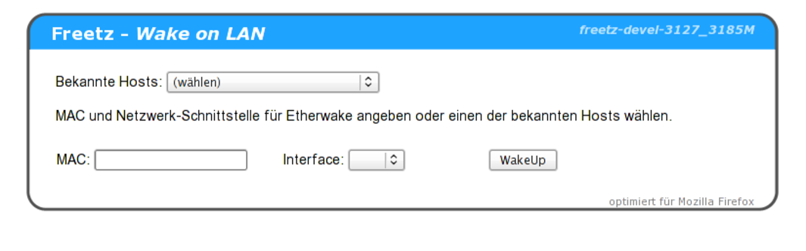

# WOL 0.7.1 (binary only)
 - Package: [master/make/pkgs/wol/](https://github.com/Freetz-NG/freetz-ng/tree/master/make/pkgs/wol/)

Es gibt zwei Programme, die WoL unterstützen:
1. *ether-wake*, das in der busybox integriert ist und
2. *wol*, das genutzt werden kann, wenn es mit *ether-wake* Probleme
gibt.

Das `wol` Paket ist "binary only", kann aber seit einiger Zeit auch
über wol-cgi bedient werden.

### Wake on LAN WebInterface(wol-cgi)

Mit Hilfe des wol-cgi Paketes lässt sich das Busybox Applet `ether-wake`
steuern. Hiermit lassen sich PCs über das lokale Netzwerk (LAN) oder
über das Internet (WAN) aufwecken.

### Konfiguration auf der Fritzbox

Ein PC, der aufgeweckt werden soll, muss in die Hostliste aufgenommen
werden. Die Hostliste lässt sich auf folgende Weisen bearbeiten:

-   *Pakete → Wake on LAN → Hosts bearbeiten*
-   *Einstellungen → Hosts*

Um Wake on LAN zu nutzen, muss wenigstens die Mac-Adresse und der
Hostname eingegeben werden, am Besten einfach gleich noch die IP-Adresse
und das Interface (meist eth0). Beispiele:

```
#<ip>           <mac>              <interface> <host>  [<description>]  (*... nicht definiert)
*              0A:B1:2C:D3:4E:F5  *           server
192.168.178.2  0A:B1:2C:D3:4E:F5  eth0        server  Das ist mein Server
```

Im Menü *Pakete → Wake on LAN* können noch weitere Einstellungen
vorgenommen werden:

[](../screenshots/16.png)

Anschließen ist das WoL-WebInterface über `fritz.box:82` oder den
Menüpunkt "*Freetz WOL*" des AVM-WebInterfaces zu erreichen. Darin
dann den PC in der Liste "Bekannte Hosts" auswählen. Die Einträge MAC
und Interface werden automatisch eingetragen und ein Klick auf
"WakeUp" startet den gewählten PC.

[](../screenshots/14.png)

Bei Problemen bitte zuerst versuchen, ob der PC sich anderweitig (von
anderen PCs) aufwecken lässt. Hierdurch ist sichergestellt, dass der PC
richtig konfiguriert ist. Weiterhin kann man statt dem Busybox
`ether-wake` Applet das [wol](wol.md) Binary probieren.

