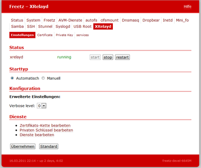

# Xrelayd 0.2.1pre2
 - Package: [master/make/xrelayd/](https://github.com/Freetz-NG/freetz-ng/tree/master/make/xrelayd/)

[](../screenshots/203.png)

*"xrelayd is the successor to matrixtunnel, a lightweight stunnel
replacement. Xrelayd is a basic tcp proxy server which enables you to
encrypt arbitrary protocols without changing ssl unaware deamons and
client software."* [xrelayd Thread im
OpenWRT-Forum](http://forum.openwrt.org/viewtopic.php?id=12338)

Obwohl es als Nachfolger von matrixtunnel betrachtet wird, ist auch
dieses Projekt ähnlich wie *matrixtunnel* seit Ende 2007 etwas
eingeschlafen. *xrelayd* benutzt eine andere SSL-Bibliothek als
*matrixtunnel* und ist auch nicht so kompakt wie dieses. Die Handhabung
und Syntax von *xrelayd* ist ähnlich dem *matrixtunnel*. *xrelayd* kann
im Unterschied zu *matrixtunnel* auch noch [selbstsignierte
Zertifikate](http://en.wikipedia.org/wiki/Self-signed_certificate)
erstellen, sodass dies auf der Box selbst geschehen kann. Solche
Zertifikate werden allerdings von den Browsern wie Firefox 3 als korrupt
angesehen, weil sie "nicht vertrauenswürdig" sind (bei
"vertrauenswürdigen Zertifikaten" bürgt dafür eine
"[Certificate
Authority](http://de.wikipedia.org/wiki/Zertifizierungsstelle)"
wie z.B. Thawte oder VeriSign). AVM scheint für ihren HTTPS-Server eine
xrelayd-ähnliche-Lösung zu benutzen. Dafür sprechen bei jedem Reboot neu
erstellte selbst signierte Zertifikate des HTTPS-Servers von AVM.

Seit
Freetz-trunk Changeset r3571 gibt es dazu auch ein WebGUI.

### Konfiguration

1.  Erzeugen der Keys auf dem PC (unter Linux):

    ``` 
    openssl genrsa 1024 > host.key
    openssl req -new -x509 -nodes -sha1 -days 365 -key host.key > host.cert
    ```

2.  Die Keys im Webinterface unter Einstellungen→XRelayd:
    Certificate/Private Key einfügen.

<!-- -->

3.  Die gewünschten Services hinzufügen. Zum Beispiel:

    ``` 
    0.0.0.0:4433 127.0.0.1:81 Freetz-Webinterface
    ```

4.  Zugriff (intern) über
    [https://fritz.box:4433](https://fritz.box:4433).
    Für den externen Zugriff muss noch eine Port-Freigabe eingetragen
    werden.

### Zertifikate auf der Box erzeugen

```
xrelayd -f -K 1024 -p host.key -U "CN=localhost" -p host.key -A host.cert
cat host.key > /tmp/flash/.xrelayd/key.pem
cat host.cert > /tmp/flash/.xrelayd/certs.pem
modsave flash
```

