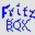
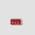

# Favicons

Aus WIKIPEDIA:
```
Ein Favicon (kurz für favourite icon, engl. für Favoriten-Symbol) ist
ein kleines, 16×16 oder 32×32 Pixel großes Icon, Symbol oder Logo,
das unter anderem in der Adresszeile eines Browsers links von der
URL angezeigt wird und meist dazu dient, die zugehörige Website auf
wiedererkennbare Weise zu kennzeichnen. Es taucht auch in der
Lesezeichenleiste (Favoriten), bei den Registerkarten (oder Tabs)
und unter Windows beim Speichern einer Seite auf dem Desktop auf. Das
Favicon wurde von Microsoft mit dem Internet Explorer 4 eingeführt.
```
Die Favicons werden sowohl bei AVM-WebIF, als auch bei FREETZ-WebIF angezeigt.<br>
Zur Zeit können folgende Einstellungen für Favicons im menuconfig unter "Web interface" ausgewählt werden:

### Freetz Webinterface

 * **none**<br>
   Keine Favicons. Dies ist die Default-Einstellung.

 * **atomphil**<br>
   [](../screenshots/000-FAV_mod-atomphil.jpg)

 * **cuma**<br>
   [](../screenshots/000-FAV_mod-cuma.png)

 * **dsl123**<br>
   [](../screenshots/000-FAV_mod-dsl123.png)

 * **hansolo**<br>
   [](../screenshots/000-FAV_mod-hansolo.png)

 * **prisrak**<br>
   [](../screenshots/000-FAV_mod-prisrak.png)

### AVM Webinterface

 * **none**<br>
   Keine Favicons. Das ist die Default-Einstellung.

 * **atomphil**<br>
   Es wird das original AVM-Favicon genutzt.

 * **cuma**<br>
   [](../screenshots/000-FAV_avm-cuma.jpg)

 * **dsl123**<br>
   [](../screenshots/000-FAV_avm-dsl123.jpg)

 * **hansolo**<br>
   [](../screenshots/000-FAV_avm-hansolo.jpg)

 * **prisrak**<br>
   Es wird das original AVM-Favicon genutzt.

<br>
