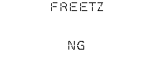
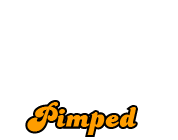

# Tagging

 * **cuma** 
   Im Webinterface wird über AVM's "Fritz" Logo der Schriftzug "FREETZ MOD" gelegt.  
   
   
 * **Freetz-NG** 
   Im Webinterface wird über AVM's "Fritz" Logo der Schriftzug "FREETZ NG" gelegt.  
   

 * **Prisrak** 
   Im Webinterface wird über AVM's "Fritz" Logo der Schriftzug "freetz ng" gelegt.  
   

 * **Pimped** 
   Im Webinterface wird über AVM's "Fritz" Logo der Schriftzug "Pimped" gelegt.  
   
