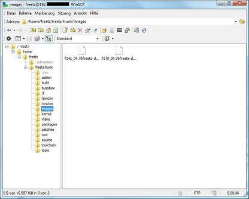
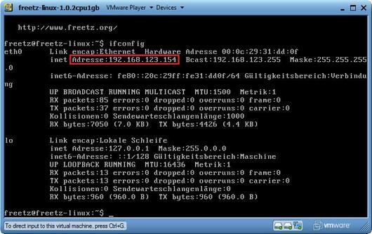
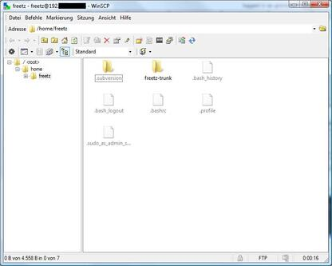
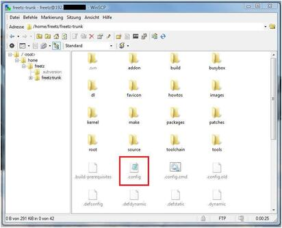

# FAQ

## Produktname und Historisches

### Was ist Freetz?

> *Freetz* ist ein Werkzeugkasten für Entwickler und versierte Anwender,
> um sich für diverse DSL/LAN/WLAN/VoIP-Router der Serien [AVM
> Fritz!Box](http://www.avm.de/de/Produkte/FRITZBox/index.html)
> bzw. [T-Com
> Speedport](http://www.t-home.de/is-bin/INTERSHOP.enfinity/WFS/EKI-PK-Site/de_DE/-/EUR/ViewFAQTheme-Download;?ProductThemeId=theme-1000&selaction=themen&FaqId=theme-28565177&pageNr=0&bound=2&itemLocator=downloads&headerSelection=2&SelectedTheme=theme-28565177&SelectedTheme=theme-2001628)
> (baulich ähnlich) eine auf der Original-Firmware des Herstellers
> aufbauende, funktional modifizierte Firmware zu bauen und diese auf
> das Gerät zu transferieren. Es werden eine Vielzahl von
> Erweiterungspaketen angeboten, aber auch Möglichkeiten, nicht
> benötigte Funktionalität der Original-Firmware zu entfernen.

### Woher kommt der Name Freetz?

> Es handelt sich um eine (verballhornte) Zusammensetzung aus dem
> englischen Wort "free" (dt. frei) und dem Männernamen "Fritz",
> welcher an den Gerätenamen des Herstellers
> [AVM](http://www.avm.de) erinnern soll. Wir
> wollen damit symbolisieren, dass es sich bei *Freetz* um freie
> Software handelt. Da wir marken- und urheberrechtlichen Problemen mit
> AVM, deren Schutzrechte auf die Marke "Fritz!" (mit Ausrufezeichen)
> wir ausdrücklich anerkennen, aus dem Weg gehen möchten, haben wir uns
> für diese deutlich unterschiedliche Schreibweise entschieden. Die Idee
> für den Namen stammt von Alexander Kriegisch, der sich gemeinsam mit
> Oliver Metz überlegte, wie das Projekt heißen sollte, wenn das
> versionsverwaltete Quelltext-Repository der Öffentlichkeit übergeben
> werden würde. Aus der (nach unserem Empfinden bescheuert klingenden)
> Alliteration "Free Fritz" wurde schließlich "Freetz". (Auch
> "OpenFritz" war im Rennen, aber wir wollten nicht
> [OpenWrt](http://openwrt.org) nachäffen.) Wir
> bilden uns nicht ein, der Name sei ein großer Wurf, aber er ist kurz
> und wir hoffen, er ist leicht zu merken. :-)

### Wie wird Freetz ausgesprochen?

> Wie das englische Wort "free" mit angehängtem deutschem "tz",
> pseudo-deutsch geschrieben in etwa "Friez", pseudo-englisch
> geschrieben in etwa "freets". Anders gesagt, wie der Männername
> "Fritz", aber mit langem "i" und mit englisch ausgesprochenem
> "r".

### Wie entstand Freetz?

> Es gibt einige Vorläufer von *Freetz*. Daniel Eiband (bekannt als
> "Danisahne") hat vor einigen Jahren, aufbauend auf Vor- und
> Zuarbeiten anderer kreativer Köpfe (Erik Andersen, Christian Volkmann,
> Andreas Bühmann, Enrik Berkhan u.a.), den sog. *Danisahne-Mod* (kurz:
> *DS-Mod*) ins Leben gerufen. So wie heute mit *Freetz*, konnte und
> kann man auch damit Firmware-Modifikationen bauen, allerdings noch für
> ältere Firmware-Versionen mit Linux-Kernel 2.4. Da einige Router noch
> immer auf Kernel 2.4 basierende Firmwares haben, ist Version
> [ds-0.2.9-p8](http://www.ip-phone-forum.de/showthread.php?t=135253)
> des *DS-Mod* für jene Geräte immer noch aktuell. Für die Mehrzahl
> aktueller Geräte war der direkte Vorläufer zu *Freetz* jedoch die von
> Oliver Metz ins Leben gerufene Version *ds26* (zuletzt
> [ds26-15.2](http://www.ip-phone-forum.de/showthread.php?t=144646)),
> welche ausschließlich für Firmwares mit Kernel 2.6 geeignet ist.
> Selbiges gilt auch für *Freetz*, denn *Freetz* ist Stand heute
> (20.01.2008) nichts anderes als die aktuelle Entwicklerversion von
> *ds26*, nur mit neuem Namen.

### Wozu überhaupt ein neuer Name, wo doch DS-Mod inzwischen so bekannt ist?

> Es gibt mehrere Gründe dafür. Zum einen ist seit gut einem Jahr Daniel
> nicht mehr aktiv an der Weiterentwicklung von *ds26* beteiligt
> gewesen, zum anderen hat er bei
> [SourceForge](http://sourceforge.net) schon etwa
> ebenso lange begonnen, eine von Grund auf neue *DS-Mod*-Version -
> nennen wir sie mal inofiziell *DS-Mod NG (Next Generation)* - zu
> entwickeln, deren aktueller Stand in einem öffentlich zugänglichen
> Quellcode-Repository auf der
> [Projekt-Webseite](http://ds-mod.sourceforge.net)
> einzusehen ist. Wir wollen Daniel seinen Projektnamen nicht streitig
> machen und auch nicht in Konkurrenz zu ihm treten, sondern hoffen im
> Gegenteil, dass er eines Tages wieder mehr Zeit für sein Projekt haben
> wird und schlußendlich beide wieder in ein gemeinsames münden, um alle
> Vorteile in einem Produkt zu vereinen. Zurzeit ist es jedoch so, dass
> beide Projekte sich deutlich auseinander entwickelt haben: *DS-Mod NG*
> hat eine sehr saubere Struktur, ist jedoch noch lange nicht fertig,
> *Freetz* (bzw. bisher *ds26*) ist hundertfach im Einsatz und wird eher
> während der laufenden Entwicklung immer wieder mal
> Refactoring-Maßnahmen unterworfen. Wo zuletzt in der Presse (z.B.
> [PC-Welt](http://www.pcwelt.de/start/dsl_voip/dsl/praxis/98946/index3.html))
> vom *DS-Mod* gesprochen wurde, war *Freetz* alias *ds26* gemeint.

## Motivation

### Warum Firmware modifizieren?

> Es können zwar einzelne spezielle Dateien (character devices) unter
> /var/flash/ bearbeitet werden und sie behalten den Inhalt auch über
> einen Reboot hinweg, jedoch trifft das nicht auf den Rest des
> Dateisystems zu. Der Inhalt dieser character devices landet in einer
> eigenen Flash Partition, die sehr klein ist. Der überwiegende Teil des
> Dateisystems ist ein read-only Squashfs Image, welches in einem
> Firmware Update enthalten ist. Um (größere) Dateien dauerhaft in die
> Firmware einzubinden müssen sie in dieses Squashfs Image gelangen,
> welches unter anderem in Freetz implementiert ist.

## Verbreitung

### Warum werden keine fertigen modifizierten Images angeboten?

> Die Lizenz, unter welcher die Firmwares von AVM bereitgestellt werden,
> untersagt dies.

### Wo kann FREETZ heruntergeladen werden?

> Auf der Startseite sind unter Quellcode
> die Möglichkeiten zum Download von FREETZ
> aufgelistet. Es werden sowohl erprobte stabile Versionen von FREETZ
> als auch Entwicklerversionen angeboten. Zum Bauen eines FREETZ-Images
> wird LINUX zwingend vorausgesetzt. Es muss nicht unbedingt ein natives
> Linux-System auf dem PC bereits vorhanden sein. Auch eine Virtuelle
> Maschine eurer Wahl oder eine Live-CD mit Linux können zum Bauen von
> FREETZ benutzt werden.\

### Welche Boxen und welche Firmwares werden durch Freetz unterstützt:

> [Trunk](../../../FIRMWARES)\

## Entwicklung

### Wann kommt Version xy?

> Grundsätzlich: It's done when it's done. Die Entwickler arbeiten in
> ihrer Freizeit, und Releases gibt es dann, wenn die beschlossenen
> Features fertig und release-kritische Bugs behoben sind.

> Es gibt jedoch einen groben Plan für die Releases: 3-4 Monate nach
> einer stabilen Release gibt es einen Feature Freeze für die
> nachfolgende Release. Ab diesem Zeitpunkt werden nur noch Bugs
> behoben. Die Feature-Freeze-Termine werden in der [Roadmap](/roadmap)
> angekündigt. Nach dem Feature Freeze kann grob nach 1 bis 1,5 Monaten
> mit dem Release gerechnet werden. Zwischen den stabilen
> Feature-Releases gibt es ggfs. weitere Maintenance-Releases, die nur
> neue Firmwareversionen von AVM unterstützen und Fehler beheben.

### Trunk, Branches, Tags?

Der Trunk ist der aktuelle Entwicklungszweig.
Unter einem Branch versteht man ein Zweig, der zu einer bestimmten Zeit aus 
dem Trunk abgetrennt wurde. Alle Releaseversionen bekommen einen Tag.
Zukünftig wird das dann der Tag 2.0 werden.\
Auschecken einer stabilen Version:

```
	svn co http://svn.freetz.org/branches/freetz-stable-2.0 freetz-stable-2.0
```

Auschecken eines Tags:

```
	svn co http://svn.freetz.org/tags/freetz-1.2 freetz-1.2
```

Nach Erscheinen des neuen Tag 2.0 wird dieser dann wie folgt
ausgecheckt:

```
	svn co http://svn.freetz.org/tags/freetz-2.0 freetz-2.0
```

Auschecken einer Entwicklerversion (trunk):

```
	svn co http://svn.freetz.org/trunk freetz-trunk
```

Achtung! Die Entwicklerversion (trunk) ist nur für fortgeschrittene
Benutzer zu empfehlen, die mit Linux-Grundlagen vertraut sind, sich bei
elementaren Problemen selbst helfen können und den Entwicklern einen
qualitativen Feedback geben können. Da es sich hierbei um eine laufende
Entwicklung handelt, ist die Stabilität der Entwicklerversion meist
nicht so hoch, wie bei Branches und Tags.

### Wann ist Feature XY fertig?

> Der schnellste Weg zur Fertigstellung ist die Präsentation einer
> funktionierenden Lösung. Wir notieren uns jedes sinnvoll erscheinende
> Feature Request. Da wir Freetz aber in unserer Freizeit gestalten,
> muss man sich halt manchmal gedulden.

### Freetz gefällt mir und ich möchte die Weiterentwicklung unterstützen.

> Hier gibt es einmal die Möglichkeit dem Entwicklerteam eine Geldspende
> zukommen zu lassen. Dazu ist in der rechten untern Ecke ein
> PayPal-Spendenbutton angebracht. Weiterhin kann eine Box natürlich
> besser unterstützt werden, wenn das Entwicklerteam "Testboxen"
> besitzt. Im
> [IPPF](http://www.ip-phone-forum.de/showpost.php?p=959253&postcount=1)
> existiert ein Thread zum Thema Spenden.

## Vorkonfiguration (menuconfig)

### Wie erkennne ich welche Variante der 7270 ich besitze?

> Siehe Fritz-FAQ.

### Welche Pakete sollte man ins Freetz Image sinnvollerweise einbauen?

> Sinnvoll ist Dropbear um später einen SSH Zugang zu haben, dnsmasq als
> DNS- und DHCP-Server Ersatz, sowie das Syslog-Webif um Fehler zu
> erkennen.

### Was bedeutet "binary only"?

> "binary only" heißt, dass für das ausgewählte Paket nur das Programm
> ("binary") selbst erstellt wird, jedoch kein Webinterface,
> init-Skripte etc. vorhanden sind. Dies bedeutet, dass man sich selbst
> um die Konfiguration und das Starten des Programms kümmern muss.

### Was bedeutet "EXPERIMENTAL" oder die Kategorie "unstable"?

> Die so gekennzeichneten Pakete haben bekannte Probleme und
> können/sollten nicht benutzt werden. Evtl gibt es dazu noch ein
> offenes [Ticket](/report/9)

### Funktioniert iptables/nat/conntrack?

> IPtables funktioniert überall. Allerdings wird in Fritz!OS 05.2x und
> 05.5x von AVM der PacketAccelerator genutzt. Durch diesen funktioniert
> conntrack nicht mehr. Und damit nat/masquerading/state/transparenter
> Proxy und alles was sonst noch von conntrack abhängt.\
> Abhilft schafft ein Downgrade auf eine alte Firmware, zB bei der 7270
> ein "Alien" mit 04.88 oder gleich Freetz-1.2.\
> Da AVM den Quellcode des PacketAccelerator veröffentlicht hat, könnte
> das Problem von jemandem mit viel Zeit und Wissen behoben werden.\
> Das Thema wird in Ticket
> Ticket #1605
> behandelt, und so lange das Ticket noch nicht geschlossen ist
> besteht das Problem.\

### Packet Accelerator (AVM PA)

Der Packet Accelerator bringt auch den Nachteil mit sich, dass tcpdump
etc nicht mehr alle Pakete sehen. Um den PA bis zum nächsten Reboot
temporär zu deaktivieren:\
`echo disable > /proc/net/avm_pa/control`\
Dies bringt den Nachteil mit sich, dass zB die 7390 keine 100 MBit/s
mehr im ATA-Modues routen kann sondern nur noch \~ 40 MBit/s. Siehe auch
"Funktioniert iptables/nat/conntrack?" in der FAQ.html

### Was bedeutet "not available, no sources by AVM"?

> Die für diese Firmware passenden Kernelquellen wurden noch nicht in
> Freetz integriert. Meist ist die Ursache dafür, dass AVM diese noch
> nicht veröffentlicht hat. Typischerweise dauert es wenige Tage bis
> mehrere Monate. Falls die Datei für die entsprechende FritzBox
> mittlerweile auf
> [ftp://ftp.avm.de/](ftp://ftp.avm.de/)
> veröffentlicht wurde, ein Ticket dafür öffnen. Um den Vorgang zu
> beschleunigen empfiehlt sich, wie in den
> [info.txt](ftp://ftp.avm.de/fritz.box/fritzbox.fon_wlan_7390/firmware/deutsch/info.txt)
> beschrieben, schriftlich an AVM zu wenden: `fritzbox_info@avm.de`.

## Erstellen von Firmware-Images (make/Build)

### Was bedeuten die einzelnen make-targets (z.B. dirclean, distclean, config-clean-deps etc.)?

A: Die make-targets beeinflussen den Build-Prozess bei der
FW-Erstellung. Viele der folgenden Infos entstammen ([diesem
Thread](http://www.ip-phone-forum.de/showthread.php?p=1185868)).

**1. Aufräumen:**

-   *make clean\
    *...


-   *make \<Paket\>-clean*:\
    ruft normalerweise das clean-Target des Source-Makefiles auf. Dieses
    wird typischerweise alle generierten Dateien (vor allem
    Object-Dateien, Libraries und ausführbare Programme) löschen.\
    Ein nachfolgendes *make* wendet keine geänderten Patches an, sondern
    erstellt nur die o.g. Object-Dateien, Libraries und ausführbare
    Programme neu (compilieren).\
    Z.B. räumt *make mc-clean* so das Paket "Midnight Commander" (mc)
    auf.


-   *make \<Paket\>-dirclean*:\
    löscht das gesamte Verzeichnis des Pakets. Ein nachfolgendes *make*
    wird die Quellen neu auspacken, die Patches anwenden, das Paket
    konfigurieren und dann compilieren.\
    Nur der letzte Schritt (compilieren) wird nach *make
    \<Paket\>-clean* (s.o.) ausgeführt.


-   *make dirclean*:\
    führt, wie der Name schon sagt, ein "Verzeichnis-Aufräumen" durch.
    Hierbei werden unter anderem die Verzeichnisse */packages, /source,
    /build, /toolchain/build, toolchain/target* (und ein paar andere
    Sachen(?)) gelöscht, sodass bei erneutem Ausführen von *make* alles
    neu gebaut werden muss. Dies ist empfehlenswert, wenn sich Aufgrund
    eines *svn up* eine neu gebaute Firmware nicht so Verhält, wie man
    es erwartet. Alternativ kann man, wenn man weiß, an welchem Packet
    es liegt, dieses auch via *make \<Paket\>-dirclean* einzeln löschen
    (siehe oben).\
    Zu erwähnen sei noch, dass nach einem *make dirclean* der Bau der
    Firmware natürlich länger dauert, da ja alles neu gebaut werden
    muss.


-   *make tools-distclean*:\
    löscht die Tools (busybox, lzma, squashfs, usw.)


-   *make distclean*:\
    Hier werden zusätzlich zum *make dirclean* auch noch die Downloads
    sowie die Tools gelöscht.


-   *make config-clean-deps*:\
    Wenn bei *make menuconfig* Pakete abgewählt wurden, sind ggfs. noch
    Shared Libraries ausgewählt, die nicht mehr benötigt werden (dies
    kann *menuconfig* nicht automatisch erkennen). Diese kann man dann
    manuell unter 'Advanced Options'→'Shared Libraries' abwählen -
    die benötigten lassen sich nicht deaktivieren. Alternativ kann man
    dies automatisch mittels *make config-clean-deps* erledigen lassen.
    Dabei werden übrigens auch manuell in *make menuconfig* ausgewählte
    Busybox-Applets deselektiert (\*nicht\* die in *make
    busybox-menuconfig*!), d.h. die Busybox-Einstellungen werden auf
    Standardwerte zurückgesetzt.


-   *make config-clean-deps-keep-busybox*:\
    Wie *make menuconfig*, aber die Busybox-Einstellungen bleiben
    bestehen.


-   *make kernel-dirclean*:\
    löscht den aktuell entpackten Source-Tree des Kernels, um von
    komplett sauberen Kernel Sourcen zu kompilieren (wichtig wenn was an
    den Patches geändert wird)


-   *make kernel-clean*:\
    analog *make \<Paket\>-clean*


-   *make kernel-toolchain-dirclean*:\
    löscht den Kernel-Compiler


-   *make target-toolchain-dirclean*:\
    löscht den Compiler für die uClibc und die Binaries (ausführbare
    Programme)

**2. Vorbereitungen:**

-   *make world*:\
    Vorraussetzung ist eine Toolchain (siehe "Cross-Compiler / Toolchain 
    erstellen".
    Sollten jemals Probleme mit nicht vorhandenen Verzeichnissen
    auftauchen, so kann ein *make world* Abhilfe schaffen. In der Regel
    sollte das aber nicht nötig sein.


-   *make kernel-toolchain*:\
    kompiliert den Kernel und auch für das target (Fritzbox)\
    Aus historischen Gründen wurde die Bezeichnung als
    *kernel-toolchain* belassen, obwohl damit wie gesagt nicht nur der
    Kernel gebaut wird, sondern auch Pakete (s.u.).


-   *make target-toolchain*:\
    kompiliert die Pakete für das target (Fritzbox)


-   *make kernel-menuconfig*:\
    Die Konfiguration des Kernels wird danach wieder nach
    ./make/linux/Config.\<kernel-ref\> zurückgespeichert.


-   *make kernel-precompiled*:\
    Damit werden der Kernel und die Kernel Module kompiliert.


-   *make menuconfig*
    Zum Konfigurieren von Freetz kommt das Programm *conf/mconf* zum
    Einsatz, welches dem ein oder anderen vielleicht von der
    Konfiguration des Linux Kernels bekannt ist. Die ncurses
    Variante *mconf* kann mit dem Kommando *make menuconfig* aufgerufen
    werden.\
    Übrigens:\
    Eine Hilfe zu den einzelnen Punkten kann direkt in *menuconfig*
    durch Eingabe von "?" aufgerufen werden.\
    Und nach Eingabe von "/" kann man von allen Ebenen aus nach
    beliebigen Zeichenfolgen suchen - sehr praktisch.

### Beim Erstellen tritt ein Fehler auf, was nun?

> Zunächst einmal die folgende Liste der häufigen Fehler durchgehen:

#### You must have either have gettext support in your C library, or use the GNU gettext library.

> Hier ist wohl ein falscher Wert im Cache gelandet, den man löschen
> muss: "rm make/config.cache" oder "rm
> source/target-mipsel_uClibc-*0.X.XX*/config.cache" jenachdem, wo die
> Datei zu finden ist. Und danach wird der FW-Bau wieder mit "make"
> gestartet.

#### ERROR: The program/library/header xy was not found...

> Wenn mit die ersten Meldungen so aussehen, fehlen für die Erstellung
> von Freetz unbedingt notwendige Pakete im Build-System und müssen
> zunächst installiert werden.

#### WARNING: The program/library/header xy was not found...

> Wenn die Erstellung mit einem Fehler abbricht, kann diese Warnung zu
> Beginn des Vorgangs darauf hindeuten, dass für bestimmte ausgewählte
> Optionen notwendige Pakete im Build-System fehlen.

#### Could not download firmware image

##### (ehemals: No such file \`FRITZ.Box_xxxxxxxxx.aa.bb.cc.image')

> AVM selbst stellt für einen Box-Typ meist nur das aktuellste
> Firmware-Image zum Download bereit. Jede
> Freetz-Version unterstützt lediglich nur die Versionen, die in der
> Datei `FIRMWARES` aufgelistet sind. Aus lizenzrechtlichen Gründen darf
> das Freetz-Projekt keine AVM-Firmwares bereitstellen.\
> Anbei Lösungsvorschläge:

-   Allgemeiner Hinweis: Im
    [Suche-Firmware-Sammelthread](http://www.ip-phone-forum.de/showthread.php?t=119856)
    kann man nach älteren Firmware-Versionen fragen (das Firmware-Image
    manuell in den Ordner `'dl/fw/'` im Freetz-Verzeichnis kopieren).
-   Experimentierfreudige User: In "make menuconfig" unter
    *Advanced Options ⇒ Override firmware source* den Namen der
    herunterzuladenen Image Datei anpassen.\
    ! Vorsicht:
    Evtl. sind weitere Anpassungen im Quellcode notwendig und zur
    Sicherheit ein passendes Recover-Image bereit halten.

#### Please copy the following file into the 'dl/fw' sub-directory manually: fritz_box_aa_bb_cc-ddddd.image

> Die Labor-Firmwares können nicht direkt vom AVM-FTP-Server
> heruntergeladen werden. Sie müssen manuell von der
> [AVM-Labor-Seite](http://www.avm.de/Labor)
> geladen werden, wobei die Nutzungsbedingungen zu bestätigen sind. Die
> Dateien müssen dann entpackt und das darin enthaltene Image in den
> Ordner 'dl/fw' im Freetz-Verzeichnis kopiert werden. Hierbei gilt
> auch das zur vorigen Frage Gesagte.

#### ./ln: cannot execute binary file

> Das aktuelle Verzeichnis '.' ist im Pfad (Variable PATH). Zum
> erfolgreichen Erstellen muss es entfernt werden.

#### Filesystem image too big

> Das Firmware-Image passt nicht in den Flash-Speicher der ausgewählten
> Box.

-   Bei manchen Boxen kann dies bereits auftreten, wenn überhaupt keine
    zusätzlichen Pakete ausgewählt sind, da die grundlegende
    Freetz-Infrastruktur bereits einigen Platz belegt und die AVM-Images
    schon knapp unter dem Maximalwert liegen. In diesem Fall ist es
    notwendig, unter 'Patches' einen oder mehrere der Remove-Patches
    auszuwählen, um nicht benötigte Komponenten der Original-Firmware zu
    entfernen. Näheres dazu im
    [IPPF](http://www.ip-phone-forum.de/showthread.php?t=136974)
    und in
    [WIKI](http://wiki.ip-phone-forum.de/software:ds-mod:development:platz_sparen)
-   Wenn viele Pakete ausgewählt sind, sollte man sich beschränken oder
    versuchen per USBRoot oder
    NFSRoot die Beschränkung des Flashs zu umgehen.
-   Bei Boxen mit einem USB-Host (z.B. 7170,7270) kann man außer
    USBRoot auch einzelne Pakete auf das
    externe USB-Medium (z.B. USB-Stick, USB-Festplatte) auslagern. Die
    Auslagerung wird nach dem make-Prozess automatisch von einem Skript
    namens "external"
    ausgeführt. Im menuconfig finden sich die Optionen für die
    Auslagerung mittels external. Im Unterschied zum USB-Root wird hier
    nicht die gesamte Firmware, sondern nur ein Teil der Pakete
    ausgelagert.
-   Wenn Pakete abgewählt wurden, sind ggfs. noch Shared Libraries
    ausgewählt, die nicht mehr benötigt werden (dies kann menuconfig
    nicht automatisch erkennen). Diese kann man dann manuell unter
    'Advanced Options'→'Shared Libraries' abwählen - die auf
    benötigten lassen sich nicht deaktivieren. Alternativ kann man dies
    automatisch mittels *make config-clean-deps* bzw. *make
    config-clean-deps-keep-busybox* erledigen lassen.

#### WARNING: Not enough free flash space for answering machine!

> Im Gegensatz zur Meldung "Filesystem image too big" passt das
> Firmware-Image in den Flash-Speicher der ausgewählten Box, der
> restliche Platz im Flash könnte aber für die Aufzeichnung von
> Nachrichten auf dem von AVM in der FW integrierten Anrufbeantworter zu
> klein sein oder komplett fehlen. Die Firmware sollte trotz dieser
> Warnung funktionieren, für Anrufbeantworter-Daten, FAX-Nachrichten und
> Sonstiges empfiehlt sich einen Stick mit einer FAT-Partition anzulegen
> und entsprechend in AVM-WebIF angeben, dass der Anrufbeantworter (oder
> andere Dienste) den externen Speicher nutzen sollten.

> Hintergrundinformationen: Seit einigen Firmware-Versionen versucht AVM
> die restlichen Bytes im Flash dafür zu nutzen, eine jffs2-Partition
> anzulegen. Auf dieser Partition werden z.B.
> Anrufbeantworter-Nachrichten (TAM) und evtl. noch Faxe und Ähnliches
> abgespeichert. Bei älteren Boxen (z.B. 7170) kommt es fast immer dazu,
> dass im Image kaum mehr Platz frei ist, sodass die jffs2-Partition
> nicht angelegt wird und die Meldung nur als Warnhinweis angesehen
> werden sollte. Mehr dazu im
> [IPPF-Thread](http://www.ip-phone-forum.de/showthread.php?t=186208).
> In FREETZ seit Revision
> [r3049](https://trac.boxmatrix.info/freetz-ng/changeset/3049).

### Beim Erstellen tritt immer noch ein Fehler auf...

> Zunächst einmal im menuconfig unter 'Advanced Options' das
> 'Verbosity Level' auf 2 stellen und das make erneut ausführen.
> Danach im [IPPF
> Forum](http://www.ip-phone-forum.de/forumdisplay.php?f=525)
> nach der relevanten Fehlermeldung suchen und ggfs. einen passenden
> bestehenden oder neuen Thread aufmachen, wo dann unter Angabe der
> kompletten Fehlermeldung (bitte in Code-Tags), der Datei .config (als
> Attachment) und der verwendeten Version oder SVN-Revision um Hilfe
> bitten.

### Ich kann das erzeugte Freetz Image nicht finden?

> Freetz verschiebt alle fertigen Images in den Unterordner *images/*.

[](../../screenshots/116.jpg)

### Wo finde ich diese berühmte .config-Datei?

> Die .config Datei beinhaltet die Hauptkonfiguration für den
> make-Aufruf beim Cross-Kompilieren der Firmware und liegt genau auf
> der Maschine die zur Erzeugung der Firmware verwendet wird und exakt
> im selben Hauptverzeichnis von FREETZ, von dem auch make ausgeführt
> wird. In der Datei steht z.B. welche Pakete/Branding/Libs usw. man
> ausgewählt hat. Die Datei .config ist eine reine Textdatei und wird
> typischerweise nach dem Aufruf von menuconfig automatisch angelegt
> bzw. aktualisiert. Bitte diese Datei nicht mit Config.in verwechseln!
> (häufiger Fehler) Wenn man die Datei nicht sehen kann, liegt es daran,
> dass sie ein "dot" an der ersten Stelle hat und somit versteckt ist.

> Alternativ kann man die Datei auch im selbsterzeugten Firmware-Image
> finden, denn .image-Dateien sind nichts anderes als gewöhnliche
> tar-Archive, die z.B. mit WinRAR oder 7Zip ausgepackt werden können.

> Neuerdings wird die .config-Datei auch mit ins Image genommen (wenn
> man es nicht explizit abwählt) und befindet sich in einer
> komprimierten Form auf der Box. Die Datei kann über das FREETZ-WebIF
> angesehen und sogar herunterladen werden. Zu finden ist die Datei
> unter Status→FREETZ-Info.

### Wie bekomme ich die .config-Datei auf den PC?

> Die .config bekommt man sehr einfach mit der
> [WinSCP-Software](http://winscp.net/eng/download.php)
> auf den PC kopiert.

Zuerst müsst Ihr euch den
[WinSCP](http://winscp.net/eng/download.php) auf
den PC installieren und dann starten. In der Startmaske gebt Ihr
folgende sachen ein (siehe Bild):

[](../../screenshots/110.jpg)

Die benötigte IP-Adresse eurer Freetz-Buildumgebung erhaltet Ihr wenn
ihr folgenden Befehl in der Konsole eingebt: **ifconfig**

[](../../screenshots/114.jpg)

**Benutzername** und **Kennwort** sind wie gewohnt **freetz freetz** Als
Protokoll nutzt ihr **FTP (Keine Verschlüsselung)** Wenn Ihr nun auf
**Anmelden** drückt sollte folgendes Bild zu sehen sein:

[](../../screenshots/115.jpg)

Als nächstes wechseln wir in das Hauptverzeichnis von FREETZ (im
Beispiel ist das **freetz-trunk**).

[](../../screenshots/111.jpg)

Dort makieren wir die gesuchte .config mit der Mause und öffnen das
Kontext-Menu mit der rechten Maustaste und drücken auf kopieren:

[](../../screenshots/112.jpg)

Im nächsten Fenster wählen wir nur noch das Zielverzeichnis auf dem PC
aus und drücken auf **Kopieren**.

[](../../screenshots/113.jpg)

Jetzt solltet Ihr die **.config** auf eurem PC finden.

## Flashen des Firmware-Images

### Wie installiere ich das Freetz-Image?

**Wenn noch eine Original-AVM-Firmware installiert ist, ...**

gibt es zwei Möglichkeiten:

-   die normale Installation über das AVM-Webinterface (wie gewohnt beim
    Update)
-   das Script tools/push_firmware.sh (befindet sich im Freetz
    Build-Verzeichnis - also z.B. unter "freetz-1.1.4"). Hiermit lässt
    sich auch bei den Speedports Freetz installieren, was über das
    Webinterface nicht so einfach möglich ist [Unterpunkt:
    "Hochladen per
    Weboberfläche"](http://www.ip-phone-forum.de/showthread.php?t=172137)

**Wenn bereits Freetz auf der Box ist, ...**

-   ist die bequemste Variante das Firmware-Update über die
    Freetz-Webinterface-Startseite. Dabei können bei Bedarf auch die
    AVM-Dienste weiterlaufen (Internetverbindung bleibt somit bestehen)
    oder können Angehalten werden, um den zusätzlichen Platz im RAM zu
    gewinnen. Das Gute an dieser Methode ist, dass man nach dem Upload
    des Images einen ausführlichen Bericht zu sehen bekommt und
    anschließend den Zeitpunkt des Reboots (und somit des eigentlichen
    Updates) manuell festlegen kann.

Grundsätzlich sei gesagt, dass für diese Funktion freetz bereits auf der
Box laufen muss.

> Sowohl die .image-datei als auch die .external-Datei, soweit diese
> erstellt wurde, lassen sich mit einem einzigen Rebootvorgang auf die
> Box laden.\
> Dabei ist folgendes Vorgehen zu empfehlen:

-   Die .external-Datei hochladen. Es wird automatisch versucht alle
    Programme die schon ausgelagert wurden zu beenden. Sollte ein Fehler
    auftreten, bitte vorher händisch alle Programme beenden.
    Hintergrund: Beim Upload-Vorgang wird der Inhalt der alten mit der
    neuen .external überschrieben.
-   Die .image-Datei hochladen.
-   Box-Reboot anstoßen

### Beim Flashen meldet das AVM-Webinterface, dass das Image keine passende Firmware enthält

> Das in der Box (im Urlader) eingestellte Branding muss auch in der
> verwendeten Firmware enthalten sein. Also bitte mal prüfen, ob das der
> Fall ist und ggfs. das Image mit dem richtigen Branding neu erstellen.

### Freetz-Trunk wurde per AVM Firmware-Update geflasht, nach dem Neustart scheint sich aber nichts geändert zu haben

> Sollte nach dem Flashen von Freetz per Firmware-Update über das
> AVM-Webinterface und dem nachfolgenden Neustart das
> Freetz-Webinterface auf Port 81 nicht zur Verfügung stehen und sich
> auch die Firmware-Version im AVM-Webinterface nicht geändert haben, so
> war vermutlich das Flashen nicht erfolgreich. Ein deutlicher Hinweis
> darauf ist, wenn der Neustart der Box sehr schnell geht. Je nach
> Modell der Box und Größe der Firmware kann das Flashen ein bis zwei
> Minuten dauern und in dieser Zeit blinkt eine Kontroll-LED an der Box,
> genauso wie bei einem normalen Firmware Update. Ursache hierfür ist
> vermutlich ein Mangel an freiem Arbeitsspeicher auf der Box während
> dem Update.

Dann können folgende Schritte ggf. Abhilfe schaffen:

-   Zunächst ein Image ohne irgendwelche Pakete erstellen (was sowieso
    empfohlen wird) und ggf. durch Remove-Patches die Größe weiter
    reduzieren.
-   Alternativ die letzte Stable-Version oder eine andere ältere (und
    hoffentlich kleinere) Version runterladen und kompilieren.
-   Diese Version dann über das AVM-Webinterface flashen und die Box
    neustarten.
-   Dann das gewünschte Image über das Freetz-Webinterface (Port 81)
    flashen und auswählen, dass die AVM Dienste heruntergefahren werden.
-   Nach dem Flash-Vorgang im angezeigten Log überprüfen, ob der Vorgang
    erfolgreich war, und die Box über das Freetz-Webinterface
    neustarten.
-   Danach sollte das gewünschte Image erfolgreich geflasht worden sein.

> > Weitere Informationen gibt es
> > [hier](http://www.ip-phone-forum.de/showthread.php?p=1447104)
> > und
> > [hier](http://www.ip-phone-forum.de/showthread.php?t=204328).

## Probleme nach dem (erfolgreichen) Flashen

### Wie lautet das Standard-Passwort für Freetz?

> Das Standard-Passwort für Freetz(sowohl Konsolen- als auch
> Website-Login) lautet 'freetz'. Benutzername für die Konsole ist
> 'root', für das Freetz-Webinterface standardmäßig 'admin'. Beim
> ersten Einloggen per Telnet (user: root) muss das Passwort geändert
> werden. Im Webinterface erscheint ein Hinweis, falls das
> Standardpasswort gesetzt ist. Ändert das Passwort bitte zu eurer
> eigenen Sicherheit.

### Nach dem Flashen ist das AVM-Webinterface nicht mehr erreichbar

> Wenn im Image (z.B. wegen OpenVPN) die OpenSSL-Libraries eingebaut
> wurden, gibt es Probleme mit TR069. Es ist dann erforderlich entweder
> auf OpenSSL-Libs zu verzichten, sie statisch mit in die jeweiligen
> Pakete einzubauen (Speicherverschwendung), TR069 zu deaktivieren
> (funktioniert nur bei älterer Firmware) oder per patch **[TR069
> komplett zu entfernen**
> (funktioniert auch bei aktueller Firmware).

> Zum Deaktivieren von TR069 muss die Datei /var/flash/tr069.cfg mittels
> nvi, nmcedit oder nnano editiert werden. So sollte es aussehen:
>
> ```
>	 # cat tr069.cfg
>	 /*
>	 * /var/flash/tr069.cfg
>	 * Sun Sep 8 14:03:34 2002
>	 */
>
>	 tr069cfg {
>	 enabled = no;>
>	 igd {
>	 ...
> ```

> Bei neueren Firmwares reicht es nicht mehr aus TR069 zu deaktivieren.
> Hier crasht der ctlmgr auch bei anderen Aktionen beim Zugriff auf die
> OpenSSL-Libs. Manchmal schafft das Ersetzen der libavmhmac (im
> menuconfig unter Advanced Options→Shared Libraries→Crypto &
> SSL→Replace libavmhmac) Abhilfe, aber auch das reicht bei neuesten
> Firmwares nicht aus und führt eventuell zu Reboot Schleifen. Unter
> Umständen funktionieren danach auch nicht mehr alle Funktionen, wie
> z.B. die FritzMini Unterstützung, das Fritz-App von AVM, u.s.w.

> Um heraus zu finden, ob die problematischen OpenSSL-Libs ins Image
> eingebunden werden, kann man folgenden Befehl ausführen:
>
> ```
>	 oliver@ubuntu:~/fritzbox/freetz/trunk$ grep -E  "libssl|libcrypto" .config
>	 FREETZ_LIB_libcrypto=y
>	 FREETZ_LIB_libssl=y
> ```

> Es folgt eine Liste mit Paketen die die OpenSSL-Libs benötigen, manche
> auch nur optional: *bip, curl, dropbear mit sftp-Support, mcabber,
> netsnmp, OpenVPN, Tor, transmission, Vsftpd und wget*

> Man kann die betroffenen Pakete statisch zu bauen (d.h. ohne externe
> OpenSSL-Libs). Dies ist bereits für einige Pakete möglich, wie z.B.
> OpenVPN und CURL. Man muss allerdings beachten, dass Binaries dadurch
> sehr gross werden, weil die OpenSSL-Libs dann ein Teil des statischen
> Binary sind. In diesem Fall ist es anzuraten solche Pakete mit
> "external" auszulagern, was
> aber am höheren Speicherbedarf im Betrieb nichts ändert. Auch wenn
> eigentlich kein Paket mehr die OpenSSL-Libs benötigt, kann es sein,
> dass diese immer noch ins Image gepackt werden. Das kommt daher, dass
> menuconfig eine automatische Abwahl nicht unterstützt. Hierfür gibt es
> den Befehl *make config-clean-deps* bzw. *make
> config-clean-deps-keep-busybox*.
>
> ```
>	 oliver@ubuntu:~/fritzbox/freetz/trunk$ make config-clean-deps
>	 Step 1: temporarily deactivate all kernel modules, shared libraries and optional BusyBox applets ... DONE
>	 Step 2: reactivate only elements required by selected packages ... DONE
>	 The following elements have been deactivated:
>	   FREETZ_BUSYBOX_BRCTL
>	   FREETZ_LIB_libcrypto
> ```

> Vorsicht: Wie im Beispiel zu sehen werden hierbei auch Optionen
> deaktiviert die absichtlich gewählt aber nicht per default aktiviert
> sind.

### Nach dem Flashen ist die Box nicht mehr erreichbar und/oder rebootet ständig

> Dies kann unterschiedlichste Gründe haben. Zuerst sollte man die Box
> vom DSL trennen und neustarten. Tritt das Problem dann nicht mehr auf
> hat man höchst wahrscheinlich einen **Konflikt mit TR069**.

> Wenn das nicht half lässt sich das Problem durch Einspielen einer
> anderen Firmware in der die problematische Funktion nicht enthalten
> ist eingrenzen. Grundsätzlich wird dies natürlich bei den
> Original-Firmwares von AVM der Fall sein; man kann aber auch durch
> Deaktivieren von Optionen und Neuerstellen von Freetz ausprobieren,
> woran es liegt. Da das Webinterface nicht mehr erreichbar ist, muss
> ein Update auf andere Weg erfolgen. Hier gibt es drei Möglichkeiten:

-   Das Script tools/push_firmware.sh. Hiermit lassen sich beliebige
    Images einspielen.
-   Ein Recover-Image von AVM. Dieses spielt wieder eine
    Original-Firmware von AVM ein.
-   Update über das Freetz Interface falls nur das AVM Interface nicht
    erreichbar ist (häufig bei TR069 Konflikten).

### Beim Aufruf des Original-AVM-Webinterface von aussen bekomme ich trotz Portweiterleitung nur eine weisse Seite?

> Dies ist ein 'Sicherheitsmechanismus' von AVM der offensichtlich
> überprüft ob der Hostname unter dem die Box aufgerufen wurde per
> Reverse-DNS Anfrage zur Box führt. Hierbei werden sowohl die internen
> Hostnamen akzepriert wie fritz.box oder fritz.fonwlan.box als auch der
> DynDNS Hostname oder eigene (zb mit dnsmasq) vergebene Namen. Löst der
> Name falsch auf wird eine leere Seite gezeigt. Dies ist z.B.
> grundsätzlich bei Remote Zugriff auf Boxen im IP-Client Modus der Fall
> da hier die Box den DynDNS Hostnamen und die externe IP nicht kennt.
> Das Problem tritt aber auch auf wenn die IP der Box und eventuelle
> Aliase in der exhosts Datei nicht übereinstimmen (manchmal ein
> nützlicher Hinweis).

> Es gibt (mindestens) 2 Möglichkeiten diese Probleme zu umgehen:

-   Schnell: Man kann eine Browser Erweiterung installieren, welche es
    erlaubt, den 'HTTP_REFERER' zu unterdrücken.
-   Komfortabel: Man startet zb mit 'Putty Portable' einen Dynamischen
    SSH Tunnel nach Hause (zu localhost) den man im Browser als Socks5
    Proxy mit entfernter DNS Auflösung einträgt und nutzt seine LAN
    internen Hostnamen (auch die von dnsmasq) und IPs. Dies hat den
    Vorteil das man nur einen SSH port nach aussen freigeben muss um
    Zugriff auf alle TCP basierten Dienste aller Geräte zu Hause zu
    haben - egal ob HTTP, HTTPS oder FTP und auf welchem Port. Auch
    funtionieren alle LAN internen Bookmarks wie zu Hause. Um bequem
    zwischen direktem und Proxy Zugriff umschalten zu können hilft zb.
    der Firefox Plugin 'FoxyProxy' der sich auch auf 'Firefox
    Portable' installieren lässt. Wenn man dann noch über HTTPS seine
    Box(en) administriert ist die Verbindung auch lokal auf Gastsystemen
    nicht abhörbar. Dieses Verfahren funktioniert super mit dropbear als
    server. Der ssh client von dropbear unterstützt dagegen leider keine
    dynamischen Tunnels, wohl aber jeder Linux OpenSSH client.

### Kann man Pakete/Patches nachinstallieren, ohne das FREETZ-Image neu zu erstellen?

> Nein, das ist im Normalfall und ohne Weiteres nicht möglich. Nach
> einer Veränderung der Konfiguration unter "menuconfig" sollte
> typischerweise ein "make" ausgeführt werden, welches als Ergebnis
> ein neues Image liefern soll. Dieses Image muss dann über
> Firmware-Update auf die Box gebracht werden, wenn man seine Änderungen
> auf der Box haben will. Einer der Gründe dafür ist das spezielle
> Dateisystem im Flash-Speicher der Box. Dieses Dateisystem ähnelt einer
> Archivdatei, ist sehr stark komprimiert und speziell für
> Flash-Speicher optimiert. Änderungen in einem solchen Dateisystem sind
> jedoch immer mit einer neuen Rearchivierung verbunden und erfordern
> somit den Neuaufbau des kompletten Systems.

> Es gibt jedoch Ausnahmen aus dieser Regelung:

-   external. Man kann nur
    die Binaries der ausgelagerten Pakete neu kompilieren. Somit kann
    man z.B. ein Paket updaten, ohne ein neues Image zu erstellen. Diese
    Methode ist allerdings sehr riskant, weil external typischerweise
    nicht alle Dateien auslagert. Somit läuft man immer Gefahr
    Versionsunterschiede zwischen den ausgelagerten und fest
    integrierten Inhalten desselben Pakets zu bekommen.
-   USB-ROOT. Hier könnte man wenigstens theoretisch das komplette
    Dateisystem (typischerweise ext2) "on the fly" ändern und braucht
    dafür kein Firmwareupdate. Allerdings wird auch hier dringend
    empfohlen das USB-ROOT-System grundsätzlich als "read-only" zu
    mounten und nur bei Bedarf (z.B. fürs Update) es kurzzeitig
    beschreibbar zu machen.\

### Nach dem Flashen ist das Freetz-Webinterface nicht (mehr) erreichbar

> Bei der Firmware XX.05.05 (7240, 7270 V2, 7270 V3 und 7390) belegt ein
> AVM Daemon (contfiltd) den vom Freetz Webinterface verwendeten Port
> 81. Um wieder Zugriff auf das Freetz Webinterface zu erhalten ist die
> Kindersicherung im AVM Webinterface zu deaktivieren. Wer dieses
> Feature benötigt sollte das Freetz Webinterfaces auf einen anderen
> Port verlegen. Dies kann über das Webinterface (Freetz→Weboberfläche)
> oder per Kommandozeile (Telnet, SSH) erledigt werden.

### Der dynamische Teil des (AVM-)Webinterface verhält sich nicht wie erwartet

Aktualisiert man die Firmware und macht dabei einen Versionssprung im
AVM Teil (z.B. von 05.05 nach 05.21 bei der 7270v2 oder von einer
Laborversion 05.06 nach 05.21 bei der 7390), kann es vorkommen, dass der
dynamische Teil des Webinterfaces nicht ordnungsgemäß funktioniert (z.B.
JavaScript Fehler "jxl.getFormElements is not a funtion"). Besonders
auffällig ist das unter *Internet→Zugangsdaten*: Wechselt man zwischen
den Zugangsmöglichkeiten, sollte sich die Seite eigentlich dynamisch
(JavaScript) anpassen, tut sie aber nicht. Daher grundsätzlich **nach
einer Firmwareaktualisierung**, und insbesondere wenn das Webinterface
auffällig erscheint, **den Browsercache löschen**!

## Freetz aktualisieren

### Ich habe momentan eine Laborversion installiert. Kann ich Freetz einfach darüber flashen?

Es ist ratsam die Box zunächst zu recovern. Anschliessend den letzten
Finalrelease aufspielen (falls es eine aktuellere Firmware gibt als das
Recovery-Image). Außerdem sollte man insbesondere nach einer
Aktualisierung von einer Laborversion den Browsercache löschen (auch
wenn man die AVM Recovery auf die Box gespielt hat).

**WICHTIG**: Vor dem Recovern (mindestens) die aktuellen Zugangsdaten
bereithalten (alternativ Start-Code). Zugangsdaten findet man als 1&1
Kunde beispielsweise im 1&1 Controllcenter unter "Zugangsdaten".

### Ich habe eine alte Freetz-Firmware auf der Box

#### Update von Freetz-Version XY auf Freetz-Version YZ:

In diesem Fall muss **nur** ein neues Freetz kompiliert / gebaut werden.

#### Wenn AVM eine neue Firmware auf den Markt bringt

In diesem Fall muss Freetz ebenfalls neu gebaut werden, jedoch muss man
eine Freetz-Version benutzen die dieses neue AVM-Firmware bereits
unterstützt. Welche Firmware-Versionen von welcher Freetz Version
unterstützt wird kann man in der FIRMWARES nachlesen.\

Es empfiehlt sich in diesem Fall, Freetz neu auszuchecken und für die
neue AVM Firmware komplett neu zu kompilieren, anstatt eine "alte"
Build-Umgebung wiederzuverwenden (auch *make distclean* oder *make
dirclean* sind unter Umständen nicht so effektiv, wie von vorne
anzufangen).

## Konfiguration

### Wo landen die diversen Konfigurationen auf der Fritzbox?

> Sämtliche Konfigurationen auf der Fritzbox liegen unter /tmp/flash.
> Dies ist zu beachten, wenn man eine Freetz-FW baut, da die
> Konfigurationen damit nicht im festen Firmware-Teil im Image liegen.
> Alles unter /tmp/flash wird daher beim FW-Update auch nicht verändert,
> so dass die diversen Konfigurationen nach einem FW-Update auch
> erhalten bleiben. Wichtig ist, dass man nach Änderungen an
> Konfigurationsdateien unter /tmp/flash noch das Kommando "modsave"
> in der Konsole aufruft, damit sie auch gespeichert werden. Näheres
> dazu folgt weiter unten.

### Konfiguration in der aktuellen Sicherheitsstufe nicht verfügbar!

> Es gibt verschiedene Sicherheitsstufen. Je nach ausgewählter Stufe
> sind nicht alle Konfigurationsdateien änderbar. Um die
> Sicherheitsstufe zu ändern sind folgende Befehle direkt in der Konsole
> der Box per Telnet oder SSH auszuführen (geht leider nicht per
> Rudi-Shell, denn die benötigt selbst eine Sicherheitsstufe "0").

> Ermitteln der aktuellen Sicherheitsstufe (hier: Freetz-1.1.4):
>
> ```
>	 cat /tmp/flash/security
> ```

> **Freetz-1.1.x und älter:**
>
> ```
>	 echo 0 > /tmp/flash/security <--- Bsp. #1: Setzen von Stufe "0" (keine Restriktionen, VORSICHT!)
>	 modsave                      <--- Speichern der neuen Sicherheitsstufe
> ```

> **Ab Freetz-1.2.x und SVN-trunk
> ≥[r3318](https://trac.boxmatrix.info/freetz-ng/changeset/3318):**
>
> ```
>	 echo 1 > /tmp/flash/mod/security <--- Bsp. #2: Setzen von Stufe "1" (Konfigurationsdateien editierbar)
>	 modsave                          <--- Speichern der neuen Sicherheitsstufe
> ```

> Erlaubte Werte mit Erläuterung (Default: 2):
>
> ```
>	 # 0 : no restrictions
>	 # 1 : only configuration files without shell commands might be edited
>	 # 2 : no configuration files might be edited
> ```

### Wie deaktiviere ich das Passwort für die Freetz-Webseite?

> Folgende Befehle auf der Konsole ausführen:
>
> ```
>	 touch /tmp/flash/webcfg_conf
>	 chmod +x /tmp/flash/webcfg_conf
>	 modsave flash
>	 /etc/init.d/rc.webcfg restart
> ```
>
> Hintergrund: Das Skript /tmp/flash/webcfg_conf wird gegenüber
> /etc/default.webcfg/webcfg_conf zum Erstellen der Konfigurationsdatei
> bevorzugt. Ein leeres Skript /tmp/flash/webcfg_conf erzeugt also eine
> leere Konfigurationsdatei ohne Passwort.

! Für Freetz-1.1.x
ist */tmp/flash/webcfg_conf* durch */tmp/flash/httpd_conf* zu
ersetzen.

### Wie ändere ich das Passwort für die Freetz-Webseite?

> Das geht über das
> [Webinterface](http://fritz.box:81/cgi-bin/passwd.cgi)
> selbst: `http://fritz.box:81/cgi-bin/passwd.cgi`

### Wie ändere ich das Passwort für die Freetz-Webseite sofern ich es vergessen und Telnet/SSH-Zugang habe?

> Erstmal das Freetz-Webif stoppen:
>
> ```
>	 /etc/init.d/rc.webcfg stop
> ```
>
> Dann mit vi in der Datei mod.cfg die Zeile, die mit export
> MOD_HTTPD_PASSWD beginnt, wie folgt abändern:
>
> ```
>	 vi /var/mod/etc/conf/mod.cfg
> ```
>
> ```
>	 export MOD_HTTPD_PASSWD='$1$$zO6d3zi9DefdWLMB.OHaO.'
> ```
>
> Speichern der Änderung: 1x ESC drücken und `:wq` eingeben.\
> Nun wieder das Freetz-Webif starten:
>
> ```
>	 /etc/init.d/rc.webcfg start
> ```
>
> Jetzt kann man sich mit dem Passwort "freetz" wieder einloggen.

> Bitte beachtet, dass diese Änderung **NICHT** reboot-resistent ist.
> Heißt, nach einem Reboot habt ihr wieder das vormalige, unbekannte
> Passwort.\
> Deshalb sollte man vor einem Neustart der Box im freetz-Menü unter
> *Einstellungen* das Passwort ändern/neu setzen.

### Wie ändere ich das root-Passwort?

> Folgende Befehle auf der Konsole ausführen:
>
> ```
>	 passwd
>	 modusers save
>	 modsave flash
> ```
>
> Nach Eingabe des Befehls 'passwd' muss das Passwort eingegeben
> werden. Dabei wird das eingegebene Passwort 'nicht' angezeigt. Zu
> einfache Passwörter werden nicht akzeptiert.

### Ändern des root-Passwortes über die Rudi-Shell

Wenn man das root-Passwort vergessen hat, aber noch Zugriff auf das
Webinterface hat kann über die Rudi-Shell ein neues Passwort gesetzt
werden:\
`(echo neuespasswort; sleep 1; echo neuespasswort) | passwd`

### Warum kann ich mich nach einer Freetz-Wiederherstellung nicht mehr am AVM-WebUI anmelden?

Ist ein Passwort für das AVM-WebUI vergeben, wird dies als Hash in der
ar7.cfg abgelegt und damit auch gesichert. Bei der Wiederherstellung
setzt Freetz anstatt des ursprünglichen Passworts den Hash-String als
Passwort. Im
[IP-Phone-Forum-Wiki](http://wiki.ip-phone-forum.de/gateways:avm:howtos:mods:password_auslesen)
ist beschrieben, wie man über einen Shell-Zugang die Passwort-Hashes
auslesen kann.

## Probleme im Betrieb

### /var/flash/freetz too big

> Das von Freetz vorgegebene Limit für die maximale Größe der
> Konfiguration wurde überschritten. Dieses Limit ist ein Schutz, um
> nicht unbeabsichtigt das TFFS volllaufen zu lassen. Das Limit kann
> folgendermaßen erhöht werden, man sollte aber den Füllstand des TFFS
> im Auge behalten:
>
> ```
>	 modconf set mod MOD_LIMIT=<bytes>
>	 modconf save mod
>	 modsave flash
> ```

! Seit
[r5706](https://trac.boxmatrix.info/freetz-ng/changeset/5706) (trunk)
wird das Setzen des Limits nicht mehr unterstützt.

### Kein FTP-Zugriff nach Freetz möglich

Hierbei handelt es sich um ein Problem das hauptsächlich in Freetz 1.1.x
auftritt.

## Entfernen von Freetz und anderen Modifikationen

> Im Ordner tools/images befindet sich ein uninstall image, das wie eine
> Firmware übers Webinterface geflasht wird und die
> Konfigurationsdateien entfernt. Da hiermit nur die
> Konfigurationsdateien entfernt werden ist natürlich auch noch eine
> original Firmware einzuspielen. Das "Update" sollte vor einem
> Neustart erfolgen, da die Konfigurationsdateien ansonsten wieder
> angelegt werden. Am Einfachsten ist der Weg über ein AVM Recover
> (Dateien gibts für jede Box auf dem AVM-FTP). Auch hier werden
> sämtliche Konfigurationsdateien von Freetz gelöscht.

## Sonstiges

### Ändern der Arbeitsgruppe von "freetz-linux"

Damit unter Windows 7 und Vista der virtuelle PC "FREETZ-LINUX" in der
Netzwerkumgebung angezeigt wird, müssen der Client- und Host-PC in der
gleichen "Arbeitsgruppe" befinden:\

-   Die erste Möglichkeit wäre, die Arbeitsgruppe des Host-PC in FREETZ
    zu ändern (und ist für Anfänger empfehlenswert).


-   Die zweite und schönere Lösung ist es, die Arbeitsgruppe des
    virtuellen PC (also freetz-linux) anzupassen.\
    Dazu geht man wie folgt vor:\

> An freetz-linux anmelden\
> Die smb.conf öffnen mit:
>
> ```
>	 sudo nano /etc/samba/smb.conf
> ```
>
> Dann zur workgroup runterscrollen und dort den Namen ändern.\
> Die smb.conf speichern mit: "strg+x"\

> Und zum Schluss Samba neu starten:
>
> ```
>	 sudo /etc/init.d/samba restart
> ```

### Wie finde ich die IP meiner Virtuellen Maschine

Die IP wird einem entweder beim Einloggen im Startbildschirm (Roter
Kasten) oder mit folgendem Befehl : **ifconfig** in der VM angezeigt.\
Nach Eingabe von **ifconfig** sollte folgende Anzeige in der VM zu sehen
sein.

```
	eth0      Link encap:Ethernet  Hardware Adresse 08:00:27:45:53:49
			  inet Adresse:192.168.XXX.203  Bcast:192.168.XXX.255  Maske:255.255.255.0
			  inet6-Adresse: XXXX::XXXX:XXXX:XXXX:XXXX/XX Gültigkeitsbereich:Verbindung
			  UP BROADCAST RUNNING MULTICAST  MTU:1500  Metrik:1
			  RX packets:454 errors:0 dropped:0 overruns:0 frame:0
			  TX packets:155 errors:0 dropped:0 overruns:0 carrier:0
			  Kollisionen:0 Sendewarteschlangenlänge:1000
			  RX bytes:59413 (59.4 KB)  TX bytes:24972 (24.9 KB)
			  Interrupt:10 Basisadresse:0xd020

	lo        Link encap:Lokale Schleife
			  inet Adresse:127.0.0.1  Maske:255.0.0.0
			  inet6-Adresse: ::1/128 Gültigkeitsbereich:Maschine
			  UP LOOPBACK RUNNING  MTU:16436  Metrik:1
			  RX packets:15 errors:0 dropped:0 overruns:0 frame:0
			  TX packets:15 errors:0 dropped:0 overruns:0 carrier:0
			  Kollisionen:0 Sendewarteschlangenlänge:0
			  RX bytes:1122 (1.1 KB)  TX bytes:1122 (1.1 KB)
```

Wie auf dem Auszug zu sehen hat die VM die **192.168.XXX.203** als IP
bekommen. Die IP kann aber von System zu System anders lauten, das ist
Abhängig vom IP-Bereich eures Systems. Sollte euch jedoch dort gar keine
IP angezeigt werden, müsst ihr die Einstellungen eures PC's bzw. eures
VM-Players erneut überprüfen.\

### Wie kann ich einen eigenen/anderen DNS-Server für alle angeschlossenen PCs und Fritzbox verwenden?

AVM lässt die Änderung des default DNS-Servers, den die Box nutzt, im
Gegensatz zu anderen Routern über die Benutzeroberfläche derzeit(Ende
2009) nicht zu. Mögliche Lösungswege:

-   dnsmasq: Installation eines eigenen DNS-Servers auf der Fritzbox
    mittels dem Packet dnsmasq. Dies
    ist ein allgemeiner Weg der auf jeder Box funktioniert, jedoch einen
    Neubau des Images (freetzen) erfordert. Zusammen mit einer
    geänderten Datei /etc/resolv.conf (im Trunk möglich über die GUI mit
    "Einstellungen"→"Freetz: resolv.conf") kann ein DNS-Server so
    eingetragen werden: "nameserver 208.67.220.220" (hier der von
    OpenDNS)
-   ohne dnsmasq: Bei einigen Boxen, z.B. 7170(Firmware 29.04.76) ist es
    möglich die zentrale Konfigurationsdatei von AVM zu bearbeiten. Mit
    "nvi /var/flash/ar7.cfg" müssen alle Vorkommen von
    "overwrite_dns1 = xxx.xxx.xxx.xxx" und "overwrite_dns2 =
    xxx.xxx.xxx.xxx" bearbeitet werden. Dieser Weg ist nur Personen
    empfohlen die Grundkenntnisse mit nvi und telnet bzw. ssh/telnet
    haben! Hier läuft der multid von AVM als DNS-Server. in der
    resolv.conf steht ein loopback "nameserver 127.0.0.1". Dies
    ermöglicht auch Linux standard Anwendungen auf der fritzbox die
    Auflösung über den multid.
-   Ändern von /etc/resolv.conf: Wenn es nur darum geht, dass die Box
    selbst einen anderen DNS-Server benutzt, reicht eine Änderung in der
    Datei /etc/resolv.conf wie oben beim dnsmasq beschrieben. Dies
    ändert allein jedoch nur die Namensauflösung der Box, angeschlossene
    Clients nutzen dann weiter den Standard-DNS

### Wie kann man character devices erstellen?

Freetz benutzt auch ein solches *[character
device](http://en.wikipedia.org/wiki/Character_device#Character_devices)*,
welches Dateien mit Hilfe eines Tiny Flash Filesystems (TFFS) dauerhaft
und veränderbar im Flash abspeichert, um die Konfiguration zu sichern.
Vorraussetzung ist eine Minor Nummer, die von keinem anderen character
device in `/var/flash/` verwendet wird (Freetz benutzt die Minor 0x3c),
die Major Nummer kann aus `/proc/devices` ausgelesen werden:

```
mknod /var/flash/<dateiname> c <major> <minor>
```

Da dieses character device in der
[Ramdisk](http://de.wikipedia.org/wiki/RAM-Disk)
unter `/var/` erzeugt wurde, muss dieser Befehl jedesmal beim Neustart
ausgeführt werden. Der Inhalt bleibt aber erhalten.

 * Zum Bearbeiten
solcher character devices **niemals** vi verwenden! Dafür gibt es das
Wrapper-Skript nvi.

 * **ACHTUNG:**
Die Flash Partition des TFFS ist sehr klein und nicht geeignet Dateien
> 10-30 KB aufzunehmen (je nach Größe der anderen Dateien).

Der aktuelle Füllstand kann wie folgt ausgelesen werden:

```
    echo 'cleanup' > /proc/tffs
    echo 'info' > /proc/tffs
    cat /proc/tffs | grep '^fill='
```

### Was für ein Netzwerkkabel benötige ich für das recovern?

> RJ45 Standardnetzwerkkabel, kein Crossover

### Woran erkenne ich, dass ich eine FB 7270v3 habe?

-   An der Firmwareversion. Firmwares für 7270v3 beginnen mit 74.xx.xx
-   An der Anzeige im AVM-Web-Interface
    [http://fritz.box](http://fritz.box), z.B.
    **Produktinformationen**: FRITZBox Fon WLAN 7270 v3 (UI)
-   Anhand der Seriennummer (s.u.)

### Wie alt ist meine FritzBox?

Benötig werden dazu die ersten vier Stellen der Seriennummer:\
Beispiel: **W484**-xxx-xx-xxx-xxx ⇒ **Donnerstag, den 27.11.2008**

**W484 = Produktionswoche (Achtung: bitte nicht verwechseln mit der
Kalenderwoche) 48 und 4. Tag = Donnerstag**\

```
	--------------- -------------
	**Buchstabe**   **Baujahr**
	U               2006
	V               2007
	W               2008
	X               2009
	A               2010
	B               2011
	C               2012
	--------------- -------------
```

**Info:** Wo liegt der Unterschied zwischen Produktionswoche und
Kalenderwoche:\

In meinem Beispiel ist die Produktionswoche = der Kalenderwoche, aber
z.B. im Jahr 2010 unterscheiden sich die Tage etwas:\
A101 = Kalenderwoch 10 = sollte einen Montag in der 10 KW, also
08.03.2010 ergeben, das ist aber falsch,\
A101 = Produktionswoche 10 ergibt einen Montag in der 9 KW und zwar den
01.03.2010\
Quelle meiner Behauptung: - Wird nachgeliefert.

### Wie viel **Flash** hat meine FritzBox 7270?

Für die zweite  Ziffern-Gruppe (xxxx-**XXX**-xxx-xxx) sind bislang
folgende Nummern aufgetreten:\

```
   ------------ ---------------- -------------- ------------------------ ------------------ ------------- ------------------------------
   **Nummer**   **HWRevision**   **Branding**   **Flashgröße (in MB)**   **Farbe**          **Version**   **Kommentar**
   293          122              AVM            8                        rot                7270 V1       
   294          122              1und1          8                        schwarz / silber   7270 V1       
   304          139              AVM            16                       rot                7270 V2       
   305          139              1und1          16                       schwarz / silber   7270 V2       
   336          139              AVM            16                       rot                7270 V2       für Kabel Deutschland-Kunden
   334          145              1und1          16                       schwarz            7270 V3       
   351          145              AVM            16                       rot                7270 V3       
   352          145              otwo           16                       rot                7270 V3       für o2-Kunden
   354          145              AVM            16                       rot                7270 V3       für Netcologne-Kunden
   355          145              EWE            16                       weiß / grau        7270 V3       für EWE-Kunden
   307          139              AVME           16                       rot                7270 V2       Internationale-Version
   310          139              AVME           16                       rot                7270 V2       A-/CH-Version
   ------------ ---------------- -------------- ------------------------ ------------------ ------------- ------------------------------
```


Beispiel: W484-**305**-xx-xxx-xxx ⇒ Fritzbox mit 16MB und
1und1-Branding\

oder

1.) Support Datei auslesen über:
[http://fritz.box/html/support.html](http://fritz.box/html/support.html)\
2.) In der Datei sollte folgender Eintrag zu finden sein:\

-   8MB: **flashsize 0x00800000**
-   16MB: **flashsize 0x01000000**

00800000 Hex = 8.388.608 Dezimal = 8.192 KB = 8 MB\
01000000 Hex = 16.777.216 Dezimal = 16.384 KB = 16 MB\

Weitere Details sind
[\[hier\]](http://www.ip-phone-forum.de/showpost.php?p=1124950&postcount=2)
beschrieben.

### Steuercodes für die Fritzbox

Hier findet Ihr eine (unvollständige) Liste der Steuercodes für Eure
Fritzbox:

```
   ---------------------- --------------------------------------------------
   **Telefoncode**        **Funktion**
   #96*0*              WLAN ausschalten
   #96*1*              WLAN einschalten
   #96*2*              CAPI over TCP (NetCAPI) ausschalten
   #96*3*              CAPI over TCP (NetCAPI) einschalten
   #96*4*              Anrufmonitor ausschalten
   #96*5*              Anrufmonitor einschalten
   #96*6*              Anzeige: "Kein Bier vor 4" oder "Bier holen"
   #96*7*              telnetd einschalten
   #96*8*              telnetd ausschalten
   #96*9*              Anzeige: Uptime des Routers
   #990*15901590*      Reboot der Fritzbox
   #991*15901590*      Rücksetzen auf Werkseinstellungen
   #83*hhmmddmmyyyy*   Uhr stellen
   ---------------------- --------------------------------------------------
```

### Hilfe, die Box ist total verkonfiguriert / Freetz "Not-AUS"

Jetzt ist es passiert: Paket konfiguriert und dabei irgendwas so
verstellt, dass die Box nicht mehr erreichbar ist. Auch in so einem Fall
gibt es noch eine Möglichkeit vor dem Recover:

[Den Freetz "Not-Aus"
Schalter](https://www.ip-phone-forum.de/threads/155770/post-1000573).

Wenn der Parameter *kernel_args* den Eintrag `ds_off=y` enthält, wird
der Haupteil von Freetz nicht mehr gestartet (genauer wird
/etc/init.d/rc.mod nicht aufgerufen). Um den Parameter zu setzen muss
man sich allerdings per FTP auf die Box verbinden, hat aber dann gute
Chancen, die Box ohne Recover erfolgreich zu neu wiederbeleben.

So geht es:

-   PC eine "feste" IP aus dem Netz 192.168.178.0 geben, z.B.
    192.168.178.12 255.255.255.0
-   Direkt nach dem Einschalten des Routers per FTP auf die
    192.168.178.1 (User/PW: adam2/adam2) verbinden (der FTP-Server steht
    nur wenige Sekunden nach dem Einstecken des Netzteils zur Verfügung,
    also eventuell ein paar mal versuchen (oder den Hinweis aus dem
    letzten Punkt ausprobieren)
-   Im FTP:

    ```
		quote SETENV kernel_args ds_off=y
		quote REBOOT
    ```

    (bereits vorhandene Einträge in den kernel_args gehen dadurch
    natürlich verloren...)

-   Falls die Box auf die IP 192.168.178.1 nicht reagiert hilf in der
    Regel der Trick, ein unpassendes Recover einer anderen(!) Box zu
    starten, was zwar mit einer Fehlermeldung abbricht, aber zwei
    angenehme Nebeneffekte hat: Die Box wird (wenn der PC eine IP wie
    oben hat) im FTP-Modus auf die IP 192.168.178.1 gesetzt und bleibt
    im FTP-Modus, so dass das Abpassen des kurzen Momentes nach dem
    Starten entfällt.

Jetzt sollte zumindest die AVM-Oberfläche wieder wie gewohnt zu
erreichen sein. Man kann sich nun per Telnet auf die Box verbinden und
die "fehlerhafte" Konfiguration eines Paketes zurücksetzen, indem man
z.B. /var/tmp/flash/<paket>.diff löscht, von Hand "korrigiert" oder
umbenennt. Wenn dann der Aufruf von `/etc/init.d/rc.mod` wieder ein
"normal funktionierendes" Freetz startet, braucht man nur noch den
`ds_off=y` Parameter zu entfernen, und alles sollte wieder gehen:

```
	. /usr/bin/kernel_args
	ka_removeVariable ds_off
```

Ergänzender Hinweis: Analog schaltet `dbg_off=y` das Abarbeiten der
debug.cfg beim Starten ab.

