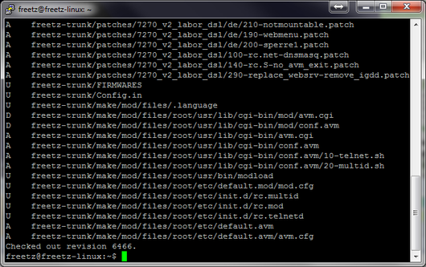
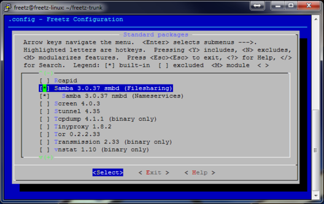
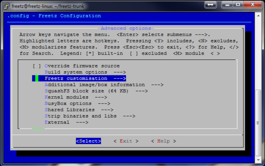
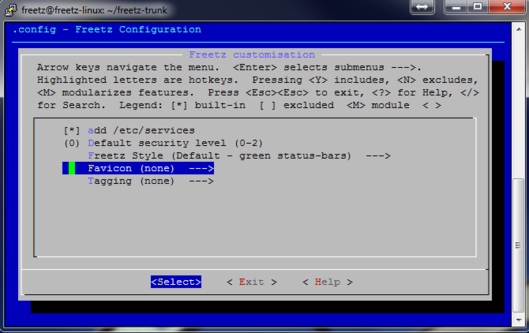
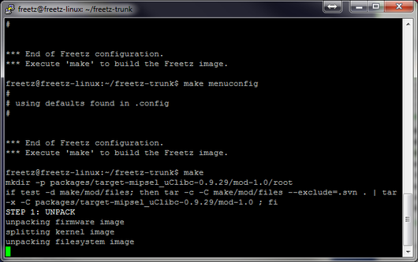
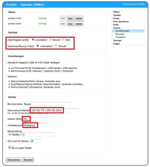
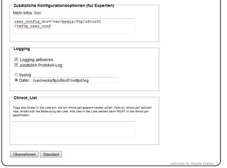
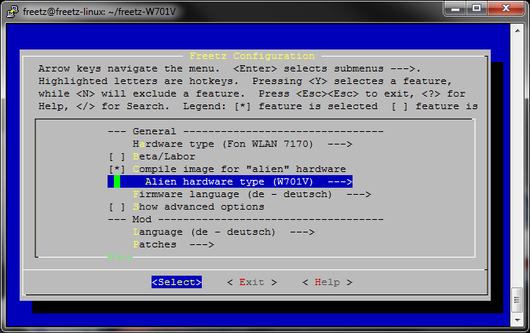
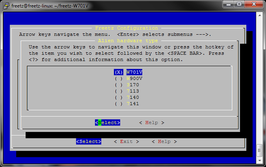
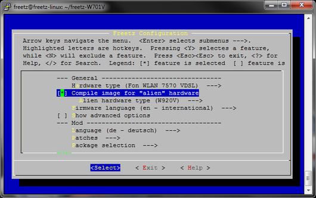

# Wie baue ich meinen ersten trunk?

### Beschreibung für ein Trunk-Image inkl. Samba und VSFTP

Diese Anweisung ist für alle die geschrieben die zum ersten Mal Ihre
Fritzbox mit einem FREETZ-Trunk (Entwickler-Version) modifizieren
wollen.

### Trunk-Image bauen

Das Vorgehen um ein Trunk-Image zu bauen stimmt bis zum Punkt **Freetz
Sourcen auschecken** mit den Schritten aus dem
Newbie-Tutorial überein. Deshalb steigt diese
Anleitung erst an dieser Stelle ein. Falls ihr euch unsicher seid, dann
geht das Tutorial nochmal bis zu 'Freetz Sourcen auschecken' durch.

Der Befehl zum Auschecken sieht nun etwas anders aus. Folgender Befehl
ist jetzt einzugeben:

```
	git clone https://github.com/Freetz-NG/freetz-ng ~/freetz-ng
```


Sollte dies nicht starten, so kann es sein das die Netzwerkverbindung
nicht funktioniert. In diesem Fall sollte ein **ping 192.168.XXX.1**
über die Konsole Aufschluss geben, ob die Netzwerkverbindung
funktioniert. Nun sollten die Freetz Quellen runtergeladen werden.
Danach wechselt man in das Freetz Verzeichnis mit **cd freetz-trunk**
und gibt dann ein **make menuconfig** ein.

[](../../screenshots/72.png)

Nach dieser Eingabe solltet Ihr folgendes Bild sehen:

[](../../screenshots/73.png)

Dies ist wieder die Konfigurations-Oberfläche des Freetz-Buildsystems.
Dort wählt ihr den jeweiligen Router und die gewünschten Pakete aus. Für
dieses HowTo haben wir beispielhaft die 7270_v2 gewählt. Als erstes
aktivieren wir die erweiterte Ansicht (**Level of user
competence**→**Advanced**) auf der ersten Seite. Danach sollten in einem
Freetz-Image folgende Patches ausgewählt werden:\
**Unter Firmware language:**

-   Auswählen ob ihr eine Firmware de oder en Firmware erstellen wollt.
    (Achtung: Die Auswahl muss zur vorhandenen Box passen.)

**Unter Other patches:**

-   **FREETZMOUNT**
-   **Automount Filesystems**
    -   **NTFS**

**Unter Removal patches**

-   **Remove ftpd (NEW)** (ein FTP-Programm auf der Box reicht)

[](../../screenshots/187.png)

**Unter Packages/Standard packages:**

-   **Samba suite** (Server der den Zugriff auf die USB Medien an der FB
    von Windows erlaubt). Die Haken bei den beiden Unterpunkten von
    Samba smbd und nmbd müssen gesetzt werden.
-   **VSFTP** (FTP-Server). Hier bitte keine weiteren Haken bei den
    Unterpunkten setzen.

[](../../screenshots/186.png)

**Unter Packages/ Web interfaces:**

-   **AVM-firewall** (Web-Oberfläche zum Administrieren der von AVM dem
    User vorenthaltene integrierten Firewall)
-   **spindown-cgi 0.2**
-   **Syslogd CGI 0.2.3**

[](../../screenshots/185.png)

**Unter Web Interface:**

-   **Favicons (none) ---→** einen Favicon auswählen. (Das ist das Bild
    was als Lesezeichen im Browser angezeigt wird)

[](../../screenshots/188.png)

[](../../screenshots/228.png)

Weitere Pakete und Patches incl. der Beschreibungen findet ihr auf der
Paketseite

Nachdem alle Pakete und Patches ausgewählt sind, beendet man die
Konfiguration und gibt auf der Kommandozeile der Shell Konsole **make**
ein. Nun solltet ihr ein solches Bild sehen:

[](../../screenshots/189.png)

Nun startet wieder der Erstellungsvorgang. Der Ablauf ist identisch zum
ersten Image. Das erstellte Image wird wiederum im Unterordner
**images** des Freetz Verzeichnisses abgelegt.

Die Abschlussmeldung sieht wie folgt aus:

[](../../screenshots/190.png)


Die Schritte **Image auf den PC kopieren** und Flash-Vorgang sind wieder
identisch zum Newbie-Tutorial.

### Samba einrichten

Samba muß zunächst eingerichtet werden. Hierfür geht man auf
**Pakete/Samba**. Starttyp auf **automatisch** stellen und Netbios Name
vergeben. Wichtig ist der Haken bei **Bevorzugter Master**, weil er den
Standard Samba-Server der FritzBox ersetzt.

[](../../screenshots/192.jpg)


Den Rest kann man so lassen und klickt auf **Samba Freigaben**.

[](../../screenshots/193.jpg)

Wir haben hier nun 2 Freigaben auf der USB-HDD der FB beispielhaft
erstellt, ein für **Gast** und die zweite für **Familie**. Hier eine
kurze Beschreibung der Parameter anhand der ersten Freigabe:

- **/var/media/ftp/uStor01** dies ist der interner Pfad auf die Festplatte\
- **/Videos** das ist das Freigegebenes Verzeichnis\
- **hdd1** Name der Freigabe der in der Windows-Netzwerkumgebung als Freigabe angezeigt wird.
- **1** Gast-Zugang erlaubt, kein Benutzername und Passwort nötig\
- **0** Schreib-Lesezugriff aktiviert\
- **-** Grund für das - ????? (Muß rein, Begründung folgt !)\
- **Videos** Kommentar

**Beispiel:**

```
	/var/media/ftp/uStor01/Videos hdd1 1 0 - Videos
```

Da wir als Netbiosname **fritz** vergeben hatte, lautet der Zugriff von
Windows auf die Freigabe\
fritz\hdd1 .
Jetzt noch unter **Dienste** den Samba Server starten und dann sollte es
funktionieren.


### FTP-Freigaben einrichten (Freetz-Trunk)

**Achtung! Diese Beschreibung beruht auf einem Trunk-Image.
FTP-Freigaben für Freetz-1.1.x-Images werden später erklärt**

Als erstes muss eine Order-Struktur auf der USB-Platte erzeugt werden.
Dazu einfach euren USB-Stick oder Festplatte im Fat32 formatieren (NTFS
würde auch gehen wird hier aber nicht näher beschrieben).
Eure Platte sollte dann wie folgt aussehen :

[](../../screenshots/81.jpg)

Wenn das der Fall sein sollte könnt ihr den Stick (wir gehen im weiteren
Verlauf dieser Beschreibung von einem Stick aus) an eure FritzBox
stecken.
Nun wird, wenn noch nicht unter der Samba-Einrichtung erfolgt, die
AVM-Lösungen von FTP abgeschaltet:

-   fritz.box → Einstellungen → Erweiterte Einstellungen → USB-Geräte →
    USB-Speicher(Speicher(NAS)
-   USB-Speicher FTP-Zugriff aktivieren → Häkchen weg
-   USB-Netzwerkspeicher aktivieren → Häkchen weg

Das sollte nun so aussehen:

[](../../screenshots/82.jpg)

Nun wechseln wir ins Freetz-Interface:
[http://fritz.box:81/](http://fritz.box:81/) und
geben dort unter : ---> Dienste ---> vsftp folgende Sachen ein:

-   Starttyp : Automatisch
-   Zugriff : Haken setzen bei **Lokale Benutzer** und **chroot jail**
    (alle anderen Haken raus)
-   Zusätzliche Konfigurationsoptionen (für Experten) :
    **user_config_dir=/var/media/ftp/uStor01/vsftp_user_conf**
-   Logging : **/var/media/ftp/uStor01/vsftpd.log** (kann man
    aktivieren, muß man aber nicht).


Die ganzen Eingaben sollten nun mit dem Drücken des Button
**Übernehmen** übernommen werden. Das sollte dann wie folgt aussehen:

[](../../screenshots/194.jpg)

[](../../screenshots/84.jpg)

Nun wenden wir uns der AVM-Firewall zu:

-   [--->Pakete ---> AVM-Firewall und dort den Pkt. Forwarding). Hier
    muß noch der FTP-Port freigegeben werden (siehe Bilder).

[](../../screenshots/85.jpg)

Nach eingabe der Zahlen (siehe Oben) einfach auf **Hinzufügen** drücken
und das Ergenbins sollte wie Folgt aussehen:

[](../../screenshots/86.jpg)

Um diese Einstellung nun endgültig zu speichern einfach den Haken
(Blinkendes Kästchen) setzen und den Reeboot der Box abwarten.
Nachdem die Box nun wieder gestartet ist öffnen wir nochmals in der
Freetz-Weboberfläche den Reiter **Dienste** und aktivieren den Dienst
**telnetd**. Dieser muß gestartet sein um im nächsten Schritt dieser
Anweisung die FTP-User einrichten zu können. Es wird nicht empfohlen
diesen Dienst auf automatisch zu setzen sondern ihn bei Bedarf manuell
zu starten.

Nun verlassen wir für's erste die Web-Oberfläche und nähern uns der
Kommandozeilenebene der FritzBox ! Dazu benötigen wir als erstes das
Programm [Putty](http://putty.softonic.de/) welches
wir uns aus dem Netz laden und auf dem PC installieren. Dieser Schritt
ist nur für Windows-User nötig. Linux-User können eine Telnet-Sitzung
wie gewohnt starten.
Putty kann man hier als Freeware laden
:[Download](http://putty.softonic.de/) und wird wie
folgt eingestellt:

[](../../screenshots/87.jpg)

Nach drücken von **Open** und Eingabe folgender Daten **login:root** und
**Password:freetz** solltet ihr folgendes Bild sehen:

[](../../screenshots/88.jpg)


### Einrichten von Benutzern

Der Befehl ist wie folgt aufgebaut:
`adduser -h '''Verzeichnis''' '''Benutzername'''`

> **Verzeichnis**: Ordner auf dem Stick, der dem Benutzer zugeordnet
> werden soll, z.B. **/var/media/ftp/uStor01/**
> **Benutzername**: Name des Benutzers

Beim Erstellen des Benutzers wird danach gleich das Passwort abgefragt.
Dieses muss zweimal eingegeben werden, und es wird dabei nichts am
Bildschirm angezeigt, auch keine Sterne.
Erzeugen wollen wir nun einen User **Paul** und eine Userin **Mary**
welche auf die Ordner **hdd1**(Paul) und **hdd2**(Mary) (siehe Samba)
FTP-Zugriff erhalten sollen. Weiterhin wird hier ein User **Gast** mit
nur Leserechten auf dem Ordner **hdd1** erzeugt.
Hierzu werden nun folgende Befehle in Putty eingegeben (Bitte auf Groß
und Kleinschreibung achten):

```
	/var/mod/root # adduser -h /var/media/ftp/uStor01/hdd1 paul
	adduser: /var/media/ftp/uStor01/hdd1: Operation not permitted
	Changing password for paul
	New password:
	Bad password: too short
	Retype password:
	Password for paul changed by root
```

Die Meldung `Operation not permitted` kommt, wenn es sich um ein
Dateisystem mit FAT oder NTFS handelt.
Das selbe machen wir nun nochmals für Marry und Gast:

```
	adduser -h /var/media/ftp/uStor01/hdd2 mary
	adduser -h /var/media/ftp/uStor01/hdd1 gast
```

Wenn man das Paßwort ändern will, verwendet man dazu den Befehl
`passwd `**`Benutzername`**. Man wird dann wieder zweimal nach dem neuen
Paßwort gefragt.
Einen Benutzer löschen kann man mit dem Befehl
`deluser `**`Benutzername`**.
In jedem Fall müssen die Änderungen mit dem Befehl **modsave all**
wieder gespeichert werden.
Anzeigen kann man die Datei mit dem Befehl **cat /var/tmp/passwd**.
Anzeigen und Ändern ist auch möglich über die
Rudi-Shell von Freetz. Diese
ist nur verfügbar, wenn die
Sicherheitsstufe
auf 0 gesetzt ist.
Wenn alles Richtig gelaufen ist, sollte folgendes in der passwd stehen:

```
	root:x:0:0:root:/mod/root:/bin/sh
	ftp:x:2:1:FTP account:/home/ftp:/bin/sh
	ftpuser:x:1:1:ftp user:/var/media/ftp:/bin/sh
	paul:x:1000:1000:Linux User,,,:/var/media/ftp/uStor01/hdd1:/bin/sh
	mary:x:1001:1001:Linux User,,,:/var/media/ftp/uStor01/hdd2:/bin/sh
	gast:x:1002:1002:Linux User,,,:/var/media/ftp/uStor01/hdd1:/bin/sh
```

Nun melden wir uns noch mit folgendem Befehl von der Putty Konsole ab:

```
	exit
```


### Rechtevergabe für FTP-User

> Ob ein Neuer FTP-User Schreibrechte erhalten soll oder nur lesen
> können soll wird wie folgt geregelt:\
> Jeder Benutzer erhält eine Datei mit seinem Dateinamen im Ordner
> **/var/media/ftp/uStor01/vsftp_user_conf/**, die festlegt, ob er
> Schreibrechte hat oder nicht.

Inhalt der Datei :

> **write_enable=yes**(User hat Schreibrechte / siehe Paul und Mary)\
> **write_enable=no**(User hat **keine** Schreibrechte / siehe Gast)

Über diese Benutzerdateien ist es auch möglich einzelne FTP-Befehle
([Liste](http://en.wikipedia.org/wiki/List_of_FTP_commands))
für Benutzer zu verbieten. Hierzu fügt man folgende Zeile in die Datei
ein und entfernt die Befehle die der User nicht ausführen darf:

```
	cmds_allowed=ABOR,ACCT,ALLO,APPE,AUTH,CDUP,CWD,DELE,EPRT,EPSV,FEAT,HELP,LIST,MDTM,MKD,MODE,NLST,NOOP,OPTS,PASS,PASV,PBSZ,PORT,PROT,PWD,QUIT,REIN,REST,RETR,RMD,RNFR,RNTO,SITE,SMNT,STAT,STOR,STOU,STRU,SYST,TYPE,USER
```

**Beispiel:** Mary darf Dateien auf den FTP kopieren und Verzeichnisse
anlegen, jedoch diese nicht wieder löschen. Also muß folgendes in der
Datei stehen:

```
	cmds_allowed=ABOR,ACCT,ALLO,APPE,AUTH,CDUP,CWD,EPRT,EPSV,FEAT,HELP,LIST,MDTM,MKD,MODE,NLST,NOOP,OPTS,PASS,PASV,PBSZ,PORT,PROT,PWD,QUIT,REIN,REST,RETR,RNFR,RNTO,SITE,SMNT,STAT,STOR,STOU,STRU,SYST,TYPE,USER
```

> **DELE** (Delete file), **RMD** (Remove a directory) wurden aus dem
> oben angegebenen String gelöscht.
> \
> \
> Sollte etwas immer noch nicht gehen, dann den Router einfach nochmal
> neu starten.


### Image für einen Speedport bauen

Speedports lassen sich aufgrund einer Software-Sperre leider nicht per
AVM-Webinterface flashen. Nutze die Freetz-Tools recover-eva oder
push_firmware oder die GUI-Programme aus dem Forum wie z.B das
[ruKernelTool](http://rukerneltool.rainerullrich.de/index.html).
Dieses funktioniert sehr gut und ist einfach in der Bedienung.

### Welche Speedports lassen sich mit Freetz modifizieren?

-   W501V
-   W701V
-   W900V
-   W920V

### Umbau eines W701V

1.) Freetz-Linux wie es oben beschrieben ist starten
2.) Wir arbeiten alle Schritte ab wie im [HowTo](first_trunk.html)
beschrieben, jedoch bei Boxtyp wählen wir die 7170 und stellen unter
Alien hardware type den W701V aus.

[](../../screenshots/196.png)

[](../../screenshots/197.png)

3.) Samba und VSFTP bringen nur was bei einem W920V (7570), da dieser
einen USB-Port hat. Alle anderen Schritte in dem
[HowTo](first_trunk.html) passen jedoch auch bei einem Speedport.

4.) Das erstellte Image sollte sich als normales FW-Update in die Box
laden lassen. Sollte die Box den Update verweigern (war bei meinem W701V
der Fall) bleibt Euch nur der Weg über das
[ruKernelTool](http://rukerneltool.rainerullrich.de/index.html).
Dann sind jedoch alle Zugangsdaten sowie alle Einstellungen verloren.
Die Box macht in diesem Fall quasi einen Werksreset.

**Ergebnis:**

[](../../screenshots/195.png)

### Umbau eines W501V

Der W501V läßt sich direkt als Boxtyp auswählen

### Umbau eines W920V

Boxtyp: 7570 VDSL\
Alientyp: W920V

[](../../screenshots/198.png)


