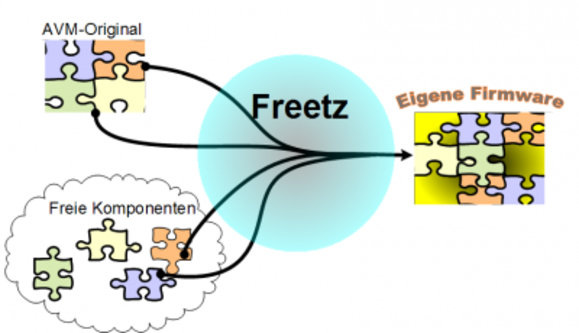

# Freetz macht mehr aus der Box!

Nicht immer hat der Hersteller der Box in seiner Firmware genau die
Funktionen vorgesehen, die man sich selber wünscht. Freetz kann das
ändern! Die Funktionalität der Box kann den individuellen Bedürfnissen
angepasst werden. Freetz kann Funktionalität

-   **hinzufügen.**\
    Das könnte zum Beispiel ein Web-Server auf der Box sein oder ein
    spezielles VPN. Die Liste der Pakete gibt
    hierzu eine Übersicht.
-   **verändern.**\
    Manchmal ist die Funktion da, aber sie lässt sich im Original nicht
    oder nicht detailliert genug konfigurieren (z. B. die integrierte
    Firewall). Die Liste der Erweiterungen gibt einen Überblick.
-   **entfernen.**\
    Das kann nötig werden, wenn man eine Funktion nicht braucht oder für
    zusätzliche Pakete Platz schaffen möchte (der Speicher der Box hat
    seine Grenzen). Auch hier gibt es einen Überblick in der Liste der
    Patches.

### Wie funktioniert Freetz?

Die Firmware der Box besteht aus vielen einzelnen Komponenten. Sie
wurden von verschiedenen Personen und Firmen entwickelt und bilden
gemeinsam die Firmware der Box. Freetz tauscht nun einzelne Komponenten
aus, verändert ihre Konfiguration oder fügt neue Komponenten ein. So
entsteht eine neue Firmware für die Box ganz nach den individuellen
Wünschen. Diese neue Firmware kann über die gewohnte Update-Funktion auf
die Box installiert werden. Die ursprüngliche Funktionalität inklusive
der AVM Weboberfläche bleibt erhalten, Freetz kann sozusagen als
Erweiterung angesehen werden.

### Wie bekomme ich eine eigene Firmware?

Aus rechtlichen Gründen muss jeder seine Firmware selbst bauen. Dazu
später mehr.

### Voraussetzungen

Dazu braucht man:

-   Ein Linux-System. Entweder direkt auf dem PC installiert oder in
    einer Virtuellen Maschine unter Windows (z.B.
    [Freetz-Linux](http://www.ip-phone-forum.de/showthread.php?t=194433)).
-   Möglicherweise muss das Linux noch um einige Werkzeuge ergänzt
    werden.
-   Den aktuellen Release von Freetz downloaden.

### Ablauf

Sind die Voraussetzugen geschaffen, kann es los gehen. Es ist soweit,
die individuelle Firmware ...

-   **Zusammenstellen.**\
    Der Prozess ist menü-gesteuert. Man kann festlegen, was genau in die
    Box kommt und worauf man verzichten kann/will/muss. Freetz kennt die
    Abhängigkeiten unter den Komponenten und sorgt für eine
    funktionierende Kombination.
-   **Herstellen.**\
    Abhängig von der Leistungsfähigkeit des Pcs dauert dieser Prozess
    eine kleine Weile, läuft im Normalfall aber automatisch ab. Je nach
    gewählten Komponenten, werden dabei weiter Dateien (Quellen) aus dem
    Internet geladen. Nach Abschluß ist eine fertige Firmware (Image)
    entstanden.
-   **Installieren** über das normale Firmware-Update der Box.
-   Die neuen Funktionalitäten auf der Box **konfigurieren** und
    **benutzen**. In der Konfiguration der Box findet sich jetzt ein Link
    auf Freetz. Hier können die zusätzlichen neuen Pakete konfiguriert
    werden.

Detaillierte Information über die Freetz-Installation finden sich auf
der entsprechenden Wiki-Seite.
Für Anfänger existiert eine spezielle
Anleitung, die man als
Freetz-Neuling unbedingt lesen sollte.

Die Einstellungen in der FritzBox bleiben normalerweise bei einem
Upgrade auf Freetz erhalten.

### Rechtliche Hintergründe

Ein grosser Teil der Komponenten der Firmware ist freie Software. Ihre
Autoren haben erlaubt, dass sie von jedem verwendet, modifiziert und
weitergegeben werden kann. Davon macht Freetz reichlich Gebrauch.

Ein anderer Teil aber ist von AVM (oder anderen Firmen) entwickelt und
geschützt. Diese Komponenten sind geschützt und nicht öffentlich
zugänglich. Für eine funktionierende Box braucht es aber beide Teile.

Solange das so ist, darf keine fertige Firmware zum
Download angeboten werden in der AVM-Teile
stecken. Freetz muss sich deshalb darauf beschränken die Werkzeuge zu
liefern, mit denen jeder seine individuelle Firmware selbst bauen kann.

Die selbst gebaute Firmware sollte nicht öffentlich zugänglich gemacht
werden. Das erspart möglichen Ärger mit AVM.

### Support

Wenn die selbst gebaute Firmware in der Box ist (und nicht mehr das
Original), kann man bei Fragen und Problemen **keinen Support von AVM**
erwarten. Hilfe kann man jetzt im
[IP-Phone-Forum](http://www.ip-phone-forum.de/forumdisplay.php?f=525)
finden.

