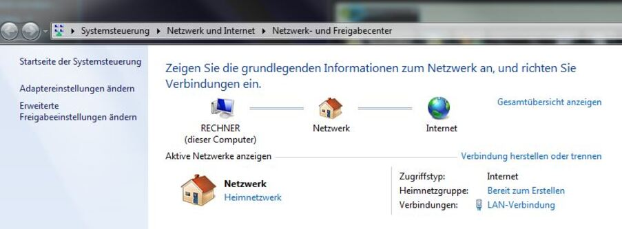
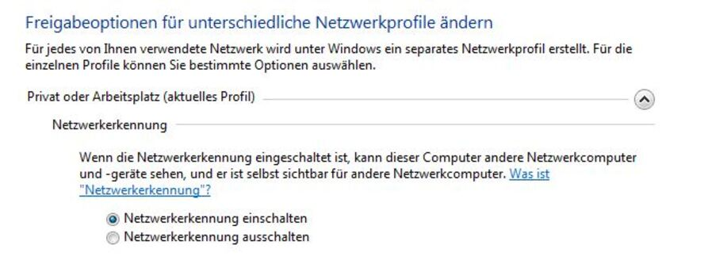

# Installation

Freetz stellt Skripte zum Modifizieren
einer originalen Firmware bereit. Aus Lizenzgründen ist die Verbreitung
sowohl originaler als auch modifizierter Firmware Images untersagt!

 Achtung:
Das Aufspielen einer modifizierten Firmware geht mit dem Verlust der
Garantie einher. Wendet euch bei Problemen mit einer modifizierten
Firmware daher **NICHT** an den AVM Support.

**Anfänger**: Bitte zuerst 'Erste Schritte für Anfänger' lesen!

### Virtuelles Linux: Freetz-Linux für VMware-Player

Wenn kein natives Linux zur Verfügung steht wird von uns
[Freetz-Linux](http://www.ip-phone-forum.de/showthread.php?t=194433)
als Buildumgebung empfohlen. Das von Silent-Tears (cinereous) zur
Verfügung gestellte Image wird bei Problemen supported.

Die unten stehende Anleitung wurde anfangs teilweise von
[Saphir](http://www.ip-phone-forum.de/member.php?u=118161)
übernommen, ist aber über die Zeit historisch gewachsen und wurde nach
und nach von mehreren Benutzer erweitert und überarbeitet. Wir bemühen
uns diese Anleitung möglichst aktuell zu halten und der jeweils
aktuellen Version der aktuell zu empfehlenden virtuellen Maschine
anzupassen. Grundsätzlich gelten jedoch die hier empfohlene Schritte mit
gewissen Einschränkungen für jede FREETZ-tauglich konfigurierte
virtuelle Linux-Maschine.

### Vorbereitung

Siehe auch:

[Buildumgebung Freetz-Linux
Installieren](http://www.ip-phone-forum.de/showpost.php?p=1400234&postcount=1)

[Freetz und Speed-to-Fritz
Installation](http://wiki.ip-phone-forum.de/skript:freetz_und_speed-to-fritz)
(relevant nur für SpeedPort Benutzer)

### Durchführung mit Windows OS

1.  Benötigte Dateien:
    -   VMWare Player
        [http://www.vmware.com/de/download/player/](http://www.vmware.com/de/download/player/)
    -   VMware Image für Freetz-Linux
        [Forumpost](http://www.ip-phone-forum.de/showpost.php?p=1400234&postcount=1)
        [Download](http://sourceforge.net/projects/freetz-linux/files/freetz-linux-1.1.1/)
    -   Freetz (aktuelle und ältere Versionen)
        Download
        (Muss man nicht direkt downloaden, wenn man sich das Paket wie
        unten empfohlen per svn lädt)
    -   Evtl. vorhandene Patches für Freetz [Freetz
        Forum](http://www.ip-phone-forum.de/forumdisplay.php?f=525)
2.  [Freetz-Linux](http://www.ip-phone-forum.de/showthread.php?t=194433)
    unter Windows mit
    [7-Zip](http://downloads.sourceforge.net/sevenzip/7z442.exe)
    oder
    [WinRAR](http://www.rarlab.com/rar/wrar380d.exe)
    entpacken.
3.  VMWare Player starten und keine Einstellungen ändern, da sich die
    virutelle Maschine eine IP per DHCP holt. Sollte dieses nicht der
    Fall sein kann die IP-Adresse mit folgendem Befehl auch per Hand
    gesetzt werden:

    ```
		ifconfig eth0 192.168.178.xx netmask 255.255.255.0 broadcast 192.168.178.255
    ```

    (Wobei die Netzwerkkarte "eth0" evtl. durch eine eine andere
    ersetzt werden muss. Eine Auflistung aller Netzwerkkarten erhält man
    mit **"ifconfig -a"**)

4.  Im VMWare Player mit dem Benutzernamen **freetz** und dem Passwort
    **freetz** anmelden.
    \
    Jetzt gibt es mehrere Alternativen, wie man mit Freetz-Linux
    arbeiten kann und die Dateien zwischen Freetz-Linux und dem Rest der
    Welt bewegen kann.
    -   **Freetz-Linux Konsole** im VMware Player (am einfachsten)
    -   **SSH/SCP**: Zu anderen Möglichkeiten gehört z.B. eine
        SSH/SCP-Verbindung mit
        [putty](http://www.chiark.greenend.org.uk/~sgtatham/putty/download.html)
        oder/und mit
        [WinSCP](http://winscp.net/eng/download.php#download2)
        (beide nur als Beispiel). Als Servernamen für putty/WinSCP trägt
        man die IP-Adresse von Freetz-Linux. Benutzername und
        Passwort s. oben
    -   **SAMBA**: Außerdem gibt es die Möglichkeit Daten zwischen
        Windows und Freetz-Linux über SAMBA auszutauschen. Dafür gibt
        man in der Adressenleiste von WindowsExplorer "\
        Freetz-Linux" oder "\
        IP-Adresse-von-Freetz-Linux" an und schon kann man die Dateien
        zwischen Windows und Freetz-Linux hin und her schieben.
        Allerdings stimmen dann die Linux Benutzerrechte nicht
        automtisch wie sie sollten.
    -   **FTP**: Funktioniert ähnlich wie SAMBA\
        \
        Alle diese Verbindungsmöglichkeiten sind unter Freetz-Linux
        voreingestellt und sollten von Anfang an funktionieren. Bei
        Problemen bitte Netzwerkverbindung, Firewall, etc. überprüfen.
        Ebenso sollten die Netzwerkeinstellungen vom VMWare-Player
        überprüft werden. Standardmäßig ist hier **Bridged-Mode**
        eingestellt. Anfangen mit den Tests sollte man mit "ping
        IP-Adresse-von-Freetz-Linux" unter Eingabeaufforderung.

5.  Je nachdem, für welche Methode man sich entschieden hat, macht man
    folgendes:
    -   Mit **SSH/TELNET** oder **Freetz-Linux Konsole** (bevorzugt)
        folgendes eingeben:

        ```
			git clone https://github.com/Freetz-NG/freetz-ng ~/freetz-ng
        ```


> **Achtung:** Kleiner Tip für Vista und Windows 7 User:\
> Solltet Ihr eine IP-Adresse in der VM-Ware erhalten (ifconfig), aber
> trotzdem folgende Fehlermeldung bekommen :**hostname konnte nicht
> aufgelöst werden**, dann kontrolliert bitte Folgendes in Eurer
> Systemsteuerung:\
> \
> 1.) ob Euer Netzwerk ein Heimnetzwerk ist:
>
> [](../../screenshots/124.jpg)
>
> 2.) ob Eure Netzwerkkennung eingeschaltet ist:
>
> [](../../screenshots/123.jpg)
>
> 

1.  *Optional*: Patch einspielen (siehe Howto)

2.  In das Verzeichnis des ausgecheckten/entpackten Freetz wechseln:

    ```
		cd freetz-2.0.x (aktuell: cd freetz-2.0)
    ```

3.  Einstellungen wie Boxtyp, Pakete usw. konfigurieren. Dies ist über
    ein
    [ncurses](http://de.wikipedia.org/wiki/Ncurses)
    Interface möglich, welches z.B. aus der Konfiguration des Linux
    Kernels bekannt ist. Details und Beschreibungen zu den Optionen gibt
    es in der Beschreibung zum
    menuconfig.

    ```
		make menuconfig
    ```

    Es empfiehlt sich beim ersten Mal nicht zu viele Einstellungen zu
    verändern und das erste FritzBox Firmware Image mit den
    Standardvorgaben zu erstellen.

4.  Firmware modifizieren. In diesem Schritt werden die zu der gewählten
    Konfiguration passenden Originalfirmware, Pakete, sowie Sourcen für
    die benötigten Tools vollautomatisch heruntergeladen und die
    modifizierte Firmware in drei Schritten erzeugt. Beim ersten Mal
    dauert es etwas länger. Die Zeit ist abhängig von den ausgewählten
    Paketen und dem benutzten Rechner. Man kann also ruhig eine
    Kaffeepause einlegen.

    ```
		make
    ```

5.  Wenn der Build ohne Fehler durchgelaufen ist, dann findet sich jetzt
    unter `~/freetz-2.0.*/images` die neue FritzBox Firmware (z.B.
    `7170_04.76freetz-devel-10390.de_20130421-180742.image`).
6.  Diese Datei kann ganz normal als Firmware Update auf die Box
    hochladen werden. Dazu muss die FritzBox aber mit einem Passwort
    gesichert sein, da sie fremde Images sonst nicht akzeptiert. (Falls
    Freetz schon auf der Box ist sollte bevorzugt die Update Funktion
    des Freetz Webinterfaces genutzt werden.) Nach einem erfolgreichen
    Upload ist nun auf Port 81 ein weiteres Webinterface verfügbar,
    welches Instruktionen zum Abschluss der Installation enthält. Sollte
    die Box nach dem Hochladen der Firmware auch Minuten nachdem die
    Info LED aufgehört hat zu blinken nicht mehr erreichbar sein
    (typischerweise leuchten **periodisch** immer wieder alle LEDs auf),
    so kann die originale Firmware bei den meisten Box-Typen, wie in
    diesem Howto
    beschrieben, wiederhergestellt werden.

### Durchführung mit Linux OS

### Notwendige Pakete

Für das Erstellen der Firmware kann auch Knoppix verwendet werden, wozu
keine Linux-Installation erforderlich ist. Wichtig ist, dass zum
Kompilieren des Mods unter Linux keine FAT oder NTFS Partition verwendet
wird. Die folgende Anleitung benötigt für

#### freetz-2.x (stabile Version)

-   **gcc** - GNU C Compiler
-   **g++** - GNU C++ Compiler
-   **binutils** - GNU Assembler, Linker und Binary-Werkzeuge
-   **autoconf** - dem Make vorgeschalteter Generator für
    Konfigurationsskripten nach GNU-Standard; hilft dabei,
    plattformunabhängig programmierte Software letztendlich für einen
    plattformspezifischen Build vorzubereiten
-   **automake** ab Version 1.10 - Makefile-Generator nach GNU-Standard;
    wird nur für manche Pakete benötigt, aber z.B. für
    privoxy; Paketmanager
    installiert normalerweise *autoconf* als abhängiges Paket gleich mit
-   **libtool** - hilft beim Erstellen von statischen und dynamischen
    Bibliotheken; kann z.B. beim aufruf von *autoreconf* notwendig
    werden
-   **GNU make** ab Version 3.81 - skriptgesteuertes Build-System
-   **bzip2** - (Ent)packen von Software-Archiven
-   **libncurses5-dev** - Entwickler-Bibliothek für ncurses (Erzeugung
    komfortabler textbasierter Benutzerschnittstellen, vgl.
    `make menuconfig`)
-   **zlib1g-dev** - Entwickler-Bibliothek für gzip-Kompression
-   **flex** - lex-kompatibler Generator für lexikalische Analyse
-   **bison** - YACC-kompatibler Parser-Generator
-   **patch** - Programm, um Patches anzuwenden
-   **texinfo** - Online-/Druck-Doku aus gemeinsamer Quelle erzeugen
-   **tofrodos** - Dateiumwandlung DOS ↔ UNIX (für was wird das
    benötigt?)
-   **gettext** - Texte in Programmen internationalisieren
-   **pkg-config** - Hilfstool welches zum Bauen von Binaries und
    Libraries nötig ist
-   **ecj-bootstrap** - Eclipse Java Compiler (evtl. auch libecj-java
    und ecj in neueren Distributionen); nur notwendig für Package
    *classpath* ab 0.95
-   **perl** - Perl-Interpreter; notwendig für `make recover`
-   **libstring-crc32-perl** - Perl-Modul zur Berechnung von
    CRC32-Prüfsummen; notwendig für `make recover`
-   **xz-utils** - (Ent)packen von Software-Archiven im XZ-Format
    (strace seit freetz-stable-1.2)

#### aktuelle Entwicklerversion und spezielle Pakete

Diese benötigen zusätzlich zu bereits unter *freetz-2.x* genannten noch
folgende Pakete:

-   **svn** - Subversion zum Auschecken der aktuellen Freetz-Versionen
-   **ruby1.8** - objektorientierte Skriptsprache (Version 1.8.6); nur
    notwendig für Package *ruby* (ab freetz-devel) - seltsamerweise
    benötigt der Crosscompile für *ruby-1.8.6* eine installierte Version
    seiner selbst als Voraussetzung. Zu allem Überfluß könnte es sein,
    daß Sie im Paket zwar `/usr/bin/ruby1.8` o.ä. haben, aber nicht das
    vom Makefile benötigte Binary Namens *ruby*. Da hilft im o.g.
    Beispiel `sudo ln -s ruby1.8 /usr/bin/ruby` bzw. die Ausführung des
    `ln`-Befehls als Benutzer *root*.
-   **gawk** - GNU awk; notwendig für das Skript `tools/extract-images`
    (ab freetz-devel), wenn man z.B. ein Recover-EXE zerlegen, also
    *urlader.image* und *kernel.image* extrahieren möchte. Die in
    anderen *awk*-Varianten nicht vorhandene Funktion *strtonum* wird an
    einer Stelle verwendet.
-   **python** - Python-Interpreter; notwendig, um via `tools/mklibs.py`
    unbenutzte Symbole aus Bibliotheken zu entfernen, um Platz zu sparen
-   **libusb-dev** - Entwicklungs-Bibliothek für USB-Anwendungen im
    Userspace; nur notwendig für SANE, wenn bspw.
    Multifunktionsdrucker/-scanner an die FritzBox angebunden werden
    sollen. Siehe auch
    [Forums-Beitrag](http://www.ip-phone-forum.de/showpost.php?p=1075181&postcount=199)
    dazu.
-   **realpath** - wird nur von Entwicklern benötigt, die innerhalb von
    *fwmod* beim Build das Patch-Auto-Fixing verwenden
    (AUTO_FIX_PATCHES=y im Environment). Wer nicht weiß, wovon die
    Rede ist, braucht es auch nicht. Unter Fedora nicht verfügbar, man
    kann es aber selbst kompilieren
    [http://forums.fedoraforum.org/archive/index.php/t-143199.html](http://forums.fedoraforum.org/archive/index.php/t-143199.html).
    **[TODO]{.wikiextras .phrase .todo}** nicht mehr notwendig in Trunk
    und freetz-stable-1.2, Eintrag löschen nach Release.
-   **fastjar** - Implementation des Java jar utils; nur notwendig für
    Package *classpath*
-   **git** - GIT Tool zum auschecken von GIT Repositories (benötigt für
    freetz_download)
-   **imagemagick** (bzw **ImageMagick**) - enthält `composite` mit dem
    Bilder kombiniert werden können; nur notwendig wenn man das
    AVM-Webinterface "taggen" möchte
-   **patchutils** - Tools zum Umgang mit Patches; notwendig für
    `tools/freetz_patch` (Auto-Fix-Modus)
-   **mktemp** - Erzeugen temporärer Dateien mit Zufallsnamen; notwendig
    für `tools/freetz_patch` (Auto-Fix-Modus)

#### alte Entwicklerversionen

Hier wird zusätzlich folgendes benötigt:

-   **automake-1.8** - Version, die zusätzlich speziell von *libid3tag*
    benötigt wird. Nicht mehr erforderlich ab Freetz 1.0.
-   **jikes** - Java Byte Code Compiler; nur notwendig für Package
    *classpath* bis 0.93 bzw. ds26-14.4

### Installation der benötigten Pakete (Ubuntu)

Eine einfache Möglichkeit die benötigten Pakete zu installieren besteht
darin, diesen Code per Copy and Paste auf der Konsole auszuführen.

(Falls du eine US-Tastaturbelegung hast → "sudo locale-gen de_DE" und
"sudo dpkg-reconfigure console-data" ausführen.
[Details](https://help.ubuntu.com/community/LocaleConf)
)

```
    sudo apt-get -y update
    sudo apt-get -y upgrade
    sudo apt-get -y dist-upgrade

    # Angepasst z.B. auf Ubuntu 9.04 (kein automake 1.8, "ecj" statt "ecj-bootstrap"):
    sudo apt-get -y install imagemagick subversion gcc g++ binutils autoconf automake automake1.9 libtool make bzip2 libncurses5-dev libreadline-dev zlib1g-dev flex bison patch texinfo tofrodos gettext pkg-config jikes ecj fastjar realpath perl libstring-crc32-perl ruby ruby1.8 gawk python libusb-dev unzip intltool libglib2.0-dev xz-utils git-core libacl1-dev libattr1-dev libcap-dev

    # Ubuntu 9.10, 10.xx, 11.xx und 12.04
    sudo apt-get -y install imagemagick subversion gcc g++ bzip2 binutils automake patch autoconf libtool pkg-config make libncurses5-dev libreadline-dev zlib1g-dev flex bison patch texinfo tofrodos gettext pkg-config ecj fastjar realpath perl libstring-crc32-perl ruby ruby1.8 gawk python libusb-dev unzip intltool libglib2.0-dev xz-utils git-core libacl1-dev libattr1-dev libcap-dev

    #Ubuntu 13.04 und 14.04
    sudo apt-get -y install graphicsmagick subversion gcc g++ binutils autoconf automake automake1.9 libtool make bzip2 libncurses5-dev libreadline-dev zlib1g-dev flex bison patch texinfo tofrodos gettext pkg-config ecj fastjar realpath perl libstring-crc32-perl ruby ruby1.8 gawk python libusb-dev unzip intltool libacl1-dev libcap-dev

    # Seit Debian Jessie bzw. Ubuntu 15.04 (vivid) wird zusätzlich das Paket libtool-bin benötigt:
    sudo apt-get -y install libtool-bin

    # Auf 64-Bit Systemen sind zusätzlich folgende Pakete zu installieren:
    sudo apt-get -y install libc6-dev-i386 lib32ncurses5-dev gcc-multilib lib32stdc++6

    # Ubuntu 15.10 x64:
    sudo apt-get -y install imagemagick subversion git gcc g++ binutils autoconf automake autopoint libtool-bin make bzip2 libncurses5-dev libreadline-dev zlib1g-dev flex bison patch texinfo tofrodos gettext pkg-config ecj fastjar realpath perl libstring-crc32-perl ruby ruby1.8 gawk python libusb-dev unzip intltool libacl1-dev libcap-dev libc6-dev-i386 lib32ncurses5-dev gcc-multilib lib32stdc++6 libglib2.0-dev

    # Ubuntu 16.04 x64:
    sudo apt -y install imagemagick subversion git bc wget sudo gcc g++ binutils autoconf automake autopoint libtool-bin make bzip2 libncurses5-dev libreadline-dev zlib1g-dev flex bison patch texinfo tofrodos gettext pkg-config ecj fastjar realpath perl libstring-crc32-perl ruby ruby1.9 gawk python libusb-dev unzip intltool libacl1-dev libcap-dev libc6-dev-i386 lib32ncurses5-dev gcc-multilib lib32stdc++6 libglib2.0-dev

    # Ubuntu 20.04 x64:
    sudo apt -y install lib32z1-dev inkscape imagemagick subversion git bc wget sudo gcc g++ binutils autoconf automake autopoint libtool-bin make bzip2 libncurses5-dev libreadline-dev zlib1g-dev flex bison patch texinfo tofrodos gettext pkg-config ecj fastjar perl libstring-crc32-perl ruby gawk python libusb-dev unzip intltool libacl1-dev libcap-dev libc6-dev-i386 lib32ncurses5-dev gcc-multilib lib32stdc++6 libglib2.0-dev 
```

### Installation der benötigten Pakete (Fedora)

```
	sudo yum -y install ImageMagick subversion gcc gcc-c++ binutils autoconf automake libtool make bzip2 ncurses-devel zlib-devel flex bison patch texinfo gettext pkgconfig ecj perl perl-String-CRC32 wget glib2-devel git libacl-devel libattr-devel libcap-devel
	# Auf 64-Bit Systemen sind zusätzlich folgende Pakete zu installieren:
	sudo yum -y install ncurses-devel.i686 glibc-devel.i686 libgcc.i686
```

### Installierte Distrubution ermitteln
Wer vergessen hat welche Linux Version er installierte kann dies mit folgenden Befehlen prüfen:

- Linux Distribution:
```
	$ hostnamectl status
	  Operating System: Fedora 33 (Thirty Three)
		    Kernel: Linux 5.10.15-200.fc33.x86_64
```
	
- Ubuntu Version:
```
	$ lsb_release -d
	Description:    Ubuntu 14.04.6 LTS
```
	
- Maschinen Typ: "i686" bei 32-bit x86 und "x86_64" bei 64-Bit x86
```
	$ uname -m
	aarch64
```

### Erstellung & Installation

1.  Shell öffnen, ins Verzeichnis von `freetz-xxx.tar.bz2` wechseln und
    diesen mit `tar -xvjf freetz-x.y.z.tar.bz2` entpacken
2.  *Optional*: Patch einspielen (siehe
    Howto)
3.  Mit `cd freetz-xxx/` in das Verzeichnis des entpackten Freetz
    wechseln
4.  Konfiguration wählen. Dies ist über ein ncurses Interface möglich,
    welches z.B. aus der Konfiguration des Linux Kernels bekannt ist.
    Details und Beschreibungen zu den Optionen gibt es in der
    Beschreibung zum make menuconfig.
5.  Firmware modifizieren. In diesem Schritt werden die zu der gewählten
    Konfiguration passenden original Firmware und Pakete, sowie Sourcen
    für die benötigten Tools vollautomatisch heruntergeladen und die
    modifizierte Firmware in drei Schritten erzeugt. Dies erledigt ein
    simples `make`.
6.  `*.image` als Firmware Update auf die Box hochladen. Nach einem
    erfolgreichen Upload ist nun auf Port 81 ein weiteres Webinterface
    verfügbar, welches Instruktionen zum Abschluss der Installation
    enthält. Sollte die Box nach dem Hochladen der Firmware auch Minuten
    nachdem die Info LED aufgehört hat zu blinken nicht mehr erreichbar
    sein (typischerweise leuchten **periodisch** immer wieder alle LEDs
    auf), so kann die originale Firmware bei den meisten Box-Typen, wie
    in diesem Howto
    beschrieben, wiederhergestellt werden.

### coLinux / andLinux / speedLinux

Siehe auch: [andlinux unter Vista
installieren](http://wiki.ip-phone-forum.de/skript:andlinux)

Alternativ kann auch [coLinux](http://colinux.org)
benutzt werden, ist etwas resourcenschonender als der vmware player. Mit
speedLinux ist alles vorbereitet für freetz oder speed-to-fritz. Mit
./freetz werden alle notwendigen Vorbereitungen und Installationen
durchgeführt. aktueller Stand 25.10.2009

Anmerkung von Alexander Kriegisch (kriegaex), 24.02.2008: Ja, das
benutze ich auch seit gestern, und zwar speziell die mit Ubuntu Gutsy
und XFCE (wahlweise auch KDE) vorkonfigurierte Variante
**[andLinux](http://www.andlinux.org)**, die man
wahlweise als Dienst oder als Anwendung starten kann und mit einem
einfachen Installer ausgeliefert wird. Scheint etwas langsamer zu sein
als ein reines Linux, aber es ist schon cool, Linux-Fenster nativ neben
Windows-Fenstern zu haben.
*:-)* Der
mitgelieferte X-Server Xming (für Windows) macht's möglich. Ich
verwende übrigens nicht mal ein X-Terminal, sondern logge mich sozusagen
"headless" über SSH ein (Putty). Ab und zu lasse ich mal Synaptic oder
als X-Editor SciTE laufen, den ich nachinstalliert habe. Ich baue gerade
sämtliche Freetz-Pakete "from scratch" inkl.
Download, es geht genauso wie in VMware
oder nativem Linux, also Linux-Paketliste siehe oben.

Nachteile von coLinux/andLinux/speedLinux:

-   bei Multicore-Prozessoren wird nur ein Kern benutzt
-   keine 64bit Unterstützung
-   gravierende Systemanpassungen (spezieller Kernel, etc) bei Updates
    des Systems notwendig.

Vorteile von coLinux/andLinux/speedLinux:

-   kommt mit weniger RAM aus als VMWare (geringerer Ressourcenbedarf)
-   native Windowsfenster

Bei andLinux - Beta 2 minimal ist nicht ausreichend Platz für ein Build
vorhanden. Ein Lösungsansatz: Den andLinux Dienst stoppen
(Startmenü-andLinux-Stop andLinux) In das andLinux
Installationsverzeichnis wechseln und die Datei "ImageResizeTool.zip"
nach "Drives" entpacken. Dort die Datei "toporesize.bat" ausführen.

Leider hat das bei mir nicht funktioniert.

Alternative Möglichkeit:

1.  cmd.exe ausführen (ggf. als Admin)
2.  in das andLinux Installationsverzeichnis wechseln
3.  Dienst Stoppen (siehe oben) oder srvstop.bat ausführen
4.  in das "Drives" Verzeichnis wechseln
5.  tfile base.vdi 4096 : vergrößert das Filesystem auf 4 GB
6.  e2fsck.exe -f base.vdi
7.  resize2fs.exe base.vdi
8.  Dienst wieder starten (via Startmenü oder srvstart.bat)

Eine weitere Partition für Feetz anlegen.

Das bietet auch den Vorteil das bei Updates diese Partition nicht
berührt wird und so wie diese ist weiter verwendet werden kann.

> Wie macht man das?

> Beispiel:

> > Eine Kopie von Drives\base.vdi auf Drives\copyofbase.vdi machen,
> > der Inhalt kann später nach Einbindung gelöscht werden.

> > Im File settings.txt die folgende Zeile zusätzlich eintragen:

> > cobd2=Drives\copyofbase.vdi

> > Im gestartenten LINUX vorher Verzeichnis */mnt/freetz* anlegen und
> > in der Datei */etc/fstab* folgende Zeile eintragen:

> > */dev/cobd2 /mnt/freetz ext3 defaults 1 1*

SpeedLinux hat eine Option zum vergrößern der Partition.

### Cygwin

 **Unter
Cygwin funktioniert Freetz definitiv *nicht*, und auch für ds-0.2.9
(Kernel 2.4) wird Linux empfohlen, weil es mit Cygwin Probleme geben
kann und es außerdem einen *riesigen* Geschwindigkeitsverlust beim Bauen
(mehrfache Build-Dauer) bedeutet, Cygwin zu verwenden.**


Da Freetz sich unter Cygwin ohnehin nicht bauen lässt, folgt hier
lediglich die Beschreibung für ds-mod:

Ein Howto von dsl123 zum Kompilieren des ds-mod's unter Cygwin gibt es
[hier](http://www.ip-phone-forum.de/showthread.php?t=98657).
Zum Entpacken der Datei `ds-*.tar.bz2` unter Windows **ausschließlich**
das Cygwin-tar --- wie in der Anleitung beschrieben --- verwenden:

1.  Cygwin Installer von
    [http://www.cygwin.com/](http://www.cygwin.com/)
    herunterladen und ausführen
2.  Cygwin mit den folgenden Paketen installieren:
    -   Archive \> unzip
    -   Devel \> gcc, libncurses-devel, make, patchutils
    -   Interpreters \> perl
    -   Web \> wget
3.  `ds-*.tar.bz2` in das Cygwin Home-Verzeichnis herunterladen (je nach
    Installation z.B. `C:/Cygwin/home/<Windows-Benutzername>/`)
4.  Cygwin Shell öffnen und den ds-mod entpacken
    `tar -xvjf ds-x.y.z.tar.bz2`
5.  *Optional*: Patch einspielen (siehe
    Howto)
6.  In das Verzeichnis des entpackten ds-mod wechseln `cd ds-*/`
7.  Konfiguration wählen. Dies ist über ein
    [ncurses](http://de.wikipedia.org/wiki/Ncurses)
    Interface möglich, welches z.B. aus der Konfiguration des Linux
    Kernels bekannt ist. Details und Beschreibungen zu den Optionen gibt
    es in der Beschreibung zum
    menuconfig. `make menuconfig`
8.  Firmware modifizieren. In diesem Schritt werden die zu der gewählten
    Konfiguration passenden original Firmware und Pakete, sowie Sourcen
    für die benötigten Tools vollautomatisch heruntergeladen und die
    modifizierte Firmware in drei Schritten erzeugt. `make`
9.  `firmware_*.image` als Firmware Update auf die Box hochladen. Nach
    einem erfolgreichen Upload ist nun auf Port 81 ein weiteres
    Webinterface verfügbar, welches Instruktionen zum Abschluss der
    Installation enthält. Sollte die Box nach dem Hochladen der Firmware
    auch Minuten nachdem die Info LED aufgehört hat zu blinken nicht
    mehr erreichbar sein (typischerweise leuchten **periodisch** immer
    wieder alle LEDs auf), so kann die original Firmware mit Hilfe der
    `recover.exe` von AVM wiederhergestellt werden.

### Mac OS X

Im Prinzip und mit ein paar Patches funktioniert ein aktuelles ds-mod
auch unter Mac OS X. Zumindest ist mir gelungen, ds-0.2.9_26-14.2 unter
Mac OS X zum Funktionieren zu überreden.

Zunächst sind folgende Voraussetzungen zu erfüllen:

1.  Datenpartition erstellen, bei der das HFS+ case sensitive
    konfiguriert ist.
2.  Xcode installieren. Dadurch erhält man geeignete Versionen von u. a.
    -   gcc
    -   g++
    -   autoconf
    -   automake
    -   make
    -   [ncurses](http://de.wikipedia.org/wiki/Ncurses)
    -   zlib
    -   flex
    -   bison

Außerdem sind einige (GNU) Utilities nötig, die z.B. über Darwin Ports
installiert werden können:

-   gettext
-   texinfo
-   dos2unix
-   gawk
-   coreutils
-   findutils
-   gsed

Und vermutlich ein paar weitere, wenn man die entsprechenden Packages
anwählt.

Die zusätzlichen Utilities werden in der Regel unter Namen installiert,
die mit g beginnen, um nicht mit den nativen Utilities von Mac OS X in
Konflikt zu geraten. Manche Konfigurationsskripte setzen aber die
Eigenschaften von GNU-Utilities voraus, auch wenn sie unter dem
Standardnamen aufgerufen werden. Daher habe ich mir ein Verzeichnis
erstellt, in dem Symlinks der Standardnamen auf die GNU Utilities
zeigen. Zum Arbeiten mit ds-mod ist dieses Verzeichnis in den Suchpfad
aufzunehmen:

```
	~/gnubin $ ls -l
	total 64
	-rwxr-xr-x   1 enrik  enrik  106 20 Mär 17:23 as
	lrwxr-xr-x   1 enrik  enrik   19 20 Mär 17:18 awk -> /opt/local/bin/gawk
	lrwxr-xr-x   1 enrik  enrik   18 20 Mär 18:32 cp -> /opt/local/bin/gcp
	lrwxr-xr-x   1 enrik  enrik   22 11 Apr 10:11 cpp -> /usr/local/bin/cpp-3.3
	lrwxr-xr-x   1 enrik  enrik   20 11 Apr 10:11 find -> /opt/local/bin/gfind
	lrwxr-xr-x   1 enrik  enrik   23 20 Mär 17:18 install -> /opt/local/bin/ginstall
	-rwxr-xr-x   1 enrik  enrik  106 20 Mär 17:24 ld
	lrwxr-xr-x   1 enrik  enrik   21 20 Mär 17:18 sed -> /opt/local/bin/gnused
```

Die Pseudebefehle `as` und `ld` dienen hier nur dazu, der glibc für den
Kernel-Compiler, die über crosstool erstellt wird, geeignete binutils
vorzugaukeln. Die beiden Dateien sehen so aus:

```
    ~/gnubin $ cat as
    #! /bin/sh

    # fake as version for crosstool

    [ "$1" = -v ] && echo GNU assembler 2.13 || /usr/bin/as "$@"
```

```
    ~/gnubin $ cat ld
    #! /bin/sh

    # fake ld version for crosstool

    [ "$1" = --version ] && echo GNU ld 2.13 || /usr/bin/ld "$@"
```

```
    ~/gnubin $ PATH=$HOME/gnubin:$PATH
```

Außerdem wird ein Patch für ds-mod benötigt, den man hier herunterladen
kann:

-   [ds-0.2.9_26-14.2-macosx.patch.gz](http://www.akk.org/~enrik/fbox/ds-mod/ds-0.2.9_26-14.2-macosx.patch.gz)

Das ganze ist wenig getestet, insbesondere habe ich noch kein so
erstelltes Image ausprobiert.

## Aktualisierung

*Freetz* läuft nun also super auf der Box, und das schon seit längererm.
Da kommt es vor, dass AVM eine neue Firmware-Version herausbringt, und
auch die *Freetz*-Entwicklung weitergegangen ist. Kurzum: Man möchte nun
natürlich auch von den neuen Features und Bugfixes profitieren. Wie
bringt man also *Freetz* auf der Box auf den neuesten Stand?

Die Antwort ist recht einfach: "Siehe oben". Eine Aktualisierung geht
genau so vonstatten, wie auch die Erst-Installation: Man baut sich ein
neues *Freetz*-Image und nutzt dann das "Firmware-Update" der Box.

Hat man für die Installation eine Repository-Version verwendet, bringt
man selbiges zuvor auf den aktuellen Stand, indem man in das
Quellverzeichnis wechselt und...

```
    # In das Verzeichnis wechseln, in dem sich das "ausgecheckte" Freetz befindet:
    cd freetz
    # Quelldateien aktualisieren
    svn up
    # ggf. die Paketauswahl überprüfen, verändern, neue Patches aktivieren, etc.
    make menuconfig
    # Image bauen
    make
```

Und jetzt das fertige Image auf die Box.

## Fehlerbehebung

Falls bei der Erstellung des Images ein Fehler auftreten sollte, findet
man die Lösung dazu wahrscheinlich in den
FAQ.

**Achtung:** Die FAQ sollten in Deutsch
angezeigt werden. Sollte das nicht der Fall sein, dann bitte diesen
[Tipp](http://www.ip-phone-forum.de/showpost.php?p=1415087&postcount=11)
beachten.

## Manuelles einspielen des Images

Wenn das Hochladen des Images partout nicht klappen will hat man noch
die Möglichkeit es manuell auf die Fritzbox zu bringen. Hierfür sollten
bevorzugt die Helfer recover-eva und push_firmware aus dem
tools/-Verzeichnis genutzt werden. Aber auch ein Einspieln per Hand ist
möglich und wir im folgenden kurz beschrieben. Voraussetzung ist, daß
wir ein fertig erstelltes Image besitzen und in einer Linuxumgebung
arbeiten! Wir entpacken nun aus dem fertigen Image die kernel.image
Datei und wechseln wenn nötig in das Verzeichnis in welchem die
kernel.image Datei liegt. Jetzt wird es etwas trickreich, da die
Fritzbox nur in den ersten 5-10 Sekunden nach Neustart per ftp zu
erreichen ist. Wir geben also in unserer Linuxkonsole schon einmal den
ersten Befehl ein **ftp 192.168.178.1** und gehen dann zur Fritzbox, um
sie über den Stromstecker zu resetten, eilen schnell wieder zurück und
drücken die Enter-Taste. Wenn es geklappt hat wird man nach Benutzername
und Passwort gefragt, er lautet für beides **adam2**. Weiter gehen wir
wie folgt vor:

```
	Eingabe am Prompt: bin

	Eingabe am Prompt: passiv

	Flash am Prompt initiieren mit: quote MEDIA FLSH

	Datei übertragen mit: put kernel.image mtd1

	Rebranding: quote SETENV firmware_version avm

	Reboot der Box starten: quote REBOOT

	ftp verlassen: quit
```

Es klappt meistens nicht beim ersten Versuch. Es hilft dann, ftp
abzubrechen und es direkt nochmal neu zu versuchen.

## Weiterführende Links

-   [IPPF
    Thread](http://www.ip-phone-forum.de/showthread.php?t=175564)
    zum Thema
-   Speedports: (siehe
    [sp2fritz](http://wiki.ip-phone-forum.de/skript:speedport2fritz#was_mach_ich_mit_dem_fertigen_kernel.image)).
    Ab Skriptversion 2.2.2008 ist das speed2fritz möglich.


