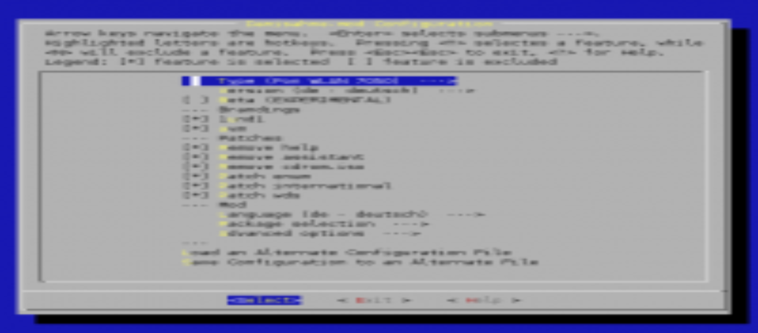

# Konfiguration

Zum Konfigurieren von Freetz kommt das Programm *conf/mconf* zum
Einsatz, welches dem ein oder anderen vielleicht von der Konfiguration
des Linux Kernels bekannt ist. Die
[ncurses](http://de.wikipedia.org/wiki/Ncurses)
Variante *mconf* kann mit dem Kommando `make menuconfig` aufgerufen
werden.

Eine Hilfe zu den einzelnen Punkten kann übrigens direkt in *menuconfig*
durch Eingabe von "?" aufgerufen werden.

### General

-   **Hardware Type**: Hier muss der Typ deiner Box gewählt werden.
    Standard ist "Fon WLAN 7170". Mit diesem Typ erstellte Images
    können nur auf die jeweilige Fritzbox hochgeladen werden. Abhängig
    vom Typ werden die Download URL
    der originalen Firmware auf dem [AVM FTP
    Server](ftp://ftp.avm.de/) und Parameter zum Erstellen
    des modifizierten Images, wie größe des Flash etc., automatisch
    gesetzt. Der Typ "Custom" macht diese "Custom options" sichtbar,
    wobei man hier gut mit seiner Box vertraut sein sollte.
-   **Version**: Für manche Fritzboxen (Typen) stellt AVM auch
    internationale Versionen der Firmware bereit, die aber auch nur auf
    internationalen Fritzboxen laufen. Internationale Fritzboxen gibt es
    für den Österreichischen / Schweizer Markt "a-ch" und das Englisch
    sprachige Ausland "en". Standard ist die für den Deutschen Markt
    bestimmte Version "de".
-   **Beta/Labor/VPN**: Ist eine Beta Version für die gewählte Fritzbox
    (Typ) verfügbar, so kann diese mit dieser Option zum Testen
    ausgewählt werden. An die Betas sollten sich nur Profis wagen, da
    Freetz hiermit meist nicht reibungslos bzw. garnicht funktioniert.
-   **Compile image for "alien" hardware** : Zur Erstellung eines
    Images für andere Hardware, als oben ausgewählt. Wer damit nichts
    anfangen kann, wählt es einfach nicht aus
    :-)
-   **Firmware language**: AVM stellt die Original-Firmware meist in
    mehreren Sprachen zur Verfügung - einfach die gewünschte auswählen.
    *Hat keinen Einfluss auf die von Freetz modifizierten Dinge (dazu
    siehe unten), sondern nur auf die
    Original-Firmware.*
-   **Replace kernel**: Den AVM-Kernel durch einen "selbstgebauten"
    ersetzen. Wiederum eine Sache für Profis
    :-)
-   **Show advanced options**: Ob die "erweiterten Optionen" (siehe
    unter Mod) angezeigt werden sollen.
-   **Branding**: Siehe unten.
-   **Annex**: Bei einigen internationalen Firmwares von AVM gibt es
    verschiedene Firmware Versionen für Annex A und Annex B.

### Brandings

Brandings sind von bestimmten Providern vorgenommene Änderungen an der
Firmware. Das aktuelle Branding der Box ist unabhängig von der Firmware.
Die modifizierte Firmware muss mindestens das aktuelle Branding der Box
enthalten. Tipp für Anfänger: Zunächst keine Brandings entfernen. Der
Platzersparnis trägt es nur geringfühgig bei; Images ohne das aktuelle
Branding werden aber von der Box nicht akzeptiert.

-   **1und1**: Gibt an, ob das 1und1 Branding in der modifizierten
    Firmware erhalten bleiben soll.
-   **avm**: Gibt an, ob das avm Branding in der modifizierten Firmware
    erhalten bleiben soll.
-   **avme**: Gibt an, ob das avme Branding in der modifizierten
    Firmware erhalten bleiben soll. Dieses Branding existiert nur bei
    internationalen nicht-Deutschen Firmware Versionen.
-   **aol**: Gibt an, ob das aol Branding in der modifizierten Firmware
    erhalten bleiben soll.
-   **arcor**: Gibt an, ob das arcor Branding in der modifizierten
    Firmware erhalten bleiben soll.
-   **freenet**: Gibt an, ob das freenet Branding in der modifizierten
    Firmware erhalten bleiben soll.

Changeset r2700 wurde die Logik der
Brandingauswahl umgekehrt. Ausgewählte Brandings werden ab jetzt
entfernt.

### Mod

-   **Language**: Die Auswahl der Sprache bezieht sich nur auf die
    Konfigurations-Webseiten von Freetz, nicht auf die der originalen
    Firmware. Es sind noch nicht alle Pakete in Englischer Sprache
    verfügbar. Standard ist Deutsch.
-   **Patches**: Siehe patches für
    eine aktuelle Übersicht.
-   **Package selection**: Auswahl der für Freetz verfügbaren Pakete /
    CGI Erweiterungen. Siehe Pakete
    für Details.
-   **Advanced options**
    -   **Override firmware source**: Falls die in der Konfiguration von
        Freetz hinterlegte Firmware Version des gewählten Typs nicht
        mehr auf dem FTP Server existiert, kann die
        Download URL mit dieser
        Option angepasst werden:
        -   **Firmware site**: z.B.:
            `ftp://ftp.avm.de/fritz.box/fritzbox.fon_wlan_7050/firmware`
        -   **Firmware source**: z.B.:
            `fritz.box_fon_wlan_7050.14.04.01.image`
    -   **Default Security level**: Wertebereich von 0 bis 2. Legt den
        standardmäßigen Security Level fest, welcher aktiviert wird,
        sofern kein anderer Wert auf der Box gespeichert ist. Standard
        ist 2 (alle Restriktionen aktiviert)
    -   **Verbosity level**: Wertebereich von 0 bis 2. Je höher die
        Zahl, desto mehr Meldungen werden beim Erstellen der Firmware
        ausgegeben. Standard ist 0.
    -   **Favicon**: Auswahl von kleinen Icons, die im Browser neben der
        URL der Fritzbox dargestellt werden. "none" installiert keine
        Favicons.
    -   **Add Freetz version to subversion string**: Fügt der im
        Web-Interface angezeigten (AVM-) Firmware-Version die
        Freetz-Version hinzu
    -   **Squashfs blocksize**: Die Blockgröße beeinflußt die
        Kompression des Images und die Zugriffszeit auf Dateien. Je
        größer die Blockgröße, desto besser die Kompression, jedoch wird
        die Zugriffszeit auf Dateien des Squashfs Images möglicherweise
        schlechter.
    -   **BusyBox options**: Listenauswahl aller Tools welche in die
        BusyBox integriert werden sollen.
    -   **Kernel modules**: Zusätzliche Kernelmodule. Jegliche Auswahl
        ist optional.
    -   **Shared libraries**: Zusätzliche Laufzeitbibliotheken. Jegliche
        Auswahl ist optional.
    -   **Compiler options**: Wer hier etwas ändert muss wissen was er
        tut.

