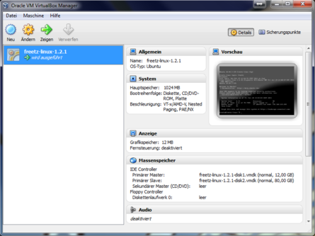
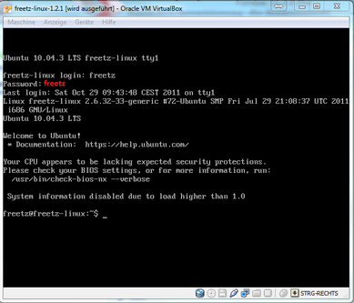
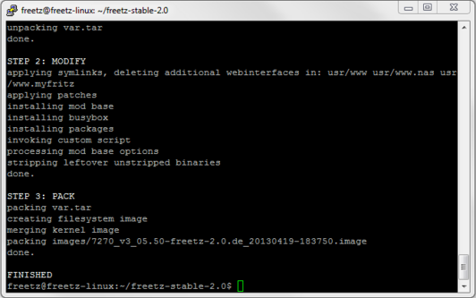

# Freetz for beginners

### Some questions

### What is Freetz?

A short description and a brief historical overview of Freetz can be
found here.


### What do I need to create a Freetz image?

1. The newest recovery-image (.exe) for your box. It's very important
that you have an up to date [recovery
image](ftp://ftp.avm.de/fritz.box) at hand.
([7170](ftp://ftp.avm.de/fritz.box/fritzbox.fon_wlan_7170/x_misc/),
[7270](ftp://ftp.avm.de/fritz.box/fritzbox.fon_wlan_7270/x_misc/)).
After a failed update you may not have any more internet access to
download a recovery image.
2a. A native Linux operating system, e.g.
[Ubuntu](http://www.ubuntu.com/) or
2b. for Windows users we recommend to install
[VirtualBox](https://www.virtualbox.org/wiki/Downloads/)
and to run
[Freetz-Linux](http://www.ip-phone-forum.de/showpost.php?p=1400234&postcount=1)
as virtual machine.
3. A SSH client
[PuTTY](http://the.earth.li/~sgtatham/putty/latest/x86/putty.exe)
(Can be used to connect to Freetz-Linux via ssh or telnet).


### What should I take into consideration?

Remember that your box is primarily a router with a telephone
switchboard. If you modify the firmware it might happen that the main
functions of the box are affected by that. Usually this shouldn't
happen, but it might cause your box to stall and unexpectedly reboot.
When selecting packages you should follow this rule: If you can't tell
someone more than two sentences about a package, it's not supposed to
be on your box. Be careful with the patches. You won't need them all of
them and not in every possible combination.
The use of "replace kernel", other comprehensive implementations or
own modules is not recommended for beginners. Not everything that seems
to be cool is really cool.
Recently there have been many issues with packages that use OpenSSL
libraries. The reason is the incompatibility between the AVM and the
Freetz version of this library. So please avoid using the SSL option in
any package (vsftp, dropbear, curl) for your first build or if they
require this option (OpenVPN, stunnel) avoid them in any case. When you
have more experience you can use OpenSSL by embedding them into the
binaries (compile them static) or use even more advanced solutions. But
please, don't do this in the very beginning! You will surely fail.


### What's my first Freetz-image supposed to do?

You can ask yourself the following question: ***"What do I want to
achieve by using Freetz"*** or ***"What function does my box lack and
can I add it through Freetz?"***\
Freetz itself is no modification but a development environment which is
used to to modify the box's firmware modularly. The list of packages
reflects the current users' needs. Everyone can build his own custom
firmware from the existing packages, add his own or omit unneeded ones.
This way you can decide to a certain degree which functions your
FritzBox will have.

First of all you should find out which packages are useful for you:
List of available packages and
add-ons


### Why should I start with a minimal image?

To find out how Freetz works and what the menu looks like after flashing
the firmware for the first time, we recommend beginners a to create a
minimal configuration and flash that image. Support requests regarding
Freetz and it's packages will only be answered after you have been able
to upload a minimal image to your box.


### Do I need to adjust my computer in any way to create an image?

You can find instructions for you computer's settings
HERE

### How do I create my first minimal image

Let's get this done even though you probably want to add more packages
later.
But first we need to check a few things.

-   Which model do I have (7141, 7270, etc.)?
-   How much RAM does my model have (16, 32 oder 64 MB)?
-   How big is the flash memory inside my box? (4, 8 or 16 MB)?
-   Do I have a working LAN-cable? If the flashing process fails the
    only way to recover your box is via LAN-cable (not WLAN).
-   Do I have a backup of my current settings? (Settings → System →
    Backup settings)
-   Do I have the right recover image?. [AVM FTP
    server](ftp://ftp.avm.de/fritz.box/) → Box → x_misc →
    english → ...recoverimage.....exe (you need Windows execute)
-   Do I need how to run the recovery file? If not, this link might help
    [Link to
    AVM](http://www.avm.de/de/Service/FAQs/FAQ_Sammlung/12798.php3)
    or this [Offline
    PDF](http://www.router-faq.de/fb/recover/firmware-recover.pdf)
    from Router-FAQ.
-   My Linux is configurated correctly and all needed packages for Freetz?
-   Is my current firmware supported by Freetz? 'Supported devices and
    firmwares'

Now we will create the minimal image:

-   These instructions are written for those that want to modify their
    Fritzbox for the first time by using Freetz.
-   We can not guarantee for the correctness of our instructions, nor do
    we take responsibility for any damages caused to your device!
-   By using Freetz, the functional range of your AVM FritzBox can be
    expanded.
-   Freetz is based on Linux and can be used on a Linux machine or run
    in a so-called virtual machine. As most current users don't own a
    Linux machine we will concentrate on the virtual machine.
-   Freetz creates a new firmware image which can be upload to the box
    via the offical AVM interface.

You decide which packages will be included, the number is only limited
by your routers available memory.

### Starting Freetz

Now we start VirtualBox and select the correspondingnd VM-image.
Freetz-Linux will then start and you can login using: **freetz** and
**freetz** as username and password followed by the enter key each
time.

[](../../screenshots/226.png)

[](../../screenshots/227.png)

The next step is to find out which ip is assigned to our Freetz-Linux
since we need it to get access via putty in the next step. To check,
type in: **ifconfig**. This should bring up the following text.

```
eth0      Link encap:Ethernet  HWaddr 00:11:22:33:44:55
          inet addr:192.168.178.30  Bcast:192.168.178.255  Mask:255.255.255.0
          UP BROADCAST NOTRAILERS RUNNING MULTICAST  MTU:1500  Metric:1
          RX packets:0 errors:0 dropped:0 overruns:0 frame:0
          TX packets:0 errors:0 dropped:0 overruns:0 carrier:0
          collisions:0 txqueuelen:1000
          RX bytes:0 (0 Mb)  TX bytes:0 (0 Mb)
```

As you can see, the virtual machine's ip address is **192.168.178.30**.
The ip address can differ from system to system, that depends on the ip
range of your system. If no ip address is shown at all you have to check
your computers or virtual machine's settings and try again.

**IMPORTANT:** you can switch between the VM and Windows by using
**Right CTRL**\
We will use this right away to start
[PuTTy](http://the.earth.li/~sgtatham/putty/latest/x86/putty.exe)

### Starting PuTTY

Starting PuTTY.EXE on a Windows computer. You should see the following
picture where you enter the VM's (Freetz-Linux's) ip address and
confirm by clicking on **Open**.

[](../../screenshots/148.jpg)

[](../../screenshots/149.png)

[](../../screenshots/150.jpg)

The access data for PuTTy are login: **freetz** password: **freetz**\
Please be aware that the password is not shown while typing. After
connecting to the Freetz-VM you should update it by entering the
following commands:

 * **sudo apt-get update** (update the package lists)
 * **sudo apt-get upgrade -d** (download updates)
 * **sudo apt-get upgrade -y** (install updates)

Confirm each command by entering the administrator password **freetz**.
(If there should be a special inquiry for a certain update, activate the
system advisors packages and activate by hitting ok).

Next, enter the following command:

> **svn checkout URL**

This will download the newest stable Freetz source code (in this case:
version 2.0) from the subversion repository. Here you can find out if a
newer version has been released: tags/.
After the download has finished you will see this message: **Checked out
revision xxxx**, e.g. xxxx=6526. Please look into FIRMWARES file for
supported firmwares. The release version can be out of date.
Change directory by entering **cd freetz-stable** into your Freetz
directory and enter **make menuconfig**.

### Settings in menuconfig

After entering the previous command you should the the following
screen:

[](../../screenshots/154.png)

This is the acutal Freetz interface where you select your router. For
this tutorial we selected the 7270-V3. After selecting the router type,
exit menuconfig by selecting exit and hitting enter and confirm the
question with **Yes**. Then enter **make** and hit enter. Now you should
see this:

[](../../screenshots/156.png)

The creation process will start. For the first time it might take a very
long time depending on your computer and internet connection since all
inital packages have to be downloaded. Once this is done the creation
process will be a lot faster if you make only small modifications. There
have been many warnings during the process but in the end there will be
a message that an image has been created. The corresponding image will
be created in the subfolder **images** of your Freetz directory. This
will be the final message:

[](../../screenshots/157.png)

Now we have to copy the image to your computer.

### Copying the image to your computer

More informations can be found
HERE

### Shutdown Freetz-Linux

You can now shot down your Ubuntu-Linux by typing: **sudo shutdown -h
now**.This command needs to be verified by typing in the administartor
password**freetz**.

### The flashing process

[](../../screenshots/78.jpg)

Once the image is on your computer you may start. But you need to make
sure to be prepared for the most unusual things to happen, e.g. that the
box does not function correctly after flashing. Therefore we urge you to
take precautions:

> 1. Download the recover image for
> your box: You can find the **Recover.exe** on AVM's [FTP
> site](ftp://ftp.avm.de/fritz.box)
> 2. Upgrade your router to the newest firmware.
> 3. Have your access data at hand
> 4. Backup your FritzBox settings
> 5. Make sure you've set a password in the AVM-GUI. Even a simple
> **0000** is sufficient, otherwise you won't be able to upload the
> firmware

Now you are ready to go. Go to your FritzBox webinterface to update your
firmware, select the Freetz image and start the process. A notice will
show up informing you that the firmware you are about to upload to your
router is not an officially approved firmware which you have to confirm.
Then your router will restart in about 1-2 minutes. The AVM webinterface
should show up again and you can log into your box again. Now you will
have an additional Freetz interface which can be accessed through
**[http://fritz.box:81](http://fritz.box:81)**. For
the first time you can log into it using **admin** and **freetz** but
you should change that password.
Congratulations! Your first Freetz-Image is now on your box.


