# Wie könnte mein nächstes Image aussehen

Freetz-Image inkl. AVM-Firewall CGI, SAMBA und VSFTP

### VirtualBox starten

[Wie starte ich VirtualBox](../newbie.html#StartenvonFreetz). Dieser
Pkt. kann aber übersprungen werden, wenn VirtualBox und Putty noch
gestartet sind.

### Einstellen des menuconfig

Zur Erstellung eines neuen Image müssen wir wieder das **menuconfig**
aufrufen.

[](../../screenshots/154.png)

In dieser Oberfläche wählt man dann den zu patchenden Router und die
gewünschten Pakete aus. Für dieses HowTo haben wir Beispielhaft die
7270_v3 gewählt.


[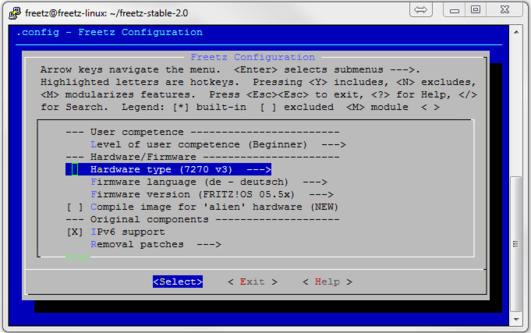](../../screenshots/259.png)


Dieses Image soll am Ende folgende Elemente enthalten und darum wählen
wir nun folgende Punkt aus:\

**a. unter other patches:**\

-   **FREETZMOUNT : Patch AVMs hotplug script, .....**
-   **Automount filesystem** einfach gesetzt lassen.
-   **ext2** (linux Dateisystem)
-   **ext3** (linux Dateisystem)
-   **fat** /Windows Dateisystem)
-   **NTFS** (Muß aktivier sein wenn man NTFS formatierte Platten an der
    Box nutzen möchte)\

[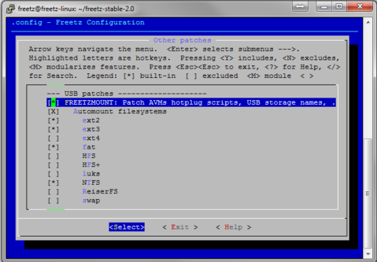](../../screenshots/92.png)

**b. unter Packages ---\> Web interface ---\>**\

-   **AVM-Firewall 2.0.4_rc5** (Web-Oberfläche um die von AVM dem User
    vorenthaltene integrierte Firewall zu administrieren)\
-   **spindown-cgi 0.2** (Web-Oberfläche für sg3_utils (Sleep-Modus für
    angeschlossene Festplatten)\
-   **Syslogd CGI** (Log-Datei zum Auswerten vom System z.B. bei der
    Fehlersuche)\

[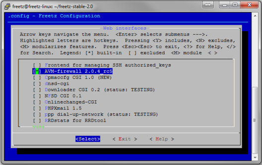](../../screenshots/94.png)

**c. unter unter Packages ---\> Standard packages ---\>**\

-   **Samba suite** ---\> **version (samba 3.0.37)** (dies ist der
    Server der den Zugriff auf die USB Medien an der FB von Windows
    erlaubt).
    -   Ebenfalls müssen folgende Haken bei folgenden Unterpunkten
        gesetzt werden:\
        -   **smbd** (file sharing server)
        -   **nmbd** (NetBIOS name server)
        -   **smbclient**
        -   **nmblookup**

[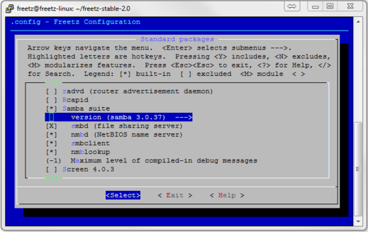](../../screenshots/260.png)

-   **vsftp 3.0.2** (FTP-Server). Hier bitte keine weiteren Haken bei
    den Unterpunkten setzen.

[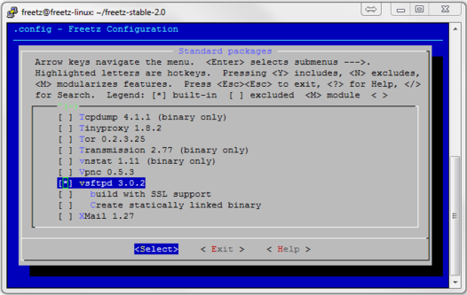](../../screenshots/164.png)

Weitere Pakete und Patches incl. der Beschreibungen findet ihr auf der
Website : wiki:packages\
Nachdem alle Pakete und Patches ausgewählt sind, beendet man Freetz und
gibt auf der Kommandozeile der Shell Konsole **make** ein.
Der Rest des Buildprozesses läuft wieder wie gewohnt ab. Die
Abschlussmeldung sieht dann wie folgt aus:

[](../../screenshots/157.png)


Nun müssen wir das Image auf den PC kopieren.

### Image auf den PC kopieren

Info's findet ihr HIER\

### Freetz-Linux beenden

Euer Ubuntu-Linux könnt ihr nun mit dem Befehl : **sudo shutdown -h
now** sauber herunter fahren. Diese Eingabe muß jedoch noch mit einem
**freetz** erneut bestätigt werden.

### Der Flashvorgang

Info's zum Flashforgang sind
HIER zu finden.

#### Konfiguration der neuen Plugins

Nachdem eure FB wieder problemlos angelaufen ist, könnt ihr wie gewohnt
per Browser über
**[http://fritz.box](http://fritz.box)** einloggen.
Zusätzlich gibt es aber jetzt die Freetz Oberfläche, die über den Link
**[http://fritz.box:81](http://fritz.box:81)**
erreicht werden kann. Hier loggt man sich mit **admin** und **freetz**
ein. Danach sieht man folgende Maske:

[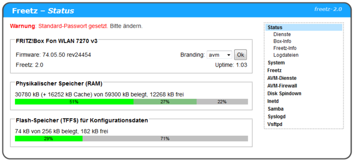](../../screenshots/261.png)


### Freetz-WebIF einstellen

1. Wechseln nach ⇒ **Freetz** ⇒ **Einstellungen** und dort unter
**Freetzmount** den Haken bei **Partitionsname (falls vorhanden) als
Mountpoint nutzen**.

[](../../screenshots/262.png)

2. Wechseln nach ⇒ **Freetz** ⇒ **Weboberfläche** und kontrollieren ob
dort folgende Haken gesetzt sind:

-   **Untermenü**
-   **Hauptseite**
-   **mit Knöpfen**
-   **Box-Info**
-   **Freetz-Info**

[](../../screenshots/263.png)


### USB-Stick erstellen

Nun formatieren wir unseren USB-Stick oder USB-Festplatte am PC in
**NTFS**, und geben ihm den Namen **USB** und legen folgende Ordner
darauf an:

-   **admin**
    -   **gast (Unterordner von admin)**
    -   **musik (Unterordner von admin)**
    -   **bilder (Unterordner von admin)**
    -   **filme (Unterordner von admin)**
    -   **dokumente (Unterordner von admin)**

Diesen so erstellten Stick stecken wir nun in den USB-Port der Fritzbox
und starten diese neu (reboot).
Nach dem Reboot solltet ihr nun folgendes Freetz-Menu sehen:\

[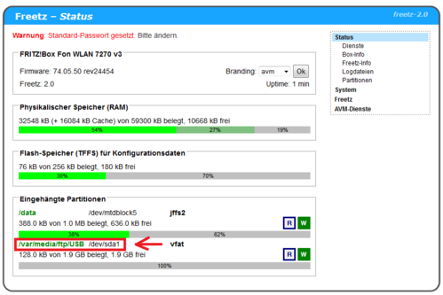](../../screenshots/264.png)

Ganz unten kann man nun sehen das der USB-Stick als **USB**
(/var/media/ftp/**USB** ) gemountet wurde. Sollte dort **uStor01**
stehen, müsst ihr die letzten Schritte nochmals kontrollieren.

### SWAP-File einrichten

1. Wechseln nach ⇒ **Freetz** ⇒ **Einstellungen**\
2. unter **Swap** den Pkt. **Aktiviert** aktivieren.
3. unter Pfad tragen wir nun folgendes ein:
**/var/media/ftp/USB/swapfile**\
4. und unter Größe : **20** ein.
5. nun drücken wir den Button **Swap-Datei anlegen**\
6. Im nächsten Fenster sollte man jetzt sehen wie die SWAP-Datei
angelegt wird.

```
	Erstelle leere Datei ...
	20+0 records in
	20+0 records out
	Bereite Datei für Swap-Benutzung vor ...
	Setting up swapspace version 1, size = 20967424 bytes
```

Dieses Fenster kann man danach einfach schließen.
Sollte alles richtig eingestellt sein, kann man SWAP über den Button
Start nun starten. Die Anzeige **stopped** sollte nach **running**
wechseln.


### Samba

#### Einstellungen

##### Starttyp

alles auf **Automatisch**\

##### Konfiguration:

-   Samba security = Share
-   Benutzername: ftpuser
-   Passwort: \* \* \* \* \* \* (einfach leer lassen, Die Pkt. werden
    trotzdem angezeigt)
-   IP-Adresse: 192.168.178.1(255.255.255.0
-   Netbios Name: NAS
-   Arbeitsgruppe: WORKGROUP
-   Beschreibung: %h (Samba %v) ⇒ (ich würde diesen Inhalt löschen)
-   OS Level für Election: 20
-   Haken bei Bevorzugter Master

##### Standardfreigaben

Beide Haken setzen / gesetzt lassen\

[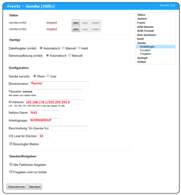](../../screenshots/79.png)

#### Erweitert

In das leere Feld kopiert man nun folgenden Text:\

```
	log level = 1
	socket options = TCP_NODELAY IPTOS_LOWDELAY
	read raw = yes
	write raw = yes
	oplocks = yes
	max xmit = 65535
	dead time = 15
	getwd cache = yes
	lpq cache = 30
	unix charset = UTF-8
```

#### Freigaben

In das leere Feld kopiert man nun folgenden Text:\

```
	/var/media/ftp/USB USB-Stick 1 0 - USB-Stick
	/var/media/ftp/USB/data/gast Gast 1 0 - Gast
	/var/media/ftp/USB/data/musik Musik 1 0 - Musik
	/var/media/ftp/USB/data/filme Filme 1 0 - Filme
	/var/media/ftp/USB/data/bilder Bilder 1 0 - Bilder
	/var/media/ftp/USB/data/dokumente Dokumente 1 0 - Dokumente
```

Wir haben nun 6 Windows-Freigaben für unserem USB-Stick erzeugt.

-   **USB-Stick** (hier sieht man den gesamten Inhalt des Sticks)
-   **Gast** (Freigegebener Ordner)
-   **Musik** (Freigegebener Ordner)
-   **Filme** (Freigegebener Ordner)
-   **Bilder** (Freigegebener Ordner)
-   **Dokumente** (Freigegebener Ordner)

[](../../screenshots/265.png)

Diese können nun per **Netzlaufwerk verbinden** mit dem PC verbinden.

Hier eine kurze Beschreibung der Parameter anhand der ersten Freigabe:
(Diese Einträge sind jedoch nur möglich, wenn die aktuelle
Sicherheitsstufe
auf 0 gesetzt ist bzw. wird.)\

**Beispiel:**

```
	/var/media/ftp/USB USB-Stick 1 0 - USB-Stick
```

> **/var/media/ftp/USB** dies ist der interner Pfad zum USB-Stick\
> **/USB-Stick** das ist das Freigegebenes Verzeichnis\
> **USB-Stick** Name der Freigabe der in der Windows-Netzwerkumgebung
> als Freigabe angezeigt wird.
> **1** Gast-Zugang erlaubt, kein Benutzername und Passwort nötig\
> **0** Schreib-Lesezugriff aktiviert\
> **-** Grund für das - ????? (Muß rein, Begründung folgt !)\
> **USB-Stick** Kommentar\

Da wir als Netbiosname **NAS** vergeben hatte, lautet der Zugriff von
Windows auf die Freigabe nun:

```
	\\NAS\USB-Stick
```

[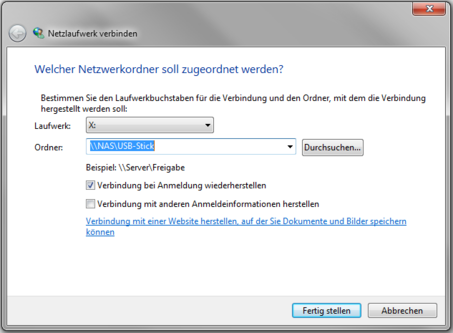](../../screenshots/266.png)


### VSFTPD

#### Einstellungen

##### Starttyp

Starttyp auf **Automatisch** stellen

##### FTP Server

Server binden an Port: 2121 (Dieser Port muß von 21 nach 2121 geändert
werden da sich sonst VSFTPD nicht starten läßt. Möchte man den Port 21
benutzen, muß der AVM-FTP (ftpd) gestoppt werden (inetd muß dazu unter
Dienste auf stopped gesetzt werden).

> **Achtung, das Stoppen von ftpd hat aber Auswirkung auf einige
> AVM-Dienste**\

##### Zugriff

Folgende Haken müssen wie folgt gesetzt sei:

-   **Anonymes FTP =** Nein
-   **Lokale Benutzer =** **Ja**
-   **chroot jail =** **Ja**
-   **Erlaube root login =** Nein
-   **Erlaube ftpuser login =** Nein

##### Erweiterte Einstellungen

-   Anzahl Verbindungen:
    -   insgesamt : **25**
    -   pro Client : **25**
-   Passive Ports:
    -   Minimum : **0**
    -   Maximum : **0**
-   Sonst sind keine Haken gesetzt

[](../../screenshots/267.png)

##### Zusätzliche Konfigurationsoptionen (für Experten)

In das leere Feld kopiert man nun folgenden Text:\

```
	user_config_dir=/var/media/ftp/USB/vsftp_user_conf
```

##### Logging

-   Logging aktivieren = angehakt
-   zusätzlich Protokoll-Log = leer

<!-- -->

-   Syslog = deaktiviert
-   Datei = aktiviert mit folgendem Text:

    ```
		/var/media/ftp/USB/logs/vsftpd.log
    ```

[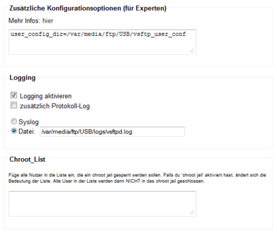](../../screenshots/268.png)

##### Änderungen am USB-Stick

Folgende Ordner müssen noch direkt auf dem USB-Stick erzeugt werden:

-   **logs**
-   **vsftp_user_conf**

In diese Ordner kopieren wir nun die Datein aus diesem
[ZIP](/attachment/wiki/help/howtos/common/newbie/other/vsftpd.zip) wie
folgt:

-   **logs**
    -   syslog.log
    -   vsftpd.log
-   **vsftp_user_conf**
    -   admin
    -   gast
    -   mary
    -   paul

Das Kopieren der Dateien kann ja nun Dank gestartetem SAMBA direkt
passieren ohne das der USB-Stick von der Box getrennt werden muß.

#### Rechtevergabe für FTP-User (wie ändere ich die Beispieldateien aus dem ZIP richtig)

Ob ein Neuer FTP-User Schreibrechte erhalten soll oder nur lesen können
soll wird wie folgt geregelt:\
Jeder Benutzer erhält eine Datei mit seinem Dateinamen im Ordner
**/var/media/ftp/USB/vsftp_user_conf/**

##### Inhalt der Datei :

1. Mary und Admin: **write_enable=yes** (User hat Schreibrechte und Löschrechte)
2. Gast : **write_enable=no** (User hat **keine** Schreibrechte)
3. Paul : Über diese Benutzerdateien ist es auch möglich einzelne FTP-Befehle
([Liste](http://en.wikipedia.org/wiki/List_of_FTP_commands))
für Benutzer zu verbieten. Hierzu fügt man folgende Zeile in die Datei
ein und entfernt die Befehle die der User nicht ausführen darf:
```
	cmds_allowed=ABOR,ACCT,ALLO,APPE,AUTH,CDUP,CWD,DELE,EPRT,EPSV,FEAT,HELP,LIST,MDTM,MKD,MODE,NLST,NOOP,OPTS,PASS,PASV,PBSZ,PORT,PROT,PWD,QUIT,REIN,REST,RETR,RMD,RNFR,RNTO,SITE,SMNT,STAT,STOR,STOU,STRU,SYST,TYPE,USER
```
   So mit darf Paul Dateien auf den FTP kopieren und Verzeichnisse anlegen,
   jedoch diese nicht wieder löschen. Also muß folgendes in der Datei
   stehen:
```
	cmds_allowed=ABOR,ACCT,ALLO,APPE,AUTH,CDUP,CWD,EPRT,EPSV,FEAT,HELP,LIST,MDTM,MKD,MODE,NLST,NOOP,OPTS,PASS,PASV,PBSZ,PORT,PROT,PWD,QUIT,REIN,REST,RETR,RNFR,RNTO,SITE,SMNT,STAT,STOR,STOU,STRU,SYST,TYPE,USER
```

> **DELE** (Delete file), **RMD** (Remove a directory) wurden aus dem
> oben angegebenen String gelöscht.
> \
> \
> Sollte etwas immer noch nicht gehen, dann den Router einfach nochmal
> neu starten.(Reboot der FritzBox).

### FTP-User erzeugen

1. **Telnet-Dienst** unter Freetz ⇒ Dienste starten.
2. [Putty starten](../newbie.html#PuTTYstarten) und sich per telnet mit
der Box verbinden (nicht per ssh)\

> Putty wird wie folgt eingestellt:

[](../../screenshots/87.jpg)

> Nach drücken von **Open** und Eingabe folgender Daten **\[ login: root
> \]** und **\[ Password: freetz \]** solltet ihr folgendes Bild sehen:

[](../../screenshots/88.jpg)


3. Nach dem Einloggen können wir nun beginnen FTP-User anzulegen.

#### Wie ist der adduser-Befehl:

> `adduser -h '''Verzeichnis''' '''Benutzername'''`\
>
> > **Verzeichnis**: Ordner auf dem Stick, der dem Benutzer zugeordnet
> > werden soll, z.B. **/var/media/ftp/USB/**\
> > **Benutzername**: Name des Benutzers\

Beim Erstellen des Benutzers wird danach gleich das Passwort abgefragt.
Dieses muss zweimal eingegeben werden, und es wird dabei nichts am
Bildschirm angezeigt, auch keine Sterne.

##### FTP-User für unser Image anlegen:

Erzeugen wollen wir nun folgende User:\

-   **admin**
-   **paul**
-   **mary**
-   **gast**

Hierzu werden nun folgende Befehle in Putty eingegeben (Bitte auf Groß
und Kleinschreibung achten):

###### admin

```
	adduser -h /var/media/ftp/USB admin
```

###### paul

```
	adduser -h /var/media/ftp/USB/data paul
```

###### mary

```
	adduser -h /var/media/ftp/USB/data mary
```

###### gast

```
	adduser -h /var/media/ftp/USB/data/gast gast
```

So sollte z.B. die Meldung für admin im Putty-Fenster aussehen:\

```
	/var/mod/root # adduser -h /var/media/ftp/USB admin
	adduser: /var/media/ftp/USB: Operation not permitted
	Changing password for admin
	New password:
	Bad password: too short
	Retype password:
	Password for admin changed by root
```

Die Meldung `Operation not permitted` kommt, wenn es sich um ein
Dateisystem mit FAT oder NTFS Dateisystem handelt.

Wenn man das Paßwort erneut wegen Falscheingabe ändern will, verwendet
man dazu den Befehl `passwd `**`Benutzername`**. Man wird dann wieder
zweimal nach dem neuen Paßwort gefragt.
Einen Benutzer löschen kann man mit dem Befehl
`deluser `**`Benutzername`**.
In jedem Fall müssen die Änderungen mit dem Befehl **modsave all**
wieder gespeichert werden.
Anzeigen kann man die Datei mit dem Befehl **cat /var/tmp/passwd**.
Nun melden wir uns noch mit folgendem Befehl von der Putty Konsole ab:\

```
	exit
```

### AVM-Firewall

#### Einstellungsseite

1. Seite wechseln über den Pkt. Forwarding). 2. FTP-Port freigegeben
siehe Bilder).

[](../../screenshots/85.jpg)

Nach eingabe der Zahlen (siehe Oben) einfach auf **Hinzufügen** drücken
und das Ergenbins sollte wie Folgt aussehen:

[](../../screenshots/86.jpg)

Um diese Einstellung nun endgültig zu speichern einfach den Haken
(Blinkendes Kästchen) setzen und den Reeboot der Box abwarten.

### Sonstige Fragen

### Wie muß ich meinen PC einstellen damit ich ein Image bauen kann

#### Linux

Bei Fragen zu Linux bitte hier nachsehen

#### Windows

Für die Installation braucht ihr einen virtuellen PC (z.B. VirtualBox)
sowie ein Linux-System wie z.B.:Freetz-Linux:\
1. [VirtualBox-Player](https://www.virtualbox.org/wiki/Downloads/)downloaden und über die Setup.exe installieren.
2. [Freetz-Linux](http://sourceforge.net/projects/freetz-linux/files/freetz-linux-1.3.2/) herrunterladen und danach nach **C:\\Freetz-Linux** kopieren.
3. VirtualBox starten

[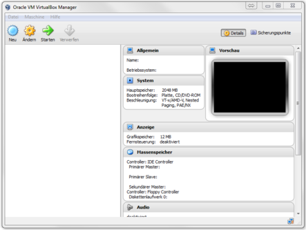](../../screenshots/269.png)

4. VirtualBox-Image (freetz-linux-1.3.1.ova) einbinden über Datei ⇒
Appliance für Import ⇒ freetz-linux-1.3.1.ova (einfach durchklicken bis
die Datei importiert wird.)

[](../../screenshots/270.png)

5. VM starten über doppelklick auf **freetz-linux**
6. Solltet ihr folgenden Fehler beim starten haben:

[](../../screenshots/271.png)

müßt ihr die VB noch auf Eure Netzwerkkarte einstellen:

[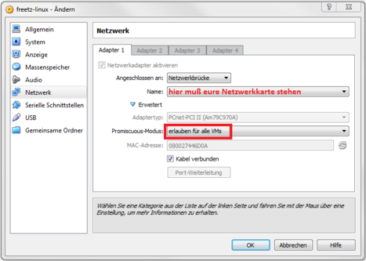](../../screenshots/272.png)

### Image auf den PC kopieren

Es gibt mehere Arten das fertige Image auf den PC zu kopieren:\

> **a. per FTP und !!TotalCommander:**

Den aktuellen TotalComander findet ihr auf der Homepage vom
[TotalCommander](http://www.ghisler.com/ddownload.htm)\

Als nächstes müssen wir die Ip-Adresse des Freetz-Linux ermitteln und
das machen wir über den Befehl **ifconfig** in der
Freetz-Linux-Umgebung:

[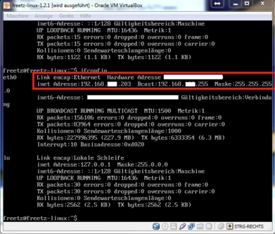](../../screenshots/102.png)

Als nächstes installieren wir den TotalCommander auf dem PC und starten
diesen dann. Die Freewaremeldung muss mit dem drücken der entsprechenden
Zahl (hier im Bsp. die 1. bestätigt werden. Durch das drücken entstehen
keine weiteren Kosten!

[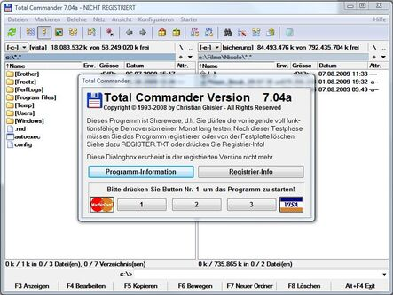](../../screenshots/103.jpg)

Nun richten wir die FTP-Verbindung im TC (TotalCommander) ein:\

[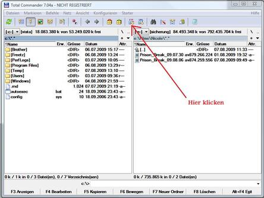](../../screenshots/104.jpg)

[](../../screenshots/105.jpg)

[](../../screenshots/106.jpg)

[](../../screenshots/107.jpg)

[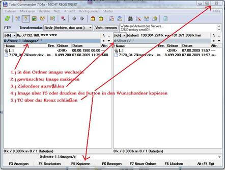](../../screenshots/108.jpg)

> **b. per SFTP und WinSCP:**\

Hier nun der Weg per SFTP:\
Besorgt Euch einen SFTP-Client, z.B.
[WinSCP](http://www.winscp.net/).
Ihr benötigt die IP-Adresse Eures virtuellen Freetz-Linux, diese erfährt
man durch

```
	ifconfig
```

Nach Start von WinSCP kann man im Ameldefenster die erforderlichen Daten eingeben:
´´´
	Rechnername: eben ermittelte IP-Adresse
	Portnummer: 22
	Benutzername: freetz
	Kennwort: freetz
	Protokoll: SFTP
´´´

Nach erfolgreicher Verbindung navigiert man in einer NC-artigen Ansicht
zum entsprechenden /images Verzeichnis und kopiert sich die Firmware mit
**F5 Kopieren**.

Nach erfolgreicher Verbindung navigiert man in einer NC-artigen Ansicht
zum entsprechenden /images Verzeichnis und kopiert sich die Firmware mit
**F5 Kopieren**.


> **c. Using a mapped network drive:**\

Freetz-linux has samba configured by default, which allows you to map
the freetz-linux drive as a network drive in Windows.

[](../../screenshots/275.png)

For username and password: freetz/freetz\

### Wie kann man eine gefreetzte Fritzbox updaten

Eine genaue Beschreibung und alles was ihr wissen müßt zu diesem Thema
steht in den FAQ's

### Einige Programme haben ähnliche Funktionen, welche sind performanter?

> FTP: bftpd ist nicht zu empfehlen wenn Wert auf hohen Datendurchsatz
> gelegt wird da man damit nur in etwa die Hälft der möglichen Leistung
> erreicht. Vsftpd wird von sehr vielen benutzt und wird daher
> empfohlen\
> WWW: Wer Webseiten auf seiner Box hostet sollte vom Apache Abstand
> nehmen wenn es in Richtung Produktivsystem geht. Lighttpd stellt eine
> gute Alternative dar.
> Webfilter: Oft wird gefragt ob man Privoxy zum Seitenfiltern nutzen
> kann. Die Antwort ist ja, die bisherige Empfehlung war das aber eher
> zu vermeiden und stattdessen Iptables zu nutzen weil sonst das gesamte
> Internet langsamer läuft.


### Linux-Befehle (Zielgruppe Newbies)

### allgemeine Linux-Befehle

Einen Grundsatz an Linux-Befehlen findet Ihr:\

1. [Link 1](http://www.linux-fuer-alle.de/doc_show.php?docid=33)
2. [Link 2](http://www.larsrichter-online.de/lmember/linuxbefehle.php)

### Der vi Editor


**Vi** ist ein Texteditor in der Freetz/Linux-Umgebung. Mit diesem
können Dateien und Skripte bearbeitet werden.
Dieses Möglichkeit sollte aber von Newbies **nur nach Anweisung oder in
Zusammenarbeit mit einem erfahrenen Freetz-Nutzer/Linux-Profi** genutzt
werden, da es sehr einfach ist die Box mit **vi nicht mehr erreichbar zu
machen**. Für die Konfigurationsdateien im Flash der FritzBox muss das
Skript nvi genutzt werden, da man diese Dateien nicht direkt mit vi
bearbeiten kann. Mit **nvi** geht es noch schneller die Box lahm zu
legen! **nvi** überschreibt auch, wenn man nichts geändert hat.

1. [Kurzanleitung Editor "vi"](http://www.my-space.li/schule/editor_VI.pdf)
2. [Hilfe aus dem IPPF](http://www.ip-phone-forum.de/showthread.php?p=313356)
3. [weitere Homepage](http://www.jux-net.info/jux2/docs/sys100/comm_13.html)


