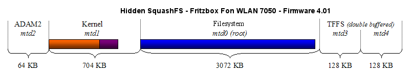

# Flash Partitionierung

Im Flash der Fritzbox befinden sich bei jedem Modell folgende
funktionale Einheiten:

-   Bootloader: ADAM2 / EVA (+ Werkseinstellungen)
-   Kernel: Linux 2.4.17_mvl21-malta-mips_fp_le, 2.6.13.1-ar7/ohio
    oder höher *(gzip oder lzma komprimiert)*
-   Dateisystem:
    [SquashFS](http://de.wikipedia.org/wiki/Squashfs)
    *(gzip oder lzma)* oder
    [YAFFS2](http://de.wikipedia.org/wiki/YAFFS2)
-   Konfigurations-Dateien + Environment: TFFS

Bei der Flash Einteilung der Fritzboxen entstanden über die Jahre einige
"Geschmacksrichtungen". Das Grundkonzept entspringt TI und deren ADAM2
Bootloader, der die Partitionstabellen verwaltet. Unabhängig von der
Reihenfolge im Speicher wurde festgelegt dass `mtd0` das root
Dateisystem enthalten soll, `mtd1` das Kernel, `mtd2` ADAM2 selbst und
`mtd3` die Konfiguration. Letztere muss häufig geschrieben werden und
trotzdem fehlerfrei sein und nutzt dabei das Flash ab. Um dies sicherer
zu gestalten entwickelte AVM das TFFS, das durch doppelte "Pufferung"
zwei gleich grosse Partitionen `mtd3` und `mtd4` benötigt.

ADAM2 bzw später AVM's funktionsgleicher Ersatz EVA wird ab Werk
installiert und wurde nur in eher seltenen Sonderfällen aktualisiert.
Ein Firmware Update aktualisiert dagegen immer Kernel und root
Dateisystem, beim ursprünglichen Konzept mit den enthaltenen Dateien
`filesystem.image` für `mtd0` und `kernel.image` für `mtd1`.

Uber die Jahre stellte sich heraus dass der Platzbedarf für Kernel und
Dateisystem kaum dauerhaft vorhersagbar ist und dass die Partitionierung
gar eine Hürde wurde da beide Komponenten verschieden stark wuchsen. Es
entstanden einige trickreiche Abwandelungen die diese Barriere
aushebelten. Ab Kernel 2.6 verzichtete man dann ganz auf die Trennung um
die Problematik zu umgehen. Bei neuen Modellen mit im Vergleich fast
unbegrenztem NAND-Flash führte man die Trennung wieder ein.

**Achtung:** Alle in diesem Artikel genannten mtd Nummern beziehen sich
auf die im Environment gespeicherten Partitionstabellen. Die Nummern der
im Linux erreichbaren mtd Devices werden vom Kernel vergeben und weichen
oft von den ADAM2/EVA Numerierung ab!

Um aus dem Linux heraus auf das Environment zugreifen zu können gibt es
die ADAM2 API, die je nach Kernel Version an verschiedenen Stellen in
/proc erreichbar ist.

Um die Environment mtd Tabelle unter Kernel 2.4 zu lesen kann

```
	cat /proc/sys/dev/adam2/environment | grep mtd
```

abgerufen werden. Ab Kernel 2.6 muss es so aussehen:

```
	cat /proc/sys/urlader/environment | grep mtd
```

Die Liste aller Linux mtd Devices erhält man mit:

```
	cat /proc/mtd
```

Da die Linux Partitionen von den MTD Treibern im Kernel ermittelt werden
weichen Nummerierung und Größen teilweise erheblich von der
Partitionierung im Environment ab.

Im Folgenden werden alle verwendeten Partitionsschemata einzeln
beleuchtet.

### Hidden SquashFS

[](../../screenshots/55.png)

Folgende Firmware verwendet Hidden SquashFS im NOR-Flash mit Kernel 2.4:

-   2 MB Flash
    -   Fritzbox SL (03.48 bis 03.73)
    -   Fritzbox 2030 (03.73 bis 03.80)
-   4 MB Flash
    -   Eumex 300 IP (alte)
    -   Fritzbox (03.29 bis 4.02, auch int)
    -   Fritzbox SL WLAN (03.65 bis 04.15)
    -   Fritzbox WLAN 3030 (03.65 bis 04.15)
    -   Fritzbox WLAN 3050 (03.63 bis 04.07)
    -   Fritzbox Fon (03.37 bis 04.27, auch int)
    -   Fritzbox Fon 5050 (03.69 bis 04.26)
    -   Fritzbox Fon ATA (03.64 bis 04.28-Beta, auch int)
    -   Fritzbox Fon WLAN (03.42 bis 04.27, auch int)
    -   Fritzbox Fon WLAN 7050 (03.58 bis 4.01)

Das Hidden SquashFS beginnt direkt hinter dem Kernel (256 Byte Padding)
und enthält vor allem Treiber. Es wird während des Bootvorgangs im
Startskript `rc.S` gemounted. Der Kernel und das Hidden SquashFS
befinden sich in `kernel.image`, das root Dateisystem in
`filesystem.image`. Diese Technik wurde verwendet um proprietäre
Binär-Module von TI vom root Dateisystem zu separieren. Das Hidden
SquashFS enthält Dateien wie `avalanche_cpmac.o`, `avalanche_usb.o`,
`tiatm.o` ohne jegliche Unterverzeichnisse und wird nach
`/lib/modules/2.4.17_mvl21-malta-mips_fp_le/kernel/hidden` gemountet.

[](../../screenshots/56.png)

### Contiguous SquashFS

[](../../screenshots/55.png)

Folgende Firmware verwendet Contiguous SquashFS im NOR-Flash mit Kernel
2.4:

-   2 MB Flash
    -   Fritzbox SL (03.92 bis 03.94)
    -   Fritzbox 2030 (03.92 bis 03.93)
-   4 MB Flash
    -   Fritzbox Fon WLAN 7050 (04.03-Beta bis 04.26, auch int)

Beim Contiguous SquashFS fängt das root Dateisystem direkt nach dem
Kernel an (256 Byte Padding). Da das root Dateisystem nun über `mtd0`
und `mtd1` verteilt liegt, muss es im Firmware Update auch
dementsprechend auf die Dateien `kernel.image` (Kernel + Anfang des root
Dateisystems) und `filesystem.image` (Rest des root Dateisystems)
aufgeteilt werden. Diese Technik wurde verwendet um ohne
Umpartitionierung Platz für das wachsende root Dateisystem aus der
Kernel Partition zu borgen.

[](../../screenshots/57.png)

### Hidden Root

[](../../screenshots/55.png)

Folgende Firmware verwendet Hidden Root im NOR- oder Serial-Flash mit
Kernel 2.6:

-   alle Firmware ab Kernel 2.6.13.1 die kein NAND Root nutzt

Bei Hidden Root befindet sich das root Dateisystem --- ähnlich wie bei
Contiguous SquashFS --- direkt
hinter dem Kernel (256 Byte Padding). Diese Boxen kann man daran
erkennen, dass die Start- und End-Adresse von `mtd0` in der mtd Tabelle
gleich 0 und die Datei `filesystem.image` im Firmware Update leer ist.
`kernel.image` enthält sowohl den Kernel als auch das root Dateisystem.
Diese Technik wurde verwendet um ohne Behinderung durch
Partitionsgrenzen den vorhandenen Platz dynamisch zwischen Kernel und
root Dateisystem aufzuteilen.

[](../../screenshots/58.png)

### NAND Root

[](../../screenshots/55.png)

Folgende Modelle verwenden NAND Root mit Kernel 2.6:

-   Fritzbox 3272
-   Fritzbox 3370
-   Fritzbox 3390
-   Fritzbox 6840 LTE
-   Fritzbox 7272
-   Fritzbox 7362 SL
-   Fritzbox 7490

Alle bisher genannten Partitionsschemata basieren auf parallelem oder
seriellem NOR-Flash mit vorhersagbarem Speicherplatz.
[NAND-Flash](https://de.wikipedia.org/wiki/NAND-Flash)
kann dagegen bereits ab Werk Fehler aufweisen und daher nur mit
Fehlererkennungsmechanismen zuverlässig genutzt werden. Dies erfordert
spezielle Controller oder Dateisysteme die Listen defekter Blöcke
verwalten. Der Speicherplatz ist also nicht mehr zwingend durchgehend
nutzbar und kann nicht mehr ohne Intelligenz geschrieben werden ohne die
Liste defekter Blöcke zu zerstören (was sehr dumm wäre).

Bei Modellen die NAND nur als Datenspeicher für den NAS nutzen (z.B. die
7390) ist das kein Problem. Dieser Speicher wird nur intelligent aus
Linux heraus angesprochen und enthält normalerweise keine Systemteile.
Alle Partitionen die über den Bootloader recovered werden liegen im
NOR-Flash.

Modelle bei denen auch das System im NAND-Flash liegt haben nur noch ein
kleines serielles NOR-Flash für den Bootloader `mtd2` und zwei TFFS
Partitionen `mtd3` und `mtd4`. Alle weiteren Partitionen befinden sich
im NAND-Flash. Da es bei NAND keinen Platzmangel gibt wurden je 2
Partitionen für Kernel und Dateisystem vorhesehen. Dies hat den Vorteil
aus dem kaufenden System heraus aktualisieren zu können (hot flashable).
Dabei werden die beiden jeweils nicht in Betrieb befindlichen
Partitionen geschrieben, als aktiv markiert, und das System
neugestartet. Beim nächsten Update wechselt der Vorgang wieder die
aktiven Partitionen. Das Kernel befindet sich auf `mtd1`, das
Dateisystem wieder getrennt auf `mtd0`. Welche beiden Partitionen damit
gemeint sind definiert die EVA Variable `linux_fs_start`.

[](../../screenshots/277.png)

Um unabhängig vom verwendeten Dateisystem die Vorteile des effizient
komprimierbaren SquashFS weiter nutzen zu können entschied sich AVM für
ein interessantes Konzept. Auf die Filesystem-Partition wird ein
minimales Wrapper-System installiert, das nur aus 190 inodes und dem
eigentlichen System `filesystem_core.squashfs` besteht. Letzteres wird
als Loop-Device als / gemountet. Dies benötigt natürlich mehr
RAM-Speicher, hat aber zusätzlich den Vorteil schneller zu sein und das
NAND-Flash erheblich weniger zu beanspruchen.

Die beiden (sehr spartanischen) TFFS Partitionen im NOR-Flash dienen nur
der Werkseinrichtung, EVA und der Recovery. Im Betrieb wird eine neue
Config-Partition im NAND-Flash verwendet, die YAFFS2 zur Speicherung der
Konfiguration nutzt.

Diese "NAND Root" Modelle erforderten auch einen komplett überdachten
Mechanismus zur Aktualisierung und zur Recovery.

WIP

### Dateisystem

Grundsätzlich enthält jedes FRITZ!OS basierte Firmware-Image mindestens
ein
[SquashFS](http://de.wikipedia.org/wiki/Squashfs)
Dateisystem. Dieses ist nahezu immer lzma oder gzip komprimiert, selten
auch unkomprimiert. Modelle mit Hidden SquashFS enthalten 2 Dateisysteme
nebeneinander in der Firmware, bei Modellen mit NAND Root sind es 2
ineinander verschachtelte Dateisysteme.

Ein SquashFS Image enthält einen immer unkomprimierten Superblock, der
mit der Signatur `sqsh` für Big Endian oder `hsqs` für Little Endian
anfängt. Diese Unterscheidung ist sehr wichtig, da alle weiteren Daten
den jeweiligen Endian nutzen. Der Superblock kann mit jeder Variante mit
`unsquashfs -s` gelesen werden. Leider gibt es viele Varianten von
SquashFS, keinen globalen Standard und kein Werkzeug das für alle
Varianten funktioniert. Auf der FRITZBox 3 SquashFS Generationen
verwendet, Version 1 bis 3. Diese Versionsnummer wird im Superblock als
`versionmajor` gespeichert. `versionminor` dient als Ersatz für das
vergessene Feld zur Angabe der Kompressionsart. 0 und 1 bedeutet gzip
Kompression die jedes Standard `unsquashfs` unterstützt - 76 ist bei der
FRITZBox der häufigste Wert, der lzma Kompression symbolisiert. Da dies
kein Standard ist baut Freetz `tools/unsquashfs3-lzma`. Um es nicht mit
einer reinen Versionsnummer zu verwechseln hat sich sie Schreibweise mit
':' zur Trennumg von major/minor eingebürgert - z.B. `3:76`.

Bei der Analyse von 1800 verschiedenen unmodifizierten Firmware-, Labor-
und Recovery-Images ergab sich folgende Verteilung:

-   1:0 - SquashFS 1, gzip komprimiert - ca. 0,1%
-   2:0 - SquashFS 2, gzip komprimiert - ca. 0,5%
-   2:1 - SquashFS 2, gzip komprimiert - ca. 8%
-   2:76 - SquashFS 2, lzma komprimiert - ca. 23%
-   3:0 - SquashFS 3, gzip komprimiert - ca. 12,2%
-   3:76 - SquashFS 3, lzma komprimiert - ca. 56,5%

Die als 3:0 genannten Images sind die `filesystem.image` und die darin
enthaltenen `filesystem_core.squashfs` der NAND-Root Modelle, die beide
gzip komprimiert sind. Es gibt auch neuere SquashFS 4 Varianten die auch
`xz` Kompression unterstützen. Auf der FRITZBox kamen diese jedoch
bisher nicht zum Einsatz.

Auch Recoveries enthalten das SquashFS in binärer Form, in der `.data`
Sektion die leicht mit 7zip isolierbar ist. Darin kann man nach den
beiden Signaturen suchen und Fehlfunde mit nicht plausiblen major/minor
Werten ausmaskieren. Die Grösse des SquashFS steht normalerweise im
Superblock als `bytesused`, der Wert kann jedoch auch 0 sein. Dies ist
nicht wirklich ein Problem, da ein SquashFS nicht durch überflüssige
Daten am Ende gestört wird.

Es gibt einen (ca 5%) Anteil (leider auch 3 neuerer) Recoveries die eine
Extraktion nicht ermöglichen. So wurden runlength encoded Firmwareteile
entdeckt die auf überoptimierende Compiler hindeuten. In einigen älteren
Recoveries mit Contiguous SquashFS befindet sich die SquashFS Signatur
am Ende des `.data` Segments, das beschnittene SquashFS befindet sich
also nicht automatisch auffindbar vor dem Kernel. In beiden Fällen ist
das extrahierte Datenmaterial dann unbrauchbar.

Recoveries mit Contiguous SquashFS (bisher sind 10 bekannt) lassen sich
mit Kenntnis von Position und Länge des größeren SquashFS-Teils
extrahieren, runlength encoded Recoveries nur mit `bsdiff` generierten
Binärpatches des extrahierten Datenmaterials. Letztere sind recht klein
(1,5-3,5KB), lassen sich aber nur erstellen wenn eine Firmware oder ein
Partitionsdump der selben Version existiert. Dumps sehr alter Versionen
sind nur schwer erstellbar, da sie zum Einspielen meist einen älteren
Bootloader benötigen.

### Kernel

Das FRITZ!OS Kernel ist immer komprimiert. Hierbei kommen 3 Techniken
zum Einsatz, die vom installierten Bootloader abhängen.

Alle Kernels die auf ADAM2 lauffähig sind fangen mit der Hexfolge
`42 FA ED FE` an (0xFEEDFA42), die ADAM2 Signatur für MIPS-LE. Da ADAM2
noch keine eingebaute Unterstützung für komprimierte Kernels hatte
enthalten diese einen `zimage` Dekompressor ([TI Avalanche
Inflater](http://gpl.back2roots.org/source/fritzbox/ALL_4.06/GPL-release_kernel/linux/arch/mips/mips-boards/ti_avalanche/inflater/),
8,5-12,5 KB) vor dem eigentlichen gzip komprimierten Kernel. Man erkennt
diesen auch am String `zimage` innerhalb der ersten 13 KB des Kernels.
Der Anfang der Kerneldaten ist durch die gzip Signatur `1F 8B 08`
auffindbar. ADAM2-Kernels sind auch auf EVA lauffähig.

Alle Kernels die EVA benötigen fangen mit der Hexfolge `81 12 ED FE` an,
unabhängig vom Endian. Eine zweite Signatur ab Offset 12 (0x0C)
signalisiert die Art der Kompression der folgenden Kerneldaten. Die
Hexfolge `01 02 5A 07` bedeutet `lzma`, die Folge `10 20 5A 70` bedeutet
`zlib` Kompression, auch hier unabhängig vom Endian.

Bei der Analyse von 1800 verschiedenen unmodifizierten Firmware-, Labor-
und Recovery-Images ergab sich folgende Verteilung:

-   zimage - gzip komprimiertes Kernel 2.4 für ADAM2 oder EVA - ca.
    10,2%
-   zlib - roher zlib Stream mit Kernel 2.6 für EVA - ca. 0,1%
-   lzma - lzma Stream mit Kernel 2.4 oder 2.6 für EVA - ca. 89,5%

EVA wurde also bereits unter Kernel 2.4 eingeführt. Von allen
untersuchten Kernel 2.4 Proben waren etwa 75% zimage komprimiert, der
Rest benötigt bereits EVA wegen lzma. Alle Kernel 2.6 Firmware benötigt
EVA.

Mit den beiden Signaturen lassen sich ADAM2- und EVA-Kernels in
Recoveries finden. Durch Prüfen der 3 Kompressions-Signaturen können
Fehlfunde ausmaskiert werden. Wie beim SquashFS funktioniert dies bei
runlength encoded Recoveries (bisher sind 11 bekannt) nur mit `bsdiff`
generierten Binärpatches des extrahierten Datenmaterials. Interessant
ist, dass die Patches für das Kernel 3x grösser sind als die Patches für
das sehr viel umfangreichere SquashFS. Hier besteht offensichtlich noch
Forschungsbedarf.

### Weblinks

-   [Avalanche MTD Treiber, Kernel
    2.4](http://gpl.back2roots.org/source/fritzbox/ALL_4.06/GPL-release_kernel/linux/drivers/mtd/maps/avalanche-flash.c)


