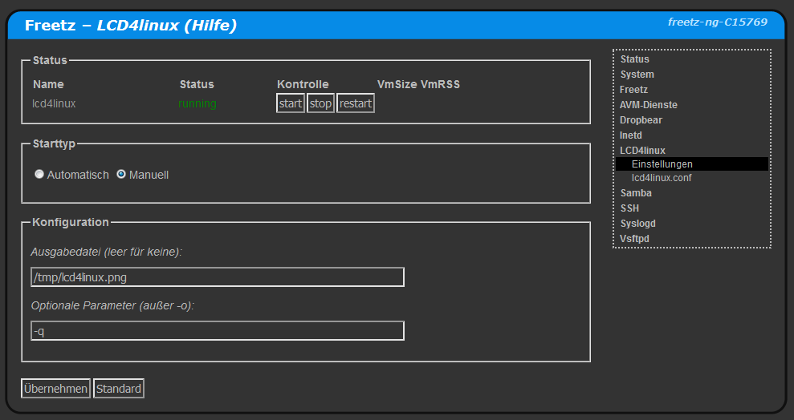

# AVM-Rules
Mit AVM-Rules können (ausschliesslich) Ports der Fritz!Box selbst für Zugriff aus dem Internet freigeben werden.<br>
<a href='../../docs/screenshots/000-PKG_lcd4linux.png'></a>&emsp;
<a href='../../docs/screenshots/000-PKG_lcd4linux_output.png'></a><br>

Dazu wird ```voip_forwardrules``` verwendet, nur für IPv4-Freigaben. Zu finden im menuconfig unter ```packages >webif```.
Da die ```ar7.cfg``` bearbeitet wird, sollte man vorher ein komplettes Backup anlegen - EXPERIMENTAL!
Die VoIP Ports sollte man nicht deaktivieren, ausser man weiss was man macht.

 * Portblöcke so angeben: PORT+ANZAHL, zB 55500+3 für 55500-55502.
 * Umleitungen so angeben: EXTERN(+ANZAHL):INTERN, zB 443:8443 oder 80+2:8008.
 * Es muss insgesamt mindestens 1 Port freigegeben werden.
 * Mindestens eine VoIP-Rufnummer muss konfiguriert sein.
 * Die Einträge können im AVM-Webif unter Diagnose > Sicherheit überprüft werden.
 * Bei Syntaxfehlern wird die komplette ar7.cfg von AVM zurückgesetzt.

