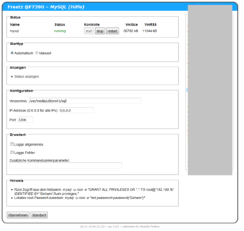
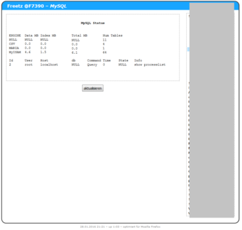

# MySQL 6.0.11-alpha

MySQL ist ein Datenbankserver
 

&emsp;

 

 - Als Mindestvoraussetzung wird eine Fritz!Box 7390 angesehen.
 - Diese Version ist sehr alt und sollte auf keinen Fall ins Internet freigegeben werden!

